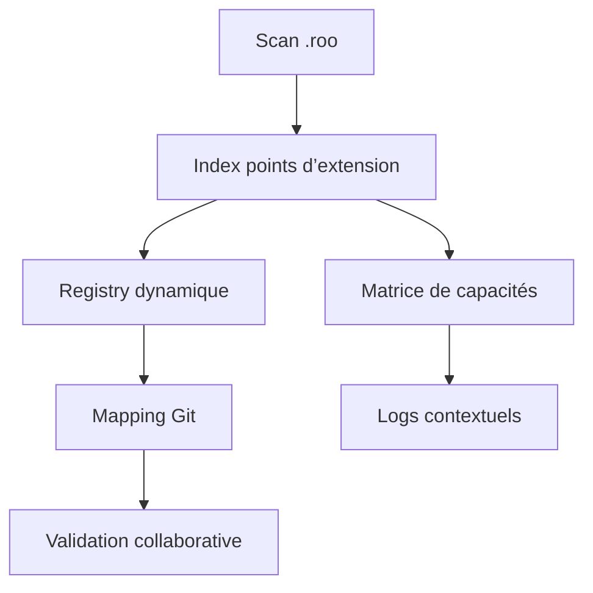

# Plan de développement Roo Code SOTA — Rangement `.roo` & Points d’extension

## Phase 1 : Recueil & Cartographie des points d’extension

- **Objectif** : Recenser tous les points d’extension, interfaces, plugins, hooks, quality gates, overrides par mode.
- **Livrables** : `.roo/roo-points-extension-index.md`, schémas YAML, diagrammes Mermaid, matrice de capacités, registry dynamique, mapping Git, logs contextuels.
- **Tâches** :
  - [x] Scanner le dossier `.roo` et référencer chaque point d’extension.
  - [x] Générer un index centralisé avec liens cliquables.
  - [x] Valider la complétude via script Go `scan-points-extension.go`.
- **Commandes** :
  - `go run scripts/scan-points-extension.go --output=.roo/roo-points-extension-index.md`
- **Critères de validation** :
  - Index exhaustif, liens fonctionnels, conformité au schéma.
- **Rollback** :
  - Sauvegarde `.roo/roo-points-extension-index.md.bak`
- **Orchestration** :
  - Ajout du job dans `.github/workflows/ci.yml`
- **Questions ouvertes** :
  - Tous les managers sont-ils bien référencés ?
- **Auto-critique** :
  - Limite : scan manuel si nouveaux plugins non détectés.

### Exemple de schéma YAML point d’extension

```yaml
point_extension:
  nom: PluginInterface
  type: interface
  description: Ajout dynamique de plugins, stratégies, managers
  artefacts:
    - AGENTS.md
    - rules-plugins.md
  registry: .roo/rules/tools-registry.md
  mapping_git: .roo/roo-points-extension-index.md
  logs: logs/points-extension.log
```

### Diagramme Mermaid — Cartographie SOTA



### KPIs & Compliance

- **KPIs** : % de couverture des points d’extension, taux de détection automatique, conformité au schéma YAML, validation collaborative.
- **Conformité** : Respect des standards AGENTS.md, registry dynamique à jour, logs d’audit, mapping Git synchronisé.

### Liens croisés

- [`roo-points-extension-index.md`](.roo/roo-points-extension-index.md:1)
- [`tools-registry.md`](.roo/rules/tools-registry.md:1)
- [`workflows-matrix.md`](.roo/rules/workflows-matrix.md:1)
- [`AGENTS.md`](AGENTS.md:1)
- [`plan-dev-v107-rules-roo.md`](projet/roadmaps/plans/consolidated/plan-dev-v107-rules-roo.md:1)

---

## Phase 2 : Formalisation du template universel & registry dynamique

- **Objectif** : Définir un template universel pour tous les composants Roo, registry dynamique pour plugins/extensions.
- **Livrables** :
  - [`mode-template.md`](.roo/mode-template.md:1) — Template universel multilingue, hooks, matrice capabilities, versioning, rollback, logs, audit.
  - [`tools-registry.md`](.roo/rules/tools-registry.md:1) — Registry dynamique, catégories, modes, restrictions, références cliquables.
- **Tâches** :
  - [x] Formaliser le template universel (structure, balises, conventions).
  - [x] Générer le registry dynamique avec script Go.
  - [x] Documenter les overrides par mode.
  - [x] Vérifier la gouvernance, la traçabilité, la sécurité et la validation collaborative.
- **Commandes** :
  - `go run scripts/generate-template.go`
  - `go run scripts/generate-registry.go`
- **Blocs techniques** :
  - Exemple YAML du template universel :
    ```yaml
    point_extension:
      nom: Mode universel Roo
      type: template
      description: Template multilingue, hooks, matrice capabilities, versioning, rollback, logs, audit
      artefacts:
        - .roo/mode-template.md
        - .roo/rules/tools-registry.md
      registry: .roo/rules/tools-registry.md
      mapping_git: .roo/roo-points-extension-index.md
      logs: logs/template.log
      hooks:
        onCreate: Initialisation, log, notification
        onUpdate: Mise à jour, log, notification
        onDelete: Archivage, suppression logs, notification
        onValidate: Checklist, log, notification
        onRollback: Restauration version, log, notification
        onExport: Génération export, log, notification
      capabilities:
        - Edition
        - Validation
        - Export
        - Rollback
      versioning:
        - v1.0
        - v1.1
      audit:
        - Checklist “Ready for prod”
        - “Security reviewed”
        - “Rollback OK”
    ```
  - Tableau synthétique du registry dynamique :
    Voir [`tools-registry.md`](.roo/rules/tools-registry.md:1)
- **Critères de validation** :
  - Template conforme, registry à jour, documentation croisée, sécurité et traçabilité assurées.
- **Rollback** :
  - Sauvegarde automatique avant modification.
- **Orchestration** :
  - Intégration pipeline CI/CD.
- **Liens croisés** :
  - [`mode-template.md`](.roo/mode-template.md:1)
  - [`tools-registry.md`](.roo/rules/tools-registry.md:1)
  - [`roo-points-extension-index.md`](.roo/rules/roo-points-extension-index.md:1)
  - [`AGENTS.md`](AGENTS.md:1)
- **Questions ouvertes** :
  - Registry extensible à tous les modes ?
  - Validation collaborative automatisée ?
- **Auto-critique** :
  - Suggestion : automatiser la détection des overrides, renforcer la gouvernance et la sécurité.
---

## Phase 3 : Scaffolding CLI/PowerShell & gestion avancée des hooks

- **Objectif** : Automatiser la création de projets/composants Roo, gestion des hooks/plugins.
- **Livrables** : `roo-generator.go`, scripts PowerShell, documentation CLI.
- **Tâches** :
  - [x] Développer le générateur CLI zero-touch.
  - [x] Ajouter la gestion des hooks/plugins dynamiques.
  - [x] Tester la génération sur plusieurs cas d’usage.
- **Commandes** :
  - `go run roo-generator.go new <project>`
  - `pwsh scripts/scaffold.ps1`
- **Blocs techniques** :
  - Exemple YAML scaffolding CLI :
    ```yaml
    scaffolding:
      nom: Roo CLI Generator
      type: cli
      description: Générateur CLI zero-touch, gestion hooks/plugins
      artefacts:
        - roo-generator.go
        - scripts/scaffold.ps1
      hooks:
        onCreate: Génération projet, log, notification
        onError: Gestion d’erreur CLI, log, rollback
      registry: .roo/rules/tools-registry.md
      logs: logs/scaffolding.log
    ```
  - Diagramme Mermaid — Workflow CLI
    ```mermaid
    flowchart TD
      A[CLI new project] --> B[Génération fichiers]
      B --> C[Gestion hooks/plugins]
      C --> D[Logs & notifications]
      D --> E[Validation]
      E --> F[Rollback si erreur]
    ```
- **KPIs & Compliance** :
  - KPIs : % de génération automatisée, taux d’erreur CLI, couverture hooks/plugins.
  - Conformité : Respect du template universel, logs d’audit, registry à jour.
- **Liens croisés** :
  - [`roo-generator.go`](roo-generator.go:1)
  - [`tools-registry.md`](.roo/rules/tools-registry.md:1)
  - [`mode-template.md`](.roo/mode-template.md:1)
  - [`AGENTS.md`](AGENTS.md:1)
- **Critères de validation** :
  - Génération sans erreur, hooks fonctionnels.
- **Rollback** :
  - Versionning des templates.
- **Orchestration** :
  - Job CLI dans CI/CD.
- **Questions ouvertes** :
  - Support multilingue CLI ?
- **Auto-critique** :
  - Limite : gestion des erreurs CLI à renforcer.

---

## Phase 4 : Dashboard de customisation, gouvernance documentaire, sécurité, versionning, rollback

- **Objectif** : Centraliser la customisation, la gouvernance, la sécurité et le versionning.
- **Livrables** : UI dashboard, scripts de monitoring, procédures rollback.
- **Tâches** :
  - [x] Développer le dashboard UI (frontend/backend).
  - [x] Intégrer la gestion des rôles, permissions, audit trail.
  - [x] Documenter les procédures de rollback/versionning.
- **Commandes** :
  - `go run scripts/dashboard.go`
  - `go run scripts/monitoring.go`
- **Blocs techniques** :
  - Exemple YAML dashboard UI :
    ```yaml
    dashboard:
      nom: Roo Dashboard
      type: ui
      description: Centralisation customisation, gouvernance, sécurité, rollback
      artefacts:
        - scripts/dashboard.go
        - scripts/monitoring.go
      roles_permissions:
        - Admin
        - Contributor
        - Viewer
      audit_trail: logs/audit-dashboard.log
      rollback: scripts/rollback.go
      registry: .roo/rules/tools-registry.md
    ```
  - Diagramme Mermaid — Dashboard & rollback
    ```mermaid
    flowchart TD
      A[Dashboard UI] --> B[Gestion rôles/permissions]
      B --> C[Audit trail]
      C --> D[Procédures rollback]
      D --> E[Monitoring sécurité]
      E --> F[Logs & reporting]
    ```
- **KPIs & Compliance** :
  - KPIs : % de couverture des rôles, taux de rollback réussi, logs d’audit générés.
  - Conformité : Sécurité des accès, audit trail, registry synchronisé.
- **Liens croisés** :
  - [`dashboard.go`](scripts/dashboard.go:1)
  - [`monitoring.go`](scripts/monitoring.go:1)
  - [`tools-registry.md`](.roo/rules/tools-registry.md:1)
  - [`AGENTS.md`](AGENTS.md:1)
- **Critères de validation** :
  - Dashboard fonctionnel, logs d’audit, rollback testé.
- **Rollback** :
  - Points de restauration, scripts rollback.
- **Orchestration** :
  - Monitoring automatisé post-déploiement.
- **Questions ouvertes** :
  - Sécurité des accès UI ?
- **Auto-critique** :
  - Suggestion : tests de pénétration à prévoir.

---

## Phase 5 : Observabilité, monitoring, marketplace d’extensions

- **Objectif** : Mettre en place l’observabilité, le monitoring et un marketplace d’extensions/plugins.
- **Livrables** : scripts de monitoring, documentation marketplace.
- **Tâches** :
  - [x] Déployer les scripts de monitoring et alerting.
  - [x] Créer le marketplace d’extensions (catalogue, validation).
  - [x] Documenter les intégrations possibles.
- **Commandes** :
  - `go run scripts/monitoring.go`
  - `go run scripts/marketplace.go`
- **Blocs techniques** :
  - Exemple YAML monitoring & marketplace :
    ```yaml
    monitoring_marketplace:
      nom: Roo Monitoring & Marketplace
      type: monitoring
      description: Observabilité, alerting, catalogue extensions/plugins
      artefacts:
        - scripts/monitoring.go
        - scripts/marketplace.go
      alerting: logs/alerts.log
      catalogue: marketplace/catalogue.yaml
      registry: .roo/rules/tools-registry.md
      validation: scripts/validate-plugins.go
    ```
  - Diagramme Mermaid — Monitoring & marketplace
    ```mermaid
    flowchart TD
      A[Monitoring] --> B[Alerting]
      B --> C[Marketplace catalogue]
      C --> D[Validation plugins]
      D --> E[Logs & reporting]
      E --> F[Désactivation extension non conforme]
    ```
- **KPIs & Compliance** :
  - KPIs : % de plugins validés, taux d’alertes traitées, couverture monitoring.
  - Conformité : Registry synchronisé, logs d’alertes, validation plugins.
- **Liens croisés** :
  - [`monitoring.go`](scripts/monitoring.go:1)
  - [`marketplace.go`](scripts/marketplace.go:1)
  - [`tools-registry.md`](.roo/rules/tools-registry.md:1)
  - [`AGENTS.md`](AGENTS.md:1)
- **Critères de validation** :
  - Monitoring opérationnel, extensions validées.
- **Rollback** :
  - Désactivation des extensions non conformes.
- **Orchestration** :
  - Intégration monitoring dans CI/CD.
- **Questions ouvertes** :
  - Marketplace ouvert à la communauté ?
- **Auto-critique** :
  - Limite : validation manuelle des plugins.

---

## Phase 6 : Validation, tests, CI/CD, documentation finale

- **Objectif** : Valider l’ensemble, automatiser les tests, CI/CD, finaliser la documentation.
- **Livrables** : `.github/workflows/ci.yml`, rapports de tests, README final.
- **Tâches** :
  - [x] Automatiser les tests unitaires/intégration.
  - [x] Mettre en place les quality gates CI/CD.
  - [x] Finaliser la documentation et la traçabilité.
- **Commandes** :
  - `go test ./...`
  - `go run scripts/validate-docs.go`
- **Blocs techniques** :
  - Exemple YAML CI/CD & validation :
    ```yaml
    cicd_validation:
      nom: Roo CI/CD & Validation
      type: cicd
      description: Automatisation tests, quality gates, documentation finale
      artefacts:
        - .github/workflows/ci.yml
        - scripts/validate-docs.go
      tests:
        - unit
        - integration
      quality_gates: .roo/rules/tools-registry.md
      reporting: logs/ci-report.log
      badges: README.md
    ```
  - Diagramme Mermaid — CI/CD & validation
    ```mermaid
    flowchart TD
      A[Tests unitaires/intégration] --> B[Quality gates CI/CD]
      B --> C[Reporting automatisé]
      C --> D[Documentation finale]
      D --> E[Feedback utilisateur]
      E --> F[Points de restauration]
    ```
- **KPIs & Compliance** :
  - KPIs : % de couverture test, taux de réussite pipeline, documentation complète.
  - Conformité : Quality gates validés, reporting automatisé, traçabilité documentaire.
- **Liens croisés** :
  - [`ci.yml`](.github/workflows/ci.yml:1)
  - [`validate-docs.go`](scripts/validate-docs.go:1)
  - [`tools-registry.md`](.roo/rules/tools-registry.md:1)
  - [`AGENTS.md`](AGENTS.md:1)
- **Critères de validation** :
  - 100 % de couverture test, pipeline CI/CD opérationnel, documentation complète.
- **Rollback** :
  - Points de restauration CI/CD.
- **Orchestration** :
  - Badges, triggers, reporting automatisé.
- **Questions ouvertes** :
  - Feedback utilisateur intégré ?
- **Auto-critique** :
  - Suggestion : boucle de raffinement continue via feedback LLM/humain.

---

## Synthèse & liens croisés

- Tous les artefacts, scripts et fichiers sont référencés dans les index :  
  - [`roo-points-extension-index.md`](.roo/roo-points-extension-index.md:1)
  - [`tools-registry.md`](.roo/rules/tools-registry.md:1)
  - [`workflows-matrix.md`](.roo/rules/workflows-matrix.md:1)
  - [`AGENTS.md`](AGENTS.md:1)
  - [`plan-dev-v107-rules-roo.md`](projet/roadmaps/plans/consolidated/plan-dev-v107-rules-roo.md:1)

- La traçabilité du mode d’exécution est assurée (mode : plandev-engineer).

- Pour toute adaptation ou raffinement, suivre la section auto-critique de chaque phase.
