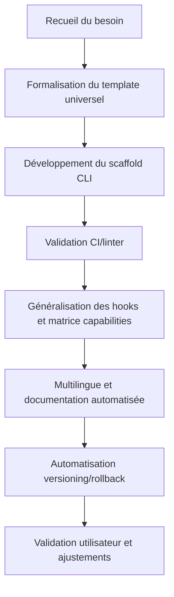

# Plan SOTA – Centralisation et automatisation des modes Roo

## Objectif
Formaliser et automatiser la gestion des modes Roo selon les standards SOTA : template universel, scaffolding CLI, validation CI/linter, hooks généralisés, multilingue, versioning/rollback, documentation enrichie.

---

## Étapes actionnables

- [x] Formaliser un template universel de mode Roo (.roo/mode-template.md) :  
  - Champs requis, overrides, hooks, matrice capabilities/groupes, permissions, sections multilingues.
- [ ] Développer un script CLI/PowerShell (mode-scaffold) pour générer le squelette d’un mode avec prompts interactifs et documentation associée.
- [ ] Mettre en place la validation automatique CI/linter :  
  - Contrôle schema YAML/JSON, checklist “Ready for prod”, “Security reviewed”, “Rollback OK”, intégration dans la doc centrale.
- [ ] Généraliser les hooks événementiels et la matrice dynamique capabilities/groupes dans le template et le scaffold.
- [ ] Rendre tous les templates multilingues-ready (fr/en) et automatiser la génération de documentation contextuelle.
- [ ] Automatiser le versioning, rollback et logs contextuels sur tout changement de mode (mapping Git, UI “Restaurer version précédente”).
- [ ] Valider le plan avec l’utilisateur et ajuster si besoin.

---

## Diagramme Mermaid – Workflow d’orchestration

---

## Références croisées

- [`AGENTS.md`](AGENTS.md:1)
- [`rules.md`](.roo/rules/rules.md:1)
- [`roo-points-extension-index.md`](.roo/rules/roo-points-extension-index.md:1)
- [`workflows-matrix.md`](.roo/rules/workflows-matrix.md:1)
- [`plan-dev-v107-rules-roo.md`](projet/roadmaps/plans/consolidated/plan-dev-v107-rules-roo.md:1)

---

## Critères d’acceptation

- Plan structuré, séquencé, actionnable et contextualisé
- Prise en compte des contraintes, dépendances et extensions
- Validation collaborative et documentation croisée
- Export compatible roadmap et outils de suivi
