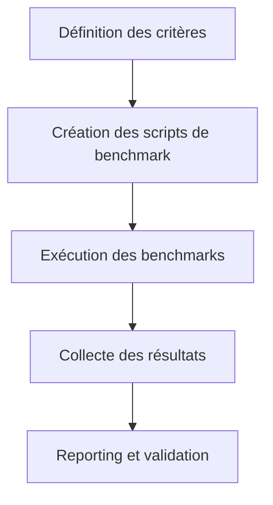

# Benchmarks SOTA — Visualisation Interactive Orchestrateur

## Objectifs
- Définir et documenter les critères de performance et robustesse du module de visualisation interactive.
- Centraliser les scripts, matrices et rapports de benchmarks pour validation SOTA.

## Workflow Mermaid


## Liens dynamiques
- [Ticket benchmark](https://repo/issues/benchmarks-visu-orch)
- [Artefact reporting](../../../reports/benchmarks-report.md)
- [Script Go exemple](../scripts/example_benchmark.go)
- [Matrice compatibilité](../matrices/compat_matrix.md)
- [Documentation centrale](../../../../.roo/rules/rules-code.md:1)

## Exemples concrets

### Script Go — Benchmark
```go
package main
func main() {
  // Benchmark orchestration
}
```

### Script Bash — Exécution
```bash
go test -bench . > reports/benchmarks.md
```

### Modèle YAML — Recensement
```yaml
benchmarks:
  - name: "latency"
    target: "orchestrator"
    threshold: "50ms"
```

## Cas limites & procédures critiques
- Benchmarks non reproductibles → documenter l’incident et proposer une alternative.
- Échec de validation SOTA → signaler et relancer la procédure.

## Checklist actionnable
- [x] Définir les critères de benchmark
- [ ] Créer et valider les scripts
- [ ] Exécuter les benchmarks sur tous les modules
- [ ] Collecter et analyser les résultats
- [ ] Documenter les écarts et actions correctives

## Conventions d’intégration
- Respect des standards PlanDev Engineer et Roo-Code.
- Documentation croisée et traçabilité systématique.
