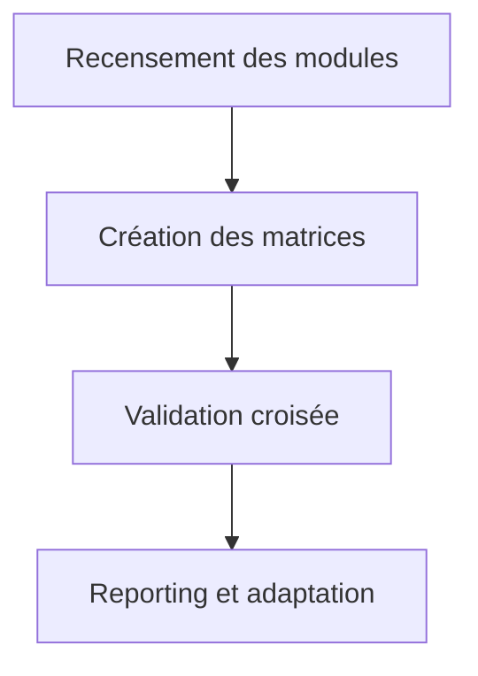

# Matrices SOTA — Visualisation Interactive Orchestrateur

## Objectifs
- Centraliser les matrices de compatibilité, dépendances, RBAC et intégration pour le module de visualisation interactive.
- Garantir la traçabilité et la validation croisée des axes critiques.

## Workflow Mermaid


## Liens dynamiques
- [Ticket matrices](https://repo/issues/matrices-visu-orch)
- [Matrice compatibilité](compat_matrix.md)
- [Matrice RBAC](rbac_matrix.md)
- [Artefact reporting](../../../reports/matrices-report.md)
- [Documentation centrale](../../../../.roo/rules/rules-plandev-engineer/plandev-engineer-reference.md:1)

## Exemples concrets

### Modèle YAML — Matrice de dépendances
```yaml
dependencies:
  - module: "visualizer"
    depends_on: ["core", "audit"]
```

### Matrice RBAC — Markdown
| Rôle         | Accès Visualisation | Accès Audit | Accès Reporting |
|--------------|--------------------|-------------|-----------------|
| Admin        | ✅                 | ✅          | ✅              |
| Utilisateur  | ✅                 | ❌          | ✅              |
| Auditeur     | ❌                 | ✅          | ✅              |

## Cas limites & procédures critiques
- Conflit de dépendances → documenter et proposer une résolution.
- Matrice non validée → relancer la procédure de validation croisée.

## Checklist actionnable
- [x] Recenser les modules et dépendances
- [ ] Créer les matrices de compatibilité et RBAC
- [ ] Valider les matrices avec les parties prenantes
- [ ] Documenter les écarts et actions correctives

## Conventions d’intégration
- Respect des standards PlanDev Engineer et Roo-Code.
- Documentation croisée et traçabilité systématique.
