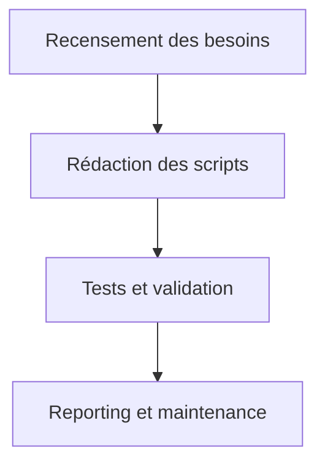

# Scripts SOTA — Visualisation Interactive Orchestrateur

## Objectifs
- Centraliser les scripts d’automatisation, de test et de maintenance pour le module de visualisation interactive.
- Faciliter l’exécution, la reproductibilité et la traçabilité des opérations critiques.

## Workflow Mermaid


## Liens dynamiques
- [Ticket scripts](https://repo/issues/scripts-visu-orch)
- [Exemple script Bash](example_script.sh)
- [Script Go rollback](example_rollback.go)
- [Documentation centrale](../../../../.roo/rules/rules-plandev-engineer/plandev-engineer-reference.md:1)

## Exemples concrets

### Script Bash — Reporting
```bash
go test ./... > reports/arch-tests.md
```

### Script Go — Rollback
```go
package main
func main() {
  // Restore backup, logs, validation
}
```

## Cas limites & procédures critiques
- Script non reproductible → documenter et corriger.
- Échec d’automatisation → prévoir rollback et reporting.

## Checklist actionnable
- [x] Recenser les besoins d’automatisation
- [ ] Rédiger les scripts Bash/Go critiques
- [ ] Tester et valider chaque script
- [ ] Documenter les procédures et cas limites

## Conventions d’intégration
- Respect des standards PlanDev Engineer et Roo-Code.
- Documentation croisée et traçabilité systématique.
