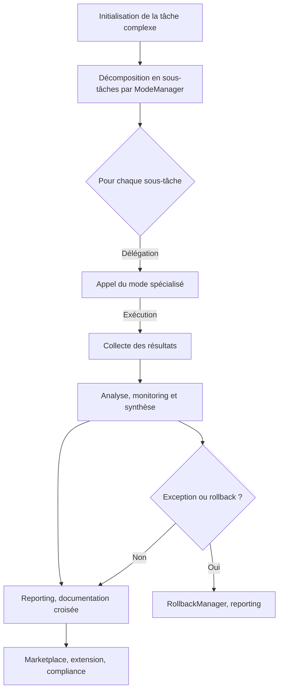

# Plan SOTA — Orchestration Multi-Modes Roo

---

## 1. Objectifs

- Définir l’orchestration multi-modes Roo comme pivot documentaire et technique pour la coordination, la traçabilité et la gouvernance des workflows hybrides.
- Garantir la compliance, la sécurité, la modularité et l’extensibilité via des points d’extension et des managers spécialisés.
- Centraliser la documentation, le monitoring, le reporting et le rollback pour chaque mode et workflow.
- Offrir une marketplace d’extensions et plugins validés pour enrichir l’écosystème Roo.

---

## 2. Workflow Mermaid



---

## 3. Points d’extension

- **PluginInterface** : Ajout dynamique de plugins, managers, stratégies ([AGENTS.md](AGENTS.md:PluginInterface), [rules-plugins.md](.roo/rules/rules-plugins.md:1)).
- **QualityGatePlugin** : Extension des quality gates CI/CD ([rules-plugins.md](.roo/rules/rules-plugins.md:1), [tools-registry.md](.roo/rules/tools-registry.md:1)).
- **CacheStrategy, VectorizationStrategy** : Personnalisation du cache et de la vectorisation documentaire ([AGENTS.md](AGENTS.md:CacheStrategy), [AGENTS.md](AGENTS.md:VectorizationStrategy)).
- **Hooks** : Points d’injection pour validation, reporting, audit, rollback ([rules-plugins.md](.roo/rules/rules-plugins.md:1)).
- **Marketplace** : Publication, validation et gouvernance des extensions.

---

## 4. Modèles YAML / Go

### Modèle YAML — Orchestration Multi-Mode

```yaml
orchestration:
  modes:
    - name: code
      tasks: [analyse, édition, reporting]
    - name: debug
      tasks: [diagnostic, logs, rollback]
    - name: architect
      tasks: [planification, todo, validation]
    - name: orchestrator
      tasks: [délégation, synthèse, reporting]
  extension_points:
    - plugin_interface
    - hooks
    - quality_gate
    - cache_strategy
    - vectorization_strategy
  monitoring:
    enabled: true
    kpis:
      - compliance_score
      - rollback_count
      - extension_coverage
```

### Modèle Go — Interface Orchestrator

```go
type Orchestrator interface {
    Init(ctx context.Context) error
    DecomposeTask(task Task) ([]SubTask, error)
    Delegate(subTask SubTask, mode Mode) (Result, error)
    CollectResults(results []Result) (Report, error)
    Monitor(report Report) (KPIs, error)
    Rollback(ctx context.Context, id string) error
    RegisterPlugin(plugin PluginInterface) error
    Report(ctx context.Context, id string) (*OrchestrationReport, error)
}
```

---

## 5. Gouvernance & Sécurité

- Validation systématique des plugins/extensions (compatibilité, sécurité, performance).
- Gestion centralisée des accès, rôles et permissions via SecurityManager ([AGENTS.md](AGENTS.md:SecurityManager)).
- Audit continu, rotation des secrets, reporting des incidents.
- Compliance documentaire : traçabilité du mode d’exécution, documentation croisée, validation collaborative.
- MonitoringManager : collecte des métriques, alertes, reporting, rollback automatisé ([AGENTS.md](AGENTS.md:MonitoringManager)).

---

## 6. Dashboard & Monitoring

- Dashboard centralisé pour visualiser : tâches, modes actifs, extensions, KPIs, incidents, rollbacks.
- Monitoring en temps réel des workflows, alertes, logs, compliance.
- Intégration avec Marketplace pour l’état des plugins/extensions.
- Historique des opérations, score de santé documentaire, reporting automatisé.

---

## 7. KPIs & Indicateurs

| KPI                       | Description                                      | Source                |
|---------------------------|--------------------------------------------------|-----------------------|
| Compliance Score          | % de tâches conformes aux standards Roo          | MonitoringManager     |
| Extension Coverage        | % de workflows utilisant des extensions validées | Marketplace           |
| Rollback Count            | Nombre de rollbacks déclenchés                   | RollbackManager       |
| Incident Rate             | Nombre d’incidents par mode                      | MonitoringManager     |
| Documentation Coverage    | % de tâches documentées croisée                  | DocManager            |
| Validation Rate           | % de tâches validées collaborativement           | ModeManager           |

---

## 8. Checklist Actionnable

- [x] Définir les objectifs et le périmètre de l’orchestration multi-modes Roo.
- [x] Modéliser le workflow Mermaid et les interactions entre managers.
- [x] Lister et documenter tous les points d’extension (plugins, hooks, stratégies).
- [x] Fournir les modèles YAML et Go pour l’orchestration.
- [x] Détailler la gouvernance, la sécurité et la compliance documentaire.
- [x] Décrire le dashboard, le monitoring et l’intégration Marketplace.
- [x] Lister les KPIs et indicateurs de performance.
- [x] Proposer une checklist actionnable pour la mise en œuvre.
- [x] Définir les critères d’acceptation et cas limites.
- [x] Intégrer tous les liens croisés et références documentaires.

---

## 9. Critères d’acceptation

- Plan structuré, séquencé et exhaustif, couvrant tous les aspects techniques et documentaires.
- Intégration complète des points d’extension, modèles, KPIs, dashboard, monitoring, rollback, compliance.
- Documentation croisée, liens cliquables, conformité aux standards Roo.
- Validation collaborative et traçabilité du mode d’exécution.
- Prise en compte des cas limites, auto-critique et gouvernance.

---

## 10. Cas limites & Liens croisés

### Cas limites

- Tâche complexe non décomposable → signaler, proposer une adaptation ou une escalade.
- Extension/plugin non validé → blocage, reporting, audit.
- Incident critique ou rollback non effectif → déclenchement d’alerte, documentation, analyse post-mortem.
- Conflit entre modes ou managers → reporting, documentation croisée, arbitrage.

### Liens croisés

- [AGENTS.md](AGENTS.md:1)
- [rules-plugins.md](.roo/rules/rules-plugins.md:1)
- [rules-orchestration.md](.roo/rules/rules-orchestration.md:1)
- [rules-code.md](.roo/rules/rules-code.md:1)
- [rules-maintenance.md](.roo/rules/rules-maintenance.md:1)
- [rules-migration.md](.roo/rules/rules-migration.md:1)
- [rules-security.md](.roo/rules/rules-security.md:1)
- [tools-registry.md](.roo/rules/tools-registry.md:1)
- [workflows-matrix.md](.roo/rules/workflows-matrix.md:1)
- [plan-dev-v107-rules-roo.md](projet/roadmaps/plans/consolidated/plan-dev-v107-rules-roo.md:1)
- [README.md](.roo/README.md:1)

---