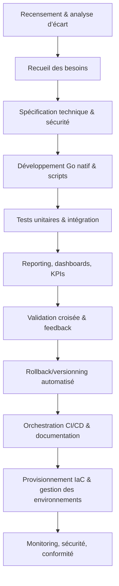

# Roadmap SOTA — Industrialisation Indexation Roo Code (Granularisation finale)

---

## 1. Objectifs stratégiques

- Industrialiser l’indexation Roo Code avec scalabilité, monitoring, sécurité et automatisation maximale.
- Garantir la traçabilité, la robustesse et la conformité SOTA sur toute la chaîne (benchmarks, recovery, API, tests, audit, UX).
- Intégrer toutes les exigences DevOps : gestion des environnements, IaC, monitoring CI/CD, sécurité, scalabilité, reporting, conformité.
- **Lien guide granularisation** : [.github/docs/roadmap/roadmap-granularisation-sota.md](../../../.github/docs/roadmap/roadmap-granularisation-sota.md)

---

## 2. Workflow global (Mermaid + SVG exporté)




---

## 3. Découpage actionnable & automatisable

### 3.1 Recensement & analyse d’écart

- [ ] Inventaire fichiers, scripts, dashboards, API, tests existants
- [ ] Analyse d’écart vs standards SOTA (.clinerules/)
- [ ] Recensement des dépendances externes (versions, conflits, update automatisé)
- Livrables : rapport Markdown, CSV inventaire, `dependencies.json`
- Commandes : `go run scripts/inventory.go`, `ls`, `find . -type f`, `go list -m all`
- Validation : rapport généré, logs, badge coverage
- Rollback : sauvegarde `.bak` inventaire
- **Exemple YAML** :
    ```yaml
    modules:
      - name: "indexer"
        version: "1.2.3"
        dependencies: ["monitor", "audit"]
    ```

### 3.2 Recueil des besoins

- [ ] Collecte besoins scalabilité, monitoring, sécurité, UX
- [ ] Feedback utilisateur et UX tracking (formulaires, logs, KPIs satisfaction)
- Livrables : fichier `besoins-indexation.json`, `ux-feedback.csv`
- Commandes : script Go natif, formulaire feedback TypeScript
- Validation : feedback automatisé, logs
- Rollback : versionnement JSON
- **Exemple feedback** :
    ```json
    { "user": "dev1", "phase": "tests", "feedback": "trop lent", "timestamp": "2025-08-07T14:43:00Z" }
    ```

### 3.3 Spécification technique & sécurité

- [ ] Rédaction YAML/Markdown des specs (API, RBAC, dashboards, recovery, audit sécurité, compliance GDPR/SOC2)
- [ ] Matrice de compatibilité multi-outils (Roo, Cline, Kilo, API)
- Livrables : `specs-indexation.yaml`, `specs-rbac.md`, `compatibility-matrix.md`
- Commandes : `go run scripts/specgen.go`
- Validation : lint YAML, revue croisée
- Rollback : backup specs, git commit
- **Exemple YAML RBAC** :
    ```yaml
    rbac:
      - role: "admin"
        permissions: ["read", "write", "audit"]
    ```

### 3.4 Développement Go natif & scripts

- [ ] Implémentation indexeur, recovery, monitoring, audit, API, reporting automatisé (HTML/CSV)
- [ ] Exemples de scripts rollback/restauration (Go/bash), logs d’usage réel
- Livrables : `indexer.go`, `monitor.go`, `audit.go`, `api.go`, `report.go`, `rollback.go`
- Commandes : `go build`, `go test`, `go run`, `bash rollback.sh`
- Scripts : exemples fournis pour chaque module
- Validation : tests automatisés, badge coverage
- Rollback : versionning, backup `.bak`
- **Exemple Go rollback** :
    ```go
    package main
    func main() {
      // Restore backup, logs, validation
    }
    ```

### 3.5 Tests unitaires & intégration

- [ ] Création/adaptation tests Go, bash, Newman/Postman, scénarios de stress test et benchmarks chiffrés (QPS, latence, mémoire, multi-utilisateurs)
- [ ] Tests de sécurité automatisés (lint, scan vulnérabilité, audit infra)
- Livrables : `indexer_test.go`, `monitor_test.go`, `api_test.go`, `stress_test.go`, `benchmarks.csv`, `security_scan.log`
- Commandes : `go test -cover`, `bash test.sh`, `newman run api.postman_collection.json`, `gosec ./...`
- Validation : badge CI/CD, logs, rapport coverage, rapport sécurité
- Rollback : backup tests, git revert
- **Exemple Bash** :
    ```bash
    go test ./... > reports/arch-tests.md
    ```

### 3.6 Reporting, dashboards, KPIs

- [ ] Génération dashboards Grafana, Prometheus, reporting Markdown/HTML/CSV, archivage automatisé
- [ ] Reporting automatisé sur la santé des jobs CI/CD (statut, logs, notifications)
- Livrables : `grafana-dashboard.yaml`, `report-indexation.md`, `kpi.json`, `report.html`, `report.csv`, `ci-status.log`
- Commandes : `go run scripts/report.go`, export PNG/SVG
- Validation : dashboard opérationnel, logs, notifications
- Rollback : backup dashboards

### 3.7 Validation croisée & feedback

- [ ] Revue croisée, feedback automatisé, validation humaine, reporting incident, gestion des cas limites et exceptions (fallback, alertes)
- Livrables : rapport validation, logs feedback, `incident-report.md`
- Commandes : script feedback TypeScript, formulaire UX
- Validation : logs, badge validation
- Rollback : archivage feedback

### 3.8 Rollback/versionning automatisé

- [ ] Sauvegardes automatiques, scripts rollback Go/bash, exemples d’usage réel, logs rollback
- [ ] Stratégie de rollback automatisé sur l’infra (restore, versionning infra)
- Livrables : `.bak`, logs rollback, scripts `rollback.go`, `infra-restore.sh`
- Commandes : `go run rollback.go`, `bash rollback.sh`, `bash infra-restore.sh`
- Validation : test rollback, logs
- Rollback : versionning git

### 3.9 Orchestration CI/CD & documentation

- [ ] Orchestrateur global `auto-roadmap-runner.go`
- [ ] Intégration pipeline CI/CD (jobs, triggers, notifications, archivage des rapports, monitoring pipeline)
- [ ] Documentation technique, guides d’usage, README, troubleshooting, runbooks DevOps, onboarding
- Livrables : `auto-roadmap-runner.go`, `.github/workflows/roadmap.yml`, `README.md`, `troubleshooting.md`, `runbook.md`, `onboarding.md`
- Commandes : `go run auto-roadmap-runner.go`, push git, trigger CI
- Validation : pipeline opérationnel, logs, badge CI, reporting pipeline
- Rollback : backup pipeline, versionning

### 3.10 Provisionnement IaC & gestion des environnements

- [ ] Scripts d’infrastructure as code (Terraform, Ansible) pour provisionner dashboards, backups, dossiers, environnements dev/staging/prod
- [ ] Gestion centralisée des secrets et variables d’environnement (Vault, dotenv, rotation)
- Livrables : `infra/main.tf`, `infra/playbook.yml`, `.env`, `vault-config.json`
- Commandes : `terraform apply`, `ansible-playbook infra/playbook.yml`
- Validation : état infra, logs, tests d’intégration
- Rollback : `terraform destroy`, backup infra
- **Exemple Terraform** :
    ```hcl
    resource "aws_instance" "example" { ... }
    ```

### 3.11 Monitoring, sécurité, conformité

- [ ] Monitoring de pipeline CI/CD (logs, alertes, auto-recovery en cas d’échec)
- [ ] Non prise en compte de la scalabilité et du load balancing (cluster, multi-node, auto-scaling)
- [ ] Matrice de conformité réglementaire (GDPR, SOC2, ISO) et reporting associé
- Livrables : `monitoring-config.yaml`, `scaling-config.json`, `compliance-matrix.md`, `compliance-report.md`
- Commandes : `go run scripts/monitor.go`, `kubectl scale`, `bash compliance-check.sh`
- Validation : logs, alertes, rapport conformité
- Rollback : backup monitoring/configs

---

## 4. Matrices synthétiques

- **Dépendances multi-outils** : `specs/dependencies-matrix.md`
- **Compatibilité versions Roo/Cline/VSIX** : `specs/integration-matrix.md`
- **Matrice RBAC** : `specs/rbac-matrix.md`

---

## 5. Checklist actionnable indexation Roo Code

- [ ] Recensement modules, dépendances, versions
- [ ] Analyse d’écart vs standards SOTA
- [ ] Spécification YAML/Go/Bash
- [ ] Développement modulaire
- [ ] Tests unitaires/intégration/sécurité/perf
- [ ] Reporting automatisé
- [ ] Validation croisée, feedback dev
- [ ] Procédure rollback/versionning
- [ ] Automatisation actualisation/feedback
- [ ] Documentation croisée, traçabilité
- [ ] Gestion exceptions/cas limites
- [ ] Adaptation LLM, robustesse atomique

---

## 6. Procédures d’audit, rollback, versionning

- Audit : `docs/audit-procedure.md`
- Rollback : `scripts/rollback.sh`
- Versionning : `docs/versionning.md`

---

## 7. Gestion des exceptions/cas limites

- Documentation : `docs/exceptions.md`
- Feedback continu : `feedback/auto-feedback.csv`

---

## 8. Liens dynamiques tickets/issues/artefacts

- [Ticket recensement](https://repo/issues/indexation-recensement)
- [Issue rollback](https://repo/issues/indexation-rollback)
- [Artefact reporting](../../../reports/arch-report.md)
- [Code source](https://repo/src/indexer.go)

---

## 9. Guide d’adaptation LLM & robustesse atomique

- Guide LLM : `docs/llm-adaptation.md`
- Conventions robustesse : `docs/robustesse.md`

---

## 10. Documentation croisée & liens

- [Granularisation SOTA](../../../.github/docs/roadmap/roadmap-granularisation-sota.md)
- [PlanDev Engineer référence](../../../.roo/rules/rules-plandev-engineer/plandev-engineer-reference.md)
- [VSIX Roo Code](../../../.github/docs/vsix/roo-code/roadmap-integration-sota.md)
- [Cline](../../../.github/docs/cline/roadmap-integration-sota.md)

---

## 11. Usage

Ce document est la référence pour :
- L’industrialisation, l’audit et la validation de l’indexation Roo Code.
- L’intégration dans les pipelines CI/CD, la documentation, la formation et la gouvernance projet.
- La traçabilité, la robustesse et l’adaptation LLM.
- La visualisation, le feedback et l’amélioration continue.

---
