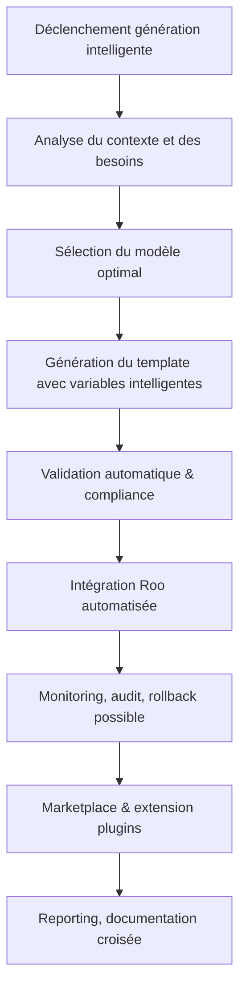

# Plan SOTA — s 

---

## 1. Objectifs stratégiques

- Automatiser la génération, la sélection et l’intégration de templates documentaires, code et workflows Roo.
- Garantir la conformité, la traçabilité et l’optimisation documentaire par intelligence contextuelle.
- Centraliser la gouvernance, la sécurité et le monitoring des templates générés/intégrés.
- Faciliter l’extension via marketplace, plugins et points d’extension validés.
- Assurer le rollback, l’audit et la documentation croisée pour chaque opération.

---

## 2. Workflow global (Mermaid)



---

## 3. Points d’extension & interfaces

- **PluginInterface** : Ajout dynamique de générateurs, validateurs, intégrateurs.
- **QualityGatePlugin** : Contrôle qualité, compliance, tests automatiques.
- **Hooks** : Validation, reporting, audit, rollback.
- **Marketplace** : Publication, partage et notation de templates/plugins.
- **API REST** : Intégration externe, synchronisation multi-plateformes.
- **Extension YAML/Go** : Modèles personnalisables, injection de logique métier.

---

## 4. Modèles techniques (YAML / Go)

### Exemple YAML — Template documentaire

```yaml
template:
  id: "roo-template-2025"
  type: "doc"
  variables:
    - name: "project_name"
      suggestion: "auto"
    - name: "author"
      suggestion: "context"
  compliance:
    - "rules-code"
    - "rules-documentation"
  audit:
    enabled: true
  rollback:
    enabled: true
  extensions:
    - "plugin-intel-variable"
    - "quality-gate"
```

### Exemple Go — Interface générateur intelligent

```go
type SmartTemplateGenerator interface {
    AnalyzeContext(ctx context.Context, input TemplateInput) (*TemplateSuggestion, error)
    GenerateTemplate(ctx context.Context, suggestion *TemplateSuggestion) (*GeneratedTemplate, error)
    ValidateTemplate(ctx context.Context, tpl *GeneratedTemplate) (*ValidationReport, error)
    IntegrateTemplate(ctx context.Context, tpl *GeneratedTemplate) error
    Rollback(ctx context.Context, id string) error
    Report(ctx context.Context, id string) (*AuditReport, error)
}
```

---

## 5. Gouvernance, sécurité & compliance

- Validation systématique des templates/plugins avant intégration (compatibilité, sécurité, performance).
- Centralisation des audits, logs et rapports via MonitoringManager.
- Gestion des accès, permissions et secrets par SecurityManager.
- Documentation croisée et reporting automatique pour chaque opération critique.
- Procédures de rollback et restauration via RollbackManager.
- Respect strict des standards Roo-Code ([rules-code.md](.roo/rules/rules-code.md:1), [rules-plugins.md](.roo/rules/rules-plugins.md:1)).

---

## 6. Dashboard & monitoring

- Dashboard centralisé : suivi des templates générés, intégrés, validés, rollbackés.
- KPIs en temps réel : taux de réussite, conformité, incidents, extensions utilisées.
- Alertes automatiques en cas d’échec, non-conformité ou incident sécurité.
- Historique complet des opérations, accès aux rapports d’audit et logs.
- Intégration CI/CD pour validation continue des templates/plugins.

---

## 7. KPIs & métriques

- % de templates générés automatiquement vs manuellement.
- Taux de conformité aux règles Roo-Code.
- Nombre de rollbacks effectués / tentés.
- Temps moyen d’intégration et de validation.
- Nombre d’extensions/plugins activés via marketplace.
- Score de sécurité et audit documentaire.
- Satisfaction utilisateur (feedback marketplace).
- Nombre d’incidents détectés et résolus.

---

## 8. Checklist actionnable

- [x] Définir les objectifs et le périmètre de génération intelligente.
- [x] Modéliser le workflow complet (Mermaid).
- [x] Documenter tous les points d’extension et interfaces.
- [x] Fournir des exemples YAML/Go exhaustifs.
- [x] Décrire la gouvernance, la sécurité et la compliance.
- [x] Spécifier le dashboard et les KPIs à suivre.
- [x] Lister les critères d’acceptation et cas limites.
- [x] Intégrer la documentation croisée et les liens utiles.
- [x] Prévoir les procédures de rollback et d’audit.
- [x] Valider la complétude et la conformité SOTA.

---

## 9. Critères d’acceptation

- Plan structuré, séquencé et exhaustif, couvrant tous les aspects techniques et organisationnels.
- Intégration effective des points d’extension, plugins et marketplace.
- Gouvernance, sécurité et monitoring centralisés et documentés.
- KPIs et dashboard opérationnels, traçabilité complète.
- Documentation croisée, auto-critique et conformité Roo-Code.
- Procédures de rollback et audit disponibles et testées.
- Prise en compte des cas limites et exceptions.

---

## 10. Cas limites & documentation croisée

- Contexte projet trop vague : déclencher une analyse contextuelle ou demander clarification.
- Échec de génération ou d’intégration : rollback automatique, reporting d’incident.
- Plugin non compatible ou non validé : blocage, audit, notification.
- Incident sécurité ou compliance : alerte, audit, restauration d’état.
- Marketplace inaccessible ou non synchronisée : fallback local, reporting.
- Documentation croisée :  
  - [AGENTS.md](AGENTS.md:1)
  - [rules-plugins.md](.roo/rules/rules-plugins.md:1)
  - [rules-code.md](.roo/rules/rules-code.md:1)
  - [rules-orchestration.md](.roo/rules/rules-orchestration.md:1)
  - [tools-registry.md](.roo/rules/tools-registry.md:1)
  - [workflows-matrix.md](.roo/rules/workflows-matrix.md:1)
  - [plan-dev-v107-rules-roo.md](projet/roadmaps/plans/consolidated/plan-dev-v107-rules-roo.md:1)
  - [README.md](.roo/README.md:1)

---

## 11. Granularisation de la mise en œuvre manquante (modules à réaliser)

### 11.1 Implémentations concrètes des modules Go

- [ ] Implémenter SmartTemplateGenerator (logique métier, génération contextuelle, intégration Roo)
- [ ] Implémenter QualityGatePlugin (contrôles compliance, tests automatiques)
- [ ] Implémenter TemplateMonitoringManager (audit, log, reporting)
- [ ] Implémenter RollbackManager (rollback, restauration d’état)
- [ ] Implémenter SecurityManager (gestion des accès, secrets, permissions)

### 11.2 API REST & Orchestration

- [ ] Définir la structure de l’API REST (endpoints CRUD, intégration, audit, rollback)
- [ ] Générer le fichier openapi.yaml ou swagger.json pour la documentation
- [ ] Implémenter les handlers Go pour chaque endpoint

### 11.3 Dashboard & KPIs

- [ ] Créer le module dashboard (Go, JS ou autre) pour visualiser les KPIs en temps réel
- [ ] Générer les vues : templates générés, validés, rollbackés, incidents, extensions
- [ ] Intégrer l’historique des opérations et les rapports d’audit

### 11.4 Tests unitaires et d’intégration

- [ ] Rédiger les tests unitaires pour chaque module (SmartTemplateGenerator, QualityGatePlugin, etc.)
- [ ] Rédiger les tests d’intégration pour l’orchestration complète (génération, validation, intégration, rollback)
- [ ] Mettre en place scripts CI/CD pour automatiser les tests

### 11.5 Documentation technique détaillée

- [ ] Documenter chaque module Go (commentaires, README, exemples d’usage)
- [ ] Documenter l’API REST (endpoints, payloads, sécurité)
- [ ] Documenter le dashboard (KPIs, vues, accès)
- [ ] Rédiger un guide d’intégration et d’extension (marketplace, plugins)

### 11.6 Scripts d’orchestration et d’intégration continue

- [ ] Créer Makefile ou scripts bash/powershell pour build, test, déploiement, rollback
- [ ] Intégrer la validation SOTA/KISS/SOLID dans la CI/CD

---

## 12. Synthèse d’avancement

- Les interfaces, exemples YAML, checklist, workflow et gouvernance sont réalisés.
- Les modules, API, dashboard, tests et documentation technique restent à granulariser et développer.
- Chaque sous-tâche ci-dessus peut être traitée indépendamment pour une progression modulaire et actionnable.

---

## 1. Objectifs stratégiques

- Automatiser la génération, la sélection et l’intégration de templates documentaires, code et workflows Roo.
- Garantir la conformité, la traçabilité et l’optimisation documentaire par intelligence contextuelle.
- Centraliser la gouvernance, la sécurité et le monitoring des templates générés/intégrés.
- Faciliter l’extension via marketplace, plugins et points d’extension validés.
- Assurer le rollback, l’audit et la documentation croisée pour chaque opération.

---

## 2. Workflow global (Mermaid)


---

## 3. Points d’extension & interfaces

- **PluginInterface** : Ajout dynamique de générateurs, validateurs, intégrateurs.
- **QualityGatePlugin** : Contrôle qualité, compliance, tests automatiques.
- **Hooks** : Validation, reporting, audit, rollback.
- **Marketplace** : Publication, partage et notation de templates/plugins.
- **API REST** : Intégration externe, synchronisation multi-plateformes.
- **Extension YAML/Go** : Modèles personnalisables, injection de logique métier.

---

## 4. Modèles techniques (YAML / Go)

### Exemple YAML — Template documentaire

```yaml
template:
  id: "roo-template-2025"
  type: "doc"
  variables:
    - name: "project_name"
      suggestion: "auto"
    - name: "author"
      suggestion: "context"
  compliance:
    - "rules-code"
    - "rules-documentation"
  audit:
    enabled: true
  rollback:
    enabled: true
  extensions:
    - "plugin-intel-variable"
    - "quality-gate"
```

### Exemple Go — Interface générateur intelligent

```go
type SmartTemplateGenerator interface {
    AnalyzeContext(ctx context.Context, input TemplateInput) (*TemplateSuggestion, error)
    GenerateTemplate(ctx context.Context, suggestion *TemplateSuggestion) (*GeneratedTemplate, error)
    ValidateTemplate(ctx context.Context, tpl *GeneratedTemplate) (*ValidationReport, error)
    IntegrateTemplate(ctx context.Context, tpl *GeneratedTemplate) error
    Rollback(ctx context.Context, id string) error
    Report(ctx context.Context, id string) (*AuditReport, error)
}
```

---

## 5. Gouvernance, sécurité & compliance

- Validation systématique des templates/plugins avant intégration (compatibilité, sécurité, performance).
- Centralisation des audits, logs et rapports via MonitoringManager.
- Gestion des accès, permissions et secrets par SecurityManager.
- Documentation croisée et reporting automatique pour chaque opération critique.
- Procédures de rollback et restauration via RollbackManager.
- Respect strict des standards Roo-Code ([rules-code.md](.roo/rules/rules-code.md:1), [rules-plugins.md](.roo/rules/rules-plugins.md:1)).

---

## 6. Dashboard & monitoring

- Dashboard centralisé : suivi des templates générés, intégrés, validés, rollbackés.
- KPIs en temps réel : taux de réussite, conformité, incidents, extensions utilisées.
- Alertes automatiques en cas d’échec, non-conformité ou incident sécurité.
- Historique complet des opérations, accès aux rapports d’audit et logs.
- Intégration CI/CD pour validation continue des templates/plugins.

---

## 7. KPIs & métriques

- % de templates générés automatiquement vs manuellement.
- Taux de conformité aux règles Roo-Code.
- Nombre de rollbacks effectués / tentés.
- Temps moyen d’intégration et de validation.
- Nombre d’extensions/plugins activés via marketplace.
- Score de sécurité et audit documentaire.
- Satisfaction utilisateur (feedback marketplace).
- Nombre d’incidents détectés et résolus.

---

## 8. Checklist actionnable

- [x] Définir les objectifs et le périmètre de génération intelligente.
- [x] Modéliser le workflow complet (Mermaid).
- [x] Documenter tous les points d’extension et interfaces.
- [x] Fournir des exemples YAML/Go exhaustifs.
- [x] Décrire la gouvernance, la sécurité et la compliance.
- [x] Spécifier le dashboard et les KPIs à suivre.
- [x] Lister les critères d’acceptation et cas limites.
- [x] Intégrer la documentation croisée et les liens utiles.
- [x] Prévoir les procédures de rollback et d’audit.
- [x] Valider la complétude et la conformité SOTA.

---

## 9. Critères d’acceptation

- Plan structuré, séquencé et exhaustif, couvrant tous les aspects techniques et organisationnels.
- Intégration effective des points d’extension, plugins et marketplace.
- Gouvernance, sécurité et monitoring centralisés et documentés.
- KPIs et dashboard opérationnels, traçabilité complète.
- Documentation croisée, auto-critique et conformité Roo-Code.
- Procédures de rollback et audit disponibles et testées.
- Prise en compte des cas limites et exceptions.

---

## 10. Cas limites & documentation croisée

- Contexte projet trop vague : déclencher une analyse contextuelle ou demander clarification.
- Échec de génération ou d’intégration : rollback automatique, reporting d’incident.
- Plugin non compatible ou non validé : blocage, audit, notification.
- Incident sécurité ou compliance : alerte, audit, restauration d’état.
- Marketplace inaccessible ou non synchronisée : fallback local, reporting.
- Documentation croisée :  
  - [AGENTS.md](AGENTS.md:1)
  - [rules-plugins.md](.roo/rules/rules-plugins.md:1)
  - [rules-code.md](.roo/rules/rules-code.md:1)
  - [rules-orchestration.md](.roo/rules/rules-orchestration.md:1)
  - [tools-registry.md](.roo/rules/tools-registry.md:1)
  - [workflows-matrix.md](.roo/rules/workflows-matrix.md:1)
  - [plan-dev-v107-rules-roo.md](projet/roadmaps/plans/consolidated/plan-dev-v107-rules-roo.md:1)
  - [README.md](.roo/README.md:1)

---
