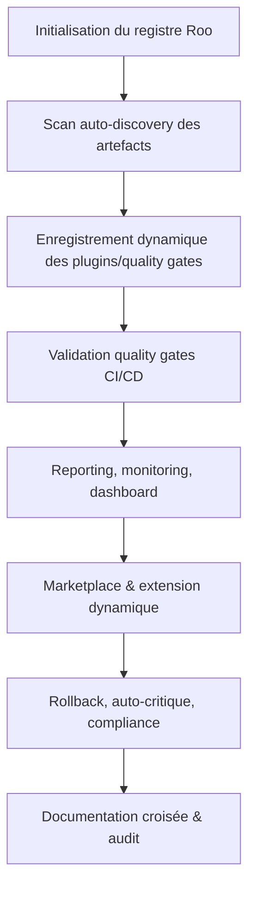

# Plan SOTA — Gestion dynamique du registre, des quality gates et de l’auto-discovery Roo

---

## 1. Objectifs & Portée

- Centraliser la gestion dynamique du registre Roo (plugins, managers, stratégies, extensions).
- Orchestrer les quality gates CI/CD, validation, reporting et auto-correction.
- Implémenter l’auto-discovery des artefacts, plugins et points d’extension.
- Garantir la traçabilité, la gouvernance, la sécurité et la conformité documentaire.
- Offrir un dashboard unifié, monitoring, rollback et documentation croisée.
- Intégrer la marketplace Roo pour l’extension dynamique.

---

## 2. Workflow global (Mermaid)



---

## 3. Points d’extension & modèles d’intégration

- **PluginInterface** : Ajout dynamique de plugins, managers, stratégies ([AGENTS.md:PluginInterface](../../../../AGENTS.md:PluginInterface))
- **QualityGatePlugin** : Extension des quality gates CI/CD ([.roo/rules/rules-plugins.md:1](../../../../.roo/rules/rules-plugins.md:1))
- **AutoDiscoveryHook** : Détection automatique des artefacts, plugins, managers.
- **RegistryStrategy** : Personnalisation du registre (cache, vectorisation, orchestration).
- **MarketplaceIntegration** : Synchronisation avec la marketplace Roo.
- **MonitoringPlugin** : Intégration monitoring, alertes, reporting.
- **RollbackHook** : Points d’extension pour rollback et restauration.

---

## 4. Modèles YAML & Go (extraits)

### Modèle YAML — Quality Gate

```yaml
quality_gate:
  id: "gate-ci-coverage"
  type: "coverage"
  threshold: 85
  actions:
    - notify: "slack"
    - rollback: true
    - report: "dashboard"
  compliance:
    enabled: true
    audit: "auto"
```

### Interface Go — RegistryManager

```go
type RegistryManager interface {
    RegisterPlugin(plugin PluginInterface) error
    DiscoverArtifacts(ctx context.Context) ([]Artifact, error)
    ValidateQualityGate(gate QualityGate) (ValidationResult, error)
    Rollback(ctx context.Context, id string) error
    Report(ctx context.Context, id string) (*RegistryReport, error)
    SyncMarketplace(ctx context.Context) error
}
```

---

## 5. Gouvernance, sécurité & compliance

- Validation systématique des plugins/extensions (compatibilité, sécurité, performance).
- Gestion des accès via SecurityManager, audit et traçabilité.
- Conformité documentaire : reporting, logs, rollback, audit croisé.
- Rotation et révocation des secrets, scan de vulnérabilités.
- Documentation des incidents et réponses dans `.github/docs/incidents/`.

---

## 6. Dashboard, monitoring & auto-critique

- Dashboard centralisé : état du registre, quality gates, artefacts, plugins, extensions.
- MonitoringManager : collecte des métriques, alertes, reporting, auto-critique.
- KPIs : taux de réussite des quality gates, nombre d’artefacts découverts, temps de rollback, couverture des tests, conformité CI/CD.
- Historique des opérations, logs, score de santé documentaire.

---

## 7. KPIs & indicateurs de performance

- % de plugins validés/actifs
- Nombre de quality gates passés/échoués
- Temps moyen de découverte d’artefacts
- Nombre de rollbacks effectués
- Score de conformité documentaire
- Taux d’extension dynamique via marketplace
- Couverture des tests unitaires et d’intégration

---

## 8. Checklist-actionnable & auto-critique

- [x] Initialiser le registre Roo et configurer les points d’extension
- [x] Implémenter l’auto-discovery des artefacts/plugins
- [x] Orchestrer les quality gates CI/CD et reporting
- [x] Intégrer le dashboard, monitoring et alertes
- [x] Synchroniser avec la marketplace Roo
- [x] Mettre en place le rollback et l’auto-critique
- [x] Documenter la gouvernance, la sécurité et la conformité
- [x] Valider la checklist-actionnable et les KPIs
- [x] Mettre à jour la documentation croisée et les liens

---

## 9. Critères d’acceptation

- Registre Roo dynamique, extensible et traçable
- Quality gates CI/CD configurables, validés et monitorés
- Auto-discovery des artefacts/plugins opérationnel
- Dashboard centralisé, KPIs et reporting en temps réel
- Rollback et auto-critique documentés et testés
- Gouvernance, sécurité et conformité assurées
- Documentation croisée et liens à jour

---

## 10. Cas limites, documentation croisée & liens

### Cas limites

- Artefact non détecté ou plugin incompatible : reporting, rollback, audit.
- Quality gate échoué : notification, rollback, documentation.
- Marketplace inaccessible : fallback local, log d’incident.
- Incident de sécurité : scan, audit, révocation, reporting.

### Documentation croisée & liens

- [AGENTS.md](../../../../AGENTS.md:1)
- [.roo/rules/rules-plugins.md](../../../../.roo/rules/rules-plugins.md:1)
- [.roo/rules/roo-points-extension-index.md](../../../../.roo/rules/roo-points-extension-index.md:1)
- [.roo/rules/rules-code.md](../../../../.roo/rules/rules-code.md:1)
- [.roo/rules/rules-orchestration.md](../../../../.roo/rules/rules-orchestration.md:1)
- [.roo/rules/tools-registry.md](../../../../.roo/rules/tools-registry.md:1)
- [.roo/rules/rules-maintenance.md](../../../../.roo/rules/rules-maintenance.md:1)
- [.roo/rules/rules-migration.md](../../../../.roo/rules/rules-migration.md:1)
- [.roo/rules/rules-security.md](../../../../.roo/rules/rules-security.md:1)
- [.roo/rules/rules-documentation.md](../../../../.roo/rules/rules-documentation.md:1)
- [.roo/rules/rules-debug.md](../../../../.roo/rules/rules-debug.md:1)
- [.roo/rules/rules.md](../../../../.roo/rules/rules.md:1)
- [.roo/rules/workflows-matrix.md](../../../../.roo/rules/workflows-matrix.md:1)
- [plan-dev-v107-rules-roo.md](../../consolidated/plan-dev-v107-rules-roo.md:1)
- [plan-dev-v113-autmatisation-doc-roo.md](../../consolidated/plan-dev-v113-autmatisation-doc-roo.md:1)
- [README.md](../../../../.roo/README.md:1)

---
