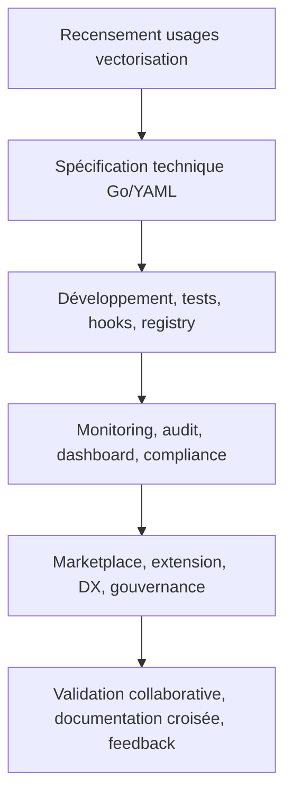

# 4. Vectorisation documentaire & Innovations SOTA Roo

---

## Phase 1 : Recensement & cadrage vectorisation

- **Objectif** : Cartographier les besoins, usages et contraintes de la vectorisation documentaire Roo.
- **Livrables** : `recensement-vecto.yaml`, `rapport-cadrage-vecto.md`
- **Dépendances** : Aucun prérequis.
- **Risques** : Ambiguïté des usages, dérive d’interprétation, manque de feedback utilisateur.
- **Outils/Agents mobilisés** : Script Go, plugin d’analyse statique, feedback utilisateur.
- **Tâches** :
  - [ ] Générer le script Go `recensement_vecto.go` pour scanner les usages.
  - [ ] Exécuter `go run scripts/recensement_vecto.go --output=recensement-vecto.yaml`
  - [ ] Valider la complétude via `go test scripts/recensement_vecto_test.go`
  - [ ] Documenter la procédure dans `README.md`
  - [ ] Collecter le feedback utilisateur et ajuster le script si besoin
- **Commandes** :
  - `go run scripts/recensement_vecto.go`
  - `go test scripts/recensement_vecto_test.go`
- **Critères de validation** :
  - 100 % de couverture test sur le parsing YAML
  - Rapport généré conforme au schéma
  - Revue croisée par un pair
- **Rollback** :
  - Sauvegarde automatique `recensement-vecto.yaml.bak`
  - Commit Git avant modification
- **Orchestration** :
  - Ajout du job dans `.github/workflows/ci.yml`
  - Monitoring automatisé du pipeline
- **Documentation croisée** :
  - [`AGENTS.md`](AGENTS.md:VectorOperationsManager)
  - [`plan-dev-v107-rules-roo.md`](projet/roadmaps/plans/consolidated/plan-dev-v107-rules-roo.md)
- **Questions ouvertes, hypothèses & ambiguïtés** :
  - Hypothèse : Les usages sont accessibles auprès des utilisateurs clés.
  - Question : Existe-t-il une source documentaire centralisée des usages vectoriels ?
  - Ambiguïté : Les besoins exprimés sont-ils stables ou sujets à évolution rapide ?
- **Auto-critique & raffinement** :
  - Limite : Le script ne détecte pas les usages implicites non formulés.
  - Suggestion : Ajouter une étape d’analyse sémantique ou d’interview utilisateur.
  - Feedback : Intégrer un agent LLM pour détecter les incohérences ou manques.

---

## Phase 2 : Spécification technique VectorOperationsManager & QdrantManager

- **Objectif** : Définir les modèles Go/YAML, interfaces, hooks, registry, extension points et schémas de validation pour la vectorisation Roo.
- **Livrables** : `vector_operations_manager.go`, `qdrant_manager.go`, `vector_schema.yaml`, `spec-tech-vecto.md`
- **Dépendances** : Recensement validé.
- **Risques** : Incomplétude des interfaces, dérive de gouvernance, sécurité insuffisante.
- **Outils/Agents mobilisés** : Générateur CLI Roo, analyse statique, registry plugins.
- **Tâches** :
  - [ ] Générer les interfaces Go complètes (voir AGENTS.md)
  - [ ] Générer le schéma YAML Roo pour la configuration
  - [ ] Intégrer les hooks d’extension (PluginInterface, VectorizationStrategy)
  - [ ] Documenter les points d’extension et registry
  - [ ] Valider la conformité via `go vet`, `golangci-lint`, tests unitaires
  - [ ] Générer la documentation API et PlantUML
- **Modèle Go (extrait)** :
```go
type VectorOperationsManagerInterface interface {
    Initialize(ctx context.Context, config *VectorOperationsManagerConfig) error
    BatchUpsertVectors(ctx context.Context, vectors []Vector) error
    UpdateVector(ctx context.Context, vector Vector) error
    DeleteVector(ctx context.Context, vectorID string) error
    GetVector(ctx context.Context, vectorID string) (*Vector, error)
    SearchVectorsParallel(ctx context.Context, queries []Vector, topK int) ([][]SearchResult, error)
    BulkDelete(ctx context.Context, vectorIDs []string) error
    GetStats(ctx context.Context) (map[string]interface{}, error)
    RegisterPlugin(plugin PluginInterface) error
    ListPlugins() []PluginInfo
    GenerateDocumentation(format DocumentationFormat) (*GeneratedDocs, error)
    GenerateOpenAPISpec() (*openapi.Spec, error)
}
```
- **Modèle YAML (extrait)** :
```yaml
vector_operations_manager:
  name: "VectorManager"
  version: "1.0.0"
  enabled: true
  timeout: "2m"
  retries: 3
  qdrant:
    host: "localhost"
    port: 6333
    collections:
      - name: "docs"
        vector_size: 768
        distance: "Cosine"
  extensions:
    - type: "plugin"
      name: "CustomVectorization"
      config: {}
```
- **Commandes** :
  - `go vet vector_operations_manager.go`
  - `golangci-lint run`
  - `go test ./... -coverprofile=coverage.out`
- **Critères de validation** :
  - Interfaces Go complètes et conformes à [`AGENTS.md`](AGENTS.md:VectorOperationsManager)
  - Schéma YAML Roo validé
  - 100 % de couverture test sur les opérations critiques
  - Documentation auto-générée (API, PlantUML)
  - Registry et hooks testés
- **Rollback** :
  - Procédures rollback via RollbackManager
  - Sauvegarde automatique des schémas et configs
- **Orchestration & CI/CD** :
  - Intégration pipeline `.github/workflows/ci.yml`
  - Quality gates automatiques (code coverage, sécurité, performance)
- **Documentation croisée** :
  - [`AGENTS.md`](AGENTS.md:QdrantManager)
  - [`rules-plugins.md`](.roo/rules/rules-plugins.md)
  - [`workflows-matrix.md`](.roo/rules/workflows-matrix.md)
- **Questions ouvertes, hypothèses & ambiguïtés** :
  - Hypothèse : Les plugins tiers sont compatibles avec le registry Roo.
  - Question : Les schémas YAML sont-ils extensibles sans breaking change ?
  - Ambiguïté : Les hooks sont-ils testés sur tous les cas limites ?
- **Auto-critique & raffinement** :
  - Limite : Les benchmarks de performance ne couvrent pas tous les volumes.
  - Suggestion : Ajouter des tests de scalabilité et de stress.
  - Feedback : Intégrer un dashboard de monitoring pour la vectorisation.

---

## Phase 3 : Monitoring, audit, dashboard & compliance

- **Objectif** : Mettre en place le monitoring, l’audit, la traçabilité, la gouvernance et la conformité pour la vectorisation documentaire Roo.
- **Livrables** : `monitoring_schema.yaml`, `audit_report_vecto.md`, `dashboard-vecto.md`, `compliance-checklist.yaml`
- **Dépendances** : Spécifications validées.
- **Risques** : Monitoring incomplet, audit non déclenché, dérive de conformité.
- **Outils/Agents mobilisés** : MonitoringManager, Audit hooks, dashboard, alertes, reporting automatisé.
- **Tâches** :
  - [ ] Déployer le monitoring via MonitoringManager
  - [ ] Générer les rapports d’audit automatisés
  - [ ] Mettre en place le dashboard de suivi (KPIs, alertes, logs)
  - [ ] Intégrer la checklist de conformité (sécurité, RGPD, traçabilité)
  - [ ] Tester les alertes et reporting
  - [ ] Documenter la gouvernance et les procédures de validation collaborative
- **Tableau KPIs (exemple)** :

| KPI                      | Description                                 | Source                        | Seuil cible      |
|--------------------------|---------------------------------------------|-------------------------------|------------------|
| Coverage vector ops      | % opérations vectorielles couvertes         | `go test -cover`              | 100 %            |
| Latence recherche        | Temps moyen de recherche vectorielle        | MonitoringManager             | < 200ms          |
| Taux d’erreur Qdrant     | % erreurs sur requêtes Qdrant               | Audit hooks                   | < 1 %            |
| Compliance RGPD          | Respect des contraintes RGPD                | Compliance checklist          | 100 %            |
| Plugins validés          | % plugins validés et audités                | Registry, Audit hooks         | 100 %            |

- **Commandes** :
  - `go run monitoring_manager.go`
  - `go test monitoring_manager_test.go`
  - `go run dashboard-vecto.go`
  - `go run audit_report_vecto.go`
- **Critères de validation** :
  - Monitoring et dashboard opérationnels
  - Audit automatisé et reporting conforme
  - Checklist de conformité validée
  - Alertes et logs testés
  - Documentation croisée et traçabilité assurée
- **Rollback/versionning** :
  - Points de restauration via RollbackManager
  - Sauvegarde des rapports et configs
  - Procédures rollback documentées dans [`monitoring_manager_rollback.md`](scripts/automatisation_doc/monitoring_manager_rollback.md)
- **Orchestration & CI/CD** :
  - Intégration monitoring dans pipeline CI/CD
  - Triggers automatiques sur anomalies
  - Badges de conformité et coverage
- **Documentation croisée** :
  - [`monitoring_manager_spec.md`](scripts/automatisation_doc/monitoring_manager_spec.md)
  - [`monitoring_manager_report.md`](scripts/automatisation_doc/monitoring_manager_report.md)
  - [`README.md`](README.md)
  - [`plan-dev-v113-autmatisation-doc-roo.md`](projet/roadmaps/plans/consolidated/plan-dev-v113-autmatisation-doc-roo.md)
- **Questions ouvertes, hypothèses & ambiguïtés** :
  - Hypothèse : Les KPIs sont pertinents pour tous les usages.
  - Question : Le dashboard est-il accessible à tous les rôles ?
  - Ambiguïté : Les procédures d’audit couvrent-elles tous les cas limites ?
- **Auto-critique & raffinement** :
  - Limite : Le monitoring ne détecte pas tous les types d’erreurs.
  - Suggestion : Ajouter des hooks IA pour la détection proactive.
  - Feedback : Intégrer la marketplace Roo pour plugins de monitoring avancés.

---

## Phase 4 : Marketplace, extension, DX & gouvernance

- **Objectif** : Ouvrir la vectorisation Roo à la marketplace, améliorer la DX, renforcer la gouvernance et la sécurité.
- **Livrables** : `marketplace-vecto.md`, `dx-guide-vecto.md`, `governance-vecto.md`, `security-checklist.yaml`
- **Dépendances** : Monitoring et audit validés.
- **Risques** : Plugins non validés, faille sécurité, dérive de gouvernance, mauvaise expérience développeur.
- **Outils/Agents mobilisés** : Registry, hooks, QualityGatePlugin, SecurityManager, documentation DX.
- **Tâches** :
  - [ ] Publier les plugins vectorisation sur la marketplace Roo
  - [ ] Documenter les procédures d’extension et registry
  - [ ] Intégrer les quality gates et security checks
  - [ ] Rédiger le guide DX pour développeurs
  - [ ] Mettre à jour la gouvernance et la documentation centrale
  - [ ] Tester la sécurité et la conformité des extensions
- **Commandes** :
  - `go run registry.go`
  - `go run security_manager.go`
  - `go run dx-guide-vecto.go`
  - `go run governance-vecto.go`
- **Critères de validation** :
  - Plugins validés et publiés
  - Registry et extension points opérationnels
  - Sécurité et conformité testées
  - Documentation DX et gouvernance à jour
  - Feedback utilisateur intégré
- **Rollback/versionning** :
  - Procédures rollback plugins et extensions
  - Points de restauration registry
  - Sauvegarde automatique des guides et configs
- **Orchestration & CI/CD** :
  - Intégration marketplace et registry dans pipeline CI/CD
  - Triggers sur publication/validation plugin
  - Monitoring sécurité et DX
- **Documentation croisée** :
  - [`rules-plugins.md`](.roo/rules/rules-plugins.md)
  - [`roo-points-extension-index.md`](.roo/rules/roo-points-extension-index.md)
  - [`README.md`](README.md)
  - [`plan-dev-v107-rules-roo.md`](projet/roadmaps/plans/consolidated/plan-dev-v107-rules-roo.md)
- **Questions ouvertes, hypothèses & ambiguïtés** :
  - Hypothèse : Les développeurs adoptent la marketplace Roo.
  - Question : Les quality gates sont-ils extensibles pour tous les usages ?
  - Ambiguïté : La gouvernance couvre-t-elle tous les cas d’extension ?
- **Auto-critique & raffinement** :
  - Limite : La DX peut varier selon les profils.
  - Suggestion : Ajouter des feedback loops et guides interactifs.
  - Feedback : Intégrer des audits IA sur la sécurité des plugins.

---

## Checklist actionnable globale

- [ ] Recensement initial vectorisation (script Go, output YAML)
- [ ] Spécification technique (Go/YAML, interfaces, hooks, registry)
- [ ] Développement, tests unitaires, benchmarks
- [ ] Monitoring, audit, dashboard, reporting
- [ ] Compliance, sécurité, rollback, versionning
- [ ] Publication marketplace, extension, DX, gouvernance
- [ ] Documentation croisée, traçabilité, feedback utilisateur
- [ ] Validation collaborative, revue croisée, auto-critique

---

## Workflow Mermaid



---

## Documentation croisée & liens utiles

- [`AGENTS.md`](AGENTS.md:VectorOperationsManager)
- [`plan-dev-v107-rules-roo.md`](projet/roadmaps/plans/consolidated/plan-dev-v107-rules-roo.md)
- [`plan-dev-v113-autmatisation-doc-roo.md`](projet/roadmaps/plans/consolidated/plan-dev-v113-autmatisation-doc-roo.md)
- [`rules-plugins.md`](.roo/rules/rules-plugins.md)
- [`roo-points-extension-index.md`](.roo/rules/roo-points-extension-index.md)
- [`workflows-matrix.md`](.roo/rules/workflows-matrix.md)
- [`README.md`](README.md)

---

## Cas limites & exceptions

- Recensement incomplet → relancer la collecte, documenter l’écart
- Plugin non validé → bloquer la publication, audit renforcé
- Monitoring non déclenché → alertes automatiques, rollback
- Dérive de gouvernance → revue croisée, documentation corrective
- Sécurité non conforme → audit, rollback, feedback IA

---

## Critères d’acceptation globaux

- Plan structuré, séquencé, actionnable et validé
- Interfaces Go/YAML complètes et conformes
- Monitoring, audit, dashboard et compliance opérationnels
- Marketplace, extension, DX et gouvernance testés
- Documentation croisée et traçabilité assurée
- Validation collaborative et feedback utilisateur intégrés

---

## Auto-critique & axes de raffinement

- Limite : Scalabilité sur très gros volumes à tester
- Suggestion : Intégrer des benchmarks et stress tests automatisés
- Feedback : Ajouter des audits IA et feedback loops sur la DX et la sécurité
- Amélioration continue : Mettre à jour la roadmap à chaque évolution SOTA
