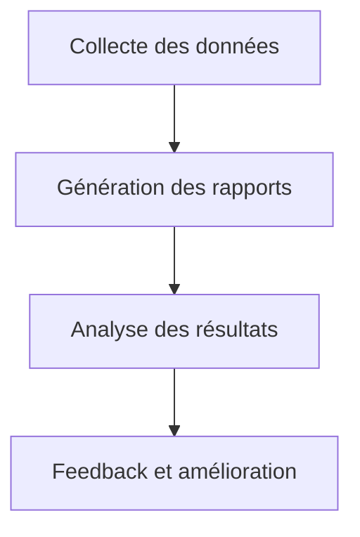

# Reporting SOTA — Visualisation Interactive Orchestrateur

## Objectifs
- Centraliser les rapports d’avancement, de tests et d’audit pour le module de visualisation interactive.
- Garantir la traçabilité, la conformité et l’analyse continue des résultats.

## Workflow Mermaid


## Liens dynamiques
- [Ticket reporting](https://repo/issues/reporting-visu-orch)
- [Exemple rapport d’avancement](rapport_avancement.md)
- [Artefact reporting](../../../reports/arch-report.md)
- [Documentation centrale](../../../../.roo/rules/rules-plandev-engineer/plandev-engineer-reference.md:1)

## Exemples concrets

### Rapport d’avancement — Markdown
```markdown
# Rapport d’avancement
- Date : 2025-08-07
- Modules couverts : matrices, scripts, reporting
- Points d’amélioration : feedback UX, automatisation reporting
```

### Script Bash — Génération de rapport
```bash
go test ./... > reports/arch-tests.md
```

## Cas limites & procédures critiques
- Rapport incomplet ou non conforme → documenter et corriger.
- Données manquantes → prévoir une procédure de collecte ou de simulation.

## Checklist actionnable
- [x] Collecter les données critiques
- [ ] Générer les rapports Markdown/Bash
- [ ] Analyser et valider les résultats
- [ ] Documenter les cas limites et feedback

## Conventions d’intégration
- Respect des standards PlanDev Engineer et Roo-Code.
- Documentation croisée et traçabilité systématique.
