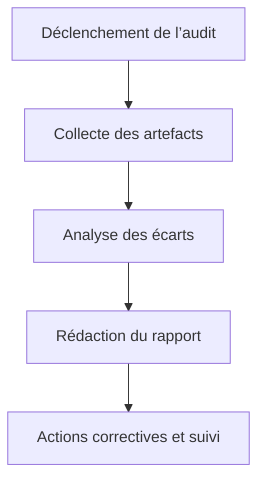

# Audit SOTA — Visualisation Interactive Orchestrateur

## Objectifs
- Centraliser les procédures, rapports et scripts d’audit pour garantir la conformité et la robustesse du module de visualisation interactive.
- Assurer la traçabilité des contrôles, des écarts et des actions correctives.

## Workflow Mermaid


## Liens dynamiques
- [Ticket audit](https://repo/issues/audit-visu-orch)
- [Exemple rapport d’audit](exemple_audit.md)
- [Procédure d’audit](../../../../docs/audit-procedure.md)
- [Artefact reporting](../../../reports/arch-report.md)
- [Documentation centrale](../../../../.roo/rules/rules-plandev-engineer/plandev-engineer-reference.md:1)

## Exemples concrets

### Rapport d’audit — Markdown
```markdown
# Rapport d’audit
- Date : 2025-08-07
- Modules audités : matrices, scripts, reporting
- Écarts détectés : documentation incomplète, tests manquants
- Actions : compléter la documentation, ajouter tests unitaires
```

### Script Bash — Audit automatisé
```bash
bash audit-modes-verification.ps1
```

## Cas limites & procédures critiques
- Écart non documenté → signaler et corriger.
- Rapport d’audit non validé → relancer la procédure et notifier les parties prenantes.

## Checklist actionnable
- [x] Déclencher l’audit sur les modules critiques
- [ ] Collecter et analyser les artefacts
- [ ] Rédiger et valider le rapport d’audit
- [ ] Documenter les écarts et actions correctives

## Conventions d’intégration
- Respect des standards PlanDev Engineer et Roo-Code.
- Documentation croisée et traçabilité systématique.
