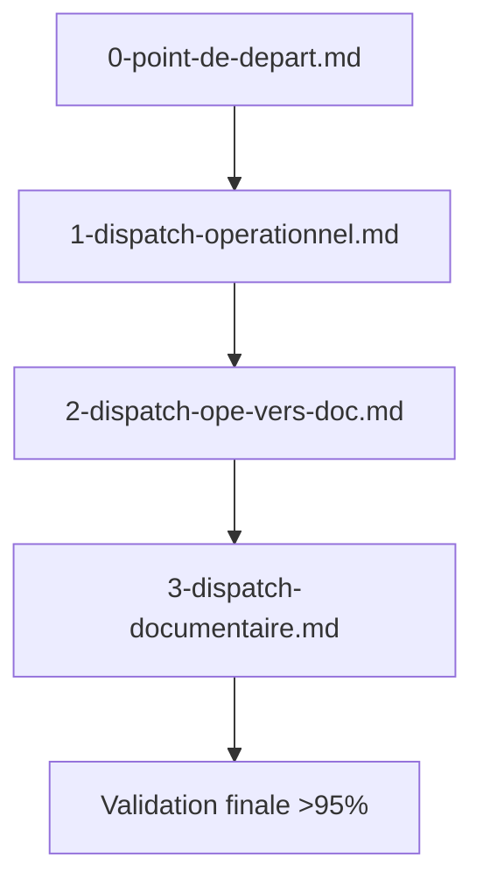

## Quality Gates chiffrés

| Gate | Condition | Manager | KPI cible | Reporting |
|------|-----------|---------|-----------|-----------|
| QG1  | Headers et deps posés | QualityGateManager | 100% | logs, audit |
| QG2  | Diff sémantique validé | PipelineManager | ≥98% | rapport, rollback |
| QG3  | Revalidation dépendants | MonitoringManager | 100% | alertes, reporting |

---

## Diff sémantique et revalidation dépendants

Chaque transformation documentaire déclenche un diff sémantique automatisé : les dépendants sont revalidés via QualityGateManager et MonitoringManager. Les écarts sont signalés, corrigés ou rollbackés selon la stratégie définie.
# 2-dispatch-ope-vers-doc.md

## Passerelle opérationnelle → documentaire

Ce fichier décrit la transformation progressive entre le dispatch opérationnel ([`1-dispatch-operationnel.md`](1-dispatch-operationnel.md:1)) et le dispatch documentaire ([`3-dispatch-documentaire.md`](3-dispatch-documentaire.md:1)), selon le workflow Roo/SOTA.

---

### Séquence de transformation

---

## Étapes clés

1. **Extraction des sections opérationnelles**  
   - Index, matrice section→fichiers, prompts modulaires
2. **Contrôles d’intégrité et logs**  
   - Vérification headers, dépendances, liens, SLO/SLA
3. **Préparation documentaire**  
   - Structuration des fichiers cibles, insertion des en-têtes standards
4. **Déploiement progressif**  
   - Création/MAJ des fichiers parents/enfants, propagation des prompts
5. **Validation CI documentaire**  
   - Passage des quality gates, reporting synthétique
6. **Rollback et reporting**  
   - Restauration snapshot en cas d’échec, rapport unique

---

## Points de contrôle et critères de succès

- Traçabilité complète des transformations
- Cohérence entre artefacts opérationnels et documentaires
- Succès de la validation documentaire >95% avant finalisation

---

## Liens et artefacts

- [`1-dispatch-operationnel.md`](1-dispatch-operationnel.md:1) → Dispatch opérationnel
- [`3-dispatch-documentaire.md`](3-dispatch-documentaire.md:1) → Dispatch documentaire
- Diagramme séquentiel, matrices, logs, rapports CI

---

## Remarques

La transformation 0→1→2→3 garantit la conformité Roo/SOTA, la modularité et la robustesse documentaire.  
Chaque étape est validée par les managers Roo : DocManager, PipelineManager, MonitoringManager, RollbackManager.
