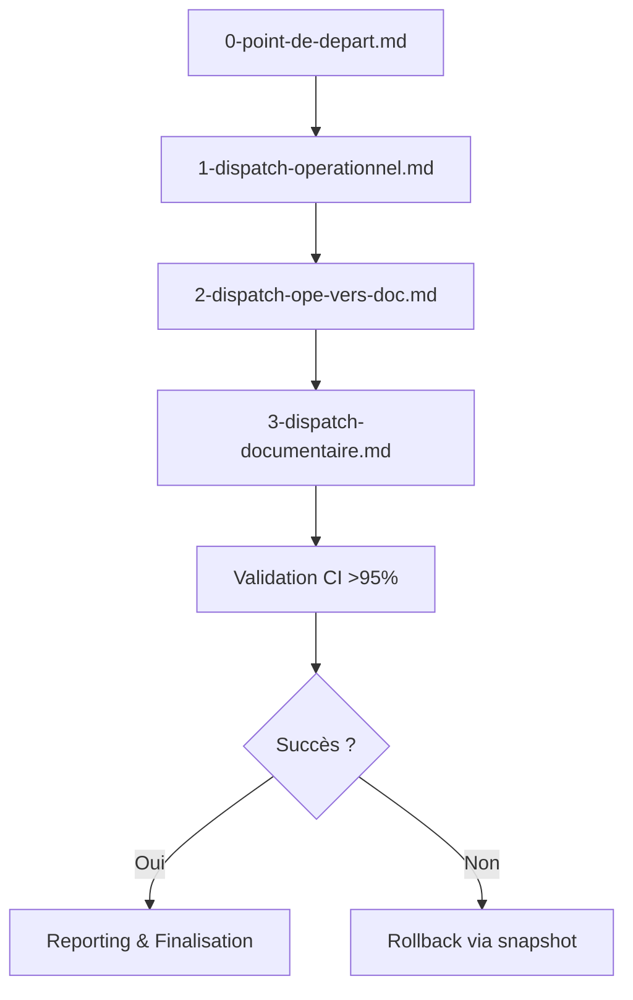

# Workflow théorique du dispatch automatisé Roo/SOTA

Ce fichier formalise le workflow automatisé du dispatch documentaire, modulaire et traçable.

## Diagramme séquentiel

## Étapes du workflow

| # | Étape | Description | Managers impliqués | Artefacts/Contrôles |
|---|-------|-------------|--------------------|---------------------|
| 1 | Initialisation | Chargement du contexte et des managers | DocManager, AuditManager | Frontmatter, index |
| 2 | Dispatch opérationnel | Génération index, matrice, prompts | DocManager, PipelineManager | 1-dispatch-operationnel.md |
| 3 | Passerelle transformation | Contrôles, logs, structuration | MonitoringManager, PipelineManager | 2-dispatch-ope-vers-doc.md |
| 4 | Dispatch documentaire | Création fichiers, rattachements | DocManager, MonitoringManager | 3-dispatch-documentaire.md |
| 5 | Validation CI | Quality gates, benchmarks, logs | QualityGateManager, MonitoringManager | CI, logs, rapport |
| 6 | Reporting | Rapport synthétique, log unique | MonitoringManager | audit-procedure.md |
| 7 | Rollback | Restauration snapshot si échec | RollbackManager | rollback/procedure_rollback.md |

## Points de contrôle

- En-têtes standard et index présents à chaque étape
- Graphe de dépendances acyclique, liens valides
- SLO/SLA et artefacts centralisés
- Reporting et logs sobres, traçabilité complète
- Rollback automatisé en cas d’échec CI

## Critères de succès

- 100% des fichiers générés et validés
- CI documentaire “green”
- Reporting et logs archivés
- Rollback prêt et documenté

## Remarques

Ce workflow est conçu pour être piloté par prompts, compatible CI/CD, et extensible via plugins Roo (PluginInterface, QualityGatePlugin).  
Il garantit la conformité SOTA, la modularité et la robustesse documentaire.
