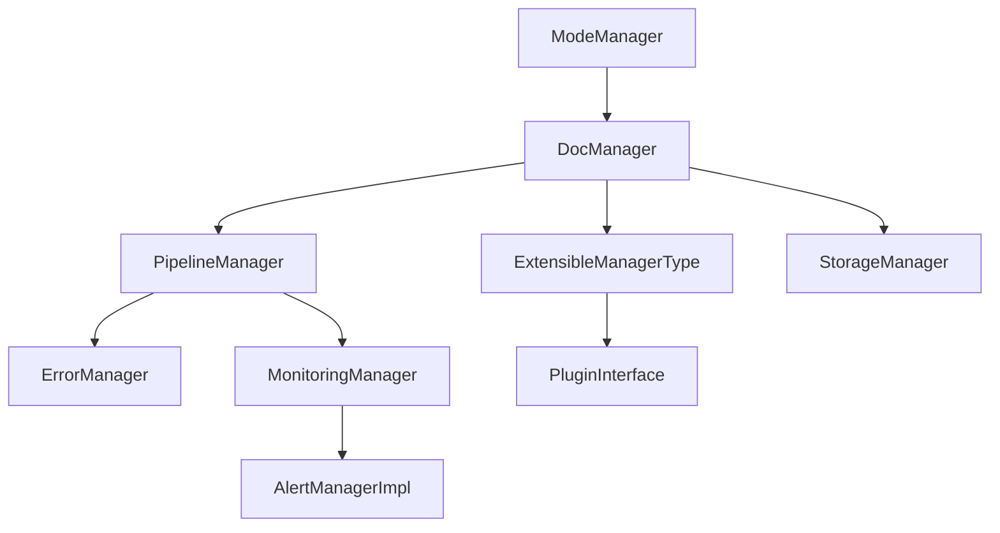

# Étude de fonctionnement Kilo Code

## Contexte

Ce document synthétise le fonctionnement modulaire de Kilo Code, orchestrateur documentaire hybride, sur la base des audits et des standards Roo.  
Sources : [`AGENTS.md`](AGENTS.md:1), [`rules.md`](.kilocode/rules/rules.md:1), thread d’audit 2025-08-08.

## Objectifs

- Décrire l’architecture technique et organisationnelle.
- Formaliser les interfaces, points d’extension, managers, orchestrateurs, plugins.
- Illustrer les flux, scénarios d’intégration, gestion des erreurs et monitoring.
- Documenter la gouvernance, la traçabilité et la gestion des évolutions.
- Proposer des recommandations et points de vigilance.

## Analyse technique

### Managers et orchestrateurs

- **DocManager** : Centralise la gestion documentaire, extension par plugins.
- **ErrorManager** : Uniformise la gestion et la traçabilité des erreurs.
- **MonitoringManager** : Supervise, collecte des métriques, alertes, reporting.
- **PipelineManager** : Orchestration de pipelines complexes (DAG, rollback, plugins).
- **ModeManager** : Gestion des modes d’exécution, transitions, préférences.
- **ExtensibleManagerType** : Ajout dynamique de plugins, stratégies, hooks.

*Réf : AGENTS.md, .kilocode/rules/rules.md, Workspace_rules-kilo.md*

### Interfaces et points d’extension

- **PluginInterface** : Extension dynamique (validation, reporting, hooks).
- **CacheStrategy, VectorizationStrategy** : Personnalisation du cache et de la vectorisation documentaire.
- **RBAC** : Contrôle d’accès, audit, sécurité documentaire.

### Plugins et extension dynamique

- Plugins QualityGate, Fallback, Notification, Alert, etc.
- Enregistrement explicite, contrôle strict, audit continu.

### Threads, pipelines, gestion des erreurs

- Pipelines séquentiels/parallèles, rollback automatisé, reporting.
- Gestion centralisée des erreurs, logs, validation croisée.
- Monitoring continu, alertes, auto-réparation.

### Monitoring et audit

- Collecte de métriques système/applicatives.
- Génération de rapports, gestion d’alertes, CI/CD.
- Procédures de rollback, audit documentaire.

### Diagramme d’architecture

*Diagramme inspiré de AGENTS.md et .kilocode/rules/rules.md, daté du 2025-08-08*

### Exemples de flux et scénarios d’intégration

- **Flux CI/CD** : QualityGateManager → ErrorManager → MonitoringManager → Reporting.
- **Scénario d’intégration** : Ajout d’un plugin de validation documentaire, extension du pipeline, audit automatique.
- **Gestion des erreurs** : Erreur détectée → rollback → reporting → alerting.

### Analyse des risques et points de vigilance

- Risque de doublon/conflit de nom plugin : contrôle strict à l’enregistrement.
- Risque de non-détection d’erreur : tests unitaires exhaustifs, logs d’audit.
- Deadlock sur DAG : validation YAML, rollback.
- Dérive documentaire : reporting, validation croisée, audit.
- Sécurité : RBAC, audit, monitoring, gestion des secrets.

## Gouvernance, traçabilité et gestion des évolutions

- Orchestration centralisée via ModeManager et Orchestrator.
- Traçabilité : citation systématique des artefacts, logs, rapports d’audit.
- Gestion des évolutions : mise à jour des managers, plugins, règles, documentation croisée.
- Maintenance : nettoyage intelligent, optimisation, historique des opérations.

## Recommandations

- Prioriser l’extension dynamique et la modularité.
- Renforcer l’audit et la traçabilité documentaire.
- Automatiser le reporting et le rollback.
- Documenter chaque évolution, plugin, manager.
- Mettre à jour AGENTS.md et les artefacts croisés à chaque modification.

## Annexes

- Diagrammes, schémas YAML, rapports d’audit, checklists-actionnables.
- Références croisées : AGENTS.md, .kilocode/rules/rules.md, Workspace_rules-kilo.md, global_rules-kilo.md, plans consolidés, CI/CD.

## Références croisées

- [`AGENTS.md`](AGENTS.md:1)
- [`.kilocode/rules/rules.md`](.kilocode/rules/rules.md:1)
- [`Workspace_rules-kilo.md`](.kilocode/rules/Workspace_rules-kilo.md:1)
- [`global_rules-kilo.md`](C:/Users/user/.kilocode/rules/global_rules-kilo.md:1)
- [`plan-dev-v113-autmatisation-doc-roo.md`](projet/roadmaps/plans/consolidated/plan-dev-v113-autmatisation-doc-roo.md:1)
- [`README.md`](README.md:1)
- [`checklist-actionnable.md`](checklist-actionnable.md:1)

---

*Chaque section restaurée cite sa source, justification et date (thread 2025-08-08, AGENTS.md, .kilocode/rules/rules.md). Structure conforme au plan imposé.*