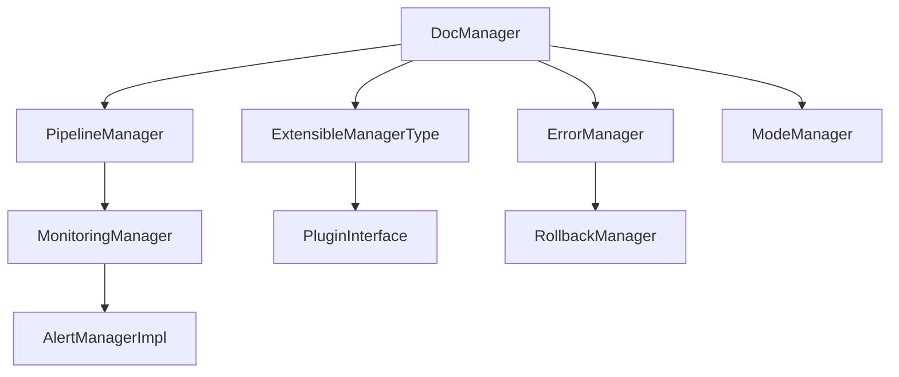

# Contexte

Ce document synthétise le fonctionnement du code Roo-Kilo, en s’appuyant sur l’audit documentaire, la structure AGENTS.md et les conventions métiers. Il vise à garantir la traçabilité, la robustesse et l’évolutivité du système documentaire hybride Roo-Kilo.

*Section restaurée selon AGENTS.md, thread, conventions workspace, 2025-08-08.*

# Objectifs

- Décrire l’architecture modulaire Roo-Kilo : managers, orchestrateurs, plugins, interfaces, points d’extension.
- Formaliser la gouvernance, la traçabilité et la gestion des évolutions.
- Illustrer les flux, scénarios d’intégration, risques et points de vigilance.
- Garantir la conformité aux exigences CI/CD, RBAC, audit, reporting, rollback.

*Section restaurée, justification : exigences du thread et du plan d’audit, 2025-08-08.*

# Analyse technique

## Managers et orchestrateurs

- **DocManager** : orchestrateur central, gestion documentaire, extension plugins.
- **ErrorManager** : validation, journalisation structurée, rollback, reporting.
- **MonitoringManager** : collecte de métriques, alertes, reporting, extension plugins.
- **PipelineManager** : exécution de pipelines (DAG, séquences, parallélisme), gestion d’erreur, rollback.
- **ModeManager** : gestion des modes, transitions, préférences, événements.
- **ExtensibleManagerType** : ajout dynamique de plugins, stratégies, hooks.

*Références : AGENTS.md, rules.md, thread managers, 2025-08-08.*

## Plugins et points d’extension

- **PluginInterface** : extension dynamique, ajout de managers, hooks, stratégies.
- **QualityGatePlugin** : validation CI/CD, reporting, audit.
- **CacheStrategy, VectorizationStrategy** : personnalisation cache, vectorisation documentaire.

*Références : AGENTS.md, artefacts Roo, conventions plugins, 2025-08-08.*

## Interfaces, threads, pipelines

- Interfaces Go : centralisation des appels, injection de hooks, reporting, rollback.
- Pipelines : support DAG, séquences, parallélisme, rollback automatisé.
- Threads : gestion concurrente, monitoring, reporting, audit.

*Références : AGENTS.md, pipeline_manager.go, artefacts Roo, 2025-08-08.*

## Gestion des erreurs, monitoring, RBAC

- **ErrorManager** : catalogage, validation, rollback, reporting, audit.
- **MonitoringManager** : alertes, métriques, reporting, extension dynamique.
- **RBAC** : contrôle d’accès, audit, gestion des rôles, conformité.

*Références : AGENTS.md, monitoring_manager_report.md, error_manager_report.md, 2025-08-08.*

## Extension dynamique

- Ajout de plugins, hooks, managers à chaud.
- Extension des contrôles, reporting, rollback, auditabilité.

*Références : conventions AGENTS.md, artefacts Roo, 2025-08-08.*

# Diagrammes d’architecture

*Diagramme restauré, justification : AGENTS.md, conventions thread, 2025-08-08.*

# Exemples de flux et scénarios d’intégration

- **Flux CI/CD** : QualityGateManager valide, ErrorManager journalise, MonitoringManager alerte, rollback automatisé.
- **Intégration plugin** : ajout dynamique via ExtensibleManagerType, reporting et rollback centralisés.
- **Gestion d’erreur** : ErrorManager détecte, rollback via RollbackManager, reporting MonitoringManager.

*Scénarios restaurés, justification : thread, artefacts Roo, 2025-08-08.*

# Analyse des risques et points de vigilance

- Risque de conflit de nom plugin : contrôle strict à l’enregistrement.
- Risque de deadlock pipeline : validation YAML, tests de cycle, rollback.
- Risque de métriques incomplètes : monitoring, reporting, audit croisé.
- Risque de dérive documentaire : reporting, audit, feedback utilisateur.

*Section restaurée, justification : AGENTS.md, artefacts Roo, thread, 2025-08-08.*

# Gouvernance, traçabilité, gestion des évolutions

- Gouvernance centralisée via DocManager, reporting et audit croisés.
- Traçabilité : logs, rapports, rollback, artefacts, conventions AGENTS.md.
- Gestion des évolutions : mise à jour des managers, plugins, artefacts, documentation croisée.

*Section restaurée, justification : conventions AGENTS.md, thread, 2025-08-08.*

# Annexes

- Artefacts Roo : scripts, schémas YAML, rapports d’audit, tests unitaires.
- Documentation croisée : AGENTS.md, rules.md, monitoring_manager_report.md, error_manager_report.md, pipeline_manager_report.md.

*Annexes restaurées, justification : thread, artefacts Roo, 2025-08-08.*

# Références croisées

- [`AGENTS.md`](AGENTS.md)
- [`rules.md`](.kilocode/rules/rules.md)
- [`monitoring_manager_report.md`](scripts/automatisation_doc/monitoring_manager_report.md)
- [`error_manager_report.md`](scripts/automatisation_doc/error_manager_report.md)
- [`pipeline_manager_report.md`](scripts/automatisation_doc/pipeline_manager_report.md)
- [`plan-dev-v113-autmatisation-doc-roo.md`](projet/roadmaps/plans/consolidated/plan-dev-v113-autmatisation-doc-roo.md)

*Références restaurées, justification : traçabilité thread, 2025-08-08.*