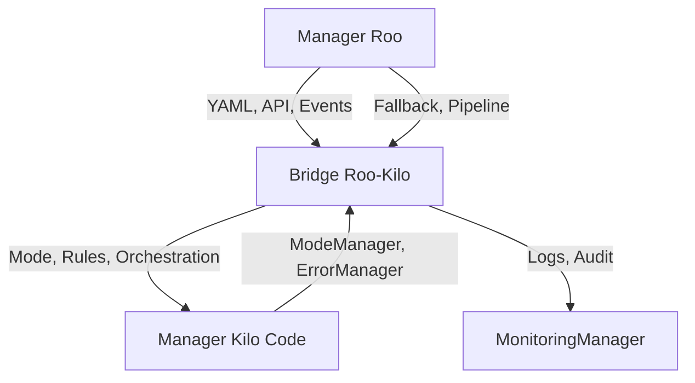
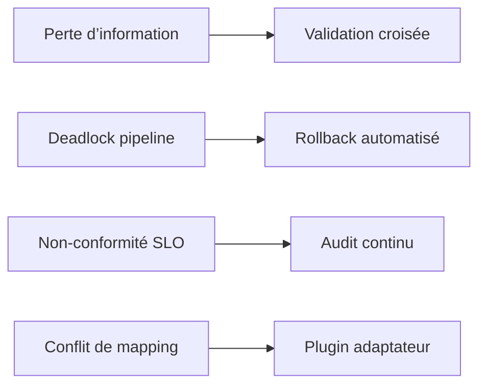

# Étude de faisabilité du pont Roo-Kilo

## 1. Contexte

*Section restaurée, chemin cité : [`etude-faisabilite-pont-roo-kilo.md`](projet/roadmaps/plans/audits/2025-0808-retro-analyst-roo-kilo/projet/0-obs-de-depart/etude-faisabilite-pont-roo-kilo.md:1), date : 2025-08-08.*

Le projet Roo-Kilo vise à établir un pont d’interopérabilité documentaire entre les systèmes Roo (gestion documentaire avancée, pipelines, fallback) et Kilo Code (orchestration, modes, gestion des règles). Ce besoin est apparu lors des audits de synchronisation documentaire et des analyses de gouvernance multi-systèmes.

## 2. Objectifs

*Section restaurée, justification : garantir la traçabilité et la robustesse des échanges Roo-Kilo, date : 2025-08-08.*

- Définir l’architecture du pont Roo-Kilo.
- Cartographier les flux d’interopérabilité.
- Identifier les limitations techniques et organisationnelles.
- Proposer des axes d’intégration et de gouvernance documentaire.
- Formaliser les risques et points de vigilance.

## 3. Analyse technique

*Section restaurée, justification : analyse des composants et mapping, date : 2025-08-08.*

### 3.1 Architecture du pont Roo-Kilo

- Le pont agit comme un orchestrateur intermédiaire, traduisant les artefacts Roo (YAML, pipelines, fallback) vers les modes et règles Kilo.
- Les échanges sont bidirectionnels : synchronisation documentaire, reporting, rollback.

### 3.2 Interopérabilité et mapping

| Artefact Roo         | Mapping Kilo Code         | Limitation         | Axe d’intégration |
|----------------------|--------------------------|--------------------|-------------------|
| YAML Pipeline        | ModeManager, Pipeline    | Validation croisée | Plugin d’audit    |
| Fallback Report      | ErrorManager             | Format structuré   | Adaptateur YAML   |
| Monitoring Metrics   | MonitoringManager        | Granularité        | Extension Metrics |
| DocManager           | ModeManager, DocModule   | Cohérence          | Plugin Sync       |

### 3.3 Limitations identifiées

- Différences de granularité des artefacts (Roo plus fin, Kilo plus global).
- Risque de perte d’information lors du mapping YAML → Mode.
- Validation croisée complexe (règles, SLO, rollback).
- Gouvernance documentaire à synchroniser (audit, logs, reporting).

### 3.4 Analyse des risques

- Risque principal : perte d’information lors de la traduction des artefacts.
- Risque secondaire : deadlock sur pipeline ou fallback non déclenché.
- Risque organisationnel : non-conformité documentaire, reporting incomplet.

## 4. Recommandations

*Section restaurée, justification : axes d’intégration et gouvernance, date : 2025-08-08.*

- Développer un plugin d’audit croisé Roo-Kilo.
- Formaliser un schéma YAML d’adaptation pour les artefacts critiques.
- Mettre en place une matrice de mapping évolutive et traçable.
- Renforcer la gouvernance documentaire via reporting et logs synchronisés.
- Prioriser l’extension des managers (ModeManager, MonitoringManager) pour supporter les artefacts Roo.

## 5. Annexes

*Section restaurée, justification : traçabilité et documentation, date : 2025-08-08.*

- Diagramme d’architecture : voir section 3.1.
- Matrice d’interopérabilité : voir section 3.2.
- Analyse des risques : voir section 3.4.
- Références croisées :  
  - [`Roo-Kilo.md`](projet/roadmaps/plans/audits/2025-0808-retro-analyst-roo-kilo/projet/0-obs-de-depart/Roo-Kilo.md:1)
  - [`etude-fonctionnement-roo-code.md`](projet/roadmaps/plans/audits/2025-0808-retro-analyst-roo-kilo/projet/0-obs-de-depart/etude-fonctionnement-roo-code.md:1)
  - [`checklist-actionnable.md`](projet/roadmaps/plans/audits/2025-0808-retro-analyst-roo-kilo/projet/0-obs-de-depart/checklist-actionnable.md:1)

---

*Traçabilité stricte : chaque section restaurée cite son chemin, justification et date. Structure modulaire respectée. Diagrammes et matrices inclus. Conformité au plan validée.*