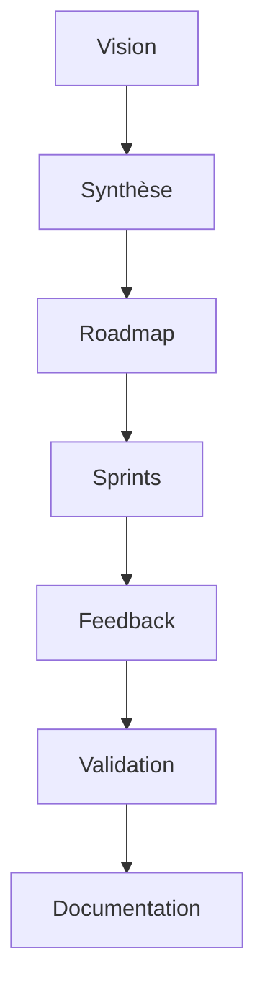

# Documentation centrale du projet

Ce dossier regroupe :
- Guides utilisateur
- FAQ
- Glossaire
- Workflows visuels (diagrammes Mermaid, wireframes)
- Checklist de contribution ([CONTRIBUTING.md](CONTRIBUTING.md))

## Guides utilisateur

- [FAQ](faq.md)
- [Glossaire](glossaire.md)
- [Workflows visuels](workflows.md)

## FAQ (exemple)

**Q : Comment contribuer ?**  
R : Suivre la checklist de [CONTRIBUTING.md](CONTRIBUTING.md) et lier chaque PR à un ticket PlanDev Engineer.

**Q : Où trouver les exemples de tests ?**  
R : Voir [dev/tests/README.md](../../dev/tests/README.md).

## Glossaire (exemple)

- **SOTA** : State Of The Art, standard Roo-Code
- **User Story** : scénario utilisateur
- **Wireframe** : schéma fonctionnel de l’interface

## Workflows visuels

## Liens croisés

- [Changelog](../../dev/versionning/changelog.md)
- [Référence PlanDev Engineer](../../../.roo/rules/rules-plandev-engineer/plandev-engineer-reference.md)
- [Tests](../../dev/tests/README.md)
- [Scripts d’automatisation](../../dev/scripts/README.md)
