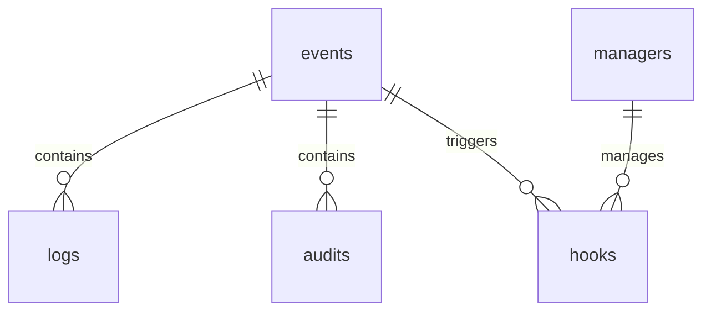

# Schéma relationnel Event Bus

- Table events : id, type, payload
- Table managers : id, name, type
- Table hooks : id, manager_id, event_type, script
- Table logs : id, event_id, timestamp, message
- Table audits : id, event_id, status, details
- Schéma ER Mermaid à compléter

