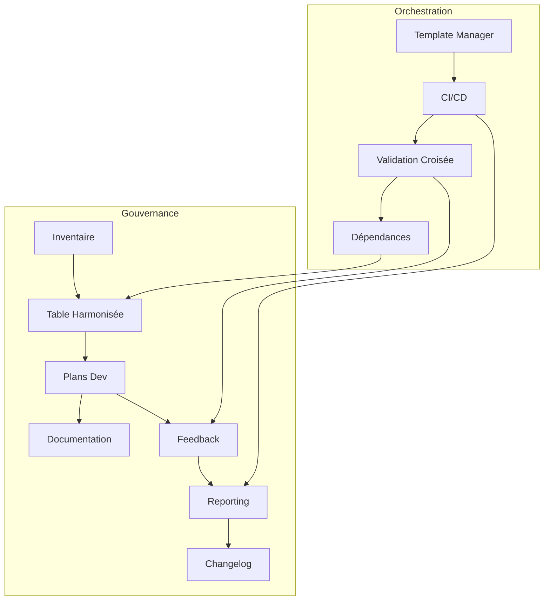

# Schéma Mermaid – Gouvernance & Orchestration

---

Ce schéma illustre la relation entre les artefacts de gouvernance et les processus d’orchestration du template-manager, pour une traçabilité et une automatisation optimale.