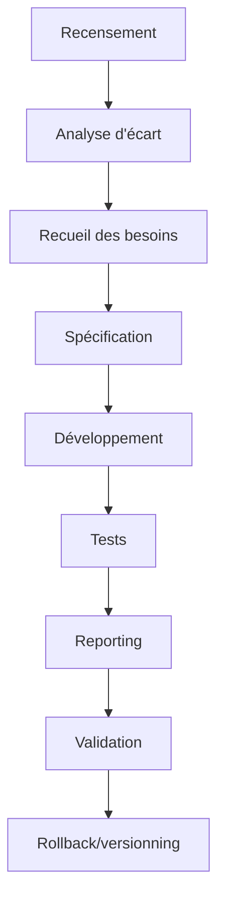

# Plan de Développement Consolidé – Automatisable, Actionnable et Testé

---

## 1. Introduction et objectifs

Ce plan vise à transformer les recommandations d’audit en une roadmap exhaustive, actionnable, automatisable et testée, alignée sur les standards avancés (.clinerules/), la stack Go native et les conventions du dépôt.  
Chaque manager/domaine est traité de façon granulaire, avec découpage atomique, automatisation maximale, traçabilité et robustesse.

---

## 2. Managers/Domaine – Découpage et granularisation

### Exemple de structure pour chaque manager (à dupliquer/adapter) :

---

### [NOM DU MANAGER]

#### 2.1 Objectifs détaillés
- Décrire précisément la finalité du manager.

#### 2.2 Découpage en sous-étapes atomiques

- **Recensement**
  - Livrables : inventaire, rapport Markdown/CSV.
  - Commandes : `go run ./cmd/manager-inventory`
  - Scripts : `inventory.go`, tests associés.
  - Format : Markdown, CSV.
  - Critères : rapport généré, validé par tests.
  - Rollback : sauvegarde `.bak` de l’inventaire précédent.
  - CI/CD : job d’inventaire automatisé.
  - Documentation : `README.md` usage script.
  - Traçabilité : logs, commit Git.

- **Analyse d’écart**
  - Livrables : rapport gap analysis (Markdown/HTML).
  - Commandes : `go run ./cmd/gap-analysis`
  - Scripts : `gap_analysis.go`, tests unitaires.
  - Format : Markdown, HTML.
  - Critères : rapport généré, validé par tests.
  - Rollback : version précédente archivée.
  - CI/CD : job gap analysis.
  - Documentation : guide gap analysis.
  - Traçabilité : logs, badge coverage.

- **Recueil des besoins**
  - Livrables : tickets, synthèse besoins (Markdown).
  - Commandes : script de collecte, ou manuel tracé.
  - Scripts : `needs_collector.go`, tests.
  - Format : Markdown.
  - Critères : synthèse validée, feedback utilisateurs.
  - Rollback : sauvegarde tickets.
  - CI/CD : intégration feedback.
  - Documentation : guide recueil besoins.
  - Traçabilité : logs, historique tickets.

- **Spécification**
  - Livrables : spécifications détaillées (Markdown).
  - Commandes : script de génération, ou manuel tracé.
  - Scripts : `spec_generator.go`, tests.
  - Format : Markdown.
  - Critères : validation croisée, revue.
  - Rollback : version précédente.
  - CI/CD : validation auto.
  - Documentation : guide de spécification.
  - Traçabilité : logs, versionning.

- **Développement**
  - Livrables : code Go, scripts, modules.
  - Commandes : `go build ./...`, `go run ...`
  - Scripts : `manager.go`, tests unitaires.
  - Format : Go natif.
  - Critères : lint, tests, coverage >85%.
  - Rollback : git revert, sauvegarde code.
  - CI/CD : build/test auto.
  - Documentation : GoDoc, README.
  - Traçabilité : logs, commits.

- **Tests (unitaires/intégration)**
  - Livrables : fichiers `_test.go`, rapports coverage.
  - Commandes : `go test -v -race -cover ./...`
  - Scripts : tests Go, fixtures.
  - Format : Go, HTML coverage.
  - Critères : 100% tests passants.
  - Rollback : suppression tests KO.
  - CI/CD : badge coverage, reporting.
  - Documentation : guide tests.
  - Traçabilité : logs, badge.

- **Reporting**
  - Livrables : rapports Markdown/HTML, badges.
  - Commandes : script reporting.
  - Scripts : `reporting.go`, tests.
  - Format : Markdown, HTML.
  - Critères : rapport généré, validé.
  - Rollback : archive rapports.
  - CI/CD : reporting auto.
  - Documentation : README reporting.
  - Traçabilité : logs, badge.

- **Validation**
  - Livrables : checklist, validation croisée.
  - Commandes : script de validation, ou manuel tracé.
  - Scripts : `validator.go`, tests.
  - Format : Markdown.
  - Critères : checklist validée.
  - Rollback : retour étape précédente.
  - CI/CD : job validation.
  - Documentation : guide validation.
  - Traçabilité : logs, badge.

- **Rollback/versionning**
  - Livrables : sauvegardes `.bak`, commits Git.
  - Commandes : `git status`, `git commit`, `git revert`
  - Scripts : backup/restore.
  - Format : fichiers `.bak`, Git.
  - Critères : rollback possible à chaque étape.
  - CI/CD : job backup.
  - Documentation : README rollback.
  - Traçabilité : logs, historique.

#### 2.3 Types/interfaces à utiliser
- Références précises aux interfaces/types Go à utiliser ou étendre.

#### 2.4 Dépendances
- Modules internes/externes, outils, scripts, packages.

#### 2.5 Standards et guides
- Références aux guides méthodologiques, schémas, conventions du dépôt.

#### 2.6 Risques et points de vigilance
- Liste des risques (techniques, organisationnels, sécurité, dette technique…)
- Points de vigilance (dépendances critiques, couverture de tests, robustesse…)

#### 2.7 Tests, tests unitaires
- Liste exhaustive des tests à automatiser (unitaires, intégration, non-régression…)
- Exemples de tests Go, critères de succès, couverture attendue.

---

## 3. Workflow global (diagramme Mermaid)

---

## 4. Checklist d’intégration et de validation

- [ ] Vérifier la branche actuelle (`git branch`, `git status`)
- [ ] Vérifier les imports (`go mod tidy`)
- [ ] Vérifier la stack (`go build ./...`)
- [ ] Vérifier la présence des fichiers requis
- [ ] Vérifier la responsabilité (pas de duplication)
- [ ] Tester avant commit (`go test ./...`)
- [ ] Committer sur la bonne branche
- [ ] Pusher immédiatement (`git push origin [branch-name]`)
- [ ] Documenter les changements (README)
- [ ] Valider l'intégration (tests end-to-end)
- [ ] Respecter conventions de nommage et structure
- [ ] Sécuriser les secrets et la configuration
- [ ] Vérifier la performance et le monitoring

---

## 5. Orchestration & CI/CD

- Orchestrateur global (`auto-roadmap-runner.go`) : exécute scans, analyses, tests, rapports, feedback, sauvegardes, notifications.
- Intégration CI/CD : pipeline, badges, triggers, reporting, feedback automatisé.
- Définition of Done : code, tests, lint, doc, review, merge, nettoyage branche.

---

## 6. Consignes critiques de vérification

- Avant chaque étape : vérifier branche, imports, stack, fichiers, responsabilité, tests.
- À chaque section majeure : commit, push, documentation, validation.
- Responsabilités par branche : main, dev, managers, consolidation-v57, etc.

---

## 7. Cases à cocher pour chaque livrable/action

- [ ] Recensement réalisé
- [ ] Analyse d’écart réalisée
- [ ] Recueil des besoins effectué
- [ ] Spécification validée
- [ ] Développement terminé
- [ ] Tests unitaires/intégration passants
- [ ] Reporting généré
- [ ] Validation croisée effectuée
- [ ] Rollback/versionning opérationnel

---

> **À dupliquer/adapter pour chaque manager/domaine identifié dans l’audit.  
> Ce modèle garantit granularité, automatisation, robustesse, traçabilité et conformité aux standards avancés.**
