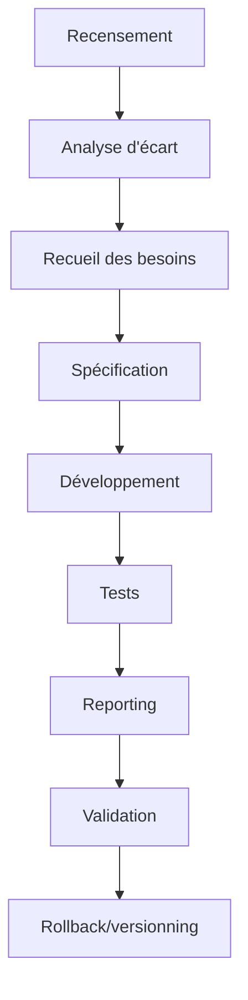

# Plans de Développement – Déclinaison opérationnelle de l’audit trae-agent

---

## 1. Introduction et objectifs

Ce document décline, pour chaque manager/domaine identifié dans l’audit [`2025-0708-analyse-trae.md`](../audits/2025-0708-analyse-trae.md), un plan opérationnel, automatisable et testé, selon la structure validée et les standards avancés du dépôt.

---

## 2. Plans détaillés par manager/domaine

---

### 2.1 MergeManager

#### Objectifs détaillés
- Automatiser la fusion, la détection et la résolution des conflits, avec stratégies configurables, outils CLI, UI, logs enrichis et tests de non-régression.

#### Découpage atomique & livrables

- **Recensement**
  - Livrable : inventaire des stratégies de merge existantes (`merge_strategies.md`)
  - Commande : `go run ./cmd/merge-inventory`
  - Script : `merge_inventory.go`, tests associés
  - Format : Markdown
  - Critère : rapport généré, validé par tests

- **Analyse d’écart**
  - Livrable : rapport gap analysis (`merge_gap_analysis.md`)
  - Commande : `go run ./cmd/merge-gap-analysis`
  - Script : `merge_gap_analysis.go`
  - Format : Markdown/HTML
  - Critère : rapport validé, tests passants

- **Recueil des besoins**
  - Livrable : synthèse besoins utilisateurs (`merge_needs.md`)
  - Commande : script collecte feedback
  - Script : `merge_needs_collector.go`
  - Format : Markdown
  - Critère : feedback intégré, validation croisée

- **Spécification**
  - Livrable : spécifications détaillées (`merge_spec.md`)
  - Commande : script génération spec
  - Script : `merge_spec_generator.go`
  - Format : Markdown
  - Critère : validation croisée, versionnée

- **Développement**
  - Livrable : module Go `merge_manager.go`, CLI, UI, logs
  - Commande : `go build ./...`
  - Script : `merge_manager.go`, tests unitaires
  - Format : Go natif
  - Critère : lint, tests, coverage >85%

- **Tests**
  - Livrable : `_test.go`, rapport coverage
  - Commande : `go test -v -race -cover ./...`
  - Script : tests Go, fixtures
  - Format : Go, HTML
  - Critère : 100% tests passants

- **Reporting**
  - Livrable : rapport Markdown/HTML, badge
  - Commande : script reporting
  - Script : `merge_reporting.go`
  - Format : Markdown, HTML
  - Critère : rapport généré, validé

- **Validation**
  - Livrable : checklist, validation croisée
  - Commande : script validation
  - Script : `merge_validator.go`
  - Format : Markdown
  - Critère : checklist validée

- **Rollback/versionning**
  - Livrable : sauvegardes `.bak`, commits Git
  - Commande : `git status`, `git commit`, `git revert`
  - Script : backup/restore
  - Format : `.bak`, Git

#### Types/interfaces à utiliser
- `MergeManager`, `Conflict`, `Resolution`, stratégies (auto, backup, priorité, chaîne)

#### Dépendances
- Modules internes : `core/conflict/`, `core/docmanager/`
- Modules externes : `github.com/stretchr/testify`, `go.uber.org/zap`

#### Standards et guides
- Guides gap analysis, merge, CI/CD, conventions Go

#### Risques et points de vigilance
- Complexité des stratégies, robustesse des tests, dépendances critiques

#### Tests, tests unitaires
- Couverture >85%, tests de non-régression, fixtures

---

### 2.2 ConflictManager

#### Objectifs détaillés
- Automatiser la détection proactive, scoring, logs, UI, scénarios de test, robustesse.

#### Découpage atomique & livrables

- **Recensement** : inventaire des types de conflits (`conflict_types.md`)
- **Analyse d’écart** : rapport gap analysis (`conflict_gap_analysis.md`)
- **Recueil des besoins** : synthèse besoins (`conflict_needs.md`)
- **Spécification** : spécifications (`conflict_spec.md`)
- **Développement** : module Go `conflict_manager.go`, scoring, logs
- **Tests** : `_test.go`, rapport coverage
- **Reporting** : rapport Markdown/HTML, badge
- **Validation** : checklist, validation croisée
- **Rollback/versionning** : sauvegardes `.bak`, commits Git

#### Types/interfaces à utiliser
- `ConflictManager`, `Conflict`, `ConflictMonitor`, `MultiCriteriaScorer`

#### Dépendances
- Modules internes : `core/conflict/`
- Modules externes : `go.uber.org/zap`, `github.com/stretchr/testify`

#### Standards et guides
- Guides scoring, logs, CI/CD

#### Risques et points de vigilance
- Robustesse scoring, logs, dépendances

#### Tests, tests unitaires
- Couverture >85%, tests scoring, détection

---

### 2.3 SyncHistoryManager

#### Objectifs détaillés
- Automatiser l’audit trail, suivi détaillé, reporting, rollback, dashboard.

#### Découpage atomique & livrables

- **Recensement** : inventaire des opérations de sync (`sync_ops.md`)
- **Analyse d’écart** : rapport gap analysis (`sync_gap_analysis.md`)
- **Recueil des besoins** : synthèse besoins (`sync_needs.md`)
- **Spécification** : spécifications (`sync_spec.md`)
- **Développement** : module Go `sync_history_manager.go`, dashboard
- **Tests** : `_test.go`, rapport coverage
- **Reporting** : rapport Markdown/HTML, badge
- **Validation** : checklist, validation croisée
- **Rollback/versionning** : sauvegardes `.bak`, commits Git

#### Types/interfaces à utiliser
- `SyncResult`, `ScanSync`, `ExportSyncJSON`, `ExportSyncGapAnalysis`

#### Dépendances
- Modules internes : `core/sync/`
- Modules externes : `github.com/stretchr/testify`, dashboarding

#### Standards et guides
- Guides reporting, dashboard, CI/CD

#### Risques et points de vigilance
- Robustesse dashboard, reporting

#### Tests, tests unitaires
- Couverture >85%, tests reporting, rollback

---

### 2.4 ConfigurableSyncRuleManager

#### Objectifs détaillés
- Automatiser la gestion des règles via YAML/JSON, reload dynamique, validation, lint, historisation.

#### Découpage atomique & livrables

- **Recensement** : inventaire des règles (`sync_rules.md`)
- **Analyse d’écart** : rapport gap analysis (`sync_rules_gap_analysis.md`)
- **Recueil des besoins** : synthèse besoins (`sync_rules_needs.md`)
- **Spécification** : spécifications (`sync_rules_spec.md`)
- **Développement** : module Go `sync_rule_manager.go`, reload dynamique
- **Tests** : `_test.go`, rapport coverage
- **Reporting** : rapport Markdown/HTML, badge
- **Validation** : checklist, validation croisée
- **Rollback/versionning** : sauvegardes `.bak`, commits Git

#### Types/interfaces à utiliser
- `ConfigurableSyncRuleManager`, validation YAML/JSON

#### Dépendances
- Modules internes : gestion YAML/JSON, watchers
- Modules externes : `github.com/spf13/viper`, `github.com/stretchr/testify`

#### Standards et guides
- Guides YAML/JSON, lint, CI/CD

#### Risques et points de vigilance
- Robustesse reload, validation, lint

#### Tests, tests unitaires
- Couverture >85%, tests validation, reload

---

### 2.5 Autres managers/domaine (ExtensibleManagerType, N8NManager, MaintenanceManager, MigrationManager, RollbackManager, CleanupManager, QdrantManager, VectorOperationsManager, NotificationManager, ChannelManager, AlertManager, AdminManager…)

#### Objectifs détaillés
- Automatiser les tâches spécifiques à chaque domaine, selon l’audit.

#### Découpage atomique & livrables
- **Recensement** : inventaire spécifique (`[manager]_inventory.md`)
- **Analyse d’écart** : rapport gap analysis (`[manager]_gap_analysis.md`)
- **Recueil des besoins** : synthèse besoins (`[manager]_needs.md`)
- **Spécification** : spécifications (`[manager]_spec.md`)
- **Développement** : module Go `[manager].go`, scripts associés
- **Tests** : `_test.go`, rapport coverage
- **Reporting** : rapport Markdown/HTML, badge
- **Validation** : checklist, validation croisée
- **Rollback/versionning** : sauvegardes `.bak`, commits Git

#### Types/interfaces à utiliser
- À préciser selon le manager

#### Dépendances
- Modules internes/externes selon le domaine

#### Standards et guides
- Guides spécifiques, CI/CD

#### Risques et points de vigilance
- À préciser selon le manager

#### Tests, tests unitaires
- Couverture >85%, tests spécifiques

---

## 3. Workflow global (diagramme Mermaid)

---

## 4. Checklist d’intégration et de validation

- [ ] Recensement réalisé
- [ ] Analyse d’écart réalisée
- [ ] Recueil des besoins effectué
- [ ] Spécification validée
- [ ] Développement terminé
- [ ] Tests unitaires/intégration passants
- [ ] Reporting généré
- [ ] Validation croisée effectuée
- [ ] Rollback/versionning opérationnel

---

## 5. Orchestration & CI/CD

- Orchestrateur global (`auto-roadmap-runner.go`) pour exécuter scans, analyses, tests, rapports, feedback, sauvegardes, notifications.
- Intégration CI/CD : pipeline, badges, triggers, reporting, feedback automatisé.

---

## 6. Consignes critiques de vérification

- Avant chaque étape : vérifier branche, imports, stack, fichiers, responsabilité, tests.
- À chaque section majeure : commit, push, documentation, validation.
- Responsabilités par branche : main, dev, managers, consolidation-v57, etc.

---

> Ce plan exhaustif permet de décliner chaque recommandation de l’audit en actions concrètes, automatisables, testées et traçables, prêtes à être intégrées dans l’écosystème projet.