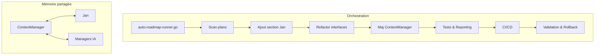

# Plan de développement v100 – Harmonisation IA locale avec Jan et mémoire partagée

## Objectif
Adapter tous les plans impliquant des agents IA pour utiliser une orchestration séquentielle multi-personas basée sur **Jan** (Go natif), avec gestion centralisée du contexte et de la mémoire partagée, en tenant compte des limites matérielles et en s’appuyant sur une intercommunication standardisée et harmonisée (voir plan v102), remplaçant toute logique multi-agent ou multi-LLM par cette approche robuste et cohérente.

---

## 1. Recensement & Analyse d’écart

- [ ] **1.1 Recenser tous les plans concernés**
  - Livrable : `plans_impactes_jan.md` (liste exhaustive des plans à modifier)
  - Commande : `grep -ril 'orchestration IA\|mémoire partagée\|intercommunication' projet/roadmaps/plans/consolidated/`
  - Critère : Tous les plans mentionnant orchestration IA, mémoire partagée ou intercommunication à harmoniser avec Jan et les standards d’interco.

- [ ] **1.2 Analyse d’écart**
  - Livrable : `ecart_jan_vs_multiagent.md` (tableau des différences de logique)
  - Script Go : `cmd/ecart-analyzer/main.go` (analyse automatique des occurrences à remplacer)
  - Format : Markdown/CSV
  - Critère : Liste des fonctionnalités à adapter (multi-agent ou multi-LLM → orchestration séquentielle Jan + intercommunication standardisée, dialogue → mémoire partagée, etc.)

---

## 2. Recueil des besoins & Spécification

- [ ] **2.1 Recueil des besoins spécifiques à Jan**
  - Livrable : `besoins_jan.md` (exigences, limites, scénarios cibles)
  - Commande : `go run cmd/recueil-besoins/main.go`
  - Critère : Validation par revue croisée.

- [ ] **2.2 Spécification du ContextManager étendu**
  - Livrable : `spec_contextmanager_jan.md`
  - Script Go : `cmd/spec-contextmanager/main.go`
  - Format : Markdown/JSON (schéma des données, API, hooks)
  - Critère : Spécification validée par tests de structure et revue humaine.

---

## 3. Développement & Adaptation des plans

- [ ] **3.1 Ajout d’une section “Orchestration séquentielle multi-personas avec Jan” dans chaque plan**
  - Livrable : PRs sur chaque plan concerné, diff Markdown
  - Script Go : `cmd/ajout-section-jan/main.go`
  - Exemple de section à injecter :
    ```
    ## Orchestration séquentielle multi-personas avec Jan
    Toutes les tâches IA sont orchestrées via Jan, en mode mono-agent séquentiel, chaque persona étant simulé par un prompt système/contextuel distinct. L’historique des échanges est géré par le ContextManager et injecté à chaque tour.
    ```
  - Critère : Section présente et validée dans chaque plan.

- [ ] **3.2 Refactorisation des interfaces d’agents IA**
  - Livrable : `interfaces_maj_jan.md` (nouveaux prototypes d’interface)
  - Script Go : `cmd/refactor-interfaces/main.go`
  - Format : Go, Markdown
  - Critère : Interfaces acceptant un contexte enrichi, hooks pour orchestrateur séquentiel.

- [ ] **3.3 Développement/extension du ContextManager**
  - Livrable : `core/contextmanager/contextmanager.go`, tests associés
  - Script Go : `core/contextmanager/contextmanager.go`
  - Exemples :
    - Fonction `StoreDialogueHistory(persona string, message string)`
    - Fonction `GetDialogueContext(persona string, n int) []string`
    - Tests unitaires : `core/contextmanager/contextmanager_test.go`
  - Critère : Couverture de tests ≥ 90%, validation CI.

- [ ] **3.4 Mise à jour des diagrammes d’architecture**
  - Livrable : `diagrams/mermaid/architecture_jan.mmd`
  - Script Go : `cmd/gen-mermaid/main.go`
  - Format : Mermaid, SVG
  - Critère : Diagrammes à jour dans chaque plan.

---

## 4. Tests, Reporting & Validation

- [ ] **4.1 Tests unitaires et d’intégration**
  - Livrable : `*_test.go`, badge coverage
  - Commande : `go test ./... -cover`
  - Critère : Tous les scripts et composants modifiés sont testés.

- [ ] **4.2 Reporting automatisé**
  - Livrable : `reporting/rapport_modif_jan.md`
  - Script Go : `cmd/reporting-jan/main.go`
  - Format : Markdown/HTML
  - Critère : Rapport généré à chaque CI.

- [ ] **4.3 Validation croisée**
  - Livrable : `validation_cross_review.md`
  - Procédure : Revue humaine, checklist, feedback automatisé.

---

## 5. Rollback & Versionnement

- [ ] **5.1 Sauvegarde automatique avant modification**
  - Livrable : `.bak` de chaque plan modifié
  - Script Bash : `cp plan.md plan.md.bak`
  - Critère : Rollback possible à tout moment.

- [ ] **5.2 Procédure de rollback**
  - Livrable : `rollback_instructions.md`
  - Procédure : Restauration des `.bak`, git revert, validation post-rollback.

---

## 6. Orchestration & CI/CD

- [ ] **6.1 Orchestrateur global**
  - Livrable : `cmd/auto-roadmap-runner/main.go`
  - Fonction : Exécute tous les scripts de scan, analyse, tests, reporting, sauvegarde, notification.
  - Commande : `go run cmd/auto-roadmap-runner/main.go`
  - Critère : Orchestration automatisée, logs centralisés.

- [ ] **6.2 Intégration CI/CD**
  - Livrable : `.github/workflows/roadmap-jan.yml`
  - Jobs : scan, test, reporting, notification, archivage des rapports.
  - Critère : Pipeline CI/CD vert, badges à jour.

---

## 7. Intégration de l'intercommunication

- [ ] **7.1 Utilisation d'interfaces standardisées pour l'intercommunication :**
  - Livrable : Spécifications des interfaces MCP, Redis Pub/Sub, HTTP/REST, gRPC.
  - Critère : Les interfaces sont conformes aux standards et permettent une communication efficace entre les composants.
  - Note : Cette section doit être alignée avec le [plan v102-intercommunication](plan-dev-v102-intercommunication.md) et respecter les standards d’intercommunication définis pour l’ensemble de l’écosystème.

## 8. Documentation & Traçabilité

- [ ] **8.1 Documentation technique**
  - Livrable : `README.md`, guides d’usage, exemples de scripts.
  - Critère : Documentation à jour, exemples reproductibles.

- [ ] **7.2 Traçabilité**
  - Livrable : `logs/`, historique des outputs, feedback automatisé.
  - Critère : Chaque action/modification est loguée et versionnée.

---

## 8. Robustesse & Adaptation LLM

- [ ] **8.1 Étapes atomiques et vérification d’état**
  - Procédure : Vérification de l’état du projet avant/après chaque modification majeure.
  - Critère : Si une action échoue, signalement immédiat et alternative proposée.

- [ ] **8.2 Limitation de la profondeur des modifications**
  - Procédure : Confirmation avant toute modification de masse, limitation à un plan à la fois.
  - Critère : Robustesse et traçabilité garanties.

- [ ] **8.3 Scripts Bash ou commandes manuelles pour actions non automatisables**
  - Livrable : `scripts/manual_actions.md`
  - Critère : Toute action manuelle est documentée et traçable.

---

## 9. Exemples de scripts Go natif

```go
// core/contextmanager/contextmanager.go (extrait)
type ContextManager struct {
    mu       sync.Mutex
    history  map[string][]string // persona -> messages
}

func (cm *ContextManager) StoreDialogueHistory(persona, message string) {
    cm.mu.Lock()
    defer cm.mu.Unlock()
    cm.history[persona] = append(cm.history[persona], message)
}

func (cm *ContextManager) GetDialogueContext(persona string, n int) []string {
    cm.mu.Lock()
    defer cm.mu.Unlock()
    h := cm.history[persona]
    if len(h) > n {
        return h[len(h)-n:]
    }
    return h
}
```

---

## 10. Exemples de commandes

- `go run cmd/ajout-section-jan/main.go`
- `go test ./core/contextmanager/... -cover`
- `go run cmd/auto-roadmap-runner/main.go`
- `cp plan-dev-v63-agent-zero-cline-copilot.md plan-dev-v63-agent-zero-cline-copilot.md.bak`

---

## 11. Critères de validation

- [ ] Tous les plans concernés modifiés et validés
- [ ] Tests unitaires/intégration verts
- [ ] CI/CD verte
- [ ] Documentation à jour
- [ ] Rollback possible à tout moment
- [ ] Feedback automatisé et humain intégré

---

## 12. Dépendances et standards

- Respect des conventions Go natif, arborescence modulaire, scripts reproductibles, documentation, tests, reporting, fixtures.
- Alignement sur les standards `.clinerules/` : granularité, documentation, validation croisée, versionnement, traçabilité, automatisation maximale.

---

## 13. Orchestration & CI/CD (schéma Mermaid)



---

</content>
## Diagramme d'architecture (Jan)


