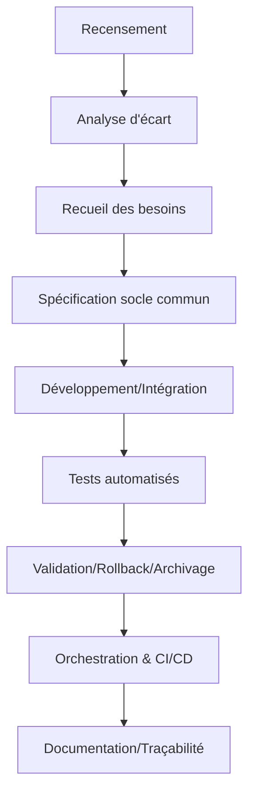

# Plan Dev Magistral v102 : Intercommunication entre Roo-Code, KiloCode, Cline et IA Locale (Jan)

## Introduction

Ce plan a pour objectif de définir une stratégie pour l'intercommunication entre Roo-Code, KiloCode, Cline et une IA locale (Jan), afin d'améliorer l'efficacité et la qualité du processus de développement.

Le contexte est l'évolution de notre écosystème de managers, avec l'ajout d'un roadmap manager et la perspective d'intégrer une IA locale.

## Architecture

L'architecture cible comprend les composants suivants :

*   **Roo-Code :** Outil de génération de code.
*   **KiloCode :** Outil d'analyse et de correction de code.
*   **Cline :** Outil de déploiement et de gestion de projet.
*   **IA Locale (Jan) :** Outil d'analyse de code en temps réel et de suggestions personnalisées.
*   **Roadmap Manager :** Outil de planification et de suivi des projets.

[Insérer un schéma de l'architecture ici]

## Avantages

L'intercommunication entre ces composants apporterait les avantages suivants :

*   **Automatisation des tâches :** Génération de code, tests, déploiement.
*   **Collaboration améliorée :** Partage de contexte, révision de code, gestion de projet.
*   **Intelligence augmentée :** Analyse de code, détection de bugs, optimisation.
*   **Gestion de projet optimisée :** Suivi en temps réel, identification des problèmes, allocation des ressources.

## Défis

L'implémentation de cette intercommunication soulève les défis suivants :

*   **Complexité accrue :** Nécessité d'une planification et d'une conception minutieuses.
*   **Gestion des dépendances :** Risque de conflits et nécessité d'outils de gestion des dépendances.
*   **Sécurité :** Augmentation de la surface d'attaque potentielle.
*   **Performance :** Risque de latences et de goulots d'étranglement.

## Recommandations

Pour relever ces défis, il est recommandé de :

*   **Adopter une approche modulaire :** Concevoir les composants avec des interfaces claires et bien définies.
*   **Utiliser des protocoles de communication standardisés :** MCP, Redis Pub/Sub, HTTP/REST, gRPC.
*   **Mettre en place des tests rigoureux :** Tests unitaires, tests d'intégration, tests de bout en bout.
*   **Documenter l'architecture et les API :** Faciliter la compréhension et la collaboration.
*   **Gérer les dépendances avec soin :** Utiliser un outil de gestion des dépendances.

## 🚨 CONSIGNES CRITIQUES DE VÉRIFICATION

### Avant CHAQUE étape

- [ ] **VÉRIFIER la branche actuelle** : `git branch` et `git status`
- [ ] **VÉRIFIER les imports** : cohérence des chemins relatifs/absolus
- [ ] **VÉRIFIER la stack** : `go mod tidy` et `go build ./...`
- [ ] **VÉRIFIER les fichiers requis** : présence de tous les composants
- [ ] **VÉRIFIER la responsabilité** : éviter la duplication de code
- [ ] **TESTER avant commit** : `go test ./...` doit passer à 100%

### À CHAQUE section majeure

- [ ] **COMMITTER sur la bonne branche** : vérifier correspondance
- [ ] **PUSHER immédiatement** : `git push origin [branch-name]`
- [ ] **DOCUMENTER les changements** : mise à jour du README
- [ ] **VALIDER l'intégration** : tests end-to-end

### Responsabilités par branche

- **main** : Code de production stable uniquement
- **dev** : Intégration et tests de l'écosystème unifié  
- **managers** : Développement des managers individuels
- **vectorization-go** : Migration Python→Go des vecteurs
- **consolidation-v57** : Branche dédiée pour ce plan

## 🏗️ SPÉCIFICATIONS TECHNIQUES GÉNÉRIQUES

### 📋 Stack Technique Complète

**Runtime et Outils**

- **Go Version** : 1.21+ requis (vérifier avec `go version`)
- **Module System** : Go modules activés (`go mod init/tidy`)
- **Build Tool** : `go build ./...` pour validation complète
- **Dependency Management** : `go mod download` et `go mod verify`

**Dépendances Critiques**

```go
// go.mod - dépendances requises
require (
    github.com/qdrant/go-client v1.7.0        // Client Qdrant natif
    github.com/google/uuid v1.6.0             // Génération UUID
    github.com/stretchr/testify v1.8.4        // Framework de test
    go.uber.org/zap v1.26.0                   // Logging structuré
    golang.org/x/sync v0.5.0                  // Primitives de concurrence
    github.com/spf13/viper v1.17.0            // Configuration
    github.com/gin-gonic/gin v1.9.1           // Framework HTTP (si APIs)
)
```

**Outils de Développement**

- **Linting** : `golangci-lint run` (configuration dans `.golangci.yml`)
- **Formatting** : `gofmt -s -w .` et `goimports -w .`
- **Testing** : `go test -v -race -cover ./...`
- **Security** : `gosec ./...` pour l'analyse de sécurité

### 🗂️ Structure des Répertoires Normalisée

```
EMAIL_SENDER_1/
├── cmd/                          # Points d'entrée des applications
│   ├── migration-tool/          # Outil de migration Python->Go
│   └── manager-consolidator/    # Outil de consolidation
├── internal/                    # Code interne non exportable
│   ├── config/                 # Configuration centralisée
│   ├── models/                 # Structures de données
│   ├── repository/             # Couche d'accès données
│   └── service/                # Logique métier
├── pkg/                        # Packages exportables
│   ├── vectorization/          # Module vectorisation Go
│   ├── managers/               # Managers consolidés
│   └── common/                 # Utilitaires partagés
├── api/                        # Définitions API (OpenAPI/Swagger)
├── scripts/                    # Scripts d'automatisation
├── docs/                       # Documentation technique
├── tests/                      # Tests d'intégration
└── deployments/                # Configuration déploiement
```

### 🎯 Conventions de Nommage Strictes

**Fichiers et Répertoires**

- **Packages** : `snake_case` (ex: `vector_client`, `email_manager`)
- **Fichiers Go** : `snake_case.go` (ex: `vector_client.go`, `manager_consolidator.go`)
- **Tests** : `*_test.go` (ex: `vector_client_test.go`)
- **Scripts** : `kebab-case.sh/.ps1` (ex: `build-and-test.sh`)

**Code Go**

- **Variables/Fonctions** : `camelCase` (ex: `vectorClient`, `processEmails`)
- **Constantes** : `UPPER_SNAKE_CASE` ou `CamelCase` selon contexte
- **Types/Interfaces** : `PascalCase` (ex: `VectorClient`, `EmailManager`)
- **Méthodes** : `PascalCase` pour export, `camelCase` pour privé

**Git et Branches**

- **Branches** : `kebab-case` (ex: `feature/vector-migration`, `fix/manager-consolidation`)
- **Commits** : Format Conventional Commits

  ```
  feat(vectorization): add Go native Qdrant client
  fix(managers): resolve duplicate interface definitions
  docs(readme): update installation instructions
  ```

### 🔧 Standards de Code et Qualité

**Formatage et Style**

- **Indentation** : Tabs (format Go standard)
- **Longueur de ligne** : 100 caractères maximum
- **Imports** : Groupés (standard, third-party, internal) avec lignes vides
- **Commentaires** : GoDoc format pour exports, inline pour logique complexe

**Architecture et Patterns**

- **Principe** : Clean Architecture avec dépendances inversées
- **Error Handling** : Types d'erreur explicites avec wrapping
- **Logging** : Structured logging avec Zap (JSON en prod, console en dev)
- **Configuration** : Viper avec support YAML/ENV/flags
- **Concurrence** : Channels et goroutines, éviter les mutexes sauf nécessaire

**Exemple de Structure d'Erreur**

```go
type VectorError struct {
    Operation string
    Cause     error
    Code      ErrorCode
}

func (e *VectorError) Error() string {
    return fmt.Sprintf("vector operation '%s' failed: %v", e.Operation, e.Cause)
}
```

### 🧪 Stratégie de Tests Complète

**Couverture et Types**

- **Couverture minimale** : 85% pour le code critique
- **Tests unitaires** : Tous les packages publics
- **Tests d'intégration** : Composants inter-dépendants
- **Tests de performance** : Benchmarks pour la vectorisation

**Conventions de Test**

```go
func TestVectorClient_CreateCollection(t *testing.T) {
    tests := []struct {
        name    string
        config  VectorConfig
        wantErr bool
    }{
        {
            name: "valid_collection_creation",
            config: VectorConfig{
                Host: "localhost",
                Port: 6333,
                CollectionName: "test_collection",
                VectorSize: 384,
            },
            wantErr: false,
        },
        // ... autres cas de test
    }
    
    for _, tt := range tests {
        t.Run(tt.name, func(t *testing.T) {
            // Test implementation
        })
    }
}
```

**Mocking et Test Data**

- **Interfaces** : Toujours définir des interfaces pour le mocking
- **Test fixtures** : Données de test dans `testdata/`
- **Setup/Teardown** : `TestMain` pour setup global

### 🔒 Sécurité et Configuration

**Gestion des Secrets**

- **Variables d'environnement** : Pas de secrets dans le code
- **Configuration** : Fichiers YAML pour le dev, ENV pour la prod
- **Qdrant** : Authentification via token si configuré

**Variables d'Environnement Requises**

```bash
# Configuration Qdrant
QDRANT_HOST=localhost
QDRANT_PORT=6333
QDRANT_API_KEY=optional_token

# Configuration Application
LOG_LEVEL=info
ENV=development
CONFIG_PATH=./config/config.yaml

# Migration
PYTHON_DATA_PATH=./data/vectors/
BATCH_SIZE=1000
```

### 📊 Performance et Monitoring

**Critères de Performance**

- **Vectorisation** : < 500ms pour 10k vecteurs
- **API Response** : < 100ms pour requêtes simples
- **Memory Usage** : < 500MB en utilisation normale
- **Concurrence** : Support 100 requêtes simultanées

**Métriques à Tracker**

```go
// Exemple de métriques avec Prometheus
var (
    vectorOperationDuration = prometheus.NewHistogramVec(
        prometheus.HistogramOpts{
            Name: "vector_operation_duration_seconds",
            Help: "Duration of vector operations",
        },
        []string{"operation", "status"},
    )
)
```

### 🔄 Workflow Git et CI/CD

**Workflow de Développement**

1. **Créer branche** : `git checkout -b feature/task-name`
2. **Développer** : Commits atomiques avec tests
3. **Valider** : `go test ./...` + `golangci-lint run`
4. **Push** : `git push origin feature/task-name`
5. **Merger** : Via PR après review

**Definition of Done**

- [ ] Code implémenté selon les spécifications
- [ ] Tests unitaires écrits et passants (>85% coverage)
- [ ] Linting sans erreurs (`golangci-lint run`)
- [ ] Documentation GoDoc mise à jour
- [ ] Tests d'intégration passants
- [ ] Performance validée (benchmarks si critique)
- [ ] Code review approuvé
- [ ] Branch mergée et nettoyée

## Plan d'implémentation

### 1. Définition des interfaces de communication

*   **Objectif :** Définir les interfaces de communication entre les différents composants (Roo-Code, KiloCode, Cline, IA Locale, Roadmap Manager).
*   **Responsable :** [Nom du responsable à définir]
    *   **Sous-étapes :**
        *   [ ] Recensement des besoins : Identifier les informations à échanger entre les composants.
            *   Livrables : Liste des informations à échanger (JSON, Markdown).
            *   Exemple :
                ```json
                {
                  "composant1": "Roo-Code",
                  "composant2": "KiloCode",
                  "informations": ["code source", "erreurs", "suggestions"]
                }
                ```
            *   Automatisation : Script Go pour générer le squelette des interfaces.
            *   Validation : Revue croisée.
            *   Rollback : Versionnement Git.
            *   CI/CD : Job pour vérifier la conformité des interfaces.
            *   Documentation : README.
            *   Traçabilité : Logs.
            *   **Vérification :**
                *   [ ] Branche actuelle correcte (`git branch`).
                *   [ ] Imports cohérents.
                *   [ ] Stack OK (`go mod tidy && go build ./...`).
                *   [ ] Fichiers requis présents.
                *   [ ] Tests passent (`go test ./...`).
        *   [ ] Analyse d'écart : Identifier les interfaces existantes et les écarts par rapport aux besoins.
        *   [ ] Recueil des besoins : Définir les spécifications des nouvelles interfaces.
        *   [ ] Spécification : Rédiger les spécifications des interfaces (API, formats de données).
            *   Livrables : Fichiers de spécification (OpenAPI, gRPC).
            *   Exemple :
                ```yaml
                openapi: 3.0.0
                info:
                  title: API Roo-Code
                  version: 1.0.0
                paths:
                  /generate:
                    post:
                      summary: Generate code
                      requestBody:
                        required: true
                        content:
                          application/json:
                            schema:
                              type: object
                              properties:
                                specifications:
                                  type: string
                  responses:
                    '200':
                      description: Successful operation
                      content:
                        text/plain:
                          schema:
                            type: string
                ```
            *   Automatisation : Script Go pour valider les spécifications.
            *   Validation : Revue croisée.
            *   Rollback : Versionnement Git.
            *   **Vérification :**
                *   [ ] Branche actuelle correcte (`git branch`).
                *   [ ] Imports cohérents.
                *   [ ] Stack OK (`go mod tidy && go build ./...`).
                *   [ ] Fichiers requis présents.
                *   [ ] Tests passent (`go test ./...`).
        *   [ ] Développement : Implémenter les interfaces.
        *   [ ] Tests (unitaires/intégration) : Écrire des tests pour vérifier le bon fonctionnement des interfaces.
            *   Livrables : Scripts de tests (Go).
            *   Exemple :
                ```go
                package main

                import "testing"

                func TestGenerateCode(t *testing.T) {
                  // Test code here
                }
                ```
            *   Automatisation : Script Go pour exécuter les tests.
            *   Validation : Couverture de code > 80%.
            *   Rollback : Versionnement Git.
            *   **Vérification :**
                *   [ ] Branche actuelle correcte (`git branch`).
                *   [ ] Imports cohérents.
                *   [ ] Stack OK (`go mod tidy && go build ./...`).
                *   [ ] Fichiers requis présents.
                *   [ ] Tests passent (`go test ./...`).
        *   [ ] Reporting : Générer des rapports sur la couverture des tests et la conformité aux normes.
        *   [ ] Validation : Valider les interfaces avec les équipes concernées.
        *   [ ] Rollback : Définir une procédure de rollback en cas de problème.
            *   **Commit et Push :**
                *   [ ] Commiter sur la bonne branche.
                *   [ ] Pusher immédiatement (`git push origin [branch-name]`).
                *   [ ] Documenter les changements (mise à jour du README).
                *   [ ] Valider l'intégration (tests end-to-end).

### 2. Implémentation des serveurs MCP

*   **Objectif :** Implémenter des serveurs MCP pour exposer les fonctionnalités des différents composants.
*   **Responsable :** [Nom du responsable à définir]
    *   **Sous-étapes :**
        *   [ ] Recensement des outils et ressources à exposer via MCP.
        *   [ ] Analyse d'écart : Identifier les serveurs MCP existants et les écarts par rapport aux besoins.
        *   [ ] Recueil des besoins : Définir les spécifications des nouveaux serveurs MCP.
        *   [ ] Spécification : Rédiger les spécifications des serveurs MCP.
        *   [ ] Développement : Implémenter les serveurs MCP.
        *   [ ] Tests (unitaires/intégration) : Écrire des tests pour vérifier le bon fonctionnement des serveurs MCP.
        *   [ ] Reporting : Générer des rapports sur la couverture des tests et la conformité aux normes.
        *   [ ] Validation : Valider les serveurs MCP avec les équipes concernées.
        *   [ ] Rollback : Définir une procédure de rollback en cas de problème.

### 3. Intégration avec Redis Pub/Sub

*   **Objectif :** Utiliser Redis Pub/Sub pour la diffusion d'événements et la synchronisation entre les composants.
*   **Responsable :** [Nom du responsable à définir]
    *   **Sous-étapes :**
        *   [ ] Définir les événements à publier et à consommer.
        *   [ ] Implémenter la publication et la consommation des événements.
        *   [ ] Tester l'intégration avec Redis Pub/Sub.

### 4. Développement des API REST/gRPC

*   **Objectif :** Développer des API REST/gRPC pour permettre aux composants de communiquer entre eux.
*   **Responsable :** [Nom du responsable à définir]
    *   **Sous-étapes :**
        *   [ ] Définir les API à développer.
        *   [ ] Implémenter les API.
        *   [ ] Tester les API.

### 5. Intégration de l'IA Locale (Jan)

*   **Objectif :** Intégrer l'IA locale (Jan) pour l'analyse de code en temps réel et la fourniture de suggestions personnalisées.
*   **Responsable :** [Nom du responsable à définir]
    *   **Sous-étapes :**
        *   [ ] Définir les interfaces de communication avec Jan.
        *   [ ] Implémenter l'intégration avec Jan.
        *   [ ] Tester l'intégration avec Jan.

### 6. Orchestration & CI/CD

*   **Objectif:** Mettre en place un système d'orchestration et d'intégration continue/déploiement continu (CI/CD) pour automatiser le processus de développement et assurer la qualité du code.
*   **Responsable :** [Nom du responsable à définir]
    *   **Sous-étapes :**
        *   [ ] Définir les étapes du pipeline CI/CD.
        *   [ ] Configurer les outils CI/CD (GitHub Actions, Jenkins, etc.).
        *   [ ] Implémenter les scripts d'automatisation pour chaque étape du pipeline.
        *   [ ] Mettre en place des tests automatisés pour valider la qualité du code.
        *   [ ] Configurer des alertes et des notifications pour signaler les problèmes potentiels.
*   **Orchestrateur global :**
    *   Développement d'un orchestrateur global (`auto-roadmap-runner.go`) pour exécuter tous les scans, analyses, tests, rapports, feedback, sauvegardes, notifications.
*   **Intégration CI/CD :**
    *   Configuration du pipeline CI/CD.
    *   Ajout de badges, triggers et reporting.
    *   Mise en place du feedback automatisé.

## Métriques et suivi de la qualité du code :

*   Intégrer des outils d'analyse de la dette technique (SonarQube, etc.) pour suivre l'évolution de la qualité du code au fil du temps.
*   Définir des seuils d'alerte pour la dette technique et mettre en place des mécanismes de notification.

## Gestion des erreurs et rollback :

*   Mettre en place un système de gestion centralisée des erreurs, avec des codes d'erreur standardisés et des messages clairs.
*   Définir des procédures de rollback automatisées pour chaque étape du processus, avec des points de restauration clairement identifiés.
*   Prévoir des mécanismes de notification en cas d'échec d'une étape ou de déclenchement d'une procédure de rollback.

## Sécurité :

*   Effectuer des tests de sécurité réguliers, en utilisant des outils d'analyse de vulnérabilités et des tests d'intrusion.
*   Mettre en place un processus de gestion des incidents de sécurité, avec des procédures claires pour la notification, l'investigation et la correction des vulnérabilités.
*   Former les développeurs aux bonnes pratiques de sécurité.

## Documentation et traçabilité :

*   Utiliser un système de gestion de la documentation (Confluence, etc.) pour centraliser la documentation technique et les guides d'utilisation.
*   Mettre en place un système de traçabilité de bout en bout, permettant de suivre l'origine de chaque modification et de chaque décision.
*   Utiliser des identifiants uniques pour chaque tâche, chaque bug et chaque demande de fonctionnalité, afin de faciliter la traçabilité.

## Adaptabilité et robustesse :

*   Concevoir les interfaces de communication de manière à être extensibles et adaptables aux évolutions futures.
*   Mettre en place des mécanismes de surveillance de la performance et de la disponibilité des différents composants, avec des alertes en cas de dépassement des seuils.
*   Prévoir des plans de continuité d'activité en cas de panne d'un des composants.

## Intégration de l'IA locale (Jan) :

*   Définir des métriques pour évaluer la qualité des suggestions de l'IA locale, et mettre en place un mécanisme de feedback pour permettre aux développeurs de signaler les suggestions incorrectes ou inutiles.
*   Mettre en place un système de formation continue pour l'IA locale, en utilisant les données de feedback pour améliorer ses performances.

## Automatisation et tests :

*   Automatiser la génération de la documentation à partir du code source.
*   Automatiser la vérification de la conformité aux normes de codage.
*   Automatiser la génération des rapports de test et des rapports de sécurité.

## Conclusion

L'intercommunication entre Roo-Code, KiloCode, Cline et l'IA locale représente une opportunité majeure d'améliorer notre processus de développement. En relevant les défis et en suivant les recommandations de ce plan, nous pouvons créer un écosystème plus efficace, intelligent et collaboratif.

Prochaine étape : Débuter le recensement des besoins pour la définition des interfaces de communication.

---

## Customisation, Scalabilité et Interopérabilité des Extensions (RooCode, KiloCode, Cline, Copilot)

### Objectif

Obtenir une intercommunication robuste, automatisable et testée entre RooCode, KiloCode, Cline et Copilot, en harmonisant la customisation, la scalabilité et la traçabilité selon les standards avancés du dépôt.

---

## Objectif

Obtenir une intercommunication robuste, automatisable et testée entre RooCode, KiloCode, Cline et Copilot, en harmonisant la customisation, la scalabilité et la traçabilité selon les standards avancés du dépôt.

---

## 1. Recensement des capacités de customisation

- [ ] **Lister les modes, workflows, rules, prompts, scripts, docs, archivage pour chaque extension**
  - Livrable : Tableau comparatif (Markdown)
  - Commande : `go run scripts/scan-customization.go > docs/customization_report.md`
  - Format : Markdown + CSV
  - Validation : Rapport généré, revue croisée
  - Rollback : Historique Git, backup `.bak`
  - CI/CD : Job de scan, badge de couverture
  - Documentation : `docs/customization_report.md`
  - Traçabilité : Log d’exécution, commit

---

## 2. Analyse d’écart et convergence

- [ ] **Comparer les capacités, identifier les points de friction et de convergence**
  - Livrable : Rapport d’écart (Markdown)
  - Commande : `go run scripts/diff-customization.go > docs/customization_gap.md`
  - Format : Markdown
  - Validation : Rapport validé par managers
  - Rollback : Versionnement Git
  - CI/CD : Job de diff, reporting automatisé
  - Documentation : `docs/customization_gap.md`
  - Traçabilité : Historique des gaps

---

## 3. Recueil des besoins pour le socle commun

- [ ] **Définir les besoins d’harmonisation, d’automatisation et d’interopérabilité**
  - Livrable : Spécification des besoins (JSON/Markdown)
  - Commande : `go run scripts/collect-needs.go > docs/interop_needs.json`
  - Format : JSON + Markdown
  - Validation : Revue croisée, feedback managers
  - Rollback : Backup auto, version Git
  - CI/CD : Job de collecte, notification
  - Documentation : `docs/interop_needs.json`
  - Traçabilité : Log de collecte

---

## 4. Spécification du socle commun

- [ ] **Rédiger la spécification technique du socle commun (modes, workflows, rules, prompts, scripts, archivage)**
  - Livrable : Spécification technique (Markdown/YAML)
  - Commande : `go run scripts/spec-common.go > docs/spec_common.md`
  - Format : Markdown + YAML
  - Validation : Revue technique, tests automatisés
  - Rollback : Historique Git, backup
  - CI/CD : Job de validation, badge
  - Documentation : `docs/spec_common.md`
  - Traçabilité : Log de validation

---

## 5. Développement et intégration

- [ ] **Développer les scripts, prompts, workflows, rules harmonisés**
  - Livrable : Scripts Go natifs, prompts, workflows YAML, rules MD
  - Commandes :  
    - `go run scripts/generate-workflows.go`
    - `go run scripts/generate-prompts.go`
    - `go run scripts/generate-rules.go`
  - Format : Go, YAML, Markdown
  - Validation : Tests unitaires/integration (`go test ./scripts/...`)
  - Rollback : Backup `.bak`, revert Git
  - CI/CD : Pipeline d’intégration, reporting, triggers
  - Documentation : Guides d’usage, README
  - Traçabilité : Historique des scripts, logs d’exécution

---

## 6. Tests automatisés et reporting

- [ ] **Automatiser les tests de chaque étape, générer les rapports de couverture et de conformité**
  - Livrable : Rapport de tests (HTML/Markdown), badge de couverture
  - Commande : `go test -v -cover ./scripts/... > docs/test_report.md`
  - Format : Markdown + HTML
  - Validation : Badge CI/CD, revue croisée
  - Rollback : Historique des tests
  - CI/CD : Job de test, reporting automatisé
  - Documentation : `docs/test_report.md`
  - Traçabilité : Log de test, commit

---

## 7. Validation, rollback et archivage

- [ ] **Valider chaque étape, prévoir rollback et archivage systématique**
  - Livrable : Checklist de validation, scripts de rollback, archive des rapports
  - Commande :  
    - `go run scripts/validate-step.go`
    - `go run scripts/rollback-step.go`
  - Format : Markdown, Go
  - Validation : Validation humaine + automatisée
  - Rollback : Backup, revert Git, archive `.bak`
  - CI/CD : Job de validation, notification
  - Documentation : Guides de rollback, README
  - Traçabilité : Log de validation, historique des archives

---

## 8. Orchestration & CI/CD

- [ ] **Développer un orchestrateur global (`auto-roadmap-runner.go`)**
  - Livrable : Script Go natif, pipeline CI/CD, reporting, feedback automatisé
  - Commande : `go run scripts/auto-roadmap-runner.go`
  - Format : Go, YAML
  - Validation : Tests automatisés, badge CI/CD
  - Rollback : Backup, revert Git
  - CI/CD : Pipeline complet, triggers, reporting, archivage
  - Documentation : Guide d’usage, README
  - Traçabilité : Log d’orchestration, historique des runs

---

## 9. Robustesse et adaptation LLM

- [ ] **Procéder par étapes atomiques, vérification avant/après chaque modification**
  - Livrable : Log d’état, rapport de vérification
  - Commande : `go run scripts/check-state.go`
  - Format : Markdown, Go
  - Validation : Vérification automatisée + humaine
  - Rollback : Backup, revert Git
  - CI/CD : Job de vérification, notification
  - Documentation : Guide de vérification
  - Traçabilité : Log d’état, historique des vérifications

---

## 10. Documentation et traçabilité

- [ ] **Documenter chaque étape, archiver tous les outputs, garantir la traçabilité**
  - Livrable : README, guides, rapports, logs, archives
  - Commande : `go run scripts/archive-docs.go`
  - Format : Markdown, Go, HTML
  - Validation : Revue croisée, badge CI/CD
  - Rollback : Backup, archive
  - CI/CD : Job d’archivage, reporting
  - Documentation : Centralisation dans `docs/`, `github/docs`, `projet/roadmaps/plans/`
  - Traçabilité : Historique des docs, logs d’archivage

---

## 11. Cases à cocher et dépendances

- [ ] **Structurer la roadmap avec cases à cocher pour chaque livrable/action**
  - Livrable : Roadmap Markdown avec cases à cocher, dépendances explicites
  - Commande : Génération automatique via script Go
  - Format : Markdown
  - Validation : Revue croisée, reporting CI/CD
  - Rollback : Historique Git
  - Documentation : Roadmap dans `projet/roadmaps/plans/consolidated/`
  - Traçabilité : Log de génération, commit

---

## 12. Exemples de scripts Go natifs

```go
// scripts/scan-customization.go
package main
import "fmt"
func main() {
    fmt.Println("Scanning customizations...")
    // Implémentation du scan
}
```

```go
// scripts/validate-step.go
package main
import "fmt"
func main() {
    fmt.Println("Validating step...")
    // Implémentation de la validation
}
```

---

## 13. Diagramme Mermaid – Dépendances et orchestration



---

## 14. Standards .clinerules/ et stack Go native

- Granularité, documentation, validation croisée, versionnement, traçabilité, automatisation maximale.
- Stack Go prioritaire, scripts reproductibles, tests automatisés, reporting, archivage.

---

**Ce plan exhaustif est prêt à être intégré à la roadmap, garantissant une intercommunication robuste, automatisable et traçable entre toutes les extensions.**


