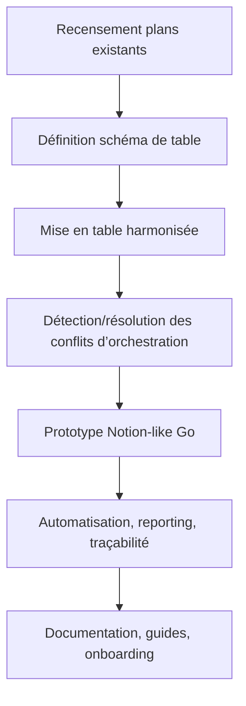

# Plan de Développement v104 – Gouvernance Dynamique et Centralisée des Plans Dev

---

## 1. Introduction et objectifs

Ce plan vise à instaurer une gouvernance unifiée, dynamique et traçable de tous les plans de développement, tâches et roadmaps du projet, en harmonisant la granularité, la traçabilité, la réutilisabilité et l’automatisation.  
Il s’appuie sur la transformation des plans en tables structurées (compatibles Notion et Notion-like open source), la synchronisation avec le template-manager, et l’intégration à l’écosystème de managers et d’orchestrateurs existants.

---

## 2. Découpage atomique, granularisé et ordonnancé

### 2.1 Recensement et inventaire des plans existants

- **Objectif** : Obtenir une vision exhaustive de tous les plans, scripts, orchestrateurs et dépendances.
- **Tâches** :
  - Scanner le dossier `consolidated/` et générer une table d’inventaire (`plans_inventory.csv`/`plans_inventory.md`).
  - Extraire pour chaque plan : ID, titre, manager, statut, priorité, dépendances, type, date, etc.
- **Livrables** : Table d’inventaire dynamique.
- **Commandes** : `go run ./cmd/plan-inventory`
- **Critères de validation** : Table exhaustive, validée par revue croisée.
- **Rollback** : sauvegarde `.bak` de l’inventaire précédent.

---

### 2.2 Définition et validation du schéma de table unique

- **Objectif** : Standardiser la structure de données pour tous les plans.
- **Tâches** :
  - Définir le modèle de données (propriétés, types, compatibilité Notion/Notion-like).
  - Valider le schéma avec les besoins métiers et techniques.
- **Livrables** : `plan_schema.json`/`plan_schema.md`
- **Commandes** : Génération automatique via template-manager.
- **Critères de validation** : Schéma validé, compatible Notion/Notion-like.

---

### 2.3 Harmonisation et migration des plans

- **Objectif** : Centraliser et standardiser tous les plans existants.
- **Tâches** :
  - Migrer chaque plan vers la table harmonisée.
  - Vérifier la cohérence, la granularité, la traçabilité.
- **Livrables** : `plans_harmonized.csv`/`plans_harmonized.md`
- **Commandes** : `go run ./cmd/plan-harmonizer`
- **Critères de validation** : 100% des plans migrés, harmonisés, traçables.
- **Rollback** : sauvegarde `.bak` des plans originaux.

---

### 2.4 Détection et résolution des conflits d’orchestration

- **Objectif** : Unifier l’orchestration et éliminer les redondances.
- **Tâches** :
  - Analyser tous les scripts, orchestrateurs, workflows existants.
  - Identifier les conflits, doublons, divergences de granularité ou de conventions.
  - Fusionner/redéfinir les points d’entrée (orchestrateur global ou API centrale).
  - Factoriser les scripts, harmoniser les conventions.
- **Livrables** : Rapport de conflits, plan de convergence, scripts factorisés.
- **Commandes** : `go run ./cmd/orchestration-convergence`
- **Critères de validation** : Zéro conflit, points d’entrée unifiés, scripts factorisés.
- **Rollback** : sauvegarde `.bak` des scripts et workflows précédents.

---

### 2.5 Développement du prototype Notion-like Go

- **Objectif** : Offrir une interface moderne, dynamique et intelligente pour la gestion massive des tâches/plans.
- **Tâches** :
  - Concevoir le backend Go (API REST/GraphQL, stockage structuré).
  - Développer l’interface web (Go templates ou front-end JS minimaliste).
  - Implémenter la gestion dynamique des propriétés, la création/édition de colonnes, la planification intelligente (priorisation automatique, suggestions).
  - Intégrer la synchronisation avec la table harmonisée et le template-manager.
- **Livrables** : Prototype fonctionnel, documentation d’usage.
- **Commandes** : `go run ./cmd/notion-like`
- **Critères de validation** : Visualisation/édition dynamique, manipulation flexible, planification intelligente.
- **Rollback** : sauvegarde `.bak` des données.

---

### 2.6 Automatisation, reporting, traçabilité

- **Objectif** : Permettre le suivi, l’audit, la validation continue.
- **Tâches** :
  - Développer les scripts d’automatisation, de reporting, de logs, de synchronisation.
  - Générer des dashboards, logs, badges.
- **Livrables** : Scripts Go, dashboards, logs, badges.
- **Commandes** : `go run ./cmd/plan-reporter`
- **Critères de validation** : Reporting automatisé, logs, badges, notifications.
- **Rollback** : sauvegarde `.bak` des rapports.

---

### 2.7 Documentation, guides, onboarding

- **Objectif** : Faciliter l’adoption et la montée en compétence.
- **Tâches** :
  - Rédiger les guides d’usage, de contribution, de migration, de validation.
  - Centraliser la documentation et la rendre accessible.
- **Livrables** : README, guides, FAQ.
- **Commandes** : Génération automatique, validation CI/CD.
- **Critères de validation** : Documentation à jour, accessible, validée.

---

## 3. Ordre d’implémentation conseillé

1. **Recensement/inventaire**
2. **Définition du schéma de table**
3. **Harmonisation/migration**
4. **Détection/résolution des conflits d’orchestration**
5. **Prototype Notion-like Go**
6. **Automatisation/reporting/traçabilité**
7. **Documentation/guides**

---

## 4. Workflow global (diagramme Mermaid)

---

## 5. Checklist d’intégration et de validation

- [ ] Table d’inventaire dynamique générée
- [ ] Schéma de table validé et compatible Notion/Notion-like
- [ ] Plans harmonisés selon un template unique
- [ ] Conflits d’orchestration détectés et résolus
- [ ] Orchestrateur global et scripts factorisés en place
- [ ] Prototype Notion-like Go fonctionnel
- [ ] Automatisation, reporting, traçabilité opérationnels
- [ ] Documentation et guides centralisés et accessibles

---

> Ce plan magistral, structuré et ordonnancé, permet de démarrer efficacement la convergence, la gouvernance et l’automatisation de tous les plans dev, en assurant cohérence, évolutivité et pilotage intelligent à grande échelle.