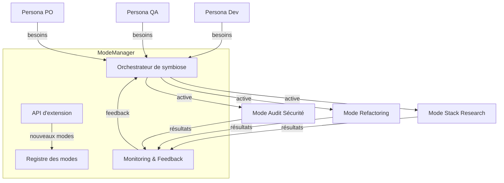

# plan-dev-v105g-gestion-personas-modes-multi-ext.md

## Objectif

- [ ] Établir une architecture de symbiose des modes (métier, techniques, persona, stack, etc.) pour permettre la coordination intelligente de tous les modes existants et futurs, afin de bâtir tous les workflows possibles pour le développement logiciel, en maximisant la complémentarité inter-persona et la résolution de problèmes métier.

---

## 1. Recensement des modes existants

- [ ] Recenser les modes existants

### Sources :
- [ ] Analyser `.roomodes` (définition des modes pour roocode)
- [ ] Analyser `.kilocodemodes` (équivalent pour kilocode)
- [ ] Analyser AGENTS.md (managers et modes Go)
- [ ] Consulter la documentation projet

### Exemples de modes identifiés :

- [ ] Compléter la liste des modes selon les sources

| Nom du mode         | Type         | Persona cible      | Objectif principal                        | Complémentarités/Exclusivités |
|---------------------|--------------|--------------------|-------------------------------------------|-------------------------------|
| Project Research    | Métier       | Architecte, Lead   | Analyse globale du repo, cartographie     | Stack Research, Audit         |
| Stack Research      | Métier       | Dev, DevOps        | Analyse ciblée d’une stack/techno         | Project Research, Refactoring |
| Refactoring         | Technique    | Dev, QA            | Identifier et automatiser les refactorings| Stack Research, Test          |
| Test                | Technique    | QA, Dev            | Génération et exécution de tests          | Refactoring, CI/CD            |
| CI/CD Pipeline      | Technique    | DevOps             | Orchestration des workflows CI/CD         | Test, Build                   |
| Build               | Technique    | Dev, DevOps        | Compilation, packaging                    | CI/CD, Test                   |
| Audit Sécurité      | Métier       | SecOps, Lead       | Analyse des vulnérabilités                | Stack Research, Project Res.  |
| Documentation       | Métier       | PO, Dev, QA        | Génération/validation de docs             | Project Research, Test        |
| Onboarding          | Métier       | RH, Lead, Dev      | Parcours d’intégration                    | Project Research, Doc         |
| Persona Dev         | Persona      | Dev                | Vue et outils adaptés au dev              | Stack Research, Refactoring   |
| Persona QA          | Persona      | QA                 | Vue et outils adaptés au QA               | Test, Refactoring             |
| Persona PO          | Persona      | Product Owner      | Vue métier, priorisation                  | Documentation, Onboarding     |
| Persona SecOps      | Persona      | SecOps             | Vue sécurité, audit                       | Audit Sécurité                |
| Persona Data        | Persona      | Data Scientist     | Analyse data, pipelines                   | Stack Research, Test          |
| Mode Synchronisation| Technique    | Tous               | Sync automatique des modes entre VSIX     | Tous                          |

*(Liste à compléter selon .roomodes/.kilocodemodes et AGENTS.md)*

---

## 2. Architecture de symbiose des modes

- [ ] Concevoir l’architecture de symbiose des modes

### a. Registre centralisé des modes
- [ ] Enregistrer tous les modes avec : nom, type, objectifs, contraintes, complémentarités, exclusivités, persona cible, valeur ajoutée.

### b. Orchestrateur de modes
- [ ] Détecter automatiquement les conflits (exclusivité, incompatibilité, ressources partagées).
- [ ] Exploiter les complémentarités (modes séquentiels, parallèles, coopératifs).
- [ ] Composer dynamiquement des modes métier/persona selon le contexte et les besoins.
- [ ] Arbitrer/prioriser entre modes concurrents.

### c. Spécification métier et intelligence collaborative
- [ ] Rédiger une fiche métier pour chaque mode (problèmes adressés, contexte d’activation, valeur ajoutée).
- [ ] Permettre aux personas d’exprimer besoins et contraintes, influençant la sélection/composition des modes actifs.
- [ ] Définir des workflows séquentiels ou parallèles entre modes/personas selon la nature du problème.

### d. API et extension
- [ ] Permettre l’ajout, modification, suppression de modes métier/persona par l’équipe ou l’utilisateur.
- [ ] Développer des plugins/extensibilité pour enrichir le catalogue de modes.

### e. Monitoring et feedback
- [ ] Mettre en place la surveillance en temps réel des modes actifs, conflits, synergies et résultats.
- [ ] Intégrer le feedback utilisateur/persona pour affiner la sélection/composition des modes.
- [ ] Proposer des suggestions d’amélioration ou de nouveaux modes métier/persona selon les usages.

---

## 3. Modèle de fiche descriptive de mode

- [ ] Définir le modèle de fiche descriptive pour chaque mode

- **Nom :**  
- **Type :** (métier, technique, persona, stack, etc.)
- **Persona cible :**  
- **Objectifs :**  
- **Contexte d’activation :**  
- **Complémentarités :**  
- **Exclusivités :**  
- **Valeur ajoutée :**  
- **Exemples de workflows associés :**  

---

## 4. Illustration (Mermaid)

- [ ] Réaliser le schéma Mermaid d’architecture

---

## 5. Exemples de workflows coordonnés

- [ ] Définir les exemples de workflows coordonnés

- **Onboarding Dev :** Project Research → Documentation → Persona Dev → Stack Research → Test
- **Audit sécurité :** Project Research → Stack Research → Audit Sécurité → Persona SecOps → Refactoring
- **Refactoring massif :** Stack Research → Refactoring → Test → CI/CD → Persona QA

---

## 6. Prochaines étapes

### 6.6 Gouvernance et sécurité des modes/personas
- [ ] Définir la politique de gestion des droits et rôles pour chaque mode/persona
- [ ] Implémenter l’audit des accès et des modifications (logs, traçabilité)
- [ ] Mettre en place la gestion des habilitations (ajout, révocation, modification)
- [ ] Rédiger la procédure de contrôle d’accès et de gestion des incidents
- [ ] Vérifier la conformité RGPD et sécurité (analyse, tests)
- [ ] Publier la documentation dans `.github/docs/securite/gouvernance-modes.md`
- [ ] Archiver les audits et validations dans `.github/docs/securite/audit-log.md`
- [ ] Mettre à jour la documentation à chaque évolution de la gouvernance

### 6.7 Interopérabilité et connecteurs externes
- [ ] Cartographier les outils tiers et API à intégrer
- [ ] Définir la structure standard des connecteurs (schéma, format, champs)
- [ ] Implémenter les connecteurs pour chaque outil/API prioritaire
- [ ] Tester l’interopérabilité (scénarios réels, cas limites)
- [ ] Documenter la procédure d’intégration dans `.github/docs/connecteurs/spec-connecteurs.md`
- [ ] Publier la liste des connecteurs dans `.github/docs/connecteurs/liste.md`
- [ ] Mettre en place un suivi des évolutions et incidents d’intégration
- [ ] Archiver les rapports de tests et corrections dans `.github/docs/connecteurs/historique-tests.md`

### 6.8 Intelligence adaptative et auto-apprentissage
- [ ] Définir les indicateurs de détection des usages et des patterns
- [ ] Implémenter le module de suggestion IA (auto-amélioration, recommandations)
- [ ] Mettre en place la collecte et l’analyse des données d’usage
- [ ] Tester la pertinence des suggestions et de l’auto-apprentissage
- [ ] Documenter l’architecture et les algorithmes dans `.github/docs/ia/spec-intelligence.md`
- [ ] Publier les rapports d’expérimentation et d’amélioration dans `.github/docs/ia/rapports/`
- [ ] Mettre à jour la documentation à chaque évolution du module IA

### 6.9 Visualisation et pilotage centralisé
- [ ] Concevoir le dashboard interactif de pilotage des modes/personas
- [ ] Définir les indicateurs et widgets à afficher
- [ ] Implémenter l’activation/désactivation dynamique des modes via le dashboard
- [ ] Tester l’ergonomie et la réactivité du pilotage centralisé
- [ ] Documenter l’interface et les flux dans `.github/docs/dashboard/spec-dashboard.md`
- [ ] Publier les guides d’utilisation et FAQ dans `.github/docs/dashboard/guides/`
- [ ] Archiver les retours utilisateurs et améliorations dans `.github/docs/dashboard/feedback-log.md`

### 6.10 Simulation et sandboxing
- [ ] Définir les scénarios de test et de simulation en environnement isolé
- [ ] Implémenter le module de sandboxing (création, gestion, suppression d’environnements)
- [ ] Tester la robustesse et la sécurité des environnements simulés
- [ ] Documenter la méthodologie de simulation dans `.github/docs/sandboxing/methodologie.md`
- [ ] Publier les rapports de simulation et d’incidents dans `.github/docs/sandboxing/rapports/`
- [ ] Mettre à jour la documentation à chaque évolution du module sandboxing

### 6.11 Documentation et onboarding utilisateur
- [ ] Rédiger les tutoriels et guides pour chaque mode/persona
- [ ] Créer une FAQ dédiée aux modes et à la gestion des personas
- [ ] Documenter les bonnes pratiques d’utilisation et de sécurité
- [ ] Mettre en place un parcours d’onboarding interactif
- [ ] Publier la documentation dans `.github/docs/onboarding/guides/`
- [ ] Archiver les retours et améliorations dans `.github/docs/onboarding/feedback-log.md`
- [ ] Mettre à jour la documentation à chaque évolution des modes ou du parcours utilisateur

### 6.12 Scalabilité et performance
- [ ] Définir les exigences de scalabilité pour chaque composant (modes, orchestrateur, connecteurs)
- [ ] Concevoir la stratégie d’architecture scalable (microservices, découplage, cache)
- [ ] Implémenter les optimisations de performance (tests de charge, monitoring)
- [ ] Documenter la stratégie et les benchmarks dans `.github/docs/performance/spec-performance.md`
- [ ] Publier les rapports de tests et analyses dans `.github/docs/performance/rapports/`
- [ ] Mettre à jour la documentation à chaque évolution de l’architecture ou des performances

### 6.13 Conformité et standards
- [ ] Cartographier les standards à respecter (OpenAPI, JSON Schema, RGPD, etc.)
- [ ] Définir les procédures de validation de conformité pour chaque mode/persona
- [ ] Implémenter les outils de vérification automatique (lint, validation de schéma)
- [ ] Tester la conformité sur des cas réels et simulés
- [ ] Documenter les standards et procédures dans `.github/docs/conformite/spec-conformite.md`
- [ ] Publier les rapports de validation et corrections dans `.github/docs/conformite/rapports/`
- [ ] Mettre à jour la documentation à chaque évolution des standards ou des outils de conformité

### 6.1 Finalisation exhaustive des modes à partir des fichiers de référence

- [ ] Recenser tous les fichiers sources (.roomodes, .kilocodemodes, AGENTS.md, documentation projet)
- [ ] Extraire et lister chaque mode avec ses attributs (nom, type, persona, objectifs, complémentarités, exclusivités)
- [ ] Vérifier la cohérence et l’unicité des modes (audit croisé, détection doublons)
- [ ] Documenter la méthodologie d’extraction dans `.github/docs/modes/extraction.md` (structure, étapes, outils utilisés)
- [ ] Valider la liste auprès des leads métier et techniques (relecture, validation formelle)
- [ ] Publier la liste consolidée dans `.github/docs/modes/list.md` (template standardisé, traçabilité des sources)
- [ ] Mettre en place un suivi de version et une procédure d’ajout/suppression de modes (workflow Git, changelog dédié)
- [ ] Archiver les décisions et validations dans `.github/docs/modes/validation-log.md`
- [ ] Vérifier la publication sur le portail documentaire (contrôle d’accès, visibilité)

### 6.2 Implémentation du registre et de l’orchestrateur de modes

- [ ] Définir la structure du registre (schéma, format, champs obligatoires)
- [ ] Rédiger la spécification technique dans `.github/docs/architecture/registre-spec.md`
- [ ] Implémenter le registre centralisé (base de données, fichier, API selon choix)
- [ ] Développer l’orchestrateur (détection conflits, exploitation complémentarités, composition dynamique)
- [ ] Documenter l’architecture et les flux dans `.github/docs/architecture/orchestrateur.md` (diagrammes, séquences, cas d’usage)
- [ ] Mettre en place des tests unitaires et d’intégration pour chaque composant
- [ ] Valider le fonctionnement par des scénarios métier/persona (jeu de données, cas réels)
- [ ] Publier le registre et l’orchestrateur sur le dépôt (README, guide d’installation, changelog)
- [ ] Assurer la traçabilité des modifications (commit convention, historique, audit)
- [ ] Mettre à jour la documentation à chaque évolution (procédure de publication continue)

### 6.3 Définition des fiches descriptives pour chaque mode

- [ ] Créer un template de fiche descriptive dans `.github/docs/modes/template-fiche-mode.md`
- [ ] Rédiger une fiche pour chaque mode recensé (remplir tous les champs : nom, type, persona, objectifs, contexte, complémentarités, exclusivités, valeur ajoutée, workflows associés)
- [ ] Vérifier la conformité des fiches (relecture croisée, checklist qualité)
- [ ] Publier les fiches dans `.github/docs/modes/fiches/` (un fichier par mode, nommage standardisé)
- [ ] Documenter la méthode de rédaction et de validation dans `.github/docs/modes/methodologie-fiche.md`
- [ ] Mettre en place un système de versioning et de validation continue (workflow PR, validation par les experts)
- [ ] Archiver les retours et corrections dans `.github/docs/modes/validation-fiches-log.md`
- [ ] Assurer la traçabilité entre fiche, source et décision (liens, références, historique)

### 6.4 Mise en place du monitoring et du feedback utilisateur/persona

- [ ] Définir les indicateurs de suivi (modes actifs, conflits, synergies, résultats)
- [ ] Rédiger la spécification du monitoring dans `.github/docs/monitoring/spec-monitoring.md`
- [ ] Implémenter le système de monitoring (dashboard, logs, alertes)
- [ ] Mettre en place la collecte de feedback utilisateur/persona (formulaires, API, intégration outils existants)
- [ ] Documenter le processus de feedback et d’amélioration continue dans `.github/docs/monitoring/feedback-process.md`
- [ ] Valider la pertinence des indicateurs et du feedback (tests, retours utilisateurs)
- [ ] Publier les rapports de monitoring et synthèses de feedback dans `.github/docs/monitoring/rapports/`
- [ ] Assurer la traçabilité des actions correctives et des suggestions (log dédié, suivi des décisions)
- [ ] Mettre à jour la documentation à chaque évolution du monitoring ou du feedback

### 6.5 Test de la composition dynamique de workflows multi-modes/personas

- [ ] Définir les scénarios de test (workflows séquentiels, parallèles, coopératifs)
- [ ] Rédiger les cas de test dans `.github/docs/tests/workflows-multi-modes.md`
- [ ] Implémenter les tests automatisés et manuels (scripts, outils, documentation associée)
- [ ] Valider les résultats par des jeux de données réels et simulés
- [ ] Documenter la méthodologie de test et les résultats dans `.github/docs/tests/methodologie-tests.md`
- [ ] Publier les rapports de test et les analyses dans `.github/docs/tests/rapports/`
- [ ] Mettre en place une procédure de validation continue (CI, revue périodique)
- [ ] Archiver les incidents, corrections et améliorations dans `.github/docs/tests/historique-tests.md`
- [ ] Assurer la traçabilité entre scénario, résultat et action corrective

---
---

- [ ] Ce plan vise à garantir que tous les modes existants et futurs sont coordonnés pour permettre la construction de workflows de développement puissants, adaptatifs et orientés métier/persona.