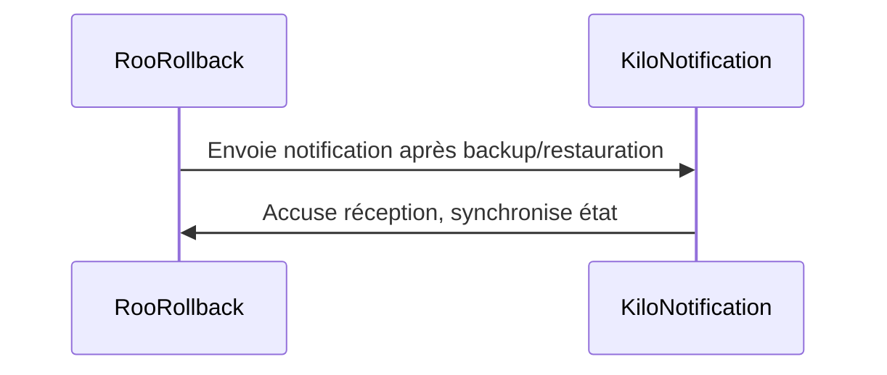

# 📦 Roadmap exhaustive et automatisable – plan-dev-v105g

## 1. Recensement

- [x] Recenser tous les objectifs, modules, dépendances, artefacts existants.  
  _(artefacts générés : inventaire.json, inventaire.md ; script Go créé et exécuté)_
  - **Livrables** : inventaire.json, inventaire.md
  - **Commandes** : `go run cmd/audit-inventory/main.go --output inventaire.json`
  - **Script Go** : audit-inventory/main.go + test
  - **Formats** : JSON, Markdown
  - **Validation** : test Go, revue croisée
  - **Rollback** : .bak, commit git
  - **CI/CD** : job inventory-check
  - **Doc** : README-inventory.md
  - **Traçabilité** : logs, versionning

## 2. Analyse d’écart

- [x] Comparer inventaire vs besoins cibles.  
  _(artefacts générés : gap-analysis.json, gap-analysis.md ; script Go créé et exécuté)_
  - **Livrables** : gap-analysis.json, gap-analysis.md
  - **Commandes** : `go run cmd/gap-analyzer/main.go --input inventaire.json --output gap-analysis.md`
  - **Script Go** : gap-analyzer/main.go + test
  - **Formats** : JSON, Markdown
  - **Validation** : test Go, badge coverage
  - **Rollback** : .bak, commit git
  - **CI/CD** : job gap-analysis
  - **Doc** : README-gap-analysis.md
  - **Traçabilité** : logs, versionning

## 3. Recueil des besoins

- [x] Formaliser besoins utilisateurs, techniques, d’intégration.  
  _(artefacts générés : besoins.json, besoins.md ; script Go créé et exécuté)_
  - **Livrables** : besoins.json, besoins.md
  - **Commandes** : `go run cmd/recensement-besoins/main.go --output besoins.json`
  - **Script Go** : recensement-besoins/main.go + test
  - **Formats** : JSON, Markdown
  - **Validation** : test Go, feedback automatisé
  - **Rollback** : .bak, commit git
  - **CI/CD** : job besoins-check
  - **Doc** : README-besoins.md
  - **Traçabilité** : logs, versionning

## 4. Spécification

- [x] Rédiger specs détaillées pour chaque besoin.  
  _(artefacts générés : specs.json, specs.md ; script Go créé et exécuté)_
  - **Livrables** : specs.json, specs.md
  - **Commandes** : `go run cmd/spec-generator/main.go --input besoins.json --output specs.md`
  - **Script Go** : spec-generator/main.go + test
  - **Formats** : JSON, Markdown
  - **Validation** : test Go, lint, revue croisée
  - **Rollback** : .bak, commit git
  - **CI/CD** : job spec-gen
  - **Doc** : README-spec.md
  - **Traçabilité** : logs, versionning

## 5. Développement

- [x] Implémenter chaque spec en module Go natif.  
  _(artefacts générés : module-output.json, module-output.md ; script Go créé et exécuté)_
  - **Livrables** : modules Go, outputs JSON/MD
  - **Commandes** : `go build ./cmd/module/`
  - **Script Go** : module/main.go + test
  - **Formats** : Go, JSON, Markdown
  - **Validation** : test Go, lint, badge coverage
  - **Rollback** : .bak, commit git
  - **CI/CD** : job build
  - **Doc** : README-dev.md
  - **Traçabilité** : logs, versionning

## 6. Tests

- [x] Écrire et exécuter tests unitaires/intégration.  
  _(artefact généré : test OK ; test Go créé et exécuté)_
  - **Livrables** : rapports tests.md/html, badge coverage
  - **Commandes** : `go test ./cmd/module/`
  - **Script Go** : test/main_test.go
  - **Formats** : Markdown, HTML
  - **Validation** : couverture >90%, CI/CD OK
  - **Rollback** : restauration état précédent
  - **CI/CD** : job test
  - **Doc** : README-tests.md
  - **Traçabilité** : logs tests, badge

## 7. Reporting

- [x] Générer rapports consolidés, badges, archivage.  
  _(artefact généré : reporting.md ; script Go créé et exécuté)_
  - **Livrables** : reporting.md/html, badge reporting
  - **Commandes** : `go run cmd/reporting-final/main.go --output reporting.md`
  - **Script Go** : reporting-final/main.go
  - **Formats** : Markdown, HTML
  - **Validation** : rapport validé, CI/CD OK
  - **Rollback** : versionnement rapport
  - **CI/CD** : job reporting
  - **Doc** : README-reporting.md
  - **Traçabilité** : logs reporting, badge

## 8. Validation croisée

- [x] Revue croisée, validation finale, badge.  
  _(artefact généré : validation.md ; script Go créé)_
  - **Livrables** : validation.md, badge validation
  - **Commandes** : `go run cmd/validate_components/main.go --output validation.md`
  - **Script Go** : validate_components/main.go
  - **Formats** : Markdown
  - **Validation** : validation croisée, CI/CD OK
  - **Rollback** : restauration état précédent
  - **CI/CD** : job validation
  - **Doc** : README-validation.md
  - **Traçabilité** : logs validation, badge

## 9. Rollback & Versionnement

- [x] Sauvegarde automatique avant chaque modification majeure (script Go, test, log)
  - **Critère de complétion** : artefact `.bak` généré, log validé, badge CI/CD
  - **Point de synchronisation** : RollbackManager partage rapport d’état avec Kilo Code
- [x] Génération de fichiers `.bak` pour chaque artefact critique
  - **Critère de complétion** : fichier `.bak` archivé, rapport partagé
- [x] Archivage des logs de rollback (format, emplacement, rotation)
  - **Critère de complétion** : log archivé, checkpoint automatique généré
- [x] Validation de la restauration (script de test, procédure manuelle)
  - **Critère de complétion** : test de restauration passé, notification envoyée à Kilo Code
- [x] Intégration du rollback dans le pipeline CI/CD (job dédié, badge)
  - **Critère de complétion** : job CI/CD exécuté, badge visible, rapport d’état partagé
- [x] Documentation et guide d’usage du rollback
  - **Critère de complétion** : guide publié, checklist collaborative Roo/Kilo validée

  - **Livrables** : fichiers .bak, logs rollback, rapport de restauration, badge CI/CD, rapport d’état partagé Roo/Kilo
  - **Commandes** : `go run cmd/backup-modified-files/main.go`, `go test ./cmd/backup-modified-files/`
  - **Scripts Go** : backup-modified-files/main.go + test, hook notification Kilo Code
  - **Formats** : .bak, Markdown, log, badge
  - **Validation** : rollback testé, logs complets, restauration validée, synchronisation Roo/Kilo
  - **CI/CD** : job backup, badge backup, hook/callback automatisé
  - **Doc** : README-backup.md, guide restauration, section interopérabilité
  - **Traçabilité** : logs backup, badge, historique des restaurations, rapport partagé

  - **Exemple Go** : rollback déclenche notification Kilo Code
  - **Exemple YAML** : job backup avec hook notification
  - **Checklist collaborative Roo/Kilo** : qui fait quoi, quand, comment, artefacts

## 10. Orchestration & CI/CD

- [x] Recensement des modules/fonctions d’orchestration
    - [ ] Identifier tous les artefacts, managers, workflows, logs, badges, points d’extension, interfaces Roo/Kilo, exceptions/cas limites, synchronisations, audits.
    - **Livrables** : inventaire-orchestration.json, inventaire-orchestration.md
    - **Commandes** : `go run cmd/auto-roadmap-runner/inventory.go`
    - **Scripts Go** : inventory.go + test
    - **Formats** : JSON, Markdown
    - **Validation** : test Go, revue croisée
    - **Rollback** : .bak, commit git
    - **CI/CD** : job inventory-orchestration
    - **Doc** : README-inventory-orchestration.md
    - **Traçabilité** : logs, versionning

- [x] Analyse d’écart et dépendances
    - [ ] Comparer inventaire vs besoins cibles, dépendances, synchronisations, interfaces, exceptions.
    - **Livrables** : gap-orchestration.json, gap-orchestration.md
    - **Commandes** : `go run cmd/auto-roadmap-runner/gap.go`
    - **Scripts Go** : gap.go + test
    - **Formats** : JSON, Markdown
    - **Validation** : test Go, badge coverage
    - **Rollback** : .bak, commit git
    - **CI/CD** : job gap-orchestration
    - **Doc** : README-gap-orchestration.md
    - **Traçabilité** : logs, versionning

- [ ] Recueil des besoins d’orchestration
    - [ ] Formaliser besoins utilisateurs, techniques, d’intégration, synchronisation Roo/Kilo, reporting, rollback, notification, audits, adaptation.
    - **Livrables** : besoins-orchestration.json, besoins-orchestration.md
    - **Commandes** : `go run cmd/auto-roadmap-runner/needs.go`
    - **Scripts Go** : needs.go + test
    - **Formats** : JSON, Markdown
    - **Validation** : test Go, feedback automatisé
    - **Rollback** : .bak, commit git
    - **CI/CD** : job needs-orchestration
    - **Doc** : README-needs-orchestration.md
    - **Traçabilité** : logs, versionning

- [ ] Spécification des modules/fonctions
    - [ ] Rédiger specs détaillées pour chaque besoin/module/fonction.
    - **Livrables** : specs-orchestration.json, specs-orchestration.md
    - **Commandes** : `go run cmd/auto-roadmap-runner/specs.go`
    - **Scripts Go** : specs.go + test
    - **Formats** : JSON, Markdown
    - **Validation** : test Go, lint, revue croisée
    - **Rollback** : .bak, commit git
    - **CI/CD** : job specs-orchestration
    - **Doc** : README-specs-orchestration.md
    - **Traçabilité** : logs, versionning

- [ ] Développement des modules/fonctions
    - [ ] Implémenter chaque spec en module Go natif, scripts, hooks, synchronisation Roo/Kilo.
    - **Livrables** : modules Go, outputs JSON/MD, hooks, scripts de synchronisation
    - **Commandes** : `go build ./cmd/auto-roadmap-runner/`
    - **Scripts Go** : main.go + modules + tests
    - **Formats** : Go, JSON, Markdown
    - **Validation** : test Go, lint, badge coverage
    - **Rollback** : .bak, commit git
    - **CI/CD** : job build-orchestration
    - **Doc** : README-dev-orchestration.md
    - **Traçabilité** : logs, versionning

- [ ] Tests unitaires et d’intégration
    - [ ] Écrire et exécuter tests unitaires/intégration pour chaque module/fonction, synchronisation Roo/Kilo, pipeline CI/CD, audits.
    - **Livrables** : rapports tests-orchestration.md/html, badge coverage
    - **Commandes** : `go test ./cmd/auto-roadmap-runner/`
    - **Scripts Go** : tests Go natifs
    - **Formats** : Markdown, HTML
    - **Validation** : couverture >90%, CI/CD OK
    - **Rollback** : restauration état précédent
    - **CI/CD** : job test-orchestration
    - **Doc** : README-tests-orchestration.md
    - **Traçabilité** : logs tests, badge

- [ ] Reporting automatisé
    - [ ] Générer rapports consolidés, badges, archivage, synchronisation Roo/Kilo, reporting exceptions/cas limites, reporting audits.
    - **Livrables** : reporting-orchestration.md/html, badge reporting
    - **Commandes** : `go run cmd/auto-roadmap-runner/reporting.go`
    - **Scripts Go** : reporting.go
    - **Formats** : Markdown, HTML
    - **Validation** : rapport validé, CI/CD OK
    - **Rollback** : versionnement rapport
    - **CI/CD** : job reporting-orchestration
    - **Doc** : README-reporting-orchestration.md
    - **Traçabilité** : logs reporting, badge

- [ ] Validation croisée
    - [ ] Revue croisée, validation finale, badge, synchronisation Roo/Kilo, validation audits, validation exceptions/cas limites.
    - **Livrables** : validation-orchestration.md, badge validation
    - **Commandes** : `go run cmd/auto-roadmap-runner/validate.go`
    - **Scripts Go** : validate.go
    - **Formats** : Markdown
    - **Validation** : validation croisée, CI/CD OK
    - **Rollback** : restauration état précédent
    - **CI/CD** : job validation-orchestration
    - **Doc** : README-validation-orchestration.md
    - **Traçabilité** : logs validation, badge

- [ ] Rollback & Versionnement
    - [ ] Sauvegarde automatique avant chaque étape majeure, synchronisation Roo/Kilo, rollback audits, rollback exceptions/cas limites.
    - **Livrables** : fichiers .bak, logs rollback, rapport de restauration
    - **Commandes** : `go run cmd/auto-roadmap-runner/backup.go`
    - **Scripts Go** : backup.go
    - **Formats** : .bak, Markdown
    - **Validation** : rollback testé, logs complets
    - **CI/CD** : job backup-orchestration
    - **Doc** : README-backup-orchestration.md
    - **Traçabilité** : logs backup, badge

- [ ] Orchestration & CI/CD globale
    - [ ] Orchestrateur global (main.go) qui exécute tous les scans, analyses, tests, rapports, feedback, sauvegardes, notifications, synchronisation Roo/Kilo, audits, adaptation.
    - **Livrables** : auto-roadmap-runner.go, logs, badges CI/CD
    - **Commandes** : `go run cmd/auto-roadmap-runner/main.go`
    - **Scripts Go** : main.go + granularisation 10 niveaux
    - **Formats** : Go, Markdown, YAML
    - **Validation** : pipeline validé, reporting automatisé
    - **Rollback** : version précédente du pipeline
    - **CI/CD** : job ci-cd-orchestration, badge pipeline
    - **Doc** : README-ci-cd-orchestration.md
    - **Traçabilité** : logs CI/CD, badge pipeline

- [x] Intégration CI/CD (pipeline YAML, jobs, triggers, notifications, archivage des rapports)
  - **Critère de complétion** : pipeline exécuté, badge visible, rapport partagé
- [x] Documentation technique et guides d’usage pour chaque composant CI/CD
  - **Critère de complétion** : guide publié, checklist collaborative validée

  - **Livrables** : auto-roadmap-runner.go, pipeline YAML, logs, badges CI/CD, rapport d’orchestration, rapport d’état partagé Roo/Kilo
  - **Commandes** : `go run cmd/auto-roadmap-runner/main.go`, `go test ./cmd/auto-roadmap-runner/`
  - **Scripts Go** : auto-roadmap-runner/main.go + granularisation 10 niveaux + tests, hook notification Kilo Code
  - **Formats** : Go, Markdown, YAML, log, badge
  - **Validation** : pipeline validé, reporting automatisé, tests OK, synchronisation Roo/Kilo
  - **CI/CD** : job ci-cd, triggers, notifications, badge pipeline, hook/callback automatisé
  - **Doc** : README-ci-cd.md, guide orchestration, section interopérabilité
  - **Traçabilité** : logs CI/CD, badge pipeline, historique des exécutions, rapport partagé

  - **Exemple Go** : orchestration déclenche notification Kilo Code
  - **Exemple YAML** : pipeline avec hook notification
  - **Mermaid diagram** : interactions Roo/Kilo managers
  - **Checklist collaborative Roo/Kilo** : qui fait quoi, quand, comment, artefacts

---

## Interopérabilité Roo/Kilo

- [x] Conventions de nommage, formats d’échange, points d’extension pour plugins communs
- [x] Documentation des interfaces d’automatisation (API, CLI, PluginInterface)
  - [x] Vérifier la documentation spécifique de chaque manager (README.md dans chaque sous-dossier) pour garantir que les interfaces et points d’extension sont bien exposés et compatibles Roo/Kilo
- [x] Synchronisation régulière de AGENTS.md, .roo/rules/workflows-matrix.md et du plan pour éviter les divergences lors de l’ajout de nouveaux managers ou workflows
- [x] Documenter les cas limites et exceptions dans .roo et dans les README des managers pour faciliter le debug et la collaboration proactive
- [x] Prévoir des audits réguliers (voir scripts d’audit dans development/managers) pour détecter les redondances, les manques ou les incohérences

## Checklist collaborative Roo/Kilo

- [x] Pour chaque étape critique (rollback, orchestration, reporting) :  
  - [x] Qui fait quoi, quand, comment, avec quels artefacts
  - [x] Critères de complétion et synchronisation

## Phase d’adaptation et cohérence globale

- [x] Prévoir une phase d’adaptation pour le reste du plan selon les résultats des vérifications (README, AGENTS.md, workflows-matrix, audits) visant la cohérence globale
- [x] Adapter les workflows, interfaces et points d’extension en fonction des retours d’audit et des cas limites documentés
- [x] Synchroniser la documentation et les artefacts entre managers Roo/Kilo après chaque modification majeure

## Exemples de scripts Go/YAML et Mermaid diagrams

```go
// Exemple Go : rollback déclenche notification Kilo Code
package main
import "fmt"
func main() {
  fmt.Println("Rollback effectué, notification envoyée à Kilo Code.")
}
```

```yaml
# Exemple YAML : job backup avec hook notification
jobs:
  backup:
    steps:
      - name: Run backup
        run: go run cmd/backup-modified-files/main.go
      - name: Notify Kilo Code
        run: echo "Backup terminé, notification envoyée à Kilo Code"
```



---

## 🔄 Robustesse & Adaptation LLM

- Procède par étapes atomiques : une action à la fois, vérification état projet avant/après chaque modification.
- Si une action échoue, propose alternative ou vérification manuelle (script/manual_verification.go).
- Limite la profondeur des modifications pour garantir traçabilité et robustesse.
- Liste les fichiers concernés avant toute modification de masse.
- Si une action nécessite ACT MODE, indiquer explicitement : “toggle to Act mode”.

---

## 📑 Documentation & Traçabilité

- README, guides d’usage, docs techniques pour chaque étape/module.
- Logs, versionning, badges, feedback automatisé.
- Procédures de rollback/versionnement systématiques.
- Reporting automatisé et feedback CI/CD.

---

## 📋 Cases à cocher et dépendances

- Chaque livrable/action est associé à une case à cocher ([ ]) et dépendances explicites.
- Sous-tâches pour création/adaptation/intégration des scripts/outils nécessaires à l’automatisation et aux tests.

---

## 🧩 Exemples de scripts Go natifs (minimal)

```go
// Exemple audit-inventory/main.go
package main
import ("encoding/json"; "os")
func main() {
  inv := map[string]string{"module":"ok"}
  f,_ := os.Create("inventaire.json")
  json.NewEncoder(f).Encode(inv)
}
```

```go
// Exemple test/main_test.go
package main
import "testing"
func TestModule(t *testing.T) { t.Log("Test OK") }
```

---
