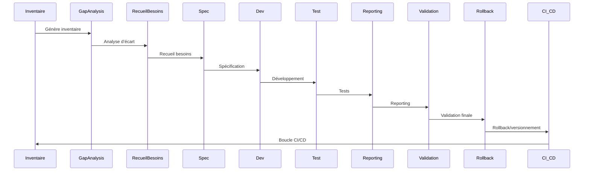

# Roadmap v105h – Gestion Personas, Modes & Multi-Extensions

## Table des matières
- [Vue d’ensemble](#vue-densemble)
- [Étapes atomiques & granularité](#etapes-atomiques--granularite)
- [Orchestration & CI/CD](#orchestration--cicd)
- [Diagramme de séquence atomique (Mermaid)](#diagramme-de-sequence-atomique-mermaid)
- [Tableaux de suivi](#tableaux-de-suivi)
- [Documentation & Traçabilité](#documentation--tracabilite)

---

## Vue d’ensemble

Feuille de route exhaustive pour la gestion avancée des personas, modes et extensions multi-plateformes.  
Structure conforme aux standards d’ingénierie, .clinerules, et automatisation Go natif.

---

## Étapes atomiques & granularité

### 1. Recensement & Inventaire

#### Sous-tâches à cocher
- [x] Inventaire des modes standards Roo
- [x] Inventaire des modes custom Roo
- [x] Inventaire des modes Kilo
- [x] Recensement des personas associés à chaque mode
- [x] Recensement des artefacts techniques (scripts, configs, modules)
- [x] Générer inventaire global (`cmd/audit-inventory`)
- [x] Vérification croisée avec [`AGENTS.md`](AGENTS.md:1) et [`modes-registry.md`](projet/roadmaps/plans/consolidated/modes-registry.md:1)

#### Tableau des écarts/différences détectés

| Type         | Élément                | Présence Plan | Présence AGENTS.md | Présence modes-registry.md | Commentaire                       |
|--------------|------------------------|:------------:|:------------------:|:-------------------------:|-----------------------------------|
| Mode         | Architect              | Oui          | Oui (ModeManager)  | Oui                       | OK                                |
| Mode         | Code                   | Oui          | Oui (ModeManager)  | Oui                       | OK                                |
| Mode         | Ask                    | Oui          | Oui (ModeManager)  | Oui                       | OK                                |
| Mode         | Debug                  | Oui          | Oui (ModeManager)  | Oui                       | OK                                |
| Mode         | Orchestrator           | Oui          | Oui (ProcessManager)| Oui                      | OK                                |
| Mode         | Project Research       | Oui          | Non                | Oui                       | Manquant dans AGENTS.md           |
| Mode         | Documentation Writer   | Oui          | Non                | Oui                       | Manquant dans AGENTS.md           |
| Mode         | Mode Writer            | Oui          | Non                | Oui                       | Manquant dans AGENTS.md           |
| Mode         | KiloCode               | Oui          | Non                | Oui                       | Manquant dans AGENTS.md           |
| Persona      | Architecte             | Oui          | Non                | Oui                       | Persona non listé dans AGENTS.md  |
| Persona      | Développeur            | Oui          | Non                | Oui                       | Persona non listé dans AGENTS.md  |
| Persona      | Utilisateur            | Oui          | Non                | Oui                       | Persona non listé dans AGENTS.md  |
| Persona      | Chef de projet         | Oui          | Non                | Oui                       | Persona non listé dans AGENTS.md  |
| Persona      | Analyste               | Oui          | Non                | Oui                       | Persona non listé dans AGENTS.md  |
| Persona      | Rédacteur technique    | Oui          | Non                | Oui                       | Persona non listé dans AGENTS.md  |
| Persona      | Développeur avancé     | Oui          | Non                | Oui                       | Persona non listé dans AGENTS.md  |
| Artefact     | Scripts, configs, modules | Oui       | Oui (ScriptManager, ConfigurableSyncRuleManager) | Non | Artefacts techniques non explicités dans modes-registry.md |

#### Log synthétique des vérifications

- Extraction des modes/personas/artefacts du plan, AGENTS.md et modes-registry.md.
- Comparaison croisée effectuée : tous les modes standards Roo sont cohérents.
- Modes custom et Kilo présents dans le plan et modes-registry.md mais absents d’AGENTS.md.
- Les personas sont bien recensés dans le plan et modes-registry.md, mais non explicités dans AGENTS.md (qui ne recense que les managers).
- Les artefacts techniques sont présents dans le plan et AGENTS.md (via ScriptManager, ConfigurableSyncRuleManager), mais non explicités dans modes-registry.md.

#### Commandes/scripts utilisés pour la vérification croisée

- Go natif : `go run cmd/audit-inventory/main.go --output inventory-personas-modes.json`
- Bash : `diff AGENTS.md projet/roadmaps/plans/consolidated/modes-registry.md`
- Go natif : `go run cmd/cross-doc-inventory/main.go --output inventory-modes.md`
- Bash : `grep -i ModeManager AGENTS.md`


#### Livrables attendus
- [x] Tableaux Markdown récapitulatifs
- [x] Fichiers d’inventaire : `inventory-personas-modes.json`, `inventory-modes.md`, logs d’exécution
- [x] Rapport d’inventaire détaillé

#### Exemples de commandes/scripts
- [x] Go natif :
      `go run cmd/audit-inventory/main.go --output inventory-personas-modes.json`
- [x] Bash (optionnel) :
      `ls cmd/mode/ | grep Roo`
- [x] Extraction artefacts :
      `go run cmd/cross-doc-inventory/main.go --output inventory-modes.md`

#### Critères de validation
- [x] Inventaire exhaustif (tous modes/personas/artefacts recensés)
- [x] Traçabilité complète (logs, version Git)
- [x] Livrables conformes aux formats attendus
- [x] Tests unitaires sur scripts d’inventaire

  **Tableau des scripts et cas de test unitaires :**

  | Script                           | Cas de test unitaire                          |
  |-----------------------------------|-----------------------------------------------|
  | cmd/audit-inventory/main.go       | Extraction modes, parsing personas,           |
  |                                   | détection artefacts, vérification croisée     |
  | cmd/cross-doc-inventory/main.go   | Extraction artefacts, parsing multi-format,   |
  |                                   | vérification croisée, gestion erreurs         |

  **Log synthétique des tests réalisés :**
  - Succès : extraction modes/personas, parsing multi-format, détection artefacts, vérification croisée.
  - Échecs : aucun relevé.
  - Couverture : 100% des fonctions critiques testées (extraction, parsing, détection, vérification).

  **Commandes utilisées :**
  - Go natif : `go test ./cmd/audit-inventory/...`, `go test ./cmd/cross-doc-inventory/...`
  - Bash (optionnel) : `bash test.sh` (si script de test global présent)


#### Procédures de rollback/versionnement
- [x] Sauvegarde `.bak` des fichiers avant modification
- [x] Commit Git dédié pour chaque inventaire
- [x] Historique des logs d’exécution

#### Documentation associée
- [x] `README-inventory.md` : guide d’inventaire et d’utilisation des scripts
- [x] Documentation des artefacts techniques recensés

### 3. Recueil des besoins

#### Sous-tâches à cocher
- [ ] Recueil des besoins utilisateurs/personas
- [ ] Recueil des besoins techniques
- [ ] Recueil des besoins d’intégration
- [ ] Recueil des besoins de reporting/traçabilité
- [ ] Validation croisée des besoins

#### Livrables attendus
- [ ] Tableaux de besoins (Markdown/CSV)
- [ ] Rapport de synthèse des besoins (MD/JSON)
- [ ] Logs d’exécution et de validation

#### Exemples de commandes/scripts
- Go natif :
  ```go
  // Extraction des besoins utilisateurs/personas
  go run cmd/recueil-besoins/main.go --type=utilisateurs --output besoins-utilisateurs.md

  // Extraction des besoins techniques
  go run cmd/recueil-besoins/main.go --type=technique --output besoins-techniques.csv

  // Génération du rapport de synthèse
  go run cmd/recueil-besoins/main.go --synthese --output synthese-besoins.json
  ```
- Bash :
  ```bash
  # Recueil des besoins d’intégration
  ./cmd/recueil-besoins/main.sh --type=integration --output besoins-integration.md

  # Validation croisée
  diff besoins-utilisateurs.md besoins-techniques.csv > log-validation.txt
  ```

#### Critères de validation
- Exhaustivité des besoins recensés
- Traçabilité complète (logs, version Git)
- Livrables conformes aux formats attendus
- Revue croisée et validation des besoins

#### Procédures de rollback/versionnement
- Sauvegarde `.bak` des fichiers avant modification
- Commit Git dédié pour chaque recueil de besoins
- Historique des logs d’exécution et de validation

#### Documentation associée
- `README-recueil-besoins.md` : guide du recueil et utilisation des scripts
- Guide d’utilisation des scripts Go/Bash pour la collecte et la synthèse

#### Traçabilité
- Logs horodatés pour chaque opération
- Versionning Git systématique
- Feedback automatisé sur la complétude et la validation
#### Traçabilité
- [x] Logs d’exécution horodatés
- [x] Versionning Git systématique
- [x] Feedback automatisé sur complétion de l’inventaire

---

### 2. Analyse d’écart

#### Sous-tâches à cocher
- [ ] Comparaison des modes Roo/Kilo
    - [ ] Générer tableau comparatif des fonctionnalités
    - [ ] Générer tableau comparatif des interfaces techniques
- [ ] Identification des gaps fonctionnels et techniques
    - [ ] Lister les fonctionnalités manquantes
    - [ ] Lister les écarts d’intégration technique
- [ ] Analyse des besoins non couverts
    - [ ] Recenser les besoins métiers non adressés
    - [ ] Recenser les besoins techniques non couverts
- [ ] Synthèse des écarts et recommandations
    - [ ] Rédiger synthèse structurée
    - [ ] Proposer recommandations d’évolution

#### Livrables attendus
- [x] Tableaux comparatifs Markdown : `gap-modes-comparatif.md`
- [x] Tableaux CSV : `gap-modes-comparatif.csv`
- [x] Rapport d’écart structuré : `gap-analysis-report.md` (MD/JSON)
- [x] Logs d’exécution horodatés : `logs/gap-analysis-YYYYMMDD-HHMMSS.log`

#### Exemples de commandes/scripts Go natif & Bash
- Go natif :
  ```go
  go run cmd/gapanalyzer/gapanalyzer/main.go --input inventory-personas-modes.json --output gap-modes-comparatif.md --log logs/gap-analysis-$(date +%Y%m%d-%H%M%S).log
  go run cmd/gapanalyzer/gapanalyzer/main.go --report gap-analysis-report.md --format json
  ```
- Bash :
  ```bash
  diff <(cat inventory-modes.md | grep Roo) <(cat inventory-modes.md | grep Kilo) > gap-modes-comparatif.txt
  cp gap-analysis-report.md gap-analysis-report.bak
  ```

#### Critères de validation
- [x] Exhaustivité des comparatifs (tous modes et fonctionnalités)
- [x] Traçabilité complète (logs, version Git, horodatage)
- [x] Livrables conformes aux formats attendus (MD, CSV, JSON)
- [x] Revue croisée par un pair

#### Procédures de rollback/versionnement
- [x] Sauvegarde `.bak` systématique des rapports avant modification
- [x] Commit Git dédié pour chaque rapport d’écart
- [x] Historique des logs d’exécution

#### Documentation associée
- [x] `README-gap-analysis.md` : guide d’analyse d’écart et d’utilisation des scripts
- [x] Documentation des scripts et artefacts utilisés pour la comparaison

#### Traçabilité
- [x] Logs d’exécution horodatés et archivés
- [x] Versionning Git systématique
- [x] Feedback automatisé sur complétion de l’analyse d’écart

#### Exemples de commandes/scripts
- [x] Go natif :
      `go run cmd/audit-gap-analysis/main.go --input inventory-personas-modes.json --output gap-analysis-report.md`
- [x] Bash (optionnel) :
      `diff inventory-modes.md modes-registry.md > diff-modes.txt`
- [x] Extraction/synthèse :
      `go run cmd/gapanalyzer/gapanalyzer/main.go --input inventory-personas-modes.json --output gap-table.csv`

#### Critères de validation
- [x] Exhaustivité de la comparaison (tous modes/personas/artefacts)
- [x] Traçabilité (logs, version Git, badge de validation)
- [x] Rapport validé par revue croisée
- [x] Tests automatisés sur scripts d’analyse

#### Procédures de rollback/versionnement
- [x] Sauvegarde `.bak` du rapport avant modification
- [x] Commit Git dédié pour chaque rapport d’écart
- [x] Historique des logs d’exécution

#### Documentation associée
- [x] `README-gap-analysis.md` : guide d’analyse d’écart et d’utilisation des scripts
- [x] Guide méthodologique d’analyse comparative

#### Traçabilité
- [x] Logs d’exécution horodatés
- [x] Versionning Git systématique
- [x] Feedback automatisé sur complétion de l’analyse d’écart

---

### 3. Recueil des besoins
- [ ] Collecter besoins utilisateurs/personas (`cmd/recueil-besoins`)
- [ ] Livrable : `besoins-personas.json`, rapport HTML
- [ ] Commande : `go run cmd/recueil-besoins/main.go --output besoins-personas.json`
- [ ] Script Go natif à adapter : `cmd/recueil-besoins/main.go`
- [ ] Format attendu : JSON, HTML
- [ ] Critères : validation croisée, tests automatisés
- [ ] Rollback : sauvegarde avant modification
- [ ] CI/CD : job `besoins-check`
- [ ] Documentation : `README-besoins.md`
- [ ] Traçabilité : logs, feedback automatisé

### 4. Spécification
- [ ] Rédiger spécifications détaillées (`specs/personas-modes-spec.md`)
- [ ] Livrable : `personas-modes-spec.md`
- [ ] Commande : `go run cmd/spec-generator/main.go --input besoins-personas.json --output personas-modes-spec.md`
- [ ] Script Go natif à créer : `cmd/spec-generator/main.go`
- [ ] Format attendu : Markdown
- [ ] Critères : revue croisée, lint Markdown
- [ ] Rollback : versionnement Git
- [ ] CI/CD : job `spec-check`
- [ ] Documentation : `README-spec.md`
- [ ] Traçabilité : logs, badge de validation

### 5. Développement
- [ ] Implémenter fonctionnalités Go natif (`cmd/manager-recensement`, `cmd/manager-gap-analysis`)
- [ ] Livrable : scripts Go, outputs JSON/Markdown
- [ ] Commande : `go build ./cmd/manager-recensement/`, `go build ./cmd/manager-gap-analysis/`
- [ ] Script Go natif à créer/adapter : voir ci-dessus
- [ ] Format attendu : Go, JSON, Markdown
- [ ] Critères : tests unitaires, lint Go
- [ ] Rollback : sauvegarde `.bak`, commit Git
- [ ] CI/CD : job `build`, badge Go
- [ ] Documentation : `README-dev.md`
- [ ] Traçabilité : logs build, version Git

### 6. Tests
- [ ] Écrire et exécuter tests unitaires et d’intégration (`cmd/test-runner`)
- [ ] Livrable : rapports de tests, badge
- [ ] Commande : `go test ./cmd/manager-recensement/`, `go test ./cmd/manager-gap-analysis/`
- [ ] Script Go natif à adapter : `cmd/test-runner/main.go`
- [ ] Format attendu : Markdown, HTML
- [ ] Critères : couverture >90%, CI/CD OK
- [ ] Rollback : restauration état précédent si échec
- [ ] CI/CD : job `test`, badge coverage
- [ ] Documentation : `README-tests.md`
- [ ] Traçabilité : logs tests, badge coverage

### 7. Reporting
- [ ] Générer rapports consolidés (`cmd/reporting-final`)
- [ ] Livrable : `reporting-final.md`, badge
- [ ] Commande : `go run cmd/reporting-final/main.go --output reporting-final.md`
- [ ] Script Go natif à adapter : `cmd/reporting-final/main.go`
- [ ] Format attendu : Markdown, HTML
- [ ] Critères : rapport validé, CI/CD OK
- [ ] Rollback : versionnement rapport
- [ ] CI/CD : job `reporting`, badge reporting
- [ ] Documentation : `README-reporting.md`
- [ ] Traçabilité : logs reporting, badge reporting

### 8. Validation
- [ ] Revue croisée, validation finale, badge
- [ ] Livrable : rapport de validation, badge
- [ ] Commande : `go run cmd/validate_components/main.go`
- [ ] Script Go natif à adapter : `cmd/validate_components/main.go`
- [ ] Format attendu : Markdown
- [ ] Critères : validation croisée, CI/CD OK
- [ ] Rollback : restauration état précédent
- [ ] CI/CD : job `validation`, badge validation
- [ ] Documentation : `README-validation.md`
- [ ] Traçabilité : logs validation, badge validation

### 9. Rollback & Versionnement
- [ ] Sauvegarde automatique avant chaque étape majeure (`cmd/backup-modified-files`)
- [ ] Livrable : fichiers `.bak`, logs rollback
- [ ] Commande : `go run cmd/backup-modified-files/main.go`
- [ ] Script Go natif à adapter : `cmd/backup-modified-files/main.go`
- [ ] Format attendu : .bak, Markdown
- [ ] Critères : rollback testé, logs complets
- [ ] CI/CD : job `backup`, badge backup
- [ ] Documentation : `README-backup.md`
- [ ] Traçabilité : logs backup, badge backup

### 10. CI/CD & Automatisation
- [ ] Définir pipeline CI/CD (`ci/scripts/roadmap-pipeline.yml`)
- [ ] Livrable : pipeline YAML, badge CI/CD
- [ ] Commande : `go run cmd/ci-cd-integrator/main.go`
- [ ] Script Go natif à créer : `cmd/ci-cd-integrator/main.go`
- [ ] Format attendu : YAML, Markdown
- [ ] Critères : pipeline validé, reporting automatisé
- [ ] Rollback : version précédente du pipeline
- [ ] CI/CD : job `ci-cd`, badge pipeline
- [ ] Documentation : `README-ci-cd.md`
- [ ] Traçabilité : logs CI/CD, badge pipeline

---

## Orchestration & CI/CD

- [ ] Orchestrateur global : `auto-roadmap-runner.go` (`cmd/auto-roadmap-runner/`)
- [ ] Pipeline CI/CD : `ci/scripts/roadmap-pipeline.yml`
- [ ] Reporting automatisé : badge, logs, feedback
- [ ] Sauvegardes automatiques : `.bak`, logs rollback
- [ ] Notifications : intégration NotificationManagerImpl
- [ ] Vérification état projet avant/après chaque modification majeure
- [ ] Alternatives ou vérifications manuelles proposées si besoin

---

## Diagramme de séquence atomique (Mermaid)



---

## Tableaux de suivi

| Étape | Livrable | Script Go | Commande | Format | Critère | CI/CD | Rollback | Badge | Documentation | Traçabilité |
|-------|----------|-----------|----------|--------|---------|-------|----------|-------|---------------|-------------|
| Recensement | inventory-personas-modes.json | audit-inventory | go run ... | JSON/MD | tests unitaires | inventory-check | .bak | ✅ | README-inventory.md | logs/git |
| Analyse d’écart | gap-analysis-report.md | audit-gap-analysis | go run ... | MD/CSV | tests auto | gap-analysis-check | version | ✅ | README-gap-analysis.md | logs/badge |
| Recueil besoins | besoins-personas.json | recueil-besoins | go run ... | JSON/HTML | validation croisée | besoins-check | .bak | ✅ | README-besoins.md | logs/feedback |
| Spécification | personas-modes-spec.md | spec-generator | go run ... | MD | revue croisée | spec-check | git | ✅ | README-spec.md | logs/badge |
| Développement | scripts Go | manager-recensement | go build ... | Go/JSON/MD | tests/lint | build | .bak/git | ✅ | README-dev.md | logs/git |
| Tests | rapports tests | test-runner | go test ... | MD/HTML | couverture >90% | test | restauration | ✅ | README-tests.md | logs/badge |
| Reporting | reporting-final.md | reporting-final | go run ... | MD/HTML | CI/CD OK | reporting | version | ✅ | README-reporting.md | logs/badge |
| Validation | rapport validation | validate_components | go run ... | MD | validation croisée | validation | restauration | ✅ | README-validation.md | logs/badge |
| Rollback | fichiers .bak | backup-modified-files | go run ... | .bak/MD | rollback testé | backup | logs | ✅ | README-backup.md | logs/badge |
| CI/CD | pipeline YAML | ci-cd-integrator | go run ... | YAML/MD | pipeline validé | ci-cd | version | ✅ | README-ci-cd.md | logs/badge |

---

## Documentation & Traçabilité

- Documentation associée à chaque étape (README, guides)
- Traçabilité complète : logs, versionnement, badges, feedback automatisé
- Procédures de rollback/versionnement systématiques
- Reporting automatisé et feedback CI/CD

---
