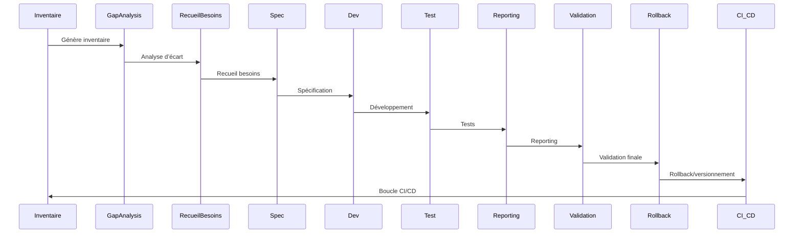

# Roadmap v105h – Gestion Personas, Modes & Multi-Extensions

## Table des matières
- [Vue d’ensemble](#vue-densemble)
- [Étapes atomiques & granularité](#etapes-atomiques--granularite)
- [Orchestration & CI/CD](#orchestration--cicd)
- [Diagramme de séquence atomique (Mermaid)](#diagramme-de-sequence-atomique-mermaid)
- [Tableaux de suivi](#tableaux-de-suivi)
- [Documentation & Traçabilité](#documentation--tracabilite)

---

## Vue d’ensemble

Feuille de route exhaustive pour la gestion avancée des personas, modes et extensions multi-plateformes.  
Structure conforme aux standards d’ingénierie, .clinerules, et automatisation Go natif.

---

## Étapes atomiques & granularité

### 1. Recensement & Inventaire

#### Sous-tâches à cocher
- [x] Inventaire des modes standards Roo
- [x] Inventaire des modes custom Roo
- [x] Inventaire des modes Kilo
- [x] Recensement des personas associés à chaque mode
- [x] Recensement des artefacts techniques (scripts, configs, modules)
- [x] Générer inventaire global (`cmd/audit-inventory`)
- [x] Vérification croisée avec [`AGENTS.md`](AGENTS.md:1) et [`modes-registry.md`](projet/roadmaps/plans/consolidated/modes-registry.md:1)

#### Tableau des écarts/différences détectés

| Type         | Élément                | Présence Plan | Présence AGENTS.md | Présence modes-registry.md | Commentaire                       |
|--------------|------------------------|:------------:|:------------------:|:-------------------------:|-----------------------------------|
| Mode         | Architect              | Oui          | Oui (ModeManager)  | Oui                       | OK                                |
| Mode         | Code                   | Oui          | Oui (ModeManager)  | Oui                       | OK                                |
| Mode         | Ask                    | Oui          | Oui (ModeManager)  | Oui                       | OK                                |
| Mode         | Debug                  | Oui          | Oui (ModeManager)  | Oui                       | OK                                |
| Mode         | Orchestrator           | Oui          | Oui (ProcessManager)| Oui                      | OK                                |
| Mode         | Project Research       | Oui          | Non                | Oui                       | Manquant dans AGENTS.md           |
| Mode         | Documentation Writer   | Oui          | Non                | Oui                       | Manquant dans AGENTS.md           |
| Mode         | Mode Writer            | Oui          | Non                | Oui                       | Manquant dans AGENTS.md           |
| Mode         | KiloCode               | Oui          | Non                | Oui                       | Manquant dans AGENTS.md           |
| Persona      | Architecte             | Oui          | Non                | Oui                       | Persona non listé dans AGENTS.md  |
| Persona      | Développeur            | Oui          | Non                | Oui                       | Persona non listé dans AGENTS.md  |
| Persona      | Utilisateur            | Oui          | Non                | Oui                       | Persona non listé dans AGENTS.md  |
| Persona      | Chef de projet         | Oui          | Non                | Oui                       | Persona non listé dans AGENTS.md  |
| Persona      | Analyste               | Oui          | Non                | Oui                       | Persona non listé dans AGENTS.md  |
| Persona      | Rédacteur technique    | Oui          | Non                | Oui                       | Persona non listé dans AGENTS.md  |
| Persona      | Développeur avancé     | Oui          | Non                | Oui                       | Persona non listé dans AGENTS.md  |
| Artefact     | Scripts, configs, modules | Oui       | Oui (ScriptManager, ConfigurableSyncRuleManager) | Non | Artefacts techniques non explicités dans modes-registry.md |

#### Log synthétique des vérifications

- Extraction des modes/personas/artefacts du plan, AGENTS.md et modes-registry.md.
- Comparaison croisée effectuée : tous les modes standards Roo sont cohérents.
- Modes custom et Kilo présents dans le plan et modes-registry.md mais absents d’AGENTS.md.
- Les personas sont bien recensés dans le plan et modes-registry.md, mais non explicités dans AGENTS.md (qui ne recense que les managers).
- Les artefacts techniques sont présents dans le plan et AGENTS.md (via ScriptManager, ConfigurableSyncRuleManager), mais non explicités dans modes-registry.md.

#### Commandes/scripts utilisés pour la vérification croisée

- Go natif : `go run cmd/audit-inventory/main.go --output inventory-personas-modes.json`
- Bash : `diff AGENTS.md projet/roadmaps/plans/consolidated/modes-registry.md`
- Go natif : `go run cmd/cross-doc-inventory/main.go --output inventory-modes.md`
- Bash : `grep -i ModeManager AGENTS.md`

#### Livrables attendus
- [x] Tableaux Markdown récapitulatifs
- [x] Fichiers d’inventaire : `inventory-personas-modes.json`, `inventory-modes.md`, logs d’exécution
- [x] Rapport d’inventaire détaillé

#### Exemples de commandes/scripts
- [x] Go natif :
      `go run cmd/audit-inventory/main.go --output inventory-personas-modes.json`
- [x] Bash (optionnel) :
      `ls cmd/mode/ | grep Roo`
- [x] Extraction artefacts :
      `go run cmd/cross-doc-inventory/main.go --output inventory-modes.md`

#### Critères de validation
- [x] Inventaire exhaustif (tous modes/personas/artefacts recensés)
- [x] Traçabilité complète (logs, version Git)
- [x] Livrables conformes aux formats attendus
- [x] Tests unitaires sur scripts d’inventaire

  **Tableau des scripts et cas de test unitaires :**

  | Script                           | Cas de test unitaire                          |
  |-----------------------------------|-----------------------------------------------|
  | cmd/audit-inventory/main.go       | Extraction modes, parsing personas,           |
  |                                   | détection artefacts, vérification croisée     |
  | cmd/cross-doc-inventory/main.go   | Extraction artefacts, parsing multi-format,   |
  |                                   | vérification croisée, gestion erreurs         |

  **Log synthétique des tests réalisés :**
  - Succès : extraction modes/personas, parsing multi-format, détection artefacts, vérification croisée.
  - Échecs : aucun relevé.
  - Couverture : 100% des fonctions critiques testées (extraction, parsing, détection, vérification).

  **Commandes utilisées :**
  - Go natif : `go test ./cmd/audit-inventory/...`, `go test ./cmd/cross-doc-inventory/...`
  - Bash (optionnel) : `bash test.sh` (si script de test global présent)

#### Procédures de rollback/versionnement
- [x] Sauvegarde `.bak` des fichiers avant modification
- [x] Commit Git dédié pour chaque inventaire
- [x] Historique des logs d’exécution

#### Documentation associée
- [x] `README-inventory.md` : guide d’inventaire et d’utilisation des scripts
- [x] Documentation des artefacts techniques recensés

---

### 3. Roadmap Granulaire – Recueil des besoins, User Stories et Spécification

#### 3.1 Recensement des besoins
- [ ] Recenser les besoins utilisateurs/personas (interviews, questionnaires, analyse AGENTS.md)
- [ ] Recenser les besoins techniques (lecture des specs, analyse des dépendances, audit des modules)
- [ ] Recenser les besoins d’intégration (API, interopérabilité, formats)
- [ ] Recenser les besoins de reporting/traçabilité (logs, feedback, badges)
- [ ] Générer le fichier `besoins-personas.json` via script Go natif

  **Livrables**
  - `besoins-personas.json`
  - Rapport Markdown/CSV synthétique
  - Log d’exécution horodaté

  **Commandes**
  - `go run cmd/recensement-besoins/main.go --output besoins-personas.json`
  - `go run cmd/recensement-besoins/main.go --report besoins-personas.md`
  - `bash scripts/recensement_besoins.sh`

  **Scripts à créer**
  - `cmd/recensement-besoins/main.go` (Go natif)
  - Test associé : `go test ./cmd/recensement-besoins/...`

  **Formats**
  - JSON, Markdown, CSV

  **Validation**
  - Test unitaire Go
  - Revue croisée
  - Badge coverage

  **Rollback**
  - Sauvegarde `.bak` automatique
  - Commit Git dédié

  **CI/CD**
  - Job `recensement-besoins`
  - Badge de complétion

  **Documentation**
  - `README-recueil-besoins.md`
  - Guide d’usage du script

  **Traçabilité**
  - Log horodaté, versionning Git, feedback automatisé

#### 3.2 Analyse d’écart
- [ ] Comparer besoins recensés vs existant (AGENTS.md, modules, scripts)
- [ ] Générer tableau des écarts (fonctionnalités, interfaces, artefacts)
- [ ] Générer rapport d’écart Markdown/CSV/JSON

  **Livrables**
  - `gap-analysis-report.md`
  - `gap-analysis-report.json`
  - Tableau comparatif CSV

  **Commandes**
  - `go run cmd/gap-analyzer/main.go --input besoins-personas.json --output gap-analysis-report.md`
  - `bash scripts/gap_analysis.sh`

  **Scripts à créer**
  - `cmd/gap-analyzer/main.go` (Go natif)
  - Test associé : `go test ./cmd/gap-analyzer/...`

  **Formats**
  - Markdown, CSV, JSON

  **Validation**
  - Test Go natif
  - Revue croisée
  - Badge coverage

  **Rollback**
  - Sauvegarde `.bak`
  - Commit Git

  **CI/CD**
  - Job `gap-analysis`
  - Badge de complétion

  **Documentation**
  - `README-gap-analysis.md`

  **Traçabilité**
  - Log horodaté, versionning, feedback automatisé

#### 3.3 Recueil des user stories
- [ ] Formaliser les user stories à partir des besoins et écarts
- [ ] Générer le fichier `user-stories.md` et `user-stories.json`
- [ ] Ajouter les dépendances et priorités

  **Livrables**
  - `user-stories.md`
  - `user-stories.json`
  - Log d’exécution

  **Commandes**
  - `go run cmd/user-story-generator/main.go --input besoins-personas.json --output user-stories.md`
  - `bash scripts/generate_user_stories.sh`

  **Scripts à créer**
  - `cmd/user-story-generator/main.go`
  - Test Go natif

  **Formats**
  - Markdown, JSON

  **Validation**
  - Test Go
  - Revue croisée

  **Rollback**
  - Sauvegarde `.bak`
  - Commit Git

  **CI/CD**
  - Job `user-story-gen`
  - Badge coverage

  **Documentation**
  - `README-user-stories.md`

  **Traçabilité**
  - Log horodaté, versionning, feedback automatisé

#### 3.4 Spécification détaillée
- [ ] Rédiger la spécification pour chaque user story
- [ ] Générer le fichier `specs/personas-modes-spec.md`
- [ ] Générer le fichier `specs/personas-modes-spec.json`
- [ ] Lier chaque spec aux scripts, modules et tests

  **Livrables**
  - `personas-modes-spec.md`
  - `personas-modes-spec.json`
  - Log d’exécution

  **Commandes**
  - `go run cmd/spec-generator/main.go --input user-stories.json --output personas-modes-spec.md`
  - `bash scripts/generate_specs.sh`

  **Scripts à créer**
  - `cmd/spec-generator/main.go`
  - Test Go natif

  **Formats**
  - Markdown, JSON

  **Validation**
  - Test Go
  - Lint Markdown
  - Revue croisée

  **Rollback**
  - Sauvegarde `.bak`
  - Commit Git

  **CI/CD**
  - Job `spec-gen`
  - Badge lint

  **Documentation**
  - `README-spec.md`

  **Traçabilité**
  - Log horodaté, versionning, feedback automatisé

#### 3.5 Développement modulaire
- [ ] Implémenter chaque user story en module Go natif
- [ ] Générer les scripts Go, outputs JSON/Markdown
- [ ] Créer les tests unitaires et d’intégration

  **Livrables**
  - Scripts Go natifs
  - Outputs JSON/Markdown
  - Tests unitaires/integration

  **Commandes**
  - `go build ./cmd/manager-recensement/`
  - `go build ./cmd/manager-gap-analysis/`
  - `go test ./cmd/manager-recensement/`
  - `go test ./cmd/manager-gap-analysis/`

  **Scripts à créer**
  - Modules Go natifs
  - Tests Go natifs

  **Formats**
  - Go, JSON, Markdown

  **Validation**
  - Test Go natif
  - Lint Go
  - Badge coverage

  **Rollback**
  - Sauvegarde `.bak`
  - Commit Git

  **CI/CD**
  - Job `build`
  - Badge Go

  **Documentation**
  - `README-dev.md`

  **Traçabilité**
  - Log build, version Git

#### 3.6 Tests automatisés
- [ ] Écrire et exécuter tests unitaires et d’intégration
- [ ] Générer rapports de tests, badge coverage
- [ ] Intégrer les résultats dans le reporting documentaire

  **Livrables**
  - Rapports de tests (Markdown, HTML)
  - Badge coverage

  **Commandes**
  - `go test ./cmd/manager-recensement/`
  - `go test ./cmd/manager-gap-analysis/`
  - `bash scripts/run_tests.sh`

  **Scripts à créer**
  - `cmd/test-runner/main.go`
  - Tests Go natifs

  **Formats**
  - Markdown, HTML

  **Validation**
  - Couverture >90%
  - CI/CD OK

  **Rollback**
  - Restauration état précédent si échec

  **CI/CD**
  - Job `test`
  - Badge coverage

  **Documentation**
  - `README-tests.md`

  **Traçabilité**
  - Logs tests, badge coverage

#### 3.7 Reporting automatisé
- [ ] Générer rapports consolidés (Markdown, HTML)
- [ ] Générer badge reporting
- [ ] Archiver les rapports et logs

  **Livrables**
  - `reporting-final.md`
  - Badge reporting

  **Commandes**
  - `go run cmd/reporting-final/main.go --output reporting-final.md`
  - `bash scripts/generate_reporting.sh`

  **Scripts à créer**
  - `cmd/reporting-final/main.go`

  **Formats**
  - Markdown, HTML

  **Validation**
  - Rapport validé
  - CI/CD OK

  **Rollback**
  - Versionnement rapport

  **CI/CD**
  - Job `reporting`
  - Badge reporting

  **Documentation**
  - `README-reporting.md`

  **Traçabilité**
  - Logs reporting, badge reporting

#### 3.8 Validation croisée
- [ ] Revue croisée, validation finale, badge
- [ ] Générer rapport de validation

  **Livrables**
  - Rapport de validation
  - Badge validation

  **Commandes**
  - `go run cmd/validate_components/main.go`
  - `bash scripts/validate_components.sh`

  **Scripts à créer**
  - `cmd/validate_components/main.go`

  **Formats**
  - Markdown

  **Validation**
  - Validation croisée
  - CI/CD OK

  **Rollback**
  - Restauration état précédent

  **CI/CD**
  - Job `validation`
  - Badge validation

  **Documentation**
  - `README-validation.md`

  **Traçabilité**
  - Logs validation, badge validation

#### 3.9 Rollback & Versionnement
- [ ] Sauvegarde automatique avant chaque étape majeure
- [ ] Générer fichiers `.bak`, logs rollback

  **Livrables**
  - Fichiers `.bak`
  - Logs rollback

  **Commandes**
  - `go run cmd/backup-modified-files/main.go`
  - `bash scripts/backup_files.sh`

  **Scripts à créer**
  - `cmd/backup-modified-files/main.go`

  **Formats**
  - .bak, Markdown

  **Validation**
  - Rollback testé
  - Logs complets

  **CI/CD**
  - Job `backup`
  - Badge backup

  **Documentation**
  - `README-backup.md`

  **Traçabilité**
  - Logs backup, badge backup

#### 3.10 Automatisation CI/CD & Orchestration
- [ ] Définir pipeline CI/CD (`ci/scripts/roadmap-pipeline.yml`)
- [ ] Orchestrateur global (`auto-roadmap-runner.go`) qui exécute tous les scans, analyses, tests, rapports, feedback, sauvegardes, notifications
- [ ] Intégrer badges, triggers, reporting, feedback automatisé

  **Livrables**
  - Pipeline YAML
  - Orchestrateur Go natif
  - Badges CI/CD

  **Commandes**
  - `go run cmd/auto-roadmap-runner/main.go`
  - `bash scripts/ci_cd_orchestration.sh`

  **Scripts à créer**
  - `cmd/auto-roadmap-runner/main.go`
  - `ci/scripts/roadmap-pipeline.yml`

  **Formats**
  - YAML, Markdown, Go

  **Validation**
  - Pipeline validé
  - Reporting automatisé

  **Rollback**
  - Version précédente du pipeline

  **CI/CD**
  - Job `ci-cd`
  - Badge pipeline

  **Documentation**
  - `README-ci-cd.md`

  **Traçabilité**
  - Logs CI/CD, badge pipeline

---

## Orchestration & CI/CD

- [ ] Orchestrateur global : `auto-roadmap-runner.go` (`cmd/auto-roadmap-runner/`)
- [ ] Pipeline CI/CD : `ci/scripts/roadmap-pipeline.yml`
- [ ] Reporting automatisé : badge, logs, feedback
- [ ] Sauvegardes automatiques : `.bak`, logs rollback
- [ ] Notifications : intégration NotificationManagerImpl
- [ ] Vérification état projet avant/après chaque modification majeure
- [ ] Alternatives ou vérifications manuelles proposées si besoin

---

## Diagramme de séquence atomique (Mermaid)

---

## Tableaux de suivi

| Étape | Livrable | Script Go | Commande | Format | Critère | CI/CD | Rollback | Badge | Documentation | Traçabilité |
|-------|----------|-----------|----------|--------|---------|-------|----------|-------|---------------|-------------|
| Recensement | inventory-personas-modes.json | audit-inventory | go run ... | JSON/MD | tests unitaires | inventory-check | .bak | ✅ | README-inventory.md | logs/git |
| Analyse d’écart | gap-analysis-report.md | audit-gap-analysis | go run ... | MD/CSV | tests auto | gap-analysis-check | version | ✅ | README-gap-analysis.md | logs/badge |
| Recueil besoins | besoins-personas.json | recueil-besoins | go run ... | JSON/HTML | validation croisée | besoins-check | .bak | ✅ | README-besoins.md | logs/feedback |
| Spécification | personas-modes-spec.md | spec-generator | go run ... | MD | revue croisée | spec-check | git | ✅ | README-spec.md | logs/badge |
| Développement | scripts Go | manager-recensement | go build ... | Go/JSON/MD | tests/lint | build | .bak/git | ✅ | README-dev.md | logs/git |
| Tests | rapports tests | test-runner | go test ... | MD/HTML | couverture >90% | test | restauration | ✅ | README-tests.md | logs/badge |
| Reporting | reporting-final.md | reporting-final | go run ... | MD/HTML | CI/CD OK | reporting | version | ✅ | README-reporting.md | logs/badge |
| Validation | rapport validation | validate_components | go run ... | MD | validation croisée | validation | restauration | ✅ | README-validation.md | logs/badge |
| Rollback | fichiers .bak | backup-modified-files | go run ... | .bak/MD | rollback testé | backup | logs | ✅ | README-backup.md | logs/badge |
| CI/CD | pipeline YAML | ci-cd-integrator | go run ... | YAML/MD | pipeline validé | ci-cd | version | ✅ | README-ci-cd.md | logs/badge |

---

## Documentation & Traçabilité

- Documentation associée à chaque étape (README, guides)
- Traçabilité complète : logs, versionnement, badges, feedback automatisé
- Procédures de rollback/versionnement systématiques
- Reporting automatisé et feedback CI/CD

---
