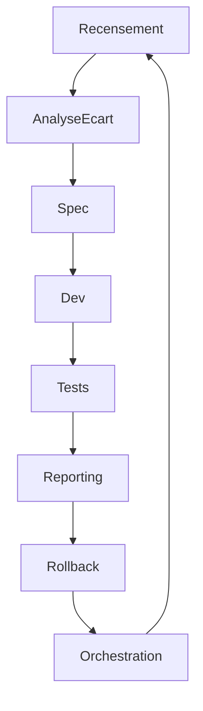

# plan-dev-v106-orga-docs.md

## Objectif
Optimiser l’organisation de `.github/docs` pour une documentation universelle, actionnable, automatisable et testée, compatible VSIX, IDE, SaaS, en tenant compte de l’écosystème des managers (dont DocManager) et des standards avancés (.clinerules/).

---

## Managers clés intégrés à la documentation universelle

### Managers essentiels pour la robustesse, la traçabilité et l’automatisation :
- **DocManager** : orchestrateur central, gestion documentaire, extension plugins.
- **ErrorManager** : gestion et traçabilité des erreurs, validation structurée.
- **ScriptManager** : exécution et gestion des scripts d’automatisation.
- **StorageManager** : persistance documentaire, gestion des métadonnées et dépendances.
- **SecurityManager** : gestion des accès, secrets, audit, vulnérabilités.
- **MonitoringManager** : collecte de métriques, reporting, alertes.
- **MaintenanceManager** : nettoyage, optimisation, analyse de santé.
- **MigrationManager** : import/export, migration de données et configs.
- **NotificationManagerImpl** : gestion des notifications, alertes, multi-canaux.
- **ProcessManager** : orchestration des processus, gestion du cycle de vie.
- **ContextManager** : gestion du contexte documentaire, snapshots, restauration.
- **ModeManager** : gestion des modes d’exécution, transitions, préférences.
- **RoadmapManager** : synchronisation, planification, reporting.
- **RollbackManager** : restauration, rollback documentaire.
- **CleanupManager** : organisation intelligente, suppression, reporting.
- **QdrantManager** : vectorisation documentaire, indexation, recherche.
- **VersionManagerImpl** : gestion des versions, compatibilité, sélection optimale.
- **VectorOperationsManager** : opérations de vectorisation, statistiques, reporting.

---

## Roadmap exhaustive et granulaire

### 1. Recensement & Cartographie
- [ ] Recenser tous les dossiers, fichiers, scripts, managers, points d’entrée, badges, métadonnées.
- Livrables : inventaire Markdown/CSV, diagramme Mermaid, script Go de scan (`scan_docs.go`), rapport JSON.
- Commandes : `go run scan_docs.go`, `ls -R .github/docs > inventory.txt`
- Format : Markdown, CSV, JSON, Mermaid.
- Validation : script Go, revue croisée.
- Rollback : sauvegarde `.bak` de l’inventaire.
- CI/CD : job de scan, archivage du rapport.
- Documentation : README du scan, guide d’usage du script.
- Traçabilité : logs, versionning du rapport.

### 2. Analyse d’écart & Recueil des besoins
- [ ] Comparer l’inventaire à la cible (standards, besoins VSIX/IDE/SaaS, .clinerules/, managers listés).
- Livrables : rapport d’écart Markdown/JSON, checklist des besoins non couverts, mapping managers/fichiers.
- Commandes : `go run compare_inventory.go`, diff Markdown.
- Format : Markdown, JSON.
- Validation : script Go, feedback humain.
- Rollback : rapport d’écart `.bak`.
- CI/CD : job de comparaison, reporting.
- Documentation : README du rapport d’écart.
- Traçabilité : logs, versionning du rapport.

### 3. Spécification détaillée
- [ ] Définir conventions, standards, formats, scripts, badges, points d’entrée, workflows, mapping multi-outils, intégration managers.
- Livrables : spécification Markdown/JSON, diagrammes Mermaid, table de mapping, scripts d’exemple, documentation des managers.
- Commandes : `go run spec_generator.go`
- Format : Markdown, JSON, Mermaid.
- Validation : revue croisée, script Go de validation.
- Rollback : version précédente de la spec.
- CI/CD : job de génération de spec.
- Documentation : README de la spec, guide d’intégration.
- Traçabilité : logs, versionning.

### 4. Développement & Adaptation
- [ ] Implémenter : scripts Go natifs (scan, analyse, reporting, validation, orchestration), adaptation des README, index, badges, frontmatter, guides, mapping, automatisation, documentation des managers.
- Livrables : scripts Go (`scan_docs.go`, `compare_inventory.go`, `spec_generator.go`, `auto-roadmap-runner.go`), README, guides, badges, outputs JSON/Markdown, fiches managers.
- Commandes : `go run ...`, `go build ...`, `go test ...`
- Format : Go, Markdown, JSON, YAML, Mermaid.
- Validation : tests unitaires Go, lint, CI/CD, revue croisée.
- Rollback : sauvegarde `.bak`, git revert.
- CI/CD : pipeline de build/test/reporting, triggers, notifications.
- Documentation : README, guides d’usage des scripts, documentation des managers.
- Traçabilité : logs, versionning, historique des outputs.

### 5. Tests (unitaires, intégration, automatisés)
- [ ] Créer/adapter des tests Go pour chaque script/action, tests de validation des outputs, tests d’intégration VSIX/IDE/SaaS, validation des managers.
- Livrables : fichiers de test Go (`*_test.go`), rapports de couverture, badges.
- Commandes : `go test ./...`, `go run auto-roadmap-runner.go --test`
- Format : Go, Markdown, JSON.
- Validation : couverture >90%, CI/CD, revue croisée.
- Rollback : version précédente des tests.
- CI/CD : job de test, reporting, archivage.
- Documentation : README des tests, guide d’intégration, documentation des managers.
- Traçabilité : logs, versionning, historique des rapports.

### 6. Reporting & Validation finale
- [ ] Générer des rapports automatisés (JSON, Markdown, HTML), badges de couverture, feedback automatisé/humain, validation croisée, reporting managers.
- Livrables : rapports, badges, outputs, logs, reporting managers.
- Commandes : `go run auto-roadmap-runner.go --report`, `go test ./...`
- Format : JSON, Markdown, HTML.
- Validation : CI/CD, revue croisée, feedback.
- Rollback : sauvegarde des rapports.
- CI/CD : job de reporting, notifications.
- Documentation : README du reporting, documentation des managers.
- Traçabilité : logs, versionning, archivage.

### 7. Rollback & Versionnement
- [ ] Mettre en place des procédures de rollback : sauvegardes automatiques, `.bak`, git revert, scripts de restauration, rollback managers.
- Livrables : scripts de rollback, documentation, logs, rollback managers.
- Commandes : `go run rollback.go`, `git revert ...`
- Format : Go, Markdown.
- Validation : test du rollback, revue croisée.
- CI/CD : job de rollback, archivage.
- Documentation : README du rollback, documentation des managers.
- Traçabilité : logs, versionning.

### 8. Orchestration & CI/CD
- [ ] Orchestrateur global (`auto-roadmap-runner.go`) : exécution des scans, analyses, tests, rapports, feedback, sauvegardes, notifications, intégration managers.
- Livrables : script Go, pipeline CI/CD, badges, rapports, orchestration managers.
- Commandes : `go run auto-roadmap-runner.go`, CI/CD triggers.
- Format : Go, YAML (pipeline), Markdown, JSON.
- Validation : tests automatisés, reporting CI/CD.
- Rollback : sauvegarde du pipeline.
- Documentation : README de l’orchestrateur, guide CI/CD, documentation des managers.
- Traçabilité : logs, versionning, archivage.

---

## Standards et conventions .clinerules/

- Granularité maximale : chaque étape et sous-étape est atomique, traçable, validée, rollbackable.
- Documentation systématique : README, guides, mapping, outputs, logs, documentation des managers.
- Validation croisée : tests automatisés, revue humaine, feedback, validation managers.
- Versionnement : git, sauvegardes, historique.
- Automatisation prioritaire : scripts Go natifs, jobs CI/CD, reporting automatisé, orchestration managers.
- Traçabilité : logs, archivage, badges, outputs, feedback automatisé, reporting managers.

---

## Exemples de scripts Go natifs

- [`scan_docs.go`](tools/scan_docs.go:1) : scan et inventaire des fichiers/docs.
- [`compare_inventory.go`](tools/compare_inventory.go:1) : analyse d’écart.
- [`spec_generator.go`](tools/spec_generator.go:1) : génération de spécifications.
- [`auto-roadmap-runner.go`](cmd/auto-roadmap-runner/main.go:1) : orchestration globale.
- [`rollback.go`](tools/rollback.go:1) : restauration et rollback.

---

## Diagramme Mermaid (workflow documentaire automatisé)

---

## Livrables attendus (checklist exhaustive)

- [ ] Inventaire complet des fichiers/docs/scripts/managers
- [ ] Rapport d’écart et besoins, mapping managers
- [ ] Spécification détaillée, documentation des managers
- [ ] Scripts Go natifs et tests associés, orchestration managers
- [ ] README, guides, badges, outputs, documentation managers
- [ ] Rapports automatisés et reporting, reporting managers
- [ ] Procédures de rollback/versionnement, rollback managers
- [ ] Orchestrateur global et pipeline CI/CD, orchestration managers
- [ ] Documentation exhaustive, traçabilité, validation managers
