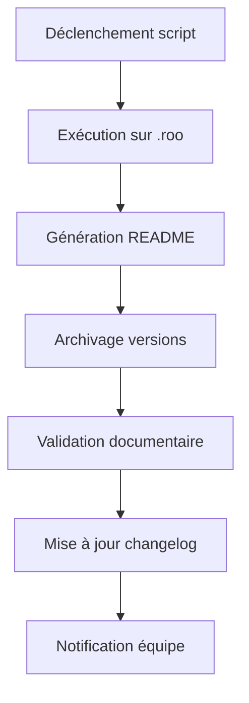
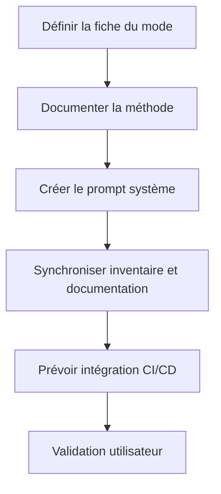

# Roadmap exhaustive et actionnable – Granularité des règles Roo-Code (v107)

## Objectif
Obtenir une amélioration robuste, automatisable et testée de la granularité des règles Roo-Code, alignée sur la stack Go native et les standards [`clinerules/`](clinerules/README.md:1).

---

## 1. Recensement & Analyse d’écart

- [ ] **Inventaire des règles existantes**  
  - Script Go natif : [`tools/rules-extractor.go`](tools/rules-extractor.go:1)
  - Livrable : rapport Markdown, badge de couverture, logs
  - Exemple : rapport d’inventaire avec tableau de règles extraites
  - Critères d’acceptation : extraction exhaustive, logs complets, rapport validé par revue croisée
  - Exception : extraction incomplète → relancer le script, signaler dans le rapport

- [ ] **Analyse d’écart**  
  - Script Go natif : comparaison, reporting
  - Livrable : rapport d’écart, logs
  - Exemple : tableau comparatif entre règles existantes et attendues
  - Critères : exhaustivité, traçabilité, validation collaborative
  - Exception : écart non explicable → annotation dans le rapport, feedback demandé

---

## 2. Recueil des besoins

- [ ] **Collecte structurée**  
  - Script CLI Go : [`tools/needs-collector.go`](tools/needs-collector.go:1)
  - Livrable : [`needs-rules.md`](needs-rules.md:1), logs, feedback automatisé
  - Exemple : formulaire de recueil, feedback structuré
  - Critères : feedback croisé, traçabilité, archivage
  - Exception : feedback manquant → relance automatisée, annotation

---

## 3. Spécification

- [ ] **Rédaction des spécifications**  
  - Script Go natif : [`tools/spec-generator.go`](tools/spec-generator.go:1)
---

## 4. Automatisation de la maintenance documentaire `.roo`

- **Outil principal** : [`tools/scripts/gen_docs_and_archive.go`](tools/scripts/gen_docs_and_archive.go:10-17)
- **Objectif** : Automatiser la génération, la mise à jour et l’archivage de la documentation du dossier `.roo` selon les standards Roo-Code.

### Workflow actionnable

1. Déclenchement manuel ou via CI/CD (commit, tag, demande de release)
2. Exécution du script Go sur le dossier `.roo`
3. Génération et mise à jour du README central
4. Archivage automatique des versions précédentes
5. Validation de la cohérence documentaire (logs, rapport, badge)
6. Mise à jour du changelog et notification à l’équipe

**Critères d’acceptation** :
- Documentation générée et archivée sans erreur
- Logs et rapport accessibles
- Badge de validation mis à jour
- Notification envoyée à l’équipe

**Exceptions** :
- Erreur d’exécution → relance manuelle, signalement dans le changelog

---
  - Livrable : [`spec-rules.md`](spec-rules.md:1), badge de validation
  - Exemple : spécification conforme au template, validée par deux reviewers
  - Critères : conformité au template, validation croisée, archivage
  - Exception : non-conformité → correction, feedback, archivage du rejet

---

## 4. Développement

- [ ] **Implémentation des règles et exemples**  
  - Script Go natif : [`tools/rules-inserter.go`](tools/rules-inserter.go:1)
  - Livrable : fichier modifié ([`.roo/rules/rules.md`](.roo/rules/rules.md:1)), logs, badge de commit
  - Exemple : ajout d’un exemple concret dans chaque règle
  - Critères : tests unitaires, lint, logs, validation collaborative
  - Exception : échec des tests → correction, signalement, archivage

---

## 5. Tests (unitaires/intégration)

- [ ] **Création/adaptation de tests Go natifs**  
  - Commande : `go test ./tools/rules-*`
  - Livrable : rapport de tests (Markdown, HTML), badge de couverture
  - Exemple : rapport >90% couverture, logs détaillés
  - Critères : couverture >90%, logs, reporting CI/CD, validation croisée
  - Exception : couverture insuffisante → ajout de tests, relance CI

---

## 6. Reporting

- [ ] **Génération automatique de rapports**  
  - Script Go natif : [`tools/report-generator.go`](tools/report-generator.go:1)
  - Livrable : [`report-rules.md`](report-rules.md:1), logs, badge CI/CD
  - Exemple : rapport exhaustif, archivage automatique
  - Critères : exhaustivité, traçabilité, archivage, validation collaborative
  - Exception : rapport incomplet → correction, feedback, archivage

---

## 7. Validation

- [ ] **Validation automatisée et humaine**  
  - Automatisée : lint, tests, CI/CD
  - Humaine : revue croisée, feedback structuré
  - Livrable : badge de validation, logs, rapport de feedback
  - Exemple : validation croisée avec archivage des décisions
  - Critères : validation croisée, logs, feedback archivé, traçabilité
  - Exception : rejet ou litige → documentation du cas, arbitrage, archivage

---

## Glossaire / FAQ

- **Inventaire** : Extraction exhaustive des règles existantes.
- **Feedback croisé** : Validation par plusieurs reviewers.
- **Badge de couverture** : Indicateur visuel du taux de couverture des tests.
- **Archivage** : Conservation systématique des rapports et décisions.
- **Validation collaborative** : Processus impliquant plusieurs parties prenantes.

---

## Processus de validation collaborative

1. Revue croisée par au moins deux reviewers
2. Feedback structuré et archivage dans [`rapport-analyse-boucle-validation.md`](projet/roadmaps/plans/consolidated/rapport-analyse-boucle-validation.md:1)
3. Arbitrage en cas de litige, documentation du processus
4. Synchronisation avec la documentation centrale

---
---
## Sous-plan : Ajout du mode PlanDev Engineer

### Objectif
Intégrer un nouveau mode persona "PlanDev Engineer" dédié à l’élaboration de plans de développement actionnables, automatisables et testés, avec documentation de la méthode et synchronisation dans l’inventaire Roo-Code.

### Étapes actionnables

1. **Définir la fiche du mode**
   - Rédiger la fiche complète selon le modèle de [.roo/rules/rules.md:81].
   - Livrable : fiche insérée dans l’inventaire des modes.
   - Critères : clarté, exhaustivité, validation collaborative.

2. **Documenter la méthode**
   - Créer `.roo/rules/rules-plandev.md` : méthode détaillée, workflow, cas limites, critères d’acceptation.
   - Livrable : fichier Markdown, liens croisés.
   - Critères : conformité au style Roo, exemples, validation croisée.

3. **Créer le prompt système**
   - Rédiger le prompt système pour le mode PlanDev Engineer.
   - Livrable : fichier dans `.roo/overrides/`.
   - Critères : alignement avec la fiche, testabilité.

4. **Synchroniser l’inventaire et la documentation**
   - Ajouter le mode à la table cliquable et au modèle de fiche.
   - Mettre à jour les liens dans les fichiers centraux (README, workflows-matrix, tools-registry).
   - Critères : cohérence documentaire, traçabilité.

5. **Prévoir l’intégration CI/CD**
   - Ajouter la validation automatique de la fiche et de la méthode dans le pipeline.
   - Livrable : logs CI, badge de validation.
   - Critères : automatisation effective, logs accessibles.

6. **Validation utilisateur**
   - Demander validation du sous-plan et de la fiche avant implémentation.
   - Livrable : feedback archivé, décision tracée.

### Diagramme Mermaid

### Critères d’acceptation

- Fiche mode validée et insérée dans l’inventaire
- Méthode documentée et accessible
- Prompt système disponible et testé
- Synchronisation documentaire effective
- Intégration CI/CD opérationnelle
- Validation utilisateur archivée

### Exceptions

- Blocage sur la validation → documentation du cas, relance collaborative
- Non-conformité documentaire → correction, feedback, archivage du rejet

---
---
## Référence documentaire

Pour garantir la cohérence et la traçabilité, chaque mode Roo-Code doit être documenté selon le modèle de fiche mode présenté dans la section 7 de [.roo/rules/rules.md:81].  
La table cliquable et le modèle de fiche assurent la validation collaborative, la gestion des exceptions et l’alignement avec les critères d’acceptation du plan v107.

Chaque étape du plan est ainsi enrichie pour garantir l’état de l’art documentaire Roo-Code.
