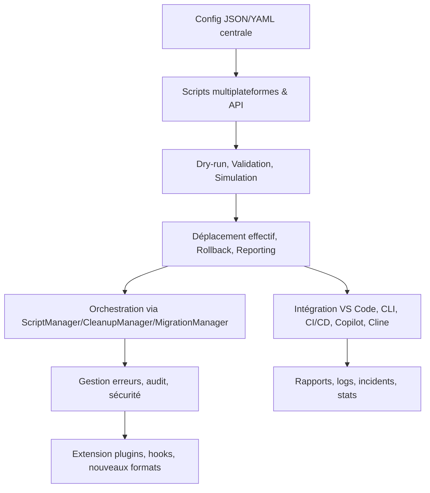

# Plan Dev v110 – Outil de déplacement multifichier documentaire (état de l’art Roo Code)

## Objectif

Concevoir et industrialiser un outil de déplacement multifichier documentaire, interopérable Roo Code, Kilo Code, Copilot, Cline, CI/CD, avec orchestration intelligente, sécurité, reporting, rollback, extension plugin et documentation complète.

---

### Phase 1 : Configuration centralisée et déclarative

- **Objectif** : Définir la configuration des déplacements de fichiers de façon déclarative et traçable.
- **Livrables** : `file-moves.json` ou `.yaml`, documentation inline.
- **Tâches** :
  - [ ] Définir le schéma de configuration (source, cible, type, tags, dépendances, priorité, rollback, dry-run, validation, hooks).
  - [ ] Implémenter la composition/import d’autres configs.
  - [ ] Ajouter la documentation inline, version, date, auteur.
  - [ ] Générer/valider la config via SmartVariableSuggestionManager ([AGENTS.md](../../../../AGENTS.md)).
  - [ ] Documenter le format et fournir un exemple commenté.

---

### Phase 2 : Scripts multiplateformes et API

- **Objectif** : Permettre l’exécution multiplateforme et l’intégration API.
- **Livrables** : Scripts PowerShell, Node.js, Bash, Go, Python, endpoints CLI/HTTP.
- **Tâches** :
  - [ ] Développer les scripts pour chaque plateforme cible.
  - [ ] Orchestrer l’exécution via ScriptManager ([AGENTS.md](../../../../AGENTS.md)).
  - [ ] Exposer une API CLI et HTTP compatible Copilot/Cline.
  - [ ] Implémenter dry-run, preview, rollback, simulation, reporting.
  - [ ] Valider automatiquement les liens internes, détecter cycles et conflits.
  - [ ] Intégrer la gestion des droits (SecurityManager) et l’audit (MonitoringManager).

---

### Phase 3 : Orchestration et intelligence documentaire

- **Objectif** : Orchestrer les déplacements et gérer les dépendances complexes.
- **Livrables** : Workflows ScriptManager, CleanupManager, MigrationManager, ErrorManager.
- **Tâches** :
  - [ ] Implémenter l’appel natif via ScriptManager.
  - [ ] Ajouter l’option via CleanupManager/MigrationManager selon contexte.
  - [ ] Intégrer ErrorManager pour la traçabilité et les hooks personnalisés.
  - [ ] Permettre l’enchaînement avec n8n (N8NManager) ou autres managers.
  - [ ] Gérer les triggers post-move, notification, indexation.

---

### Phase 4 : Intégration outils et CI/CD

- **Objectif** : Intégrer l’outil dans les environnements de développement et CI/CD.
- **Livrables** : `tasks.json` VS Code, scripts CLI Roo, jobs CI (GitHub Actions, GitLab CI, Azure DevOps).
- **Tâches** :
  - [ ] Définir les tâches VS Code et scripts CLI Roo.
  - [ ] Intégrer l’API Kilo Code, Cline, Copilot.
  - [ ] Ajouter les jobs CI/CD pour automatiser les déplacements.
  - [ ] Générer automatiquement les rapports d’écart, logs, incidents, statistiques (MonitoringManager).
  - [ ] Implémenter le mode interactif (sélection, confirmation, annulation).

---

### Phase 5 : Documentation, modèles et guides

- **Objectif** : Fournir une documentation exhaustive et des modèles réutilisables.
- **Livrables** : Guides utilisateur/développeur, FAQ, modèles de config, checklists de validation.
- **Tâches** :
  - [ ] Rédiger les guides utilisateur et développeur.
  - [ ] Fournir des modèles de configuration et d’intégration.
  - [ ] Créer des checklists de validation pour chaque étape.
  - [ ] Centraliser la documentation et versionner.
  - [ ] Ajouter des exemples de scénarios avancés (migration, rollback, audit, reporting, extension plugin).
  - [ ] Lister les liens directs vers les fichiers de référence :
    - [AGENTS.md](../../../../AGENTS.md)
    - [rules-maintenance.md](../../../../.roo/rules/rules-maintenance.md)
    - [tools-registry.md](../../../../.roo/rules/tools-registry.md)
    - [workflows-matrix.md](../../../../.roo/rules/workflows-matrix.md)

---

### Phase 6 : Tests, validation et sécurité

- **Objectif** : Garantir la robustesse, la conformité et la sécurité de l’outil.
- **Livrables** : Suites de tests, rapports de validation, audit sécurité.
- **Tâches** :
  - [ ] Écrire des tests unitaires et d’intégration pour chaque script/configuration.
  - [ ] Simuler des scénarios d’erreur, rollback, permissions, reporting.
  - [ ] Mettre en place la validation collaborative et automatisée (CI).
  - [ ] Générer les rapports d’écart et d’audit de conformité.
  - [ ] Intégrer la gestion des accès, secrets, audit, conformité RGPD.

---

### Phase 7 : Évolutivité et extension

- **Objectif** : Ouvrir l’outil à l’extension et à la contribution.
- **Livrables** : Architecture plugin, documentation des hooks, procédure de contribution.
- **Tâches** :
  - [ ] Concevoir l’architecture plugin (PluginInterface).
  - [ ] Ajouter des points d’extension pour nouveaux types/formats/managers.
  - [ ] Documenter et implémenter les hooks (pré/post, custom).
  - [ ] Intégrer d’autres outils IA ou pipelines.
  - [ ] Documenter les cas limites, exceptions, évolutions.
  - [ ] Rédiger la procédure de contribution.

---

### Phase 8 : Diagramme Mermaid

---

**Ce plan est prêt pour validation collaborative et implémentation.**