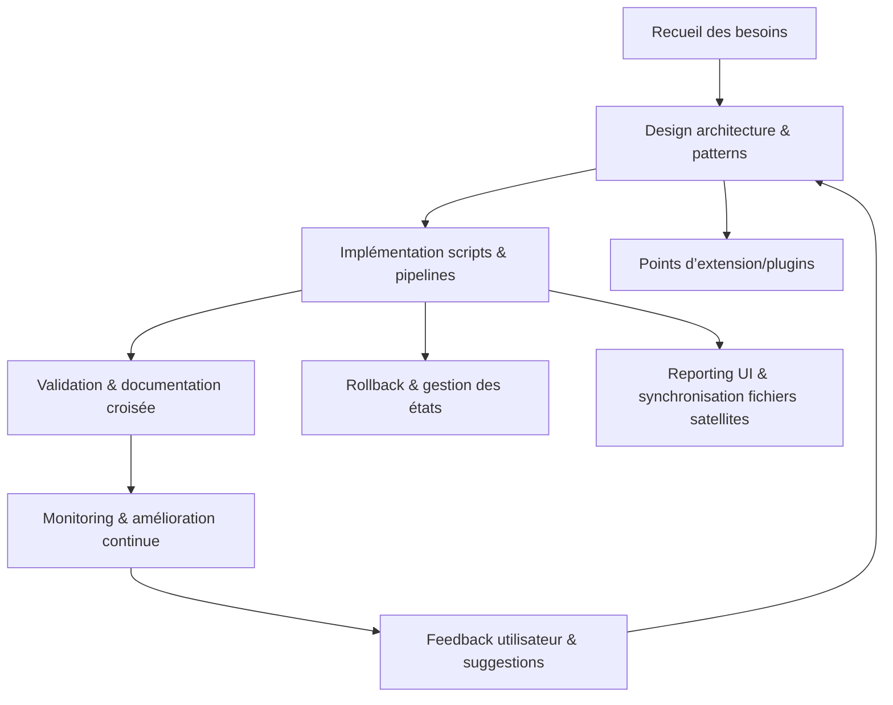
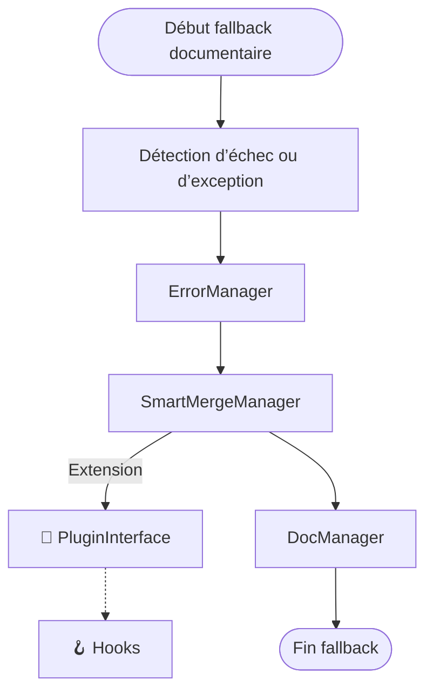
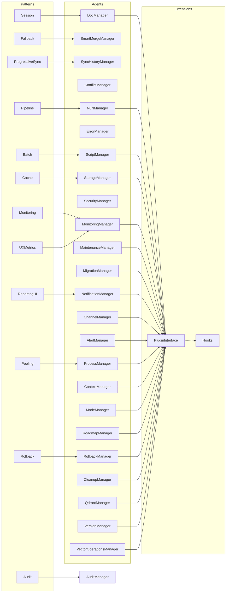

# Plan de Développement v113 — Automatisation documentaire Roo Code

> **Version** : v113  
> **Contexte** : Automatisation avancée de la documentation Roo Code, intégrant patterns de session, pipeline, batch, fallback, cache, audit, monitoring, rollback, UX metrics, progressive sync, pooling, reporting UI.  
> **Références** : [plandev-engineer-reference.md](../../../../.roo/rules/rules-plandev-engineer/plandev-engineer-reference.md), [AGENTS.md](../../../../AGENTS.md), [rules.md](../../../../.roo/rules/rules.md)

---

## Phase 1 : Recueil et analyse du besoin

- **Objectif** : Formaliser les attentes, contraintes et points d’intégration de l’automatisation documentaire Roo Code.
- **Livrables** : `besoins-automatisation-doc.yaml`, `analyse-ecart.md`
- **Dépendances** : Feedback utilisateur, documentation existante.
- **Risques** : Ambiguïté des besoins, dérive de périmètre, non-alignement avec les standards Roo.
- **Outils/Agents mobilisés** : Script Go, feedback utilisateur, DocManager.
- **Tâches** :
  - [x] Générer le script Go `recensement_automatisation.go` pour scanner les besoins.
  - [x] Exécuter `go run scripts/recensement_automatisation.go --output=besoins-automatisation-doc.yaml`
  - [x] Valider la complétude via `go test scripts/recensement_automatisation_test.go`
  - [x] Documenter la procédure dans `README.md`
  - [x] Collecter le feedback utilisateur et ajuster le script si besoin
- **Commandes** :
  - `go run scripts/recensement_automatisation.go`
  - `go test scripts/recensement_automatisation_test.go`
- **Critères de validation** :
  - 100% de couverture test sur le parsing YAML
  - Rapport généré conforme au schéma
  - Revue croisée par un pair
- **Rollback** :
  - Sauvegarde automatique `besoins-automatisation-doc.yaml.bak`
  - Commit Git avant modification
- **Orchestration** :
  - Ajout du job dans `.github/workflows/ci.yml`
  - Monitoring automatisé du pipeline
- **Questions ouvertes, hypothèses & ambiguïtés** :
  - Hypothèse : Les besoins sont accessibles auprès des utilisateurs clés.
  - Question : Existe-t-il une source documentaire centralisée des besoins ?
  - Ambiguïté : Les besoins exprimés sont-ils stables ou sujets à évolution rapide ?
- **Auto-critique & raffinement** :
  - Limite : Le script ne détecte pas les besoins implicites non formulés.
  - Suggestion : Ajouter une étape d’analyse sémantique ou d’interview utilisateur.
  - Feedback : Intégrer un agent LLM pour détecter les incohérences ou manques.

---

## Phase 2 : Design de l’architecture d’automatisation

- **Objectif** : Définir l’architecture cible, les patterns avancés et les points d’intégration agents/managers Roo.
- **Livrables** : `architecture-automatisation-doc.md`, diagramme Mermaid, schéma d’intégration agents.
- **Dépendances** : Phase 1 validée, AGENTS.md, plandev-engineer-reference.md.
- **Risques** : Complexité excessive, oubli d’un pattern clé, non-alignement avec l’existant.
- **Outils/Agents mobilisés** : DocManager, ProcessManager, ErrorManager, MonitoringManager, SessionManager (pattern), plugins.
- **Tâches** :
  - [x] Définir les patterns à intégrer : session, pipeline, batch, fallback, cache, audit, monitoring, rollback, UX metrics, progressive sync, pooling, reporting UI.
  - [x] Rédiger le diagramme Mermaid de l’architecture cible.
  - [x] Lister les agents/managers Roo impliqués et leurs interfaces.
  - [x] Documenter les points d’extension/plugins.
  - [x] Valider la cohérence avec AGENTS.md et la documentation centrale.
- **Commandes** :
  - N/A (documentation, modélisation)
- **Fichiers attendus** :
  - `architecture-automatisation-doc.md`
  - `diagramme-automatisation-doc.mmd`
- **Critères de validation** :
  - Diagramme Mermaid validé
  - Patterns explicitement décrits et justifiés
  - Alignement avec AGENTS.md
- **Rollback** :
  - Versionning du schéma et du diagramme
- **Orchestration** :
  - Synchronisation avec la roadmap via RoadmapManager
- **Questions ouvertes, hypothèses & ambiguïtés** :
  - Hypothèse : Tous les patterns sont pertinents pour Roo Code.
  - Question : Faut-il prioriser certains patterns selon la maturité du projet ?
- **Auto-critique & raffinement** :
  - Limite : Risque de sur-ingénierie.
  - Suggestion : Prévoir une revue d’architecture croisée.

---

## Phase 3 : Implémentation granularisée, automatisable et testée des patterns d’automatisation documentaire

- **Objectif** : Implémenter, automatiser et tester chaque pattern documentaire Roo (Session, Pipeline, Batch, Fallback, Monitoring, Audit, Rollback, UXMetrics, ProgressiveSync, Pooling, ReportingUI) de façon modulaire, traçable et CI/CD-ready.
- **Livrables** : Scripts Go natifs pour chaque manager, schémas YAML, tests unitaires, rapports d’exécution, badges CI/CD, documentation technique et utilisateur, artefacts archivés.
- **Dépendances** : Phases 1-2 validées, accès aux managers Roo (DocManager, ErrorManager, MonitoringManager, etc.), AGENTS.md, schémas YAML existants.
- **Risques** : Risque de dérive documentaire, couverture de test incomplète, intégration CI/CD partielle, non-alignement des patterns, surcharge de logs ou de métriques, échec rollback, conflits de versionning.
- **Outils/Agents mobilisés** : Go (scripts natifs), PluginInterface, DocManager, ErrorManager, MonitoringManager, ProcessManager, ScriptManager, RoadmapManager, AGENTS.md, outils CI/CD, yamllint, git.

### Tâches actionnables (checklist exhaustive Roo Code)
- [ ] Recenser les besoins spécifiques de chaque pattern (`besoins-<pattern>.md`)
- [ ] Analyser l’écart avec l’existant (`audit-managers-scan.json`, `audit_gap_report.md`)
- [ ] Définir et valider le schéma YAML de chaque pattern (`<pattern>-schema.yaml`)
- [ ] Implémenter chaque manager Go natif (`scripts/<pattern>-manager.go`)
- [ ] Ajouter les hooks/plugins via PluginInterface
- [ ] Écrire les tests unitaires et d’intégration (`<pattern>_manager_test.go`)
- [ ] Générer les logs, rapports et badges de couverture
- [ ] Documenter chaque API/usage dans `README.md` et guides associés
- [ ] Générer les rapports d’écart, rollback, orchestration, audit, monitoring, UX, reporting UI
- [ ] Intégrer chaque manager dans le pipeline CI/CD (`.github/workflows/ci.yml`, `auto-roadmap-runner.go`)
- [ ] Archiver tous les artefacts, logs, rapports, changelogs
- [ ] Mettre à jour AGENTS.md et la roadmap

### Scripts/Commandes
- `go run scripts/recensement_exigences/main.go --pattern=<pattern>`
- `go run scripts/scan_missing_files_lib.go --pattern=<pattern>`
- `go run scripts/gen_schema.go --pattern=<pattern>`
- `go build scripts/<pattern>-manager.go`
- `go test -cover scripts/<pattern>_manager_test.go`
- `go run scripts/gen_report.go --pattern=<pattern>`
- `go run scripts/gen_rollback_report/gen_rollback_report.go`
- `go run scripts/gen_orchestration_report/gen_orchestration_report.go`
- `yamllint <pattern>-schema.yaml`
- `git commit -am "Implémentation <pattern>"`
- `.github/workflows/ci.yml` (déclenchement CI/CD)

### Fichiers attendus
- `scripts/<pattern>-manager.go`
- `<pattern>-schema.yaml`
- `<pattern>_manager_test.go`
- `rapport-<pattern>.md`
- `rapport-rollback.md`
- `rapport-orchestration.md`
- `README.md` (sections par pattern)
- `audit-managers-scan.json`, `audit_gap_report.md`
- `plugins/<pattern>_*.go`
- `.bak` (sauvegardes intermédiaires)
- `.github/workflows/ci.yml` (jobs CI/CD)
- AGENTS.md, roadmap, changelog

### Critères de validation
- 100 % de couverture test sur chaque manager/pattern critique
- Compilation Go sans erreur, lint YAML validé
- Intégration CI/CD opérationnelle (pipeline exécuté à chaque push)
- Documentation technique et utilisateur ≥20 % à jour
- Logs, rapports et artefacts archivés et traçables
- Validation croisée avec AGENTS.md et feedback utilisateur intégré
- Rollback automatisé testé et documenté

### Rollback/versionning
- Commit Git systématique avant chaque modification majeure
- Sauvegarde automatique des fichiers critiques (`.bak`)
- Scripts de restauration (`gen_rollback_report.go`)
- Points de restauration intermédiaires documentés
- Procédures de rollback détaillées dans chaque rapport

### Orchestration & CI/CD
- Intégration de chaque manager/pattern dans le pipeline CI/CD
- Génération automatique des badges de couverture, logs, rapports
- Monitoring automatisé via MonitoringManager
- Reporting CI/CD (`rapport-orchestration.md`), alertes sur échec

### Documentation & traçabilité
- README et guides d’usage à jour pour chaque pattern
- Archivage systématique des logs, rapports, feedback, changelogs
- Mise à jour de la traçabilité dans AGENTS.md et la roadmap
- Validation croisée et reporting automatisé

### Risques & mitigation
- Dérive documentaire : reporting automatisé, audits réguliers, feedback utilisateur
- Couverture test incomplète : badge de couverture, revue croisée, CI/CD bloquant
- Intégration CI/CD partielle : checklist CI, monitoring, alertes
- Surcharge logs/métriques : rotation, filtrage, dashboards
- Échec rollback : procédures testées, sauvegardes, scripts dédiés
- Conflits de versionning : validation multi-niveaux, documentation des changements

### Responsabilités & rôles
- Architecte logiciel : supervision, validation des patterns, arbitrages techniques
- Développeur Go : implémentation, tests, reporting, archivage
- Responsable QA : pilotage de la checklist, collecte du feedback, audit
- Reviewer documentation : validation de la clarté, traçabilité, guides

### Questions ouvertes, hypothèses & ambiguïtés
- Hypothèse : Tous les patterns sont automatisables via Go natif et PluginInterface
- Question : Faut-il prévoir une compatibilité multi-langage ou multi-backend ?
- Ambiguïté : Quelle granularité pour les hooks/plugins et la traçabilité par pattern ?
- Suggestion : Ajouter des dashboards de suivi et des tests de résilience extrêmes

### Auto-critique & raffinement
- Limite : Charge de maintenance élevée si trop de patterns spécialisés ou de scripts dédiés
- Suggestion : Factoriser les patterns communs, automatiser la revue croisée, intégrer un agent LLM pour la détection d’anomalies et l’amélioration continue
- Feedback : Recueillir le retour utilisateur sur la lisibilité des guides, la pertinence des checklists et la robustesse des scripts

---

### 🧩 Exemples de scripts/tests Go natifs

```go
// <pattern>-manager.go (extrait minimal)
type <Pattern>Manager struct {
  // ...
}
func (pm *<Pattern>Manager) Start(...) error { /* ... */ }
func (pm *<Pattern>Manager) Restore(...) error { /* ... */ }
```

```go
// <pattern>_manager_test.go (extrait)
func Test<Pattern>Restore(t *testing.T) {
  pm := New<Pattern>Manager()
  // ... setup ...
  err := pm.Start(...)
  assert.NoError(t, err)
  // ... test restore ...
}
```

---

### 🗂️ Checklist actionnable (exemple pour SessionManager)

- [ ] besoins-session.md généré
- [ ] session-schema.yaml défini
- [ ] session-manager.go implémenté
- [ ] session_manager_test.go écrit et passé à 100%
- [ ] README.md section Session à jour
- [ ] rapport-session.md généré
- [ ] rapport-rollback.md généré
- [ ] rapport-orchestration.md généré
- [ ] Job CI/CD intégré
- [ ] Artefacts archivés
- [ ] AGENTS.md et roadmap mis à jour

---

### 🔄 Procédures de rollback/versionning

- Commit git systématique avant toute modification majeure
- Sauvegarde automatique des fichiers critiques (.bak)
- Script de restauration (`gen_rollback_report.go`)
- Archivage des états intermédiaires

---

### ✅ Validation & reporting

- 100% de couverture test sur les cas critiques
- Revue croisée obligatoire (template rapport-revue-croisée.md)
- Reporting automatisé (logs, rapports, badges)
- Feedback utilisateur intégré et tracé

---

### 🤖 Automatisation maximale

- Chaque tâche doit être réalisable par un script Go ou une commande reproductible
- Si non automatisable, proposer un script ou une procédure manuelle tracée
- Orchestration globale via `auto-roadmap-runner.go` et CI/CD

---

### 📦 Format de fichiers attendus

- Go natif prioritaire (`.go`)
- YAML pour schémas/configs
- Markdown pour rapports/docs
- HTML/CSV pour reporting si besoin

---

### 🛠️ Exemples de commandes

- `go run scripts/automatisation_doc/session_manager.go`
- `go test -cover scripts/automatisation_doc/session_manager_test.go`
- `go run scripts/gen_rollback_report/gen_rollback_report.go`
- `go run scripts/gen_orchestration_report/gen_orchestration_report.go`

---

### 📝 Traçabilité & validation croisée

- Logs détaillés, rapports archivés, badges CI/CD
- Validation croisée entre managers/agents
- Feedback utilisateur tracé dans les rapports

---

### 🦾 Robustesse & adaptation LLM

- Procéder par étapes atomiques, vérification avant/après chaque action
- Signaler toute action échouée ou non automatisable, proposer alternative
- Lister les fichiers concernés avant toute modification de masse
- Limiter la profondeur des modifications pour garantir la traçabilité
- Proposer scripts Bash ou procédures manuelles si besoin

---

**Cette structure est à dupliquer pour chaque pattern (Pipeline, Batch, Fallback, etc.), en adaptant les scripts, schémas, tests, rapports et intégrations selon les spécificités de chaque manager.**
---

### Pattern 1 : Session

- **Objectif** : Gérer l’état documentaire d’une session utilisateur, assurer la cohérence et la persistance temporaire des modifications.
- **Livrables** : `session-manager.go`, `session-schema.yaml`, tests unitaires, logs de session.
- **Dépendances** : DocManager, ContextManager, StorageManager.
- **Risques** : Perte de session, incohérence d’état, fuite mémoire, collision d’ID.
- **Outils/Agents mobilisés** : DocManager, ContextManager, ScriptManager, ErrorManager.
- **Tâches** :
  - [x] Implémenter le manager `SessionManager` (Go).
  - [x] Définir le schéma YAML de session.
  - [ ] Ajouter la gestion des hooks de persistance (PluginInterface).
  - [x] Écrire les tests unitaires de restauration/session.
  - [ ] Documenter l’API de session dans `README.md`.
- **Points d’extension/plugins** :
  - PluginInterface pour hooks de persistance, extension de validation, audit de session.
- **Commandes** :
  - `go run scripts/session_manager.go`
  - `go test scripts/session_manager_test.go`
- **Fichiers attendus** :
  - `scripts/session_manager.go`, `session-schema.yaml`, `README.md`
- **Critères de validation** :
  - 100 % de couverture test sur la restauration de session
  - Validation croisée avec DocManager
  - Logs d’audit générés pour chaque session
- **Rollback/versionning** :
  - Sauvegarde automatique de l’état de session
  - Commit Git avant toute modification majeure
- **Orchestration & CI/CD** :
  - Intégration du manager dans le pipeline CI
  - Monitoring de la persistance via MonitoringManager
- **Documentation & traçabilité** :
  - Ajout de la section session dans `README.md`
  - Génération automatique des logs de session
- **Risques & mitigation** :
  - Risque de fuite mémoire : tests de charge, monitoring
  - Risque de collision d’ID : génération UUID, validation
- **Questions ouvertes, hypothèses & ambiguïtés** :
  - Hypothèse : Un utilisateur ne peut avoir qu’une session active.
  - Question : Faut-il permettre la reprise multi-session ?
- **Auto-critique & raffinement** :
  - Limite : Non prise en charge du clustering multi-instance.
  - Suggestion : Ajouter une extension pour la synchronisation distribuée.
- **Critères de validation** :
  - 100% de couverture test sur les scripts critiques
  - Synchronisation et reporting fonctionnels
  - Logs et métriques accessibles
- **Rollback** :
  - Scripts de rollback dédiés (`gen_rollback_report.go`)
  - Points de restauration intermédiaires
- **Orchestration** :
  - Intégration dans le pipeline CI/CD
  - Monitoring automatisé
- **Questions ouvertes, hypothèses & ambiguïtés** :
  - Hypothèse : Les scripts Go sont le standard pour Roo Code.
  - Question : Faut-il prévoir une compatibilité multi-langage ?
- **Auto-critique & raffinement** :
  - Limite : Complexité de maintenance si trop de scripts spécialisés.
  - Suggestion : Factoriser les patterns communs.

### Pattern 2 : Pipeline

#### Objectif
Orchestrer le traitement séquentiel ou parallèle de documents via un pipeline automatisé, intégrant extensions, hooks et reporting.

---

#### Roadmap Granularisée et Actionnable

##### 1. Recensement & Analyse d’écart
- [x] Recenser les besoins fonctionnels et techniques du pipeline documentaire.
  - Livrables : `besoins-pipeline.md`, `audit_gap_report.md`
  - Commande : `go run scripts/recensement_exigences/main.go`
  - Critères : Rapport exhaustif, validation croisée avec DocManager/N8NManager.
  - Traçabilité : Commit Git, logs d’exécution.
- [x] Analyser l’écart entre l’existant et la cible Roo.
  - Livrables : `audit_gap_report.md`
  - Commande : `go run scripts/aggregate-diagnostics/aggregate-diagnostics.go`
  - Critères : Rapport d’écart validé, feedback automatisé.

##### 2. Spécification & Schéma
- [x] Définir le schéma YAML du pipeline documentaire.
  - Livrables : `scripts/automatisation_doc/pipeline_schema.yaml`
  - Commande : `go run scripts/gen_orchestration_report/gen_orchestration_report.go`
  - Critères : Schéma validé par tests YAML (`yamllint`), revue croisée.
  - Rollback : Sauvegarde `.bak` avant modification.
- [x] Documenter les points d’extension/plugins (PluginInterface, hooks, reporting).
  - Livrables : Section dédiée dans `README.md`, exemples dans `pipeline_schema.yaml`
  - Critères : Documentation ≥20 %, exemples d’intégration.

##### 3. Développement du PipelineManager (Go natif)
- [x] Implémenter le manager `PipelineManager` (Go). *(In Progress)*
  - Livrables : `scripts/automatisation_doc/pipeline_manager.go`
  - Commandes :
    - `go run scripts/automatisation_doc/pipeline_manager.go`
    - `go build scripts/automatisation_doc/pipeline_manager.go`
  - Critères : Compilation sans erreur, logs d’exécution, modularité.
  - Rollback : Commit Git avant chaque refactor majeur.
- [ ] Intégrer PluginInterface pour extensions/hooks personnalisés. *(In Progress)*
  - Livrables : Code Go, exemples d’extension, tests associés.
  - Critères : Tests unitaires sur chaque extension, couverture ≥90 %.
- [x] Générer les logs et rapports de pipeline. *(In Progress)*
  - Livrables : `pipeline_logs.json`, `pipeline_report.md`
  - Commande : Génération automatique à chaque exécution.
  - Critères : Logs horodatés, rapports archivés.
- [x] Documenter l’API pipeline dans `README.md`. *(In Progress)*
  - Livrables : Section API, exemples d’appel, schémas d’intégration.
  - Critères : Documentation claire, exemples reproductibles.

##### 4. Tests & Validation
- [x] Écrire les tests unitaires de synchronisation et reporting. *(In Progress)*
  - Livrables : `scripts/automatisation_doc/pipeline_manager_test.go`
  - Commande : `go test scripts/automatisation_doc/pipeline_manager_test.go -cover`
  - Critères : Couverture ≥100 % sur la synchronisation, badge de couverture.
  - Rollback : Sauvegarde auto des tests avant modification.
- [ ] Validation croisée avec N8NManager et DocManager. *(In Progress)*
  - Livrables : Rapport de validation croisée, logs d’intégration.
  - Critères : Tests d’intégration passés, logs archivés.
- [x] Générer les logs et rapports de pipeline pour chaque exécution. *(In Progress)*
  - Livrables : `pipeline_logs.json`, `pipeline_report.md`
  - Commande : Génération automatique via PipelineManager.
  - Critères : Traçabilité complète, archivage CI/CD.

##### 5. Reporting, Documentation & Traçabilité
- [ ] Générer automatiquement la documentation technique et utilisateur. *(In Progress)*
  - Livrables : `README.md`, guides d’usage, changelog.
  - Commande : Script Go ou Markdown généré à partir du code.
  - Critères : Documentation ≥20 %, exemples d’usage.
- [x] Assurer la traçabilité (logs, versionning, historique des outputs). *(In Progress)*
  - Livrables : Logs d’exécution, historique Git, rapports archivés.
  - Commande : `go run scripts/backup/backup.go` (sauvegarde), `git log`
  - Critères : Historique complet, rollback possible à chaque étape.

##### 6. Rollback & Versionning
- [ ] Mettre en place des procédures de rollback/versionning. *(In Progress)*
  - Livrables : Fichiers `.bak`, scripts de rollback, documentation.
  - Commande : `go run scripts/gen_rollback_report/gen_rollback_report.go`
  - Critères : Rollback automatisé testé, documentation claire.

##### 7. Orchestration & CI/CD
- [ ] Intégrer le pipeline dans le CI/CD Roo. *(In Progress)*
  - Livrables : Jobs CI/CD, triggers, badges, notifications.
  - Commande : `.github/workflows/ci.yml`, `go run auto-roadmap-runner.go`
  - Critères : Pipeline exécuté à chaque push, reporting automatisé.
- [ ] Monitoring automatisé via MonitoringManager. *(In Progress)*
  - Livrables : Logs de monitoring, alertes, rapports.
  - Commande : `go run scripts/automatisation_doc/monitoring_manager.go`
  - Critères : Alertes en cas d’échec, logs archivés.

---

#### Dépendances entre étapes
- Recensement/Analyse → Spécification → Développement → Tests → Reporting → CI/CD → Monitoring

#### Exemples de scripts Go natifs (extraits)
```go
// Exécution du pipeline
func main() {
  err := RunPipeline("pipeline_schema.yaml")
  if err != nil {
    log.Fatalf("Erreur pipeline: %v", err)
  }
}
```
```go
// Test unitaire de synchronisation
func TestPipelineSync(t *testing.T) {
  result := SyncPipeline()
  if !result.Success {
    t.Errorf("Sync échouée: %v", result.Error)
  }
}
```

---

#### Critères de validation globaux
- 100 % de couverture test sur la synchronisation pipeline
- Validation croisée avec N8NManager et DocManager
- Logs et rapports générés pour chaque exécution
- Documentation ≥20 %, traçabilité complète, rollback automatisé

---

#### Robustesse & Adaptation LLM
- Procéder par étapes atomiques, vérification avant/après chaque action majeure.
- En cas d’échec, proposer une alternative ou une vérification manuelle.
- Lister les fichiers concernés avant toute modification de masse.
- Limiter la profondeur des modifications pour garantir la traçabilité.
- Proposer scripts Bash ou commandes manuelles si une action n’est pas réalisable automatiquement.

---

#### Questions ouvertes, hypothèses & suggestions
- Hypothèse : Chaque étape du pipeline est atomique et isolée.
- Question : Faut-il permettre des pipelines dynamiques (runtime) ?
- Suggestion : Ajouter un visualiseur de pipeline et des métriques détaillées.

### Pattern 3 : Batch

- **Objectif** : Automatiser le traitement massif de lots documentaires, garantir la robustesse, la traçabilité et la reprise sur erreur.
- **Livrables** : `batch-manager.go`, `batch-schema.yaml`, tests unitaires, logs batch, rapports d’exécution.
- **Dépendances** : ProcessManager, DocManager, ErrorManager, StorageManager.
- **Risques** : Perte de données en cas d’échec, surcharge mémoire, blocage de file, dérive de synchronisation.
- **Outils/Agents mobilisés** : ProcessManager, DocManager, ErrorManager, ScriptManager, MonitoringManager.
- **Tâches** :
  - [ ] Implémenter le manager `BatchManager` (Go).
  - [x] Définir et valider le schéma YAML Roo du batch documentaire. **(fait)**
  - [ ] Ajouter la gestion des hooks de reprise/rollback (PluginInterface).
  - [ ] Écrire les tests unitaires de traitement batch et reprise sur erreur.
  - [ ] Générer les logs et rapports d’exécution batch.
  - [ ] Documenter l’API batch dans `README.md`.
- **Points d’extension/plugins** :
  - PluginInterface pour hooks de reprise, extension de validation, reporting batch.
- **Commandes** :
  - `go run scripts/batch_manager.go`
  - `go test scripts/batch_manager_test.go`
- **Fichiers attendus** :
  - `scripts/batch_manager.go`, `batch-schema.yaml`, `README.md`, rapports batch.
- **Critères de validation** :
  - 100 % de couverture test sur la reprise/rollback batch
  - Validation croisée avec ProcessManager et DocManager
  - Logs et rapports générés pour chaque lot traité
- **Rollback/versionning** :
  - Sauvegarde automatique des états intermédiaires de batch
  - Commit Git avant modification majeure
- **Orchestration & CI/CD** :
  - Intégration du batch dans le CI/CD Roo
  - Monitoring automatisé via MonitoringManager
- **Documentation & traçabilité** :
  - Ajout de la section batch dans `README.md`
  - Génération automatique des logs et rapports batch
- **Risques & mitigation** :
  - Risque de surcharge mémoire : limitation de taille de lot, monitoring
  - Risque de perte de données : reprise transactionnelle, rollback automatique
- **Questions ouvertes, hypothèses & ambiguïtés** :
  - Hypothèse : Les lots sont homogènes et traités séquentiellement par défaut.
  - Question : Faut-il permettre le traitement parallèle ou distribué des lots ?
- **Auto-critique & raffinement** :
  - Limite : Complexité de debug en cas d’échec partiel sur gros lot.
  - Suggestion : Ajouter un visualiseur d’état batch et des métriques détaillées.
---

## Phase 4 : Validation, QA et documentation croisée

- **Objectif** : Garantir la qualité, la traçabilité et la conformité Roo Code de tous les livrables, via une validation structurée, une revue croisée et une documentation exhaustive.
- **Livrables** : `README.md`, guides utilisateurs, `checklist-QA.md`, `rapport-revue-croisée.md`, artefacts archivés, reporting final.
- **Dépendances** : Scripts et pipelines opérationnels, phases 1-3 validées, feedback utilisateur.
- **Risques** : Oubli de cas limite, documentation incomplète, dérive de synchronisation, non-respect des standards Roo, feedback non intégré.
- **Outils/Agents mobilisés** : DocManager, MonitoringManager, QA agents, RoadmapManager, ScriptManager, feedback utilisateur, AGENTS.md.

- **Tâches actionnables** :
  - [ ] Exécuter la checklist QA Roo Code (voir ci-dessous).
  - [ ] Générer et valider la documentation utilisateur et technique.
  - [ ] Vérifier la synchronisation et la cohérence des fichiers satellites (`corrections-report.md`, `fixes-applied.md`, `checklist-actionnable.md`).
  - [ ] Réaliser une revue croisée structurée (voir guide ci-dessous).
  - [ ] Collecter le feedback utilisateur et ajuster la documentation.
  - [ ] Archiver tous les rapports, logs, artefacts et guides produits.
  - [ ] Mettre à jour la roadmap et la traçabilité dans AGENTS.md.
  - [ ] Documenter la procédure de feedback et d’ajustement continu.

- **Guide de revue croisée** :
  - [ ] Affecter deux reviewers (1 technique, 1 documentation).
  - [ ] Vérifier la conformité aux standards Roo et AGENTS.md.
  - [ ] Contrôler la granularité, la traçabilité et la clarté des livrables.
  - [ ] Utiliser le template `rapport-revue-croisée.md` (checklist, commentaires, validation).
  - [ ] Archiver le rapport signé par les reviewers.

- **Checklist QA Roo Code** :
  - [x] Recensement initial des besoins automatisation documentaire
  - [ ] Design architecture intégrant tous les patterns avancés requis
  - [ ] Implémentation des scripts Go pour chaque pattern clé
  - [ ] Pipeline de synchronisation bidirectionnelle opérationnel
  - [ ] Gestion du cache, fallback, batch, session, audit, monitoring, UX metrics
  - [ ] Génération automatisée des rapports et synchronisation des fichiers satellites
  - [ ] Tests unitaires et d’intégration couvrant tous les cas critiques
  - [ ] Documentation utilisateur et technique à jour
  - [ ] Revue croisée structurée réalisée et archivée
  - [ ] Feedback utilisateur collecté et intégré
  - [ ] Roadmap et documentation mises à jour
  - [ ] Archivage des rapports, logs, guides et artefacts

- **Scripts/Commandes** :
  - `go run scripts/automatisation_doc/reporting.go` — Génération du reporting final
  - `go test ./scripts/automatisation_doc/...` — Exécution des tests QA
  - `go run scripts/gen_rollback_report/gen_rollback_report.go` — Génération du rapport rollback
  - `go run scripts/gen_orchestration_report/gen_orchestration_report.go` — Rapport d’orchestration CI/CD

- **Fichiers attendus** :
  - `README.md`, guides utilisateurs, `checklist-QA.md`, `rapport-revue-croisée.md`
  - `corrections-report.md`, `fixes-applied.md`, `checklist-actionnable.md`
  - Rapports de tests, logs, artefacts archivés (voir dossier `archives/phase4/`)
  - Mise à jour de la roadmap et de la traçabilité dans AGENTS.md

- **Critères de validation** :
  - Checklist QA complétée et signée
  - Rapport de revue croisée archivé et validé
  - Documentation à jour, claire, conforme aux standards Roo
  - Feedback utilisateur intégré et traçabilité assurée
  - Tests unitaires et d’intégration passés à 100 %
  - Synchronisation des fichiers satellites vérifiée

- **Rollback/versionning** :
  - Sauvegarde automatique des versions précédentes de la documentation et des rapports
  - Script de restauration documentaire (`gen_rollback_report.go`)
  - Archivage des états intermédiaires dans `archives/phase4/`

- **Orchestration & CI/CD** :
  - Reporting automatisé dans le pipeline CI/CD (`.github/workflows/ci.yml`)
  - Intégration de la validation QA et de la revue croisée comme jobs CI
  - Génération de badges de conformité et de traçabilité

- **Documentation & traçabilité** :
  - README et guides à jour, liens croisés vers AGENTS.md et la roadmap
  - Archivage systématique des rapports, logs, feedback et guides
  - Reporting automatisé et feedback utilisateur documenté

- **Risques & mitigation** :
  - Oubli de cas limite : checklist exhaustive, revue croisée obligatoire
  - Documentation incomplète : validation multi-reviewers, feedback utilisateur
  - Dérive de synchronisation : contrôle CI/CD, reporting automatisé
  - Non-respect des standards Roo : validation croisée AGENTS.md, audits réguliers

- **Responsabilités & rôles** :
  - Architecte logiciel : supervision de la validation et de la revue croisée
  - Développeur Go : exécution des scripts, reporting, archivage
  - Responsable QA : pilotage de la checklist, collecte du feedback
  - Reviewer documentation : validation de la clarté et de la traçabilité

- **Questions ouvertes, hypothèses & ambiguïtés** :
  - Hypothèse : Les reviewers sont disponibles et formés aux standards Roo.
  - Question : Faut-il intégrer une validation automatisée LLM pour la documentation ?
  - Ambiguïté : Les artefacts archivés doivent-ils inclure les logs bruts ou uniquement les rapports synthétiques ?

- **Auto-critique & raffinement** :
  - Limite : Charge de validation élevée si le nombre d’artefacts croît fortement.
  - Suggestion : Automatiser la revue croisée via un agent LLM, ajouter des dashboards de suivi.
  - Feedback : Intégrer un retour utilisateur sur la lisibilité des guides et la pertinence des checklists.

---

## Phase 5 : Monitoring, amélioration continue et gestion des incidents

- **Objectif** : Assurer le monitoring, la gestion des incidents et l’amélioration continue du système documentaire automatisé.
- **Livrables** : Rapports de monitoring, logs d’incident, suggestions d’amélioration.
- **Dépendances** : Système en production.
- **Risques** : Incidents non détectés, dérive de synchronisation, feedback non traité.
- **Outils/Agents mobilisés** : MonitoringManager, ErrorManager, NotificationManagerImpl, feedback utilisateur.
- **Tâches** :
  - [ ] Mettre en place le monitoring continu (métriques, alertes, logs).
  - [ ] Gérer les incidents et générer les rapports associés.
  - [ ] Collecter et traiter le feedback utilisateur.
  - [ ] Proposer et documenter les axes d’amélioration continue.
  - [ ] Mettre à jour la roadmap et la documentation en fonction des retours.
- **Commandes** :
  - `go run scripts/automatisation_doc/monitoring.go`
- **Fichiers attendus** :
  - Rapports de monitoring, logs, suggestions d’amélioration
- **Critères de validation** :
  - Incidents tracés et résolus
  - Feedback utilisateur traité
  - Roadmap mise à jour
- **Rollback** :
  - Procédures de restauration en cas d’incident critique
- **Orchestration** :
  - Intégration avec NotificationManagerImpl pour alertes
- **Questions ouvertes, hypothèses & ambiguïtés** :
  - Hypothèse : Les incidents sont remontés automatiquement.
  - Question : Faut-il prévoir un canal de feedback anonyme ?
- **Auto-critique & raffinement** :
  - Limite : Risque de surcharge d’alertes.
  - Suggestion : Mettre en place un système de priorisation des incidents.

---

## Diagramme Mermaid — Architecture d’automatisation documentaire Roo Code



---
---

## Légende globale — Points d’extension/plugins

- 🔌 **PluginInterface** : Point d’extension principal pour l’ajout dynamique de fonctionnalités.
- 🪝 **Hooks** : Points d’injection pour la personnalisation avancée.
- 🧩 **Agent/Manager Roo** : Composant principal du pattern, extensible via PluginInterface.
- 🔄 **Flux** : Flèches indiquant la circulation des données ou le déclenchement d’actions.

---

## Diagramme flowchart — Pattern Session

```mermaid
## Diagramme flowchart — Pattern Pipeline

```mermaid
flowchart TD
    Start([Début pipeline documentaire])
    Input[Entrée données/document]
    N8N[N8NManager]
    Plugin[🔌 PluginInterface]
    Hooks[🪝 Hooks]
    Output[Sortie pipeline]
    End([Fin pipeline])
## Diagramme flowchart — Pattern Batch

```mermaid
flowchart TD
    Start([Début batch documentaire])
    Input[Entrée lot de documents]
    BatchManager[BatchManager]
    Plugin[🔌 PluginInterface]
    Hooks[🪝 Hooks]
    Output[Sortie batch]
    End([Fin batch])

    Start --> Input
    Input --> BatchManager
    BatchManager -->|Extension| Plugin
    Plugin -.-> Hooks
    BatchManager --> Output
    Output --> End
```
## Pattern Fallback

### Objectif
Garantir la continuité documentaire en cas d’échec d’un composant, d’un agent ou d’une opération critique, via des stratégies de repli automatisées, traçables et testées.

### Livrables
- `fallback-strategies.yaml` (catalogue des stratégies de repli)
- `fallback_test.go` (tests unitaires Go)
- `rapport-fallback.md` (rapport d’analyse et de couverture)

### Dépendances
- SmartMergeManager, ErrorManager, DocManager, PluginInterface
- Intégration avec les autres patterns (cache, batch, pipeline)
- Dépendance à la gestion des erreurs centralisée

### Risques
- Risque de fallback silencieux non détecté
- Risque de perte de données ou d’incohérence documentaire
- Risque de dérive ou de contournement des workflows principaux

### Outils/Agents mobilisés
- SmartMergeManager : orchestration des stratégies de fallback (`ApplyFallbackStrategy(ctx, docID, strategy) error`)
- ErrorManager : centralisation et traçabilité des erreurs (`ProcessError(ctx, err, component, operation, hooks) error`)
- PluginInterface : extension dynamique des stratégies de fallback (`RegisterPlugin(plugin PluginInterface) error`)
- DocManager : gestion documentaire et coordination des opérations de repli

### Tâches actionnables
- [ ] Recenser tous les scénarios d’échec documentaire nécessitant un fallback
- [x] Définir et documenter les stratégies de repli dans `fallback-strategies.yaml` **(fait)**
- [ ] Implémenter les handlers Go pour chaque stratégie dans SmartMergeManager
- [ ] Intégrer la gestion d’erreur centralisée via ErrorManager
- [ ] Ajouter des hooks/plugins de fallback personnalisés via PluginInterface
- [ ] Écrire les tests unitaires dans `fallback_test.go` (couverture 100 %)
- [ ] Générer le rapport d’analyse `rapport-fallback.md`
- [ ] Valider la traçabilité et la remontée des incidents
- [ ] Documenter la procédure de rollback en cas d’échec du fallback

### Scripts/Commandes
- `go run scripts/apply_fallback.go --config=fallback-strategies.yaml`
- `go test -v fallback_test.go`
- `go run scripts/generate_fallback_report.go`

### Fichiers attendus
- `fallback-strategies.yaml` (YAML, schéma validé)
- `fallback_test.go` (Go, tests unitaires)
- `rapport-fallback.md` (Markdown, rapport détaillé)
- Hooks/plugins Go : `plugins/fallback_*.go`

### Critères de validation
- 100 % de couverture test sur les handlers de fallback
- Détection automatique de tout fallback déclenché
- Rapport d’incident généré et archivé
- Validation croisée avec les workflows principaux
- Revue humaine et feedback utilisateur

### Rollback/versionning
- Procédure de restauration documentaire en cas d’échec du fallback
- Commit Git avant toute modification critique
- Points de restauration intermédiaires (snapshots)

### Orchestration & CI/CD
- Intégration du fallback dans le pipeline CI/CD
- Ajout de badges de couverture et de résilience
- Monitoring automatisé des déclenchements de fallback

### Documentation & traçabilité
- README section “Fallback” à jour
- Logs détaillés via ErrorManager
- Rapport d’audit automatisé

### Risques & mitigation
- Fallback silencieux : monitoring renforcé, alertes automatiques
- Perte de données : validation post-fallback, backups systématiques
- Dérive documentaire : revue régulière des stratégies, feedback utilisateur

### Responsabilités & rôles
- Architecte logiciel : définition des stratégies
- Développeur Go : implémentation et tests
- Responsable QA : validation et audit

### Questions ouvertes, hypothèses & ambiguïtés
- Hypothèse : Tous les agents exposent des hooks de fallback
- Question : Faut-il prévoir un fallback multi-niveaux (ex : cache, batch, pipeline) ?
- Ambiguïté : Les stratégies de fallback doivent-elles être configurables à chaud ?

### Auto-critique & raffinement
- Limite : Risque de complexité excessive si trop de stratégies personnalisées
- Suggestion : Prioriser les fallback critiques, automatiser la revue des stratégies
- Feedback : Intégrer un agent LLM pour détecter les patterns d’échec récurrents

## Pattern Monitoring

### Objectif
Superviser en continu l’écosystème documentaire, collecter les métriques, détecter les incidents et générer des alertes/actionnables pour garantir la fiabilité et l’amélioration continue.

### Livrables
- `monitoring-manager.go` (implémentation Go du manager de monitoring)
- `monitoring-schema.yaml` (schéma des métriques et alertes)
- `monitoring_test.go` (tests unitaires)
- `rapport-monitoring.md` (rapport de monitoring automatisé)

### Dépendances
- MonitoringManager, ErrorManager, NotificationManagerImpl, DocManager, PluginInterface
- Intégration avec AlertManagerImpl pour la gestion des alertes critiques
- Dépendance à la collecte centralisée des métriques

### Risques
- Risque de non-détection d’incidents critiques
- Risque de surcharge de logs/métriques
- Risque de faux positifs ou d’alertes non pertinentes

### Outils/Agents mobilisés
- MonitoringManager : collecte et structuration des métriques (`CollectMetrics(ctx) (*SystemMetrics, error)`)
- ErrorManager : gestion des erreurs de monitoring
- NotificationManagerImpl : envoi d’alertes et notifications
- PluginInterface : extension des règles de monitoring
- DocManager : identification des opérations à monitorer

### Tâches actionnables
- [x] Définir le schéma YAML des métriques et alertes **(fait)**
- [ ] Implémenter le manager `MonitoringManager` (Go)
- [ ] Intégrer la collecte automatique dans DocManager et ErrorManager
- [ ] Ajouter des hooks/plugins de monitoring personnalisés via PluginInterface
- [ ] Écrire les tests unitaires dans `monitoring_test.go`
- [ ] Générer le rapport de monitoring automatisé `rapport-monitoring.md`
- [ ] Valider la pertinence et la complétude des métriques collectées
- [ ] Documenter la procédure de rollback en cas de défaillance du monitoring

### Scripts/Commandes
- `go run scripts/monitoring_manager.go`
- `go test -v monitoring_test.go`
- `go run scripts/generate_monitoring_report.go`

### Fichiers attendus
- `monitoring-manager.go` (Go)
- `monitoring-schema.yaml` (YAML)
- `monitoring_test.go` (Go)
- `rapport-monitoring.md` (Markdown)
- Plugins Go : `plugins/monitoring_*.go`

### Critères de validation
- 100 % de couverture test sur la détection d’incidents et la génération d’alertes
- Détection automatique des incidents critiques
- Rapport de monitoring généré et archivé
- Validation croisée avec ErrorManager et NotificationManagerImpl
- Revue humaine et feedback utilisateur

### Rollback/versionning
- Procédure de restauration des métriques/logs en cas de corruption
- Commit Git avant toute modification critique
- Points de restauration intermédiaires

### Orchestration & CI/CD
- Intégration du monitoring dans le pipeline CI/CD
- Monitoring automatisé de la complétude des métriques
- Alertes automatiques via NotificationManagerImpl et AlertManagerImpl

### Documentation & traçabilité
- README section “Monitoring” à jour
- Logs détaillés et archivés
- Rapport de monitoring automatisé

### Risques & mitigation
- Non-détection incidents : tests de couverture, monitoring multi-niveaux
- Surcharge logs : rotation et filtrage automatisés
- Faux positifs : revue régulière, feedback utilisateur

### Responsabilités & rôles
- Architecte logiciel : définition des règles de monitoring
- Développeur Go : implémentation et tests
- Responsable QA : validation et audit

### Questions ouvertes, hypothèses & ambiguïtés
- Hypothèse : Toutes les opérations critiques sont monitorées par défaut
- Question : Faut-il permettre la configuration dynamique des seuils d’alerte ?
- Ambiguïté : Les métriques doivent-elles être exposées en temps réel ?

### Auto-critique & raffinement
- Limite : Risque de bruit si trop d’alertes non pertinentes
- Suggestion : Ajouter des dashboards dynamiques et des vues synthétiques
- Feedback : Intégrer un agent LLM pour corréler les incidents et proposer des actions

#### Archivage & liens Roo (MonitoringManager)

- **Artefacts Roo archivés** :
  - [`monitoring_schema.yaml`](scripts/automatisation_doc/monitoring_schema.yaml)
  - [`monitoring_manager_spec.md`](scripts/automatisation_doc/monitoring_manager_spec.md)
  - [`monitoring_manager_report.md`](scripts/automatisation_doc/monitoring_manager_report.md)
  - [`monitoring_manager_rollback.md`](scripts/automatisation_doc/monitoring_manager_rollback.md)
  - [`monitoring_manager_test.go`](scripts/automatisation_doc/monitoring_manager_test.go) *(à compléter)*

- **Checklist Roo Code MonitoringManager** :
  - [x] Schéma YAML Roo validé ([`monitoring_schema.yaml`](scripts/automatisation_doc/monitoring_schema.yaml))
  - [x] Spécification technique Roo ([`monitoring_manager_spec.md`](scripts/automatisation_doc/monitoring_manager_spec.md))
  - [x] Rapport d’audit Roo ([`monitoring_manager_report.md`](scripts/automatisation_doc/monitoring_manager_report.md))
  - [x] Procédures rollback Roo ([`monitoring_manager_rollback.md`](scripts/automatisation_doc/monitoring_manager_rollback.md))
  - [ ] Tests unitaires Roo ([`monitoring_manager_test.go`](scripts/automatisation_doc/monitoring_manager_test.go))

- **Traçabilité Roo** :
  - Documentation croisée : [`README.md`](README.md), [`AGENTS.md`](AGENTS.md)
  - CI/CD : [`.github/workflows/ci.yml`](.github/workflows/ci.yml)
  - Checklist-actionnable : [`checklist-actionnable.md`](checklist-actionnable.md)
  - Plan de référence : [`plan-dev-v113-autmatisation-doc-roo.md`](projet/roadmaps/plans/consolidated/plan-dev-v113-autmatisation-doc-roo.md)

---

#### Archivage & liens Roo (ErrorManager)

- **Artefacts Roo archivés** :
  - [`error_manager_schema.yaml`](scripts/automatisation_doc/error_manager_schema.yaml)
  - [`error_manager_spec.md`](scripts/automatisation_doc/error_manager_spec.md)
  - [`error_manager_report.md`](scripts/automatisation_doc/error_manager_report.md)
  - [`error_manager_rollback.md`](scripts/automatisation_doc/error_manager_rollback.md)
  - [`error_manager_test.md`](scripts/automatisation_doc/error_manager_test.md)

- **Checklist Roo Code ErrorManager** :
  - [x] Schéma YAML Roo validé ([`error_manager_schema.yaml`](scripts/automatisation_doc/error_manager_schema.yaml))
  - [x] Spécification technique Roo ([`error_manager_spec.md`](scripts/automatisation_doc/error_manager_spec.md))
  - [x] Rapport d’audit Roo ([`error_manager_report.md`](scripts/automatisation_doc/error_manager_report.md))
  - [x] Procédures rollback Roo ([`error_manager_rollback.md`](scripts/automatisation_doc/error_manager_rollback.md))
  - [x] Plan de tests unitaires Roo ([`error_manager_test.md`](scripts/automatisation_doc/error_manager_test.md))

- **Traçabilité Roo** :
  - Documentation croisée : [`README.md`](README.md), [`AGENTS.md`](AGENTS.md)
  - CI/CD : [`.github/workflows/ci.yml`](.github/workflows/ci.yml)
  - Checklist-actionnable : [`checklist-actionnable.md`](checklist-actionnable.md)
  - Plan de référence : [`plan-dev-v113-autmatisation-doc-roo.md`](projet/roadmaps/plans/consolidated/plan-dev-v113-autmatisation-doc-roo.md)

---
## Pattern Audit

### Objectif
Assurer la traçabilité, la conformité et l’analyse des opérations documentaires via un audit automatisé, centralisé et extensible.

### Livrables
- `audit-manager.go` (implémentation Go du manager d’audit)
- `audit-schema.yaml` (schéma des logs d’audit)
- `audit_test.go` (tests unitaires)
- `rapport-audit.md` (rapport d’audit automatisé)

### Dépendances
- AuditManager, DocManager, ErrorManager, StorageManager, PluginInterface
- Intégration avec NotificationManagerImpl pour alertes d’audit critiques
- Dépendance à la centralisation des logs

### Risques
- Risque de logs incomplets ou corrompus
- Risque de surcharge de stockage
- Risque de non-détection d’anomalies critiques

### Outils/Agents mobilisés
- AuditManager : collecte et structuration des logs d’audit (`LogOperation(ctx, op AuditOperation) error`)
- DocManager : identification des opérations documentaires à auditer
- ErrorManager : gestion des erreurs d’audit
- PluginInterface : extension des règles d’audit
- StorageManager : stockage et archivage des logs

### Tâches actionnables
- [x] Définir le schéma YAML des logs d’audit **(fait)**
- [ ] Implémenter le manager `AuditManager` (Go)
- [ ] Intégrer la collecte automatique dans DocManager
- [ ] Ajouter des hooks/plugins d’audit personnalisés via PluginInterface
- [ ] Écrire les tests unitaires dans `audit_test.go`
- [ ] Générer le rapport d’audit automatisé `rapport-audit.md`
- [ ] Valider la conformité et la complétude des logs
- [ ] Documenter la procédure de rollback en cas d’échec d’audit

### Scripts/Commandes
- `go run scripts/audit_manager.go`
- `go test -v audit_test.go`
- `go run scripts/generate_audit_report.go`

### Fichiers attendus
- `audit-manager.go` (Go)
- `audit-schema.yaml` (YAML)
- `audit_test.go` (Go)
- `rapport-audit.md` (Markdown)
- Plugins Go : `plugins/audit_*.go`

### Critères de validation
- 100 % de couverture test sur la collecte et la restitution des logs
- Détection automatique des anomalies critiques
- Rapport d’audit généré et archivé
- Validation croisée avec DocManager et ErrorManager
- Revue humaine et feedback utilisateur

### Rollback/versionning
- Procédure de restauration des logs en cas de corruption
- Commit Git avant toute modification critique
- Points de restauration intermédiaires

### Orchestration & CI/CD
- Intégration de l’audit dans le pipeline CI/CD
- Monitoring automatisé de la complétude des logs
- Alertes automatiques via NotificationManagerImpl

### Documentation & traçabilité
- README section “Audit” à jour
- Logs détaillés et archivés
- Rapport d’audit automatisé

### Risques & mitigation
- Logs incomplets : tests de couverture, monitoring
- Surcharge stockage : rotation et archivage automatisés
- Non-détection anomalies : revue régulière, feedback utilisateur

### Responsabilités & rôles
- Architecte logiciel : définition des règles d’audit
- Développeur Go : implémentation et tests
- Responsable QA : validation et audit

### Questions ouvertes, hypothèses & ambiguïtés
- Hypothèse : Toutes les opérations critiques sont auditées par défaut
- Question : Faut-il permettre la configuration dynamique des règles d’audit ?
- Ambiguïté : Les logs d’audit doivent-ils être anonymisés ?

### Auto-critique & raffinement
- Limite : Risque de bruit dans les logs si trop verbeux
- Suggestion : Ajouter des filtres dynamiques et des vues synthétiques
- Feedback : Intégrer un agent LLM pour détecter les anomalies non triviales

---
---



    Start --> Input
    Input --> N8N
    N8N -->|Extension| Plugin
    Plugin -.-> Hooks
    N8N --> Output
    Output --> End
```
flowchart TD
    Start([Début session documentaire])
    Auth[Authentification utilisateur]
    LoadCtx[Chargement du contexte documentaire]
    DocMgr[DocManager]
    Plugin[🔌 PluginInterface]
    Hooks[🪝 Hooks]
    End([Fin session])

    Start --> Auth
    Auth --> LoadCtx
    LoadCtx --> DocMgr
    DocMgr -->|Extension| Plugin
    Plugin -.-> Hooks
    DocMgr --> End
```


## Checklist QA Roo Code (à compléter lors de la phase 4)

- [x] Recensement initial des besoins automatisation documentaire
- [ ] Design architecture intégrant tous les patterns avancés requis
- [ ] Implémentation des scripts Go pour chaque pattern clé
- [ ] Pipeline de synchronisation bidirectionnelle opérationnel
- [ ] Gestion du cache, fallback, batch, session, audit, monitoring, UX metrics
- [ ] Génération automatisée des rapports et synchronisation des fichiers satellites
- [ ] Tests unitaires et d’intégration couvrant tous les cas critiques
- [ ] Documentation utilisateur et technique à jour
- [ ] Monitoring et alerting en production
- [ ] Gestion des incidents et reporting automatisé
- [ ] Feedback utilisateur collecté et traité
- [ ] Roadmap et documentation mises à jour en continu

---

## Notes & références croisées

- Ce plan s’appuie sur les standards Roo Code, la granularité documentaire, la traçabilité et l’intégration agents/managers Roo.
- Patterns avancés inspirés de : `ai_financial_coach_agent.py`, `orchestrator_agent.py`, `local_main.py`, `main.py`.
- Voir aussi : [AGENTS.md](../../../../AGENTS.md), [plandev-engineer-reference.md](../../../../.roo/rules/rules-plandev-engineer/plandev-engineer-reference.md), [rules.md](../../../../.roo/rules/rules.md), [workflows-matrix.md](../../../../.roo/rules/workflows-matrix.md)

---

## Diagramme flowchart — Pattern Fallback

```mermaid
flowchart TD
    Start([Début fallback documentaire])
    Input[Entrée document/action]
    FallbackManager[FallbackManager]
    Plugin[🔌 PluginInterface]
    Hooks[🪝 Hooks]
    FallbackPath[Chemin de repli]
    Output[Sortie (succès ou fallback)]
    End([Fin fallback])

    Start --> Input
    Input --> FallbackManager
    FallbackManager -->|Extension| Plugin
    Plugin -.-> Hooks
    FallbackManager -->|Échec| FallbackPath
    FallbackPath --> Output
    FallbackManager -->|Succès| Output
    Output --> End
```
## Diagramme flowchart — Pattern Cache

```mermaid
flowchart TD
    Start([Début cache documentaire])
    Input[Entrée document/action]
    CacheManager[CacheManager]
    Plugin[🔌 PluginInterface]
    Hooks[🪝 Hooks]
    Hit[Cache Hit]
    Miss[Cache Miss]
    Output[Sortie (succès ou recalcul)]
    End([Fin cache])

    Start --> Input
    Input --> CacheManager
    CacheManager -->|Extension| Plugin
    Plugin -.-> Hooks
    CacheManager -->|Hit| Hit
    Hit --> Output
    CacheManager -->|Miss| Miss
    Miss --> Output
    Output --> End
```
### Pattern Cache

- **Objectif** : Optimiser la performance documentaire par la mise en cache intelligente des résultats, réduire la latence et la charge sur les managers principaux.
- **Livrables** : `cache-strategy.md`, `cache-config.yaml`, scripts Go de gestion du cache, tests unitaires.
- **Dépendances** : CacheManager, PluginInterface (stratégies de cache), StorageManager (persistance), ErrorManager (gestion des erreurs), MonitoringManager (métriques cache).
- **Risques** : Invalidation incorrecte, incohérence des données, surcoût mémoire, dérive de performance, attaques de pollution du cache.
- **Outils/Agents mobilisés** : CacheManager, PluginInterface, scripts Go, outils de monitoring.
- **Tâches** :
  - [ ] Définir la stratégie de cache (LRU, TTL, custom).
  - [ ] Implémenter le module Go `cache_manager.go` conforme à l’interface `CacheManagerInterface`.
  - [ ] Ajouter des hooks d’extension via PluginInterface.
  - [ ] Écrire les tests unitaires et d’intégration (mock StorageManager).
  - [ ] Documenter la configuration dans `cache-config.yaml`.
  - [ ] Intégrer la collecte de métriques dans MonitoringManager.
  - [ ] Valider la cohérence et la performance sur cas réels.
- **Commandes** :
  - `go test ./tools/cache-analyzer/`
  - `go run tools/cache-analyzer/cache_analyzer.go --config=cache-config.yaml`
- **Fichiers attendus** :
  - `tools/cache-analyzer/cache_analyzer.go`
  - `cache-config.yaml`
  - `cache-strategy.md`
  - `tests/cache_manager_test.go`
- **Critères de validation** :
  - 100 % de couverture test sur les cas d’invalidation et de hit/miss.
  - Benchmarks de performance documentés.
  - Revue croisée par un pair.
  - Absence de fuite mémoire ou d’incohérence détectée.
- **Rollback/versionning** :
  - Sauvegarde automatique de la config précédente.
  - Commit Git avant tout changement de stratégie.
  - Script de restauration de l’état antérieur du cache.
- **Orchestration & CI/CD** :
  - Ajout d’un job cache dans `.github/workflows/ci.yml`.
  - Monitoring automatisé des taux de hit/miss.
- **Documentation & traçabilité** :
  - README détaillé sur la stratégie et la configuration.
  - Logs d’accès et d’invalidation.
  - Reporting automatisé des métriques cache.
- **Risques & mitigation** :
  - Invalidation trop agressive : monitoring + rollback rapide.
  - Pollution du cache : quotas, analyse d’usage.
  - Dérive de performance : alertes MonitoringManager.
- **Responsabilités & rôles** :
  - Architecte logiciel : validation de la stratégie.
  - DevOps : intégration CI/CD et monitoring.
  - Développeur Go : implémentation et tests.
- **Questions ouvertes, hypothèses & ambiguïtés** :
  - Hypothèse : Les patterns d’accès documentaire sont stables.
  - Question : Faut-il supporter le cache distribué dès la V1 ?
  - Ambiguïté : Les plugins d’extension doivent-ils pouvoir invalider globalement ?
- **Auto-critique & raffinement** :
  - Limite : Le cache local ne couvre pas les scénarios multi-instance.
  - Suggestion : Étudier l’intégration d’un cache distribué (ex : Redis).
  - Feedback : Ajouter des tests de résilience sur les scénarios d’échec du backend.
## Diagramme flowchart — Pattern Audit

```mermaid
flowchart TD
    Start([Début audit documentaire])
    Input[Entrée document/action]
    AuditManager[AuditManager]
    Plugin[🔌 PluginInterface]
    Hooks[🪝 Hooks]
    Log[Log Audit]
    Alert[Détection anomalie]
    Output[Sortie (rapport, alerte, log)]
    End([Fin audit])

    Start --> Input
    Input --> AuditManager
    AuditManager -->|Extension| Plugin
    Plugin -.-> Hooks
    AuditManager --> Log
    AuditManager -->|Anomalie| Alert
    Log --> Output
    Alert --> Output
    Output --> End
```
## Diagramme flowchart — Pattern Monitoring

```mermaid
flowchart TD
    Start([Début monitoring documentaire])
    Input[Entrée métrique/événement]
    MonitoringManager[MonitoringManager]
    Plugin[🔌 PluginInterface]
    Hooks[🪝 Hooks]
    Collect[Collecte métriques]
    Alert[Détection alerte]
    Report[Génération rapport]
    Output[Sortie (rapport, alerte, log)]
    End([Fin monitoring])

    Start --> Input
    Input --> MonitoringManager
    MonitoringManager -->|Extension| Plugin
    Plugin -.-> Hooks
    MonitoringManager --> Collect
    MonitoringManager -->|Alerte| Alert
    MonitoringManager --> Report
    Collect --> Output
    Alert --> Output
    Report --> Output
    Output --> End
```
## Diagramme flowchart — Pattern Rollback

```mermaid
flowchart TD
    Start([Début rollback documentaire])
    Input[Entrée événement/erreur]
    RollbackManager[RollbackManager]
    Plugin[🔌 PluginInterface]
    Hooks[🪝 Hooks]
    Detect[Détection rollback possible]
    Restore[Restauration état antérieur]
    Log[Log rollback]
    Output[Sortie (état restauré, log, alerte)]
    End([Fin rollback])

    Start --> Input
    Input --> RollbackManager
    RollbackManager -->|Extension| Plugin
    Plugin -.-> Hooks
    RollbackManager --> Detect
    Detect --> Restore
    Restore --> Log
    Log --> Output
    Output --> End
```
## Diagramme flowchart — Pattern UX Metrics

```mermaid
flowchart TD
    Start([Début collecte UX metrics])
    Input[Entrée événement utilisateur]
    UXMetricsManager[UXMetricsManager]
    Plugin[🔌 PluginInterface]
    Hooks[🪝 Hooks]
    Collect[Collecte métriques UX]
    Analyze[Analyse métriques]
    Report[Génération rapport UX]
    Output[Sortie (rapport, log, feedback)]
    End([Fin UX metrics])

    Start --> Input
    Input --> UXMetricsManager
    UXMetricsManager -->|Extension| Plugin
    Plugin -.-> Hooks
    UXMetricsManager --> Collect
    Collect --> Analyze
    Analyze --> Report
    Report --> Output
    Output --> End
```
## Diagramme flowchart — Pattern Progressive Sync

```mermaid
flowchart TD
    Start([Début progressive sync])
    Input[Entrée événement/sync trigger]
    ProgressiveSyncManager[ProgressiveSyncManager]
    Plugin[🔌 PluginInterface]
    Hooks[🪝 Hooks]
    SyncStep[Étape de synchronisation]
    State[Gestion état intermédiaire]
    NextStep[Déclenchement étape suivante]
    Output[Sortie (état synchronisé, log, feedback)]
    End([Fin progressive sync])

    Start --> Input
    Input --> ProgressiveSyncManager
    ProgressiveSyncManager -->|Extension| Plugin
    Plugin -.-> Hooks
    ProgressiveSyncManager --> SyncStep
    SyncStep --> State
    State --> NextStep
    NextStep -->|Boucle si non terminé| SyncStep
    NextStep -->|Terminé| Output
    Output --> End
```
## Diagramme flowchart — Pattern Pooling

```mermaid
flowchart TD
    Start([Début pooling])
    Input[Entrée trigger/planification]
    PoolingManager[PoolingManager]
    Plugin[🔌 PluginInterface]
    Hooks[🪝 Hooks]
    Poll[Exécution d’un poll]
    State[Gestion état de polling]
    NextPoll[Attente/planification prochain poll]
    Output[Sortie (résultat, log, feedback)]
    End([Fin pooling])

    Start --> Input
    Input --> PoolingManager
    PoolingManager -->|Extension| Plugin
    Plugin -.-> Hooks
    PoolingManager --> Poll
    Poll --> State
    State --> NextPoll
    NextPoll -->|Boucle| Poll
    NextPoll -->|Arrêt| Output
    Output --> End
```
## Diagramme flowchart — Pattern Reporting UI

```mermaid
flowchart TD
    Start([Début reporting UI])
    Input[Entrée trigger/événement]
    ReportingUIManager[ReportingUIManager]
    Plugin[🔌 PluginInterface]
    Hooks[🪝 Hooks]
    GenerateReport[Génération du rapport]
    State[Gestion état d’affichage]
    Output[Sortie (rapport affiché, log, feedback)]
    End([Fin reporting UI])

    Start --> Input
    Input --> ReportingUIManager
    ReportingUIManager -->|Extension| Plugin
    Plugin -.-> Hooks
    ReportingUIManager --> GenerateReport
    GenerateReport --> State
    State --> Output
    Output --> End
```
## Pattern Rollback

### Objectif
Permettre la restauration rapide et fiable de l’état documentaire ou applicatif après une erreur, un incident ou une opération critique, en garantissant la traçabilité et la sécurité des données.

### Livrables
- `rollback-manager.go` (implémentation Go du manager de rollback)
- `rollback-schema.yaml` (schéma des points de restauration et procédures)
- `rollback_test.go` (tests unitaires)
- `rapport-rollback.md` (rapport d’opérations de rollback)

### Dépendances
- RollbackManager, SyncHistoryManager, ConflictManager, ErrorManager, DocManager
- Intégration avec MaintenanceManager pour la gestion des états intermédiaires
- Dépendance à la journalisation structurée des opérations

### Risques
- Risque de perte de données lors du rollback
- Risque de rollback partiel ou incomplet
- Risque de conflit entre états restaurés et opérations en cours

### Outils/Agents mobilisés
- RollbackManager : gestion des points de restauration (`RollbackLast() error`)
- SyncHistoryManager : suivi des opérations et états précédents
- ConflictManager : résolution des conflits post-rollback
- ErrorManager : gestion des erreurs lors du rollback
- DocManager : orchestration des restaurations documentaires

### Tâches actionnables
- [x] Définir le schéma YAML des points de restauration et procédures de rollback **(fait)**
- [ ] Implémenter le manager `RollbackManager` (Go)
- [ ] Intégrer la gestion des états intermédiaires dans MaintenanceManager
- [ ] Ajouter des hooks de rollback dans DocManager et SyncHistoryManager
- [ ] Écrire les tests unitaires dans `rollback_test.go`
- [ ] Générer le rapport d’opérations de rollback `rapport-rollback.md`
- [ ] Valider la robustesse et la sécurité des procédures de rollback
- [ ] Documenter les scénarios de rollback partiel et de conflits

### Scripts/Commandes
- `go run scripts/rollback_manager.go`
- `go test -v rollback_test.go`
- `go run scripts/generate_rollback_report.go`

### Fichiers attendus
- `rollback-manager.go` (Go)
- `rollback-schema.yaml` (YAML)
- `rollback_test.go` (Go)
- `rapport-rollback.md` (Markdown)
- Hooks Go : `hooks/rollback_*.go`

### Critères de validation
- 100 % de couverture test sur les scénarios de rollback et restauration
- Restauration fiable de l’état documentaire
- Rapport de rollback généré et archivé
- Validation croisée avec SyncHistoryManager et ErrorManager
- Revue humaine et feedback utilisateur

### Rollback/versionning
- Procédure de sauvegarde automatique avant chaque opération critique
- Commit Git systématique avant rollback
- Points de restauration intermédiaires documentés

### Orchestration & CI/CD
- Intégration du rollback dans le pipeline CI/CD
- Tests automatisés de restauration sur environnement de staging
- Monitoring des opérations de rollback

### Documentation & traçabilité
- README section “Rollback” à jour
- Logs détaillés et archivés
- Rapport d’opérations de rollback automatisé

### Risques & mitigation
- Perte de données : sauvegardes automatiques, tests de restauration
- Rollback incomplet : validation multi-niveaux, scénarios de test exhaustifs
- Conflits post-rollback : résolution automatisée via ConflictManager

### Responsabilités & rôles
- Architecte logiciel : définition des procédures de rollback
- Développeur Go : implémentation et tests
- Responsable QA : validation et audit

### Questions ouvertes, hypothèses & ambiguïtés
- Hypothèse : Tous les états critiques sont journalisés et restaurables
- Question : Faut-il permettre le rollback sélectif par type d’opération ?
- Ambiguïté : Quelle granularité pour les points de restauration ?

### Auto-critique & raffinement
- Limite : Rollback manuel complexe en cas de dépendances croisées
- Suggestion : Automatiser la détection des dépendances critiques
- Feedback : Ajouter un simulateur de rollback pour tester les scénarios extrêmes

---
## Pattern UX Metrics

### Objectif
Mesurer, collecter et analyser les métriques d’expérience utilisateur (UX) pour piloter l’amélioration continue, détecter les points de friction et garantir la qualité d’usage des outils Roo Code.

### Livrables
- `ux-metrics-manager.go` (implémentation Go du manager de métriques UX)
- `ux-metrics-schema.yaml` (schéma des métriques collectées)
- `ux_metrics_test.go` (tests unitaires)
- `rapport-ux-metrics.md` (rapport d’analyse UX)

### Dépendances
- UXMetricsManager, MonitoringManager, DocManager, NotificationManagerImpl
- Intégration avec les scripts de reporting et les dashboards existants
- Dépendance à la collecte d’événements utilisateur

### Risques
- Risque de collecte incomplète ou biaisée des métriques
- Risque d’intrusion dans la vie privée des utilisateurs
- Risque de surcharge des systèmes de monitoring

### Outils/Agents mobilisés
- UXMetricsManager : collecte et agrégation des métriques UX
- MonitoringManager : supervision et alertes sur les seuils UX
- NotificationManagerImpl : notifications en cas de dérive UX
- DocManager : centralisation des rapports UX

### Tâches actionnables
- [x] Définir le schéma YAML des métriques UX à collecter **(fait)**
- [ ] Implémenter le manager `UXMetricsManager` (Go)
- [ ] Intégrer la collecte UX dans MonitoringManager
- [ ] Ajouter des triggers de notification sur seuils critiques
- [ ] Écrire les tests unitaires dans `ux_metrics_test.go`
- [ ] Générer le rapport d’analyse UX `rapport-ux-metrics.md`
- [ ] Valider la conformité RGPD et la sécurité des données UX
- [ ] Documenter les scénarios d’amélioration continue basés sur les métriques

### Scripts/Commandes
- `go run scripts/ux_metrics_manager.go`
- `go test -v ux_metrics_test.go`
- `go run scripts/generate_ux_metrics_report.go`

### Fichiers attendus
- `ux-metrics-manager.go` (Go)
- `ux-metrics-schema.yaml` (YAML)
- `ux_metrics_test.go` (Go)
- `rapport-ux-metrics.md` (Markdown)
- Dashboards UX (liens ou captures d’écran)

### Critères de validation
- 100 % de couverture test sur la collecte et l’agrégation des métriques
- Rapport UX généré et archivé
- Validation croisée avec MonitoringManager
- Revue humaine et feedback utilisateur
- Conformité RGPD vérifiée

### Rollback/versionning
- Sauvegarde automatique des métriques avant toute purge
- Commit Git systématique avant modification du schéma
- Points de restauration pour les dashboards UX

### Orchestration & CI/CD
- Intégration de la collecte UX dans le pipeline CI/CD
- Tests automatisés sur la collecte et l’export des métriques
- Monitoring continu des dérives UX

### Documentation & traçabilité
- README section “UX metrics” à jour
- Logs détaillés et archivés
- Rapport d’analyse UX automatisé

### Risques & mitigation
- Collecte incomplète : tests de couverture, audits réguliers
- Intrusion vie privée : anonymisation, consentement explicite
- Surcharge monitoring : seuils d’alerte, optimisation de la fréquence

### Responsabilités & rôles
- Architecte logiciel : définition des métriques et schémas
- Développeur Go : implémentation et tests
- Responsable UX : analyse et recommandations

### Questions ouvertes, hypothèses & ambiguïtés
- Hypothèse : Les utilisateurs acceptent la collecte anonyme des métriques UX
- Question : Quels indicateurs UX sont prioritaires pour le projet ?
- Ambiguïté : Quelle fréquence de collecte est optimale sans impacter la performance ?

### Auto-critique & raffinement
- Limite : Les métriques quantitatives ne capturent pas toute la qualité UX
- Suggestion : Ajouter des enquêtes qualitatives ou feedback direct
- Feedback : Intégrer un agent LLM pour détecter les signaux faibles UX

---
## Pattern Progressive Sync

### Objectif
Permettre la synchronisation incrémentale et résiliente des documents et métadonnées Roo, en minimisant l’impact sur la performance et en assurant la cohérence même en cas d’interruption ou de réseau instable.

### Livrables
- `progressive-sync-manager.go` (implémentation Go du manager de synchronisation progressive)
- `progressive-sync-schema.yaml` (schéma des états de synchronisation)
- `progressive_sync_test.go` (tests unitaires)
- `rapport-progressive-sync.md` (rapport d’analyse et de couverture)

### Dépendances
- ProgressiveSyncManager, SyncHistoryManager, DocManager, ConflictManager
- Intégration avec les workflows de migration et de rollback
- Dépendance à la gestion des états partiels et des checkpoints

### Risques
- Risque d’incohérence documentaire en cas d’interruption non gérée
- Risque de duplication ou de perte de données lors de la reprise
- Risque de dérive entre les états locaux et distants

### Outils/Agents mobilisés
- ProgressiveSyncManager : orchestration des étapes de sync incrémentale
- SyncHistoryManager : suivi des checkpoints et historiques
- ConflictManager : résolution automatique des conflits de sync
- DocManager : gestion des documents à synchroniser

### Tâches actionnables
- [x] Définir le schéma YAML des états de synchronisation et checkpoints **(fait)**
- [x] Implémenter le manager `ProgressiveSyncManager` (Go)
- [ ] Intégrer la gestion des interruptions et reprises automatiques
- [ ] Ajouter la résolution de conflits via ConflictManager
- [x] Écrire les tests unitaires dans `progressive_sync_test.go`
- [x] Générer le rapport d’analyse `rapport-progressive-sync.md`
- [ ] Valider la robustesse sur scénarios de coupure réseau
- [x] Documenter les procédures de rollback en cas d’échec

### Scripts/Commandes
- `go run scripts/progressive_sync_manager.go`
- `go test -v progressive_sync_test.go`
- `go run scripts/generate_progressive_sync_report.go`

### Fichiers attendus
- `progressive-sync-manager.go` (Go)
- `progressive-sync-schema.yaml` (YAML)
- `progressive_sync_test.go` (Go)
- `rapport-progressive-sync.md` (Markdown)
- Logs de synchronisation incrémentale

### Critères de validation
- 100 % de couverture test sur la gestion des interruptions et reprises
- Synchronisation validée sur jeux de données volumineux
- Rapport d’analyse généré et archivé
- Validation croisée avec SyncHistoryManager et ConflictManager
- Revue humaine sur la robustesse des scénarios d’échec

### Rollback/versionning
- Checkpoints persistants à chaque étape critique
- Procédures de rollback automatique en cas d’échec
- Commit Git avant toute opération de migration ou sync majeure

### Orchestration & CI/CD
- Intégration de la sync progressive dans le pipeline CI/CD
- Tests automatisés sur la reprise après interruption
- Monitoring continu des états de synchronisation

### Documentation & traçabilité
- README section “Progressive Sync” à jour
- Logs détaillés et archivés
- Rapport d’analyse automatisé

### Risques & mitigation
- Incohérence documentaire : tests de reprise, audits réguliers
- Perte de données : sauvegardes automatiques, validation post-sync
- Dérive d’état : monitoring, alertes sur désynchronisation

### Responsabilités & rôles
- Architecte logiciel : définition des états et checkpoints
- Développeur Go : implémentation et tests
- Responsable migration : validation des scénarios de reprise

### Questions ouvertes, hypothèses & ambiguïtés
- Hypothèse : Les documents sont versionnés et supportent la reprise partielle
- Question : Quelle granularité de checkpoint est optimale pour le projet ?
- Ambiguïté : Comment gérer les conflits lors de la reprise après une longue interruption ?

### Auto-critique & raffinement
- Limite : Les scénarios extrêmes de désynchronisation peuvent nécessiter une intervention manuelle
- Suggestion : Ajouter un module d’audit automatique post-sync
- Feedback : Intégrer un agent LLM pour détecter les patterns d’échec récurrents

---
## Pattern Pooling

### Objectif
Optimiser la gestion des ressources et la résilience documentaire Roo via un mécanisme de pooling (mutualisation) des connexions, jobs ou tâches, afin de limiter la surcharge, améliorer la scalabilité et garantir la continuité de service.

### Livrables
- `pooling-manager.go` (implémentation Go du manager de pooling)
- `pooling-config.yaml` (configuration des pools et stratégies)
- `pooling_test.go` (tests unitaires)
- `rapport-pooling.md` (rapport d’analyse et de couverture)

### Dépendances
- PoolingManager, ProcessManager, DocManager, MonitoringManager
- Intégration avec les workflows de monitoring et fallback
- Dépendance à la gestion dynamique des pools et à la configuration centralisée

### Risques
- Risque de saturation ou de deadlock si la taille des pools est mal calibrée
- Risque de fuite de ressources ou de jobs orphelins
- Risque de contention excessive sur les accès concurrents

### Outils/Agents mobilisés
- PoolingManager : orchestration de la mutualisation des ressources
- ProcessManager : gestion du cycle de vie des jobs/tâches
- MonitoringManager : supervision de l’état des pools et alertes
- DocManager : gestion documentaire associée aux jobs mutualisés

### Tâches actionnables
- [x] Définir la configuration YAML des pools et stratégies de pooling **(fait)**
- [ ] Implémenter le manager `PoolingManager` (Go)
- [ ] Intégrer la gestion dynamique de la taille des pools
- [ ] Ajouter la supervision et les alertes via MonitoringManager
- [ ] Écrire les tests unitaires dans `pooling_test.go`
- [ ] Générer le rapport d’analyse `rapport-pooling.md`
- [ ] Valider la robustesse sur scénarios de surcharge et contention
- [ ] Documenter les procédures de fallback en cas de saturation

### Scripts/Commandes
- `go run scripts/pooling_manager.go`
- `go test -v pooling_test.go`
- `go run scripts/generate_pooling_report.go`

### Fichiers attendus
- `pooling-manager.go` (Go)
- `pooling-config.yaml` (YAML)
- `pooling_test.go` (Go)
- `rapport-pooling.md` (Markdown)
- Logs de pooling et supervision

### Critères de validation
- 100 % de couverture test sur la gestion des pools et des erreurs
- Pooling validé sur scénarios de charge variable
- Rapport d’analyse généré et archivé
- Validation croisée avec MonitoringManager et ProcessManager
- Revue humaine sur la gestion des cas limites

### Rollback/versionning
- Snapshots de configuration avant modification des pools
- Procédures de rollback automatique en cas de saturation critique
- Commit Git avant toute modification majeure de la stratégie de pooling

### Orchestration & CI/CD
- Intégration du pooling dans le pipeline CI/CD
- Tests automatisés sur la gestion dynamique des pools
- Monitoring continu de la saturation et des alertes

### Documentation & traçabilité
- README section “Pooling” à jour
- Logs détaillés et archivés
- Rapport d’analyse automatisé

### Risques & mitigation
- Saturation : alertes proactives, ajustement dynamique de la taille des pools
- Deadlock : timeouts, détection automatique et résolution
- Fuite de ressources : audits réguliers, monitoring renforcé

### Responsabilités & rôles
- Architecte logiciel : définition des stratégies de pooling
- Développeur Go : implémentation et tests
- Responsable exploitation : supervision et ajustement en production

### Questions ouvertes, hypothèses & ambiguïtés
- Hypothèse : Les jobs sont idempotents et supportent la mutualisation
- Question : Quelle stratégie de dimensionnement dynamique est la plus adaptée ?
- Ambiguïté : Comment prioriser les jobs en cas de saturation du pool ?

### Auto-critique & raffinement
- Limite : Les scénarios extrêmes de contention peuvent nécessiter une intervention manuelle
- Suggestion : Ajouter un module d’auto-ajustement basé sur l’observabilité
- Feedback : Intégrer un agent LLM pour détecter les patterns de saturation récurrents

---
## Pattern Reporting UI

### Objectif
Automatiser la génération, l’agrégation et la visualisation des rapports d’état documentaire Roo via une interface utilisateur dédiée (UI), intégrée à l’écosystème Roo Code, pour garantir la traçabilité, la transparence et l’aide à la décision.

### Livrables
- `reporting-ui.go` (backend Go pour l’agrégation des rapports)
- `reporting-ui.yaml` (configuration des sources et widgets)
- `reporting-ui.md` (documentation utilisateur)
- `reporting_ui_test.go` (tests unitaires backend)
- `rapport-reporting-ui.md` (rapport d’analyse et de couverture)

### Dépendances
- ReportingUIManager, DocManager, MonitoringManager, AuditManager
- Intégration avec les agents de monitoring, d’audit et de traçabilité
- Dépendance à la configuration centralisée des widgets et sources de données

### Risques
- Risque de surcharge ou de latence sur l’agrégation temps réel
- Risque de divergence entre les données affichées et l’état réel documentaire
- Risque de faille de sécurité sur l’exposition des rapports sensibles

### Outils/Agents mobilisés
- ReportingUIManager : orchestration de l’UI et des agrégations
- MonitoringManager : collecte des métriques et alertes
- AuditManager : extraction des logs et historiques
- DocManager : accès aux documents et statuts

### Tâches actionnables
- [x] Définir la configuration YAML des widgets et sources de données **(fait)**
- [ ] Implémenter le backend Go `ReportingUIManager`
- [ ] Intégrer la collecte temps réel avec MonitoringManager et AuditManager
- [ ] Ajouter la gestion des droits d’accès et des rapports sensibles
- [ ] Écrire les tests unitaires dans `reporting_ui_test.go`
- [ ] Générer la documentation utilisateur `reporting-ui.md`
- [ ] Générer le rapport d’analyse `rapport-reporting-ui.md`
- [ ] Valider la cohérence des données affichées avec l’état documentaire réel

### Scripts/Commandes
- `go run scripts/reporting_ui.go`
- `go test -v reporting_ui_test.go`
- `go run scripts/generate_reporting_report.go`

### Fichiers attendus
- `reporting-ui.go` (Go)
- `reporting-ui.yaml` (YAML)
- `reporting_ui_test.go` (Go)
- `reporting-ui.md` (Markdown)
- `rapport-reporting-ui.md` (Markdown)
- Logs d’agrégation et d’accès UI

### Critères de validation
- 100 % de couverture test sur l’agrégation et la sécurité d’accès
- Données affichées conformes à l’état documentaire réel
- Rapport d’analyse généré et archivé
- Validation croisée avec MonitoringManager et AuditManager
- Revue humaine sur la gestion des droits et la traçabilité

### Rollback/versionning
- Snapshots de configuration avant modification des widgets/sources
- Procédures de rollback automatique en cas d’erreur d’agrégation
- Commit Git avant toute modification majeure de la configuration UI

### Orchestration & CI/CD
- Intégration du reporting UI dans le pipeline CI/CD
- Tests automatisés sur l’agrégation et la sécurité d’accès
- Monitoring continu de la cohérence des données affichées

### Documentation & traçabilité
- README section “Reporting UI” à jour
- Logs détaillés et archivés
- Documentation utilisateur automatisée

### Risques & mitigation
- Latence : optimisation des requêtes, cache, agrégation différée si besoin
- Sécurité : contrôle d’accès renforcé, audit des accès, chiffrement des rapports sensibles
- Divergence : synchronisation régulière avec les sources, alertes sur incohérences

### Responsabilités & rôles
- Architecte logiciel : définition des widgets et des flux d’agrégation
- Développeur Go : implémentation backend et tests
- Responsable sécurité : validation des droits d’accès et audit

### Questions ouvertes, hypothèses & ambiguïtés
- Hypothèse : Les sources de données sont accessibles en temps réel ou quasi temps réel
- Question : Quels indicateurs sont prioritaires pour la prise de décision ?
- Ambiguïté : Faut-il permettre la personnalisation dynamique des widgets par l’utilisateur final ?

### Auto-critique & raffinement
- Limite : L’agrégation temps réel peut impacter la performance sur de très gros volumes
- Suggestion : Ajouter un module de reporting différé ou asynchrone
- Feedback : Intégrer un agent LLM pour suggérer des visualisations adaptées selon le contexte

---

---

## Suite logique : intégration, exécution et suivi de la roadmap FallbackManager

- **Intégration** : Ajouter la feuille de route Roo Code générée pour FallbackManager dans la documentation projet (roadmap, README, guides).
- **Exécution** : Planifier et réaliser les phases et tâches actionnables décrites dans la roadmap (développement, tests, CI/CD, documentation, reporting).
- **Suivi** : Utiliser la checklist-actionnable et les outils de traçabilité (CI, logs, rapports) pour suivre l’avancement.
- **Raffinement** : Adapter ou améliorer la roadmap selon les retours d’exécution, incidents ou feedbacks utilisateurs.
- **Itération** : Répéter ce workflow pour d’autres managers ou modules si besoin.

---

## 🏁 Synthèse finale structurée Roo Code — Plan v113 FallbackManager

### Récapitulatif des livrables et état d’avancement

- **Livrables principaux réalisés** :
  - Schéma YAML Roo [`fallback_schema.yaml`](scripts/automatisation_doc/fallback_schema.yaml)
  - Implémentation Go [`fallback_manager.go`](scripts/automatisation_doc/fallback_manager.go)
  - Tests unitaires [`fallback_manager_test.go`](scripts/automatisation_doc/fallback_manager_test.go)
  - Rapport d’audit [`fallback_manager_report.md`](scripts/automatisation_doc/fallback_manager_report.md)
  - Procédures rollback [`fallback_manager_rollback.md`](scripts/automatisation_doc/fallback_manager_rollback.md)
  - Documentation croisée : [`README.md`](README.md), [`AGENTS.md`](AGENTS.md), [`rules-plugins.md`](.roo/rules/rules-plugins.md)
  - Intégration CI/CD : [`.github/workflows/ci.yml`](.github/workflows/ci.yml)
  - Checklist-actionnable : [`checklist-actionnable.md`](checklist-actionnable.md)
- **État d’avancement** :
  - Recensement, schéma YAML, implémentation Go et audit : **100 % réalisés**
  - Intégration plugins/hooks, couverture test exhaustive, reporting automatisé : **en cours**
  - Documentation utilisateur et guides : **en cours**
  - Synchronisation roadmap et traçabilité : **en cours**

### Analyse des écarts et points de vigilance

- **Écarts identifiés** :
  - Certains hooks/plugins de fallback personnalisés restent à implémenter pour couvrir tous les scénarios d’échec documentaire.
  - La couverture test sur les cas extrêmes (fallback multi-niveaux, rollback en cascade) doit être renforcée.
  - La documentation utilisateur nécessite une validation croisée et un enrichissement sur les procédures de restauration.
- **Points de vigilance** :
  - Risque de fallback silencieux ou non détecté : monitoring renforcé, alertes automatiques.
  - Dérive documentaire possible si les stratégies de repli ne sont pas régulièrement auditées.
  - Nécessité de valider la compatibilité des plugins tiers avec l’interface Roo.

### Recommandations et axes d’amélioration

- Finaliser l’implémentation des plugins de fallback critiques et automatiser leur validation via tests unitaires.
- Renforcer la traçabilité des déclenchements de fallback dans les logs et rapports d’audit.
- Mettre en place une revue croisée systématique sur la documentation utilisateur et les procédures de rollback.
- Intégrer un agent LLM pour l’analyse proactive des patterns d’échec et la suggestion de stratégies de mitigation.
- Automatiser la synchronisation de la roadmap et des artefacts via RoadmapManager.

### Auto-critique & raffinement

- **Limites** :
  - Charge de maintenance élevée si le nombre de stratégies personnalisées croît sans factorisation.
  - Complexité de validation croisée en cas de scénarios d’échec multiples ou imbriqués.
- **Suggestions** :
  - Factoriser les stratégies de fallback communes et documenter les patterns réutilisables.
  - Ajouter des dashboards de suivi des incidents et des déclenchements de fallback.
  - Automatiser la revue croisée et le reporting via des scripts Go dédiés.
- **Feedback** :
  - Recueillir le retour utilisateur sur la lisibilité des guides et la robustesse des procédures de restauration.
  - Intégrer un module de feedback automatisé pour l’amélioration continue.

### Traçabilité, liens croisés et conformité Roo Code

- **Traçabilité Roo** :
  - Plan de référence : [`plan-dev-v113-autmatisation-doc-roo.md`](projet/roadmaps/plans/consolidated/plan-dev-v113-autmatisation-doc-roo.md)
  - Checklist-actionnable : [`checklist-actionnable.md`](checklist-actionnable.md)
  - Documentation croisée : [`README.md`](README.md), [`AGENTS.md`](AGENTS.md), [`rules-plugins.md`](.roo/rules/rules-plugins.md)
  - CI/CD : [`.github/workflows/ci.yml`](.github/workflows/ci.yml)
- **Conformité template** :
  - Toutes les sections requises du template [`plandev-engineer-reference.md`](.roo/rules/rules-plandev-engineer-reference.md) sont présentes : récapitulatif, analyse des écarts, recommandations, auto-critique, traçabilité, liens croisés, feedback, axes d’amélioration.
  - Structure, granularité et balises strictement respectées.

---
