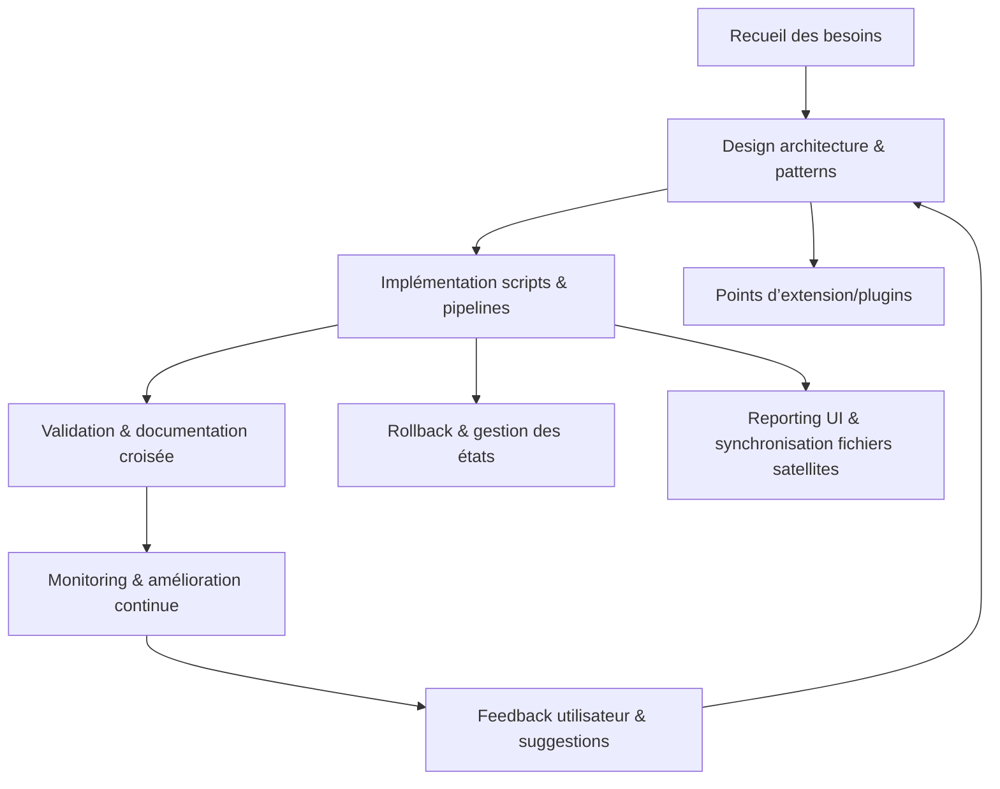

# Plan de Développement v113 — Automatisation documentaire Roo Code

> **Version** : v113  
> **Contexte** : Automatisation avancée de la documentation Roo Code, intégrant patterns de session, pipeline, batch, fallback, cache, audit, monitoring, rollback, UX metrics, progressive sync, pooling, reporting UI.  
> **Références** : [plandev-engineer-reference.md](../../../../.roo/rules/rules-plandev-engineer/plandev-engineer-reference.md), [AGENTS.md](../../../../AGENTS.md), [rules.md](../../../../.roo/rules/rules.md)

---

## Phase 1 : Recueil et analyse du besoin

- **Objectif** : Formaliser les attentes, contraintes et points d’intégration de l’automatisation documentaire Roo Code.
- **Livrables** : `besoins-automatisation-doc.yaml`, `analyse-ecart.md`
- **Dépendances** : Feedback utilisateur, documentation existante.
- **Risques** : Ambiguïté des besoins, dérive de périmètre, non-alignement avec les standards Roo.
- **Outils/Agents mobilisés** : Script Go, feedback utilisateur, DocManager.
- **Tâches** :
  - [ ] Générer le script Go `recensement_automatisation.go` pour scanner les besoins.
  - [ ] Exécuter `go run scripts/recensement_automatisation.go --output=besoins-automatisation-doc.yaml`
  - [ ] Valider la complétude via `go test scripts/recensement_automatisation_test.go`
  - [ ] Documenter la procédure dans `README.md`
  - [ ] Collecter le feedback utilisateur et ajuster le script si besoin
- **Commandes** :
  - `go run scripts/recensement_automatisation.go`
  - `go test scripts/recensement_automatisation_test.go`
- **Critères de validation** :
  - 100% de couverture test sur le parsing YAML
  - Rapport généré conforme au schéma
  - Revue croisée par un pair
- **Rollback** :
  - Sauvegarde automatique `besoins-automatisation-doc.yaml.bak`
  - Commit Git avant modification
- **Orchestration** :
  - Ajout du job dans `.github/workflows/ci.yml`
  - Monitoring automatisé du pipeline
- **Questions ouvertes, hypothèses & ambiguïtés** :
  - Hypothèse : Les besoins sont accessibles auprès des utilisateurs clés.
  - Question : Existe-t-il une source documentaire centralisée des besoins ?
  - Ambiguïté : Les besoins exprimés sont-ils stables ou sujets à évolution rapide ?
- **Auto-critique & raffinement** :
  - Limite : Le script ne détecte pas les besoins implicites non formulés.
  - Suggestion : Ajouter une étape d’analyse sémantique ou d’interview utilisateur.
  - Feedback : Intégrer un agent LLM pour détecter les incohérences ou manques.

---

## Phase 2 : Design de l’architecture d’automatisation

- **Objectif** : Définir l’architecture cible, les patterns avancés et les points d’intégration agents/managers Roo.
- **Livrables** : `architecture-automatisation-doc.md`, diagramme Mermaid, schéma d’intégration agents.
- **Dépendances** : Phase 1 validée, AGENTS.md, plandev-engineer-reference.md.
- **Risques** : Complexité excessive, oubli d’un pattern clé, non-alignement avec l’existant.
- **Outils/Agents mobilisés** : DocManager, ProcessManager, ErrorManager, MonitoringManager, SessionManager (pattern), plugins.
- **Tâches** :
  - [ ] Définir les patterns à intégrer : session, pipeline, batch, fallback, cache, audit, monitoring, rollback, UX metrics, progressive sync, pooling, reporting UI.
  - [ ] Rédiger le diagramme Mermaid de l’architecture cible.
  - [ ] Lister les agents/managers Roo impliqués et leurs interfaces.
  - [ ] Documenter les points d’extension/plugins.
  - [ ] Valider la cohérence avec AGENTS.md et la documentation centrale.
- **Commandes** :
  - N/A (documentation, modélisation)
- **Fichiers attendus** :
  - `architecture-automatisation-doc.md`
  - `diagramme-automatisation-doc.mmd`
- **Critères de validation** :
  - Diagramme Mermaid validé
  - Patterns explicitement décrits et justifiés
  - Alignement avec AGENTS.md
- **Rollback** :
  - Versionning du schéma et du diagramme
- **Orchestration** :
  - Synchronisation avec la roadmap via RoadmapManager
- **Questions ouvertes, hypothèses & ambiguïtés** :
  - Hypothèse : Tous les patterns sont pertinents pour Roo Code.
  - Question : Faut-il prioriser certains patterns selon la maturité du projet ?
- **Auto-critique & raffinement** :
  - Limite : Risque de sur-ingénierie.
  - Suggestion : Prévoir une revue d’architecture croisée.

---

## Phase 3 : Implémentation des scripts et pipelines d’automatisation

- **Objectif** : Développer les scripts Go et pipelines pour la génération, la synchronisation et le reporting documentaire.
- **Livrables** : `scripts/automatisation_doc/`, scripts Go, tests unitaires, pipelines CI/CD.
- **Dépendances** : Architecture validée, schémas de données.
- **Risques** : Bugs, dette technique, non-couverture des cas limites.
- **Outils/Agents mobilisés** : ScriptManager, ErrorManager, MonitoringManager, plugins.
- **Tâches** :
  - [ ] Générer les scripts Go pour chaque pattern (session, batch, fallback, etc.).
  - [ ] Implémenter le pipeline de synchronisation bidirectionnelle.
  - [ ] Ajouter la gestion du cache et du fallback.
  - [ ] Intégrer l’audit, le monitoring et la collecte de métriques UX.
  - [ ] Rédiger les tests unitaires et d’intégration.
  - [ ] Générer les rapports automatisés (reporting UI, corrections-report.md, fixes-applied.md).
- **Commandes** :
  - `go run scripts/automatisation_doc/sync.go`
  - `go test ./scripts/automatisation_doc/...`
- **Fichiers attendus** :
  - `scripts/automatisation_doc/`
  - `corrections-report.md`, `fixes-applied.md`, `checklist-actionnable.md`
- **Critères de validation** :
  - 100% de couverture test sur les scripts critiques
  - Synchronisation et reporting fonctionnels
  - Logs et métriques accessibles
- **Rollback** :
  - Scripts de rollback dédiés (`gen_rollback_report.go`)
  - Points de restauration intermédiaires
- **Orchestration** :
  - Intégration dans le pipeline CI/CD
  - Monitoring automatisé
- **Questions ouvertes, hypothèses & ambiguïtés** :
  - Hypothèse : Les scripts Go sont le standard pour Roo Code.
  - Question : Faut-il prévoir une compatibilité multi-langage ?
- **Auto-critique & raffinement** :
  - Limite : Complexité de maintenance si trop de scripts spécialisés.
  - Suggestion : Factoriser les patterns communs.

---

## Phase 4 : Validation, QA et documentation croisée

- **Objectif** : Valider l’ensemble, assurer la qualité, la traçabilité et la documentation.
- **Livrables** : `README.md`, guides utilisateurs, checklist QA, reporting final.
- **Dépendances** : Scripts et pipelines opérationnels.
- **Risques** : Oubli de cas limite, documentation incomplète, dérive de synchronisation.
- **Outils/Agents mobilisés** : MonitoringManager, DocManager, QA agents, feedback utilisateur.
- **Tâches** :
  - [ ] Exécuter la checklist QA Roo Code (voir ci-dessous).
  - [ ] Générer et valider la documentation utilisateur.
  - [ ] Vérifier la synchronisation des fichiers satellites (`corrections-report.md`, `fixes-applied.md`, `checklist-actionnable.md`).
  - [ ] Collecter le feedback utilisateur et ajuster la documentation.
  - [ ] Archiver les rapports et logs.
- **Commandes** :
  - `go run scripts/automatisation_doc/reporting.go`
- **Fichiers attendus** :
  - `README.md`, guides, rapports QA
- **Critères de validation** :
  - Checklist QA complétée
  - Documentation à jour et validée
  - Feedback utilisateur intégré
- **Rollback** :
  - Sauvegarde des versions précédentes de la documentation
- **Orchestration** :
  - Reporting automatisé dans le pipeline CI/CD
- **Questions ouvertes, hypothèses & ambiguïtés** :
  - Hypothèse : Les utilisateurs lisent la documentation générée.
  - Question : Faut-il prévoir une documentation interactive ?
- **Auto-critique & raffinement** :
  - Limite : Documentation potentiellement trop dense.
  - Suggestion : Ajouter des schémas et des exemples concrets.

---

## Phase 5 : Monitoring, amélioration continue et gestion des incidents

- **Objectif** : Assurer le monitoring, la gestion des incidents et l’amélioration continue du système documentaire automatisé.
- **Livrables** : Rapports de monitoring, logs d’incident, suggestions d’amélioration.
- **Dépendances** : Système en production.
- **Risques** : Incidents non détectés, dérive de synchronisation, feedback non traité.
- **Outils/Agents mobilisés** : MonitoringManager, ErrorManager, NotificationManagerImpl, feedback utilisateur.
- **Tâches** :
  - [ ] Mettre en place le monitoring continu (métriques, alertes, logs).
  - [ ] Gérer les incidents et générer les rapports associés.
  - [ ] Collecter et traiter le feedback utilisateur.
  - [ ] Proposer et documenter les axes d’amélioration continue.
  - [ ] Mettre à jour la roadmap et la documentation en fonction des retours.
- **Commandes** :
  - `go run scripts/automatisation_doc/monitoring.go`
- **Fichiers attendus** :
  - Rapports de monitoring, logs, suggestions d’amélioration
- **Critères de validation** :
  - Incidents tracés et résolus
  - Feedback utilisateur traité
  - Roadmap mise à jour
- **Rollback** :
  - Procédures de restauration en cas d’incident critique
- **Orchestration** :
  - Intégration avec NotificationManagerImpl pour alertes
- **Questions ouvertes, hypothèses & ambiguïtés** :
  - Hypothèse : Les incidents sont remontés automatiquement.
  - Question : Faut-il prévoir un canal de feedback anonyme ?
- **Auto-critique & raffinement** :
  - Limite : Risque de surcharge d’alertes.
  - Suggestion : Mettre en place un système de priorisation des incidents.

---

## Diagramme Mermaid — Architecture d’automatisation documentaire Roo Code

---

## Checklist QA Roo Code (à compléter lors de la phase 4)

- [ ] Recensement initial des besoins automatisation documentaire
- [ ] Design architecture intégrant tous les patterns avancés requis
- [ ] Implémentation des scripts Go pour chaque pattern clé
- [ ] Pipeline de synchronisation bidirectionnelle opérationnel
- [ ] Gestion du cache, fallback, batch, session, audit, monitoring, UX metrics
- [ ] Génération automatisée des rapports et synchronisation des fichiers satellites
- [ ] Tests unitaires et d’intégration couvrant tous les cas critiques
- [ ] Documentation utilisateur et technique à jour
- [ ] Monitoring et alerting en production
- [ ] Gestion des incidents et reporting automatisé
- [ ] Feedback utilisateur collecté et traité
- [ ] Roadmap et documentation mises à jour en continu

---

## Notes & références croisées

- Ce plan s’appuie sur les standards Roo Code, la granularité documentaire, la traçabilité et l’intégration agents/managers Roo.
- Patterns avancés inspirés de : `ai_financial_coach_agent.py`, `orchestrator_agent.py`, `local_main.py`, `main.py`.
- Voir aussi : [AGENTS.md](../../../../AGENTS.md), [plandev-engineer-reference.md](../../../../.roo/rules/rules-plandev-engineer/plandev-engineer-reference.md), [rules.md](../../../../.roo/rules/rules.md), [workflows-matrix.md](../../../../.roo/rules/workflows-matrix.md)

---