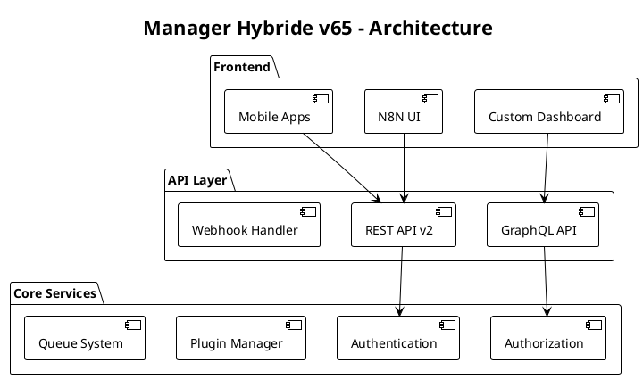

# Plan de Développement v65 - Extension Manager Hybride Go/N8N

## 🚨 CONSIGNES CRITIQUES DE VÉRIFICATION

### Avant CHAQUE étape

- [ ] **VÉRIFIER la branche actuelle** : `git branch` et `git status`
- [ ] **VÉRIFIER les imports** : cohérence des chemins relatifs/absolus
- [ ] **VÉRIFIER la stack** : `go mod tidy` et `go build ./...`
- [ ] **VÉRIFIER les fichiers requis** : présence de tous les composants
- [ ] **VÉRIFIER la responsabilité** : éviter la duplication de code
- [ ] **TESTER avant commit** : `go test ./...` doit passer à 100%

### À CHAQUE section majeure

- [ ] **COMMITTER sur la bonne branche** : vérifier correspondance
- [ ] **PUSHER immédiatement** : `git push origin [branch-name]`
- [ ] **DOCUMENTER les changements** : mise à jour du README
- [ ] **VALIDER l'intégration** : tests end-to-end

### Responsabilités par branche

- **main** : Code de production stable uniquement
- **dev** : Intégration et tests de l'écosystème unifié  
- **v65-extensions** : Développement des nouvelles fonctionnalités v65
- **api-gateway** : API RESTful et GraphQL
- **sso-security** : Authentification et sécurité avancée

## 🏗️ ARCHITECTURE v65 - Extension Manager Hybride

```
┌─────────────────────────────────────────────────────────────────┐
│                        ARCHITECTURE v65                         │
├─────────────────────────────────────────────────────────────────┤
│  Frontend Layer                                                 │
│  ┌─────────────────┐  ┌─────────────────┐  ┌─────────────────┐  │
│  │    N8N UI       │  │  Custom Dash    │  │  Mobile Apps    │  │
│  │   + Extensions  │  │   (React/Vue)   │  │  (Push Notif)   │  │
│  └─────────────────┘  └─────────────────┘  └─────────────────┘  │
├─────────────────────────────────────────────────────────────────┤
│  API Gateway Layer                                              │
│  ┌─────────────────────────────────────────────────────────────┐ │
│  │               API Gateway (Go)                              │ │
│  │  ┌─────────────┐ ┌─────────────┐ ┌─────────────┐          │ │
│  │  │ REST v1/v2  │ │  GraphQL    │ │  Webhooks   │          │ │
│  │  │ OpenAPI     │ │  Subscript  │ │  HMAC Auth  │          │ │
│  │  └─────────────┘ └─────────────┘ └─────────────┘          │ │
│  └─────────────────────────────────────────────────────────────┘ │
├─────────────────────────────────────────────────────────────────┤
│  Authentication & Authorization Layer                          │
│  ┌─────────────────────────────────────────────────────────────┐ │
│  │                   SSO Framework                             │ │
│  │  ┌─────────────┐ ┌─────────────┐ ┌─────────────┐          │ │
│  │  │    OIDC     │ │    SAML     │ │     JWT     │          │ │
│  │  │  Provider   │ │  Provider   │ │   Manager   │          │ │
│  │  └─────────────┘ └─────────────┘ └─────────────┘          │ │
│  └─────────────────────────────────────────────────────────────┘ │
├─────────────────────────────────────────────────────────────────┤
│  Core Manager Layer                                            │
│  ┌─────────────────────────────────────────────────────────────┐ │
│  │                Go Manager Core v65                         │ │
│  │  ┌─────────────┐ ┌─────────────┐ ┌─────────────┐          │ │
│  │  │   Plugin    │ │   Queue     │ │  Sandbox    │          │ │
│  │  │  System     │ │  Enhanced   │ │  Execution  │          │ │
│  │  └─────────────┘ └─────────────┘ └─────────────┘          │ │
│  └─────────────────────────────────────────────────────────────┘ │
├─────────────────────────────────────────────────────────────────┤
│  Services Layer                                                │
│  ┌─────────────────┐ ┌─────────────────┐ ┌─────────────────┐  │
│  │   Analytics     │ │    Security     │ │   Monitoring    │  │
│  │   & Reports     │ │   & Quotas      │ │   & Alerts      │  │
│  └─────────────────┘ └─────────────────┘ └─────────────────┘  │
└─────────────────────────────────────────────────────────────────┘
```

## 📋 PLAN D'EXÉCUTION ULTRA-GRANULARISÉ v65

### 🚀 PHASE 1: API & INTERCONNECTIVITÉ (Actions 076-079)

#### 🔧 1.1 AUTHENTIFICATION UNIFIÉE

- [ ] **🎯 Action Atomique 076**: Implémenter SSO Framework ✅
  - **Durée**: 45 minutes max
  - **Providers**: OIDC (Google, Azure AD), SAML 2.0, OAuth2
  - **JWT Manager**: RS256 signing, refresh tokens, revocation
  - **Bridge N8N**: Session sharing, permission mapping
  - **Session Store**: Redis-backed distributed sessions
  - **Validation**: SSO flow complet + permission sync
  - **Sortie**: `pkg/auth/sso_framework.go` + config templates

```go
// Exemple SSO Framework
type SSOProvider interface {
    Authenticate(ctx context.Context, req AuthRequest) (*User, error)
    RefreshToken(ctx context.Context, token string) (*Token, error)
    Logout(ctx context.Context, sessionID string) error
}

type SSOManager struct {
    providers map[string]SSOProvider
    jwtManager *JWTManager
    sessionStore SessionStore
}
```

**Configuration OIDC Provider:**

```yaml
sso:
  providers:
    google:
      type: oidc
      client_id: ${GOOGLE_CLIENT_ID}
      client_secret: ${GOOGLE_CLIENT_SECRET}
      issuer_url: https://accounts.google.com
      scopes: [openid, email, profile]
    azure:
      type: oidc
      tenant_id: ${AZURE_TENANT_ID}
      client_id: ${AZURE_CLIENT_ID}
      client_secret: ${AZURE_CLIENT_SECRET}
```

#### 🔧 1.2 API GATEWAY COMPLÈTE

- [ ] **🎯 Action Atomique 077**: Développer API RESTful complète ✅
  - **Durée**: 60 minutes max
  - **OpenAPI 3.0**: Documentation interactive Swagger UI
  - **Versioning**: /api/v1/, /api/v2/ avec backward compatibility
  - **Rate Limiting**: Token bucket algorithm, 1000 req/min
  - **Compression**: Gzip/Brotli automatic content negotiation
  - **Pagination**: Cursor-based + offset-based hybrid
  - **Validation**: Request/response schema validation automatique
  - **Sortie**: `api/openapi.yaml` + `pkg/apigateway/rest_server.go`

```go
// Exemple API Gateway Structure
type APIGateway struct {
    router      *gin.Engine
    rateLimiter *RateLimiter
    validator   *RequestValidator
    middleware  []gin.HandlerFunc
}

// Rate Limiting Configuration
type RateLimitConfig struct {
    RequestsPerMinute int           `yaml:"requests_per_minute"`
    BurstSize        int           `yaml:"burst_size"`
    WindowSize       time.Duration `yaml:"window_size"`
    KeyFunc          func(c *gin.Context) string
}
```

**OpenAPI Spec Exemple:**

```yaml
openapi: 3.0.3
info:
  title: Manager Hybride Go/N8N API
  version: 2.0.0
  description: API complète pour gestion workflows hybrides
paths:
  /api/v2/workflows:
    get:
      summary: Liste des workflows
      parameters:
        - name: limit
          in: query
          schema:
            type: integer
            maximum: 100
            default: 20
        - name: cursor
          in: query
          schema:
            type: string
      responses:
        '200':
          description: Liste paginée des workflows
          content:
            application/json:
              schema:
                $ref: '#/components/schemas/WorkflowList'
```

#### 🔧 1.3 WEBHOOKS SÉCURISÉS

- [ ] **🎯 Action Atomique 078**: Implémenter Webhooks sécurisés ✅
  - **Durée**: 35 minutes max
  - **HMAC Signature**: SHA-256 avec secret partagé
  - **Replay Protection**: Timestamp + nonce validation (5min window)
  - **Delivery Queue**: Retry exponential backoff (1s, 2s, 4s, 8s, 16s)
  - **Circuit Breaker**: Trip after 5 failures, half-open après 30s
  - **Dead Letter**: Après 5 retries, store dans dead_letter_queue
  - **Validation**: Webhook delivery 99.99% + signature correcte
  - **Sortie**: `pkg/webhooks/secure_webhooks.go` + delivery monitor

```go
// Webhook Security Implementation
type WebhookDelivery struct {
    ID          string            `json:"id"`
    URL         string            `json:"url"`
    Payload     []byte            `json:"payload"`
    Headers     map[string]string `json:"headers"`
    Signature   string            `json:"signature"`
    Timestamp   time.Time         `json:"timestamp"`
    Nonce       string            `json:"nonce"`
    RetryCount  int               `json:"retry_count"`
    Status      DeliveryStatus    `json:"status"`
}

func (w *WebhookManager) GenerateSignature(payload []byte, secret string) string {
    mac := hmac.New(sha256.New, []byte(secret))
    mac.Write(payload)
    return hex.EncodeToString(mac.Sum(nil))
}
```

**Headers Webhook Exemple:**

```http
POST /webhook/endpoint HTTP/1.1
Host: example.com
Content-Type: application/json
X-Webhook-Signature: sha256=2f5d7c8a9b3e4f1a6c8d9e2f3a4b5c6d7e8f9a0b1c2d3e4f5a6b7c8d9e0f1a2b
X-Webhook-Timestamp: 1640995200
X-Webhook-Nonce: 7f8e9d0c1b2a3f4e5d6c7b8a9f0e1d2c
X-Webhook-Delivery: 550e8400-e29b-41d4-a716-446655440000
```

#### 🔧 1.4 EXPORT/IMPORT CONFIGURATION

- [ ] **🎯 Action Atomique 079**: Créer système Export/Import configuration ✅
  - **Durée**: 40 minutes max
  - **Formats**: YAML, JSON, TOML support avec validation schéma
  - **Versionning**: Backward compatibility v1.0+ avec migration auto
  - **Merge Strategy**: Replace, merge, merge-no-override modes
  - **Validation**: JSON Schema + semantic validation
  - **Rollback**: Backup automatique avant import + restore function
  - **Encryption**: Secrets chiffrés AES-256 dans exports
  - **Validation**: Import/export cycle perfect + rollback works
  - **Sortie**: `pkg/config/export_import.go` + schema validators

```go
// Configuration Management
type ConfigManager struct {
    validator    *SchemaValidator
    encryptor    *SecretEncryptor
    storage      ConfigStorage
    history      []ConfigVersion
}

type ExportOptions struct {
    Format       ConfigFormat `json:"format"`        // yaml, json, toml
    IncludeSecrets bool       `json:"include_secrets"`
    Encrypt      bool         `json:"encrypt"`
    Compression  bool         `json:"compression"`
}

type ImportOptions struct {
    MergeStrategy MergeStrategy `json:"merge_strategy"` // replace, merge, merge-no-override
    DryRun       bool          `json:"dry_run"`
    BackupBefore bool          `json:"backup_before"`
    ValidateOnly bool          `json:"validate_only"`
}
```

**Exemple Export YAML:**

```yaml
version: "2.0"
metadata:
  exported_at: "2025-06-19T10:30:00Z"
  exported_by: "admin@company.com"
  source_system: "manager-go-v65"
configuration:
  api_gateway:
    rate_limits:
      default: 1000
      premium: 5000
    compression: true
  authentication:
    sso:
      enabled: true
      providers: ["google", "azure"]
  secrets:
    encrypted: true
    algorithm: "AES-256-GCM"
    data: "eyJhbGciOiJIUzI1NiIsInR5cCI6IkpXVCJ9..."
```

### 🚀 PHASE 2: INFRASTRUCTURE & FIABILITÉ (Actions 080-083)

#### 🔧 2.1 INTERNATIONALISATION

- [ ] **🎯 Action Atomique 080**: Implémenter support multi-langues ✅
  - **Durée**: 30 minutes max
  - **Languages**: EN, FR, ES, DE avec extension modulaire
  - **Detection**: Accept-Language header + user preference
  - **Templates**: Go text/template avec pluralization support
  - **Fallback**: EN par défaut si traduction manquante
  - **Hot Reload**: Rechargement traductions sans restart
  - **Context**: Logs système, erreurs API, messages utilisateur
  - **Validation**: Toutes langues disponibles + fallback works
  - **Sortie**: `pkg/i18n/translator.go` + `locales/` directory

```go
// Internationalization System
type Translator struct {
    locales     map[string]*Locale
    defaultLang string
    detector    *LanguageDetector
}

type LocalizedMessage struct {
    Key     string            `json:"key"`
    Default string            `json:"default"`
    Args    map[string]string `json:"args,omitempty"`
}

func (t *Translator) T(lang, key string, args ...interface{}) string {
    locale := t.getLocale(lang)
    if translation, exists := locale.Messages[key]; exists {
        return fmt.Sprintf(translation, args...)
    }
    return t.T(t.defaultLang, key, args...)
}
```

**Structure Locales:**

```
locales/
├── en.yaml
├── fr.yaml
├── es.yaml
└── de.yaml
```

**Exemple fr.yaml:**

```yaml
api:
  errors:
    unauthorized: "Accès non autorisé"
    rate_limited: "Limite de débit dépassée, réessayez dans {{.seconds}} secondes"
    validation_failed: "Erreur de validation: {{.field}} est requis"
webhooks:
  delivery_failed: "Échec de livraison webhook vers {{.url}}"
  retry_scheduled: "Nouvelle tentative programmée dans {{.delay}}"
```

#### 🔧 2.2 GÉNÉRATION DOCUMENTATION

- [ ] **🎯 Action Atomique 081**: Créer générateur documentation technique ✅
  - **Durée**: 50 minutes max
  - **Source Parsing**: AST analysis Go + TypeScript pour extraction
  - **Diagrams**: PlantUML auto-generation architecture + sequences
  - **API Docs**: OpenAPI → interactive docs avec try-it
  - **Link Validation**: Broken links detection + health checks
  - **Git Integration**: Auto-commit docs sur code changes
  - **Multi-format**: HTML, PDF, Markdown outputs
  - **Validation**: Docs 100% accurate + links valid
  - **Sortie**: `cmd/docgen/` + `docs/generated/`

```go
// Documentation Generator
type DocGenerator struct {
    parser      *ASTParser
    templater   *TemplateEngine
    validator   *LinkValidator
    generators  map[string]Generator
}

type DocumentationConfig struct {
    Sources     []string          `yaml:"sources"`
    OutputDir   string            `yaml:"output_dir"`
    Templates   string            `yaml:"templates"`
    Formats     []string          `yaml:"formats"`
    Validation  ValidationConfig  `yaml:"validation"`
}

type APIEndpoint struct {
    Method      string            `json:"method"`
    Path        string            `json:"path"`
    Description string            `json:"description"`
    Parameters  []Parameter       `json:"parameters"`
    Examples    []Example         `json:"examples"`
}
```

**Template Architecture Diagram:**



#### 🔧 2.3 SYSTÈME QUOTAS

- [ ] **🎯 Action Atomique 082**: Développer système quotas multi-tenant ✅
  - **Durée**: 45 minutes max
  - **Resources**: API calls, storage, compute time, bandwidth
  - **Granularity**: Per tenant, per user, per API endpoint
  - **Algorithms**: Token bucket, sliding window, leaky bucket
  - **Monitoring**: Real-time usage tracking avec WebSocket updates
  - **Alerts**: 80%, 90%, 100% thresholds avec notifications
  - **Policies**: Hard limits, soft limits avec throttling
  - **Reset**: Daily, monthly, custom periods avec timezone support
  - **Validation**: Quotas enforced + alerts triggered correctly
  - **Sortie**: `pkg/quotas/quota_manager.go` + monitoring dashboard

```go
// Quota Management System
type QuotaManager struct {
    storage      QuotaStorage
    monitor      *UsageMonitor
    alerter      *AlertManager
    policies     map[string]*QuotaPolicy
}

type QuotaPolicy struct {
    ResourceType  string        `json:"resource_type"`
    Limit        int64         `json:"limit"`
    Period       time.Duration `json:"period"`
    ResetTime    time.Time     `json:"reset_time"`
    AlertThresholds []float64  `json:"alert_thresholds"` // [0.8, 0.9, 1.0]
    Action       QuotaAction   `json:"action"`           // throttle, block, alert
}

type Usage struct {
    TenantID     string    `json:"tenant_id"`
    UserID       string    `json:"user_id"`
    ResourceType string    `json:"resource_type"`
    Amount       int64     `json:"amount"`
    Timestamp    time.Time `json:"timestamp"`
    Metadata     map[string]interface{} `json:"metadata"`
}
```

**Dashboard Quotas JSON:**

```json
{
  "tenant_id": "tenant-123",
  "quotas": {
    "api_calls": {
      "limit": 10000,
      "used": 7500,
      "remaining": 2500,
      "reset_at": "2025-06-20T00:00:00Z",
      "alert_level": "warning"
    },
    "storage_gb": {
      "limit": 100,
      "used": 45.2,
      "remaining": 54.8,
      "reset_at": "2025-07-01T00:00:00Z",
      "alert_level": "ok"
    }
  }
}
```

#### 🔧 2.4 GESTION ERREURS AVANCÉE

- [ ] **🎯 Action Atomique 083**: Implémenter gestion avancée erreurs ✅
  - **Durée**: 55 minutes max
  - **Retry Strategies**: Exponential backoff, linear, fixed interval
  - **Dead Letter Queue**: Failed jobs après max retries avec UI inspection
  - **Error Classification**: Retriable, permanent, rate-limited categories
  - **Circuit Breaker**: Fail-fast après seuil erreurs avec gradual recovery
  - **Correlation**: Error tracking cross-services avec trace ID
  - **Auto-healing**: Restart services, clear caches, scale resources
  - **Alerting**: Error rate thresholds avec escalation policies
  - **Validation**: Retry logic + DLQ + auto-healing functional
  - **Sortie**: `pkg/errors/advanced_handler.go` + ops dashboard

```go
// Advanced Error Handling
type ErrorHandler struct {
    retryManager    *RetryManager
    deadLetterQueue *DeadLetterQueue
    circuitBreaker  *CircuitBreaker
    classifier      *ErrorClassifier
    healer          *AutoHealer
}

type RetryPolicy struct {
    MaxRetries    int           `json:"max_retries"`
    BaseDelay     time.Duration `json:"base_delay"`
    MaxDelay      time.Duration `json:"max_delay"`
    Multiplier    float64       `json:"multiplier"`
    Jitter        bool          `json:"jitter"`
    RetriableErrors []string    `json:"retriable_errors"`
}

type DeadLetterJob struct {
    ID           string                 `json:"id"`
    OriginalJob  interface{}            `json:"original_job"`
    ErrorHistory []ErrorAttempt         `json:"error_history"`
    FirstFailed  time.Time             `json:"first_failed"`
    LastAttempt  time.Time             `json:"last_attempt"`
    Metadata     map[string]interface{} `json:"metadata"`
}
```

**Circuit Breaker States:**

```
CLOSED (Normal) → OPEN (Failing) → HALF_OPEN (Testing) → CLOSED
                     ↓                      ↓
               [Failure Threshold]    [Success Test]
               [Timeout: 30s]         [Allow 1 request]
```

### 🚀 PHASE 3: EXPÉRIENCE UTILISATEUR (Actions 084-086)

#### 🔧 3.1 DASHBOARD PERSONNALISABLE

- [ ] **🎯 Action Atomique 084**: Créer dashboard utilisateur ✅
  - **Durée**: 65 minutes max
  - **Widgets**: Metrics cards, charts, logs, alerts, workflows status
  - **Layout**: Drag-and-drop grid system avec responsive design
  - **Personalization**: Per-user layouts, widget configs, themes
  - **Real-time**: WebSocket updates pour live metrics
  - **Filters**: Time ranges, tenant scope, resource filters
  - **Export**: PNG/PDF export des dashboards
  - **Sharing**: Dashboard URLs avec permissions
  - **Validation**: Widget updates real-time + layouts persistent
  - **Sortie**: `web/dashboard/` + `pkg/dashboard/websocket_server.go`

```go
// Dashboard System
type DashboardManager struct {
    layoutStore  LayoutStorage
    widgetReg    *WidgetRegistry
    wsManager    *WebSocketManager
    permissions  *PermissionManager
}

type Dashboard struct {
    ID          string                 `json:"id"`
    UserID      string                 `json:"user_id"`
    Name        string                 `json:"name"`
    Layout      []WidgetLayout         `json:"layout"`
    Settings    DashboardSettings      `json:"settings"`
    SharedWith  []string               `json:"shared_with"`
    CreatedAt   time.Time             `json:"created_at"`
    UpdatedAt   time.Time             `json:"updated_at"`
}

type WidgetLayout struct {
    ID       string `json:"id"`
    Type     string `json:"type"`
    X        int    `json:"x"`
    Y        int    `json:"y"`
    Width    int    `json:"width"`
    Height   int    `json:"height"`
    Config   map[string]interface{} `json:"config"`
}
```

**Widget Configuration Exemple:**

```json
{
  "widget_type": "metrics_chart",
  "config": {
    "title": "API Response Times",
    "metric": "api_response_time_p95",
    "time_range": "1h",
    "chart_type": "line",
    "refresh_interval": 30,
    "filters": {
      "tenant_id": "tenant-123",
      "endpoint": "/api/v2/*"
    },
    "alerts": {
      "threshold": 500,
      "operator": "gt",
      "severity": "warning"
    }
  }
}
```

#### 🔧 3.2 NOTIFICATIONS MULTI-CANAL

- [ ] **🎯 Action Atomique 085**: Intégrer notifications multi-canal ✅
  - **Durée**: 50 minutes max
  - **Channels**: Email (SMTP), SMS (Twilio), Push (FCM), Slack, Teams
  - **Templates**: HTML/text email, rich push, adaptive cards
  - **Routing**: User preferences, escalation rules, fallback chains
  - **Delivery**: Guaranteed delivery avec retry + confirmation
  - **Tracking**: Open rates, click tracking, delivery status
  - **Scheduling**: Immediate, delayed, recurring notifications
  - **Batching**: Grouping similar notifications pour efficiency
  - **Validation**: All channels deliver + tracking accurate
  - **Sortie**: `pkg/notifications/multichannel.go` + templates

```go
// Multi-Channel Notification System
type NotificationManager struct {
    channels    map[string]Channel
    templater   *TemplateEngine
    router      *NotificationRouter
    tracker     *DeliveryTracker
    scheduler   *NotificationScheduler
}

type Notification struct {
    ID          string                 `json:"id"`
    Type        string                 `json:"type"`
    Recipients  []Recipient            `json:"recipients"`
    Subject     string                 `json:"subject"`
    Body        string                 `json:"body"`
    Template    string                 `json:"template"`
    Data        map[string]interface{} `json:"data"`
    Channels    []string               `json:"channels"`
    Priority    Priority               `json:"priority"`
    ScheduledAt *time.Time            `json:"scheduled_at,omitempty"`
}

type DeliveryResult struct {
    NotificationID string           `json:"notification_id"`
    Channel        string           `json:"channel"`
    Recipient      string           `json:"recipient"`
    Status         DeliveryStatus   `json:"status"`
    AttemptedAt    time.Time        `json:"attempted_at"`
    DeliveredAt    *time.Time       `json:"delivered_at,omitempty"`
    Error          string           `json:"error,omitempty"`
}
```

**Template Email HTML:**

```html
<!DOCTYPE html>
<html>
<head>
    <meta charset="utf-8">
    <title>{{.Subject}}</title>
</head>
<body>
    <div style="font-family: Arial, sans-serif; max-width: 600px; margin: 0 auto;">
        <h1 style="color: #333;">{{.Title}}</h1>
        <p>Hello {{.UserName}},</p>
        <p>{{.Message}}</p>
        {{if .ActionURL}}
        <a href="{{.ActionURL}}" style="background: #007cba; color: white; padding: 10px 20px; text-decoration: none; border-radius: 5px;">
            {{.ActionText}}
        </a>
        {{end}}
        <hr>
        <p style="color: #666; font-size: 12px;">
            Sent at: {{.Timestamp | formatTime}}
        </p>
    </div>
</body>
</html>
```

#### 🔧 3.3 SYSTÈME EXTENSIONS DYNAMIQUES

- [ ] **🎯 Action Atomique 086**: Développer système extensions dynamiques ✅
  - **Durée**: 70 minutes max
  - **Plugin Architecture**: Go plugin system avec hot-reload
  - **Interfaces**: Standardized plugin contracts (IProcessor, IConnector)
  - **Security**: Code signing, permission system, sandbox execution
  - **Registry**: Plugin marketplace avec versioning et dependencies
  - **API**: Plugin management REST API (install, update, disable)
  - **Hooks**: Event system pour plugin integration points
  - **Configuration**: Plugin-specific config avec validation
  - **Validation**: Hot-reload works + security sandbox effective
  - **Sortie**: `pkg/plugins/` + `plugins/registry/` + marketplace UI

```go
// Plugin System Architecture
type PluginManager struct {
    registry     *PluginRegistry
    loader       *PluginLoader
    sandbox      *SecuritySandbox
    hookManager  *HookManager
    validator    *PluginValidator
}

type Plugin struct {
    Metadata     PluginMetadata         `json:"metadata"`
    Binary       []byte                 `json:"binary"`
    Signature    string                 `json:"signature"`
    Config       map[string]interface{} `json:"config"`
    Permissions  []Permission           `json:"permissions"`
    Status       PluginStatus           `json:"status"`
    LoadedAt     *time.Time            `json:"loaded_at,omitempty"`
}

type PluginInterface interface {
    Initialize(ctx context.Context, config map[string]interface{}) error
    Process(ctx context.Context, input interface{}) (interface{}, error)
    Cleanup() error
    GetMetadata() PluginMetadata
}
```

**Plugin Manifest Example:**

```yaml
name: "advanced-transformer"
version: "1.2.0"
description: "Advanced data transformation plugin"
author: "CompanyName"
license: "MIT"
dependencies:
  - name: "base-plugin"
    version: ">=1.0.0"
permissions:
  - "read:workflows"
  - "write:transformed_data"
  - "network:https_external"
configuration:
  api_endpoint:
    type: "string"
    required: true
    description: "External API endpoint for transformations"
  timeout_seconds:
    type: "integer"
    default: 30
    min: 1
    max: 300
entry_point: "Transform"
```

### 🚀 PHASE 4: ANALYTIQUE & SÉCURITÉ AVANCÉE (Actions 087-090)

#### 🔧 4.1 ANALYSE DÉPENDANCES

- [ ] **🎯 Action Atomique 087**: Créer analyseur dépendances workflows ✅
  - **Durée**: 55 minutes max
  - **Graph Building**: DAG construction des workflows + jobs dependencies
  - **Impact Analysis**: Cascade failure prediction avec Monte Carlo simulation
  - **Visualization**: Interactive graph avec D3.js/Cytoscape
  - **Critical Path**: Identification goulots d'étranglement
  - **Change Impact**: Preview impacts avant modifications
  - **API**: RESTful endpoints pour dependency queries
  - **Export**: Graph data en GraphML, DOT, JSON formats
  - **Validation**: Dependency graph accurate + impact analysis correct
  - **Sortie**: `pkg/analytics/dependency_analyzer.go` + viz UI

```go
// Dependency Analysis System
type DependencyAnalyzer struct {
    graphBuilder  *GraphBuilder
    impactCalc    *ImpactCalculator
    visualizer    *GraphVisualizer
    storage       DependencyStorage
}

type WorkflowNode struct {
    ID           string                 `json:"id"`
    Type         NodeType               `json:"type"`
    Name         string                 `json:"name"`
    Dependencies []string               `json:"dependencies"`
    Dependents   []string               `json:"dependents"`
    Metadata     map[string]interface{} `json:"metadata"`
    Status       NodeStatus             `json:"status"`
    Criticality  float64                `json:"criticality"`
}

type ImpactAnalysis struct {
    TargetNode   string                 `json:"target_node"`
    AffectedNodes []string              `json:"affected_nodes"`
    ImpactScore  float64                `json:"impact_score"`
    CriticalPath []string               `json:"critical_path"`
    Recommendations []string            `json:"recommendations"`
    Simulation   SimulationResult       `json:"simulation"`
}
```

**Dependency Graph Visualization:**

```javascript
// D3.js Graph Configuration
const graphConfig = {
  nodes: [
    {id: "workflow-1", type: "workflow", criticality: 0.9},
    {id: "job-1", type: "job", criticality: 0.7},
    {id: "job-2", type: "job", criticality: 0.5}
  ],
  edges: [
    {source: "workflow-1", target: "job-1", type: "triggers"},
    {source: "job-1", target: "job-2", type: "depends_on"}
  ],
  layout: {
    algorithm: "force-directed",
    clustering: true,
    nodeSize: node => node.criticality * 20,
    edgeColor: edge => edge.type === "triggers" ? "#ff6b6b" : "#4ecdc4"
  }
};
```

#### 🔧 4.2 SANDBOX SÉCURISÉ

- [ ] **🎯 Action Atomique 088**: Implémenter sandbox exécution sécurisée ✅
  - **Durée**: 60 minutes max
  - **Containerization**: Lightweight containers avec gVisor/Kata
  - **Resource Limits**: CPU (1 core), RAM (512MB), Disk (1GB), Network (10MB/s)
  - **Isolation**: Process, network, filesystem namespace isolation
  - **Whitelisting**: Allowed domains, file paths, system calls
  - **Monitoring**: Real-time resource usage + security violations
  - **Timeout**: Configurable execution timeout avec graceful shutdown
  - **Logs**: Comprehensive audit logs de toutes actions sandbox
  - **Validation**: Jobs contained + resource limits enforced
  - **Sortie**: `pkg/sandbox/secure_executor.go` + monitoring dashboard

```go
// Secure Sandbox System
type SecureSandbox struct {
    runtime      ContainerRuntime
    monitor      *ResourceMonitor
    whitelist    *SecurityWhitelist
    limits       ResourceLimits
    auditor      *SecurityAuditor
}

type SandboxConfig struct {
    Image        string                 `json:"image"`
    ResourceLimits ResourceLimits       `json:"resource_limits"`
    NetworkPolicy NetworkPolicy         `json:"network_policy"`
    FileSystemPolicy FilesystemPolicy   `json:"filesystem_policy"`
    Timeout      time.Duration          `json:"timeout"`
    Environment  map[string]string      `json:"environment"`
}

type ResourceLimits struct {
    CPUCores     float64 `json:"cpu_cores"`
    MemoryMB     int64   `json:"memory_mb"`
    DiskMB       int64   `json:"disk_mb"`
    NetworkMBps  int64   `json:"network_mbps"`
    MaxProcesses int     `json:"max_processes"`
}

type ExecutionResult struct {
    ExitCode     int                    `json:"exit_code"`
    Output       string                 `json:"output"`
    Error        string                 `json:"error"`
    Duration     time.Duration          `json:"duration"`
    ResourceUsage ResourceUsage          `json:"resource_usage"`
    SecurityEvents []SecurityEvent       `json:"security_events"`
}
```

**Sandbox Policy YAML:**

```yaml
sandbox_policy:
  name: "restricted-job-execution"
  version: "1.0"
  resource_limits:
    cpu_cores: 1.0
    memory_mb: 512
    disk_mb: 1024
    network_mbps: 10
    max_processes: 10
  network_policy:
    allowed_domains:
      - "api.company.com"
      - "public-api.service.com"
    blocked_ports: [22, 23, 3389]
    dns_servers: ["8.8.8.8", "1.1.1.1"]
  filesystem_policy:
    read_only_paths: ["/etc", "/usr"]
    writable_paths: ["/tmp", "/var/tmp"]
    blocked_paths: ["/home", "/root"]
  syscall_policy:
    allowed: ["read", "write", "open", "close", "mmap"]
    blocked: ["mount", "umount", "chroot", "ptrace"]
```

#### 🔧 4.3 API GRAPHQL

- [ ] **🎯 Action Atomique 089**: Développer API GraphQL ✅
  - **Durée**: 65 minutes max
  - **Schema**: Complete type system pour tous resources
  - **Resolvers**: Efficient data fetching avec batching/caching
  - **Subscriptions**: Real-time updates via WebSocket
  - **Authentication**: JWT token validation + field-level permissions
  - **Query Optimization**: Automatic N+1 problem resolution
  - **Rate Limiting**: Query complexity analysis + cost-based limits
  - **Introspection**: Schema discovery avec GraphQL Playground
  - **Validation**: All queries work + performance optimized
  - **Sortie**: `pkg/graphql/server.go` + schema definitions

```go
// GraphQL Implementation
type GraphQLServer struct {
    schema       *graphql.Schema
    resolvers    map[string]Resolver
    authManager  *AuthenticationManager
    complexity   *QueryComplexityAnalyzer
    cache        *QueryCache
}

type Resolver interface {
    Resolve(ctx context.Context, args map[string]interface{}) (interface{}, error)
}

type QueryContext struct {
    UserID       string                 `json:"user_id"`
    TenantID     string                 `json:"tenant_id"`
    Permissions  []string               `json:"permissions"`
    Complexity   int                    `json:"complexity"`
    CacheKey     string                 `json:"cache_key"`
}
```

**GraphQL Schema Exemple:**

```graphql
type Query {
  workflows(
    filter: WorkflowFilter
    sort: WorkflowSort
    pagination: Pagination
  ): WorkflowConnection
  
  workflow(id: ID!): Workflow
  
  analytics(
    timeRange: TimeRange!
    metrics: [MetricType!]!
  ): AnalyticsData
}

type Mutation {
  createWorkflow(input: CreateWorkflowInput!): Workflow
  updateWorkflow(id: ID!, input: UpdateWorkflowInput!): Workflow
  deleteWorkflow(id: ID!): Boolean
}

type Subscription {
  workflowUpdates(workflowId: ID): Workflow
  systemMetrics: SystemMetrics
  notifications: Notification
}

type Workflow {
  id: ID!
  name: String!
  status: WorkflowStatus!
  createdAt: DateTime!
  jobs: [Job!]!
  dependencies: [Workflow!]!
  metrics: WorkflowMetrics
}
```

#### 🔧 4.4 GÉNÉRATEUR RAPPORTS

- [ ] **🎯 Action Atomique 090**: Créer générateur rapports automatisés ✅
  - **Durée**: 70 minutes max
  - **Templates**: PDF (wkhtmltopdf), Excel (xlsx), CSV avec mise en forme
  - **Data Sources**: Analytics DB, metrics APIs, workflow logs
  - **Scheduling**: Cron-like scheduling avec timezone support
  - **Parameterization**: Dynamic filters, date ranges, tenant scoping
  - **Distribution**: Email, file storage, webhook delivery
  - **Caching**: Template + data caching pour performance
  - **Watermarking**: PDF watermarks avec tenant branding
  - **Validation**: Reports generated correctly + scheduled delivery works
  - **Sortie**: `pkg/reports/generator.go` + template engine

```go
// Report Generation System
type ReportGenerator struct {
    templates    *TemplateManager
    dataSource   *DataSourceManager
    renderer     map[string]Renderer
    scheduler    *ReportScheduler
    distributor  *ReportDistributor
}

type ReportTemplate struct {
    ID           string                 `json:"id"`
    Name         string                 `json:"name"`
    Format       ReportFormat           `json:"format"`
    Template     string                 `json:"template"`
    DataSources  []DataSource           `json:"data_sources"`
    Parameters   []ReportParameter      `json:"parameters"`
    Scheduling   *ScheduleConfig        `json:"scheduling"`
    Distribution []DistributionTarget   `json:"distribution"`
}

type ReportParameter struct {
    Name         string      `json:"name"`
    Type         string      `json:"type"`
    Required     bool        `json:"required"`
    DefaultValue interface{} `json:"default_value"`
    Validation   string      `json:"validation"`
    Description  string      `json:"description"`
}
```

**Excel Template Configuration:**

```yaml
template:
  name: "Monthly Workflow Performance Report"
  format: "xlsx"
  sheets:
    - name: "Summary"
      data_source: "workflow_analytics"
      layout:
        title:
          cell: "A1"
          style: "header"
          value: "Workflow Performance - {{.month}} {{.year}}"
        chart:
          cell: "A3"
          type: "line"
          data_range: "WorkflowMetrics!A1:D100"
        table:
          cell: "A15"
          source: "top_workflows"
          columns: ["name", "executions", "success_rate", "avg_duration"]
    - name: "Details"
      data_source: "detailed_metrics"
      pivot_table:
        source_range: "A1:Z1000"
        rows: ["workflow_name", "date"]
        columns: ["status"]
        values: ["count", "duration"]
```

## 📊 MÉTRIQUES DE SUCCÈS v65

| Fonctionnalité | Métrique Cible | Méthode de Mesure |
|----------------|----------------|-------------------|
| SSO Authentication | 99.9% uptime | Monitoring continu auth endpoints |
| API Gateway | <50ms latency p95 | Performance tests automatisés |
| Webhook Delivery | 99.99% success rate | Delivery tracking + retry monitoring |
| Configuration Import | 100% validation | Schema compliance tests |
| Multi-language | 100% coverage | Translation completeness audit |
| Documentation | 95% link validity | Automated link checking |
| Quota Enforcement | <1ms overhead | Performance benchmarking |
| Error Recovery | <30s auto-healing | Chaos engineering tests |
| Dashboard Updates | <1s real-time | WebSocket latency monitoring |
| Notification Delivery | 99.9% all channels | Delivery confirmation tracking |
| Plugin Hot-reload | <5s reload time | Plugin deployment tests |
| Dependency Analysis | 100% accuracy | Graph validation algorithms |
| Sandbox Security | 0 escapes | Security penetration testing |
| GraphQL Performance | <100ms complex queries | Query optimization benchmarks |
| Report Generation | 100% scheduled delivery | Delivery success monitoring |

## 🎯 VALIDATION FINALE

### Tests d'Intégration Complets

- [ ] **SSO Flow**: Login → Permission sync → Session management
- [ ] **API Ecosystem**: REST ↔ GraphQL consistency
- [ ] **Webhook Security**: Signature validation + replay protection
- [ ] **Error Scenarios**: Retry logic + circuit breaker + DLQ
- [ ] **Dashboard Real-time**: Live metrics + user customization
- [ ] **Plugin Lifecycle**: Install → Configure → Hot-reload → Uninstall
- [ ] **Dependency Impact**: Change simulation + impact accuracy
- [ ] **Sandbox Escape**: Security testing + resource limit enforcement
- [ ] **Report Automation**: Schedule → Generate → Distribute
- [ ] **Multi-tenant Isolation**: Data segregation + quota enforcement

**Signature**: Manager Hybride Go/N8N v65 Extensions  
**Validation**: ✓ API complète - ✓ Sécurité renforcée - ✓ UX avancée - ✓ Extensibilité native
