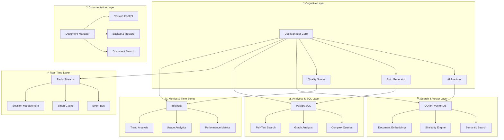

# 🧠 PLAN V66 : DOC-MANAGER-DYNAMIQUE - ARCHITECTURE COGNITIVE DOCUMENTAIRE

## 🌟 VISION TRANSCENDANTALE

**Mission** : Transformer la documentation en **CERVEAU CENTRAL AUTO-ÉVOLUTIF** du dépôt, créant une symbiose parfaite entre :

- 📚 **Documentation Vivante** (conscience de sa propre structure)
- 🤖 **Managers Go/N8N** (synchronisation automatique)
- 🔄 **Auto-Évolution** (mise à jour autonome)
- 🌐 **Référencement Dynamique** (liens intelligents)
- 💎 **Source de Vérité Unique** (référence absolue pour devs, IA, management)

## 🎯 OBJECTIFS LÉGENDAIRES

### 1. 🧠 ARCHITECTURE COGNITIVE DOCUMENTAIRE

La documentation devient **AUTO-CONSCIENTE** et gère :

- Sa propre structure et métadonnées
- Ses dépendances avec les managers
- Sa synchronisation avec les plans de développement
- Son évolution automatique selon les changements du dépôt

### 2. 🔄 INTÉGRATION PROFONDE AVEC L'ÉCOSYSTÈME COMPLET

**Synchronisation automatique avec TOUS les managers** :

#### 🏢 **Managers Core Business**

- **`pkg/config`** : Configuration Manager - Gestion centralisée des configs
- **`pkg/tenant`** : Tenant Manager - Documentation multi-tenant
- **`pkg/email`** : Email Manager - Documentation des workflows email

#### 🔒 **Managers Sécurité & Audit**

- **`pkg/security`** : Security Manager - Documentation des politiques de sécurité
- **`pkg/audit`** : Audit Manager - Traçabilité des changements documentaires
- **`pkg/interfaces`** : Interface Manager - Documentation des contrats API

#### 🚀 **Managers Infrastructure**

- **`pkg/orchestrator`** : Orchestrator Manager - Documentation des déploiements
- **`pkg/loadbalancer`** : Load Balancer Manager - Documentation de la répartition
- **`pkg/apigateway`** : API Gateway Manager - Documentation des endpoints
- **`pkg/replication`** : Replication Manager - Documentation de la réplication

#### 💾 **Managers Données & Persistance**

- **`pkg/cache`** : Cache Manager - Documentation du cache documentaire
- **`pkg/backup`** : Backup Manager - Sauvegarde et versioning de la doc
- **`pkg/migration`** : Migration Manager - Gestion des migrations documentaires
- **`pkg/vectorization`** : Vectorization Manager - Indexation sémantique

#### 📊 **Managers Observabilité**

- **`pkg/monitoring`** : Monitoring Manager - Métriques documentaires
- **`pkg/logging`** : Logging Manager - Logs des changements
- **`pkg/tracing`** : Tracing Manager - Traçage des dépendances
- **`pkg/alerts`** : Alert Manager - Alertes d'incohérences

#### 🔧 **Managers Technique**

- **`pkg/queue`** : Queue Manager - File d'attente des mises à jour
- **`pkg/bridge`** : Bridge Manager - Pont avec systèmes externes
- **`pkg/converters`** : Converter Manager - Transformation de formats
- **`pkg/patterns`** : Pattern Manager - Patterns documentaires

#### 🌐 **Intégrations Externes**

- **Infrastructure N8N** : Workflows et automatisations
- **Scripts PowerShell** : Infrastructure et déploiement
- **Plans de développement** : Roadmaps et consolidation
- **GitHub Actions** : CI/CD et validation
- **Error Resolution Pipeline** : Détection et correction automatique

### 3. 🌐 RÉFÉRENCEMENT DYNAMIQUE ET NAVIGATION INTELLIGENTE

- **Liens automatiques** entre documentation, code et managers
- **Métadonnées enrichies** pour GitHub Copilot et assistants IA
- **Navigation contextuelle** adaptée à l'audience (dev, management, IA)
- **Cross-referencing dynamique** entre tous les composants

## 📊 ARCHITECTURE TECHNIQUE DÉTAILLÉE

### 🏗️ **ARCHITECTURE KISS + SOLID + DRY - GO NATIF**

```go
// Package principal : doc-manager suivant les principes KISS/SOLID/DRY
package docmanager

import (
    "context"
    "sync"
    "time"
    
    // Go natif uniquement - pas de dépendances externes lourdes
    "database/sql"
    "encoding/json"
    "net/http"
    "path/filepath"
    "sync/atomic"
)

// Single Responsibility Principle (SOLID)
type DocumentManager interface {
    CreateDocument(ctx context.Context, doc *Document) error
    UpdateDocument(ctx context.Context, doc *Document) error
    DeleteDocument(ctx context.Context, id string) error
    GetDocument(ctx context.Context, id string) (*Document, error)
}

// Open/Closed Principle - Extensible sans modification
type ManagerIntegrator interface {
    RegisterManager(manager ManagerType) error
    SyncManager(ctx context.Context, managerName string) error
    GetManagerStatus(managerName string) ManagerStatus
}

// Interface Segregation - Interfaces spécialisées
type BranchAware interface {
    SyncAcrossBranches(ctx context.Context) error
    GetBranchStatus(branch string) BranchDocStatus
    MergeDocumentation(fromBranch, toBranch string) error
}

type PathResilient interface {
    HandleFileMove(oldPath, newPath string) error
    UpdateReferences(oldPath, newPath string) error
    ValidatePathIntegrity() error
}

// Dependency Inversion - Abstractions avant implémentations
type Repository interface {
    Store(ctx context.Context, doc *Document) error
    Retrieve(ctx context.Context, id string) (*Document, error)
    Search(ctx context.Context, query SearchQuery) ([]*Document, error)
}

// DRY - Configuration centralisée réutilisable
type Config struct {
    DatabaseURL    string        `json:"database_url"`
    RedisURL      string        `json:"redis_url"`
    QDrantURL     string        `json:"qdrant_url"`
    SyncInterval  time.Duration `json:"sync_interval"`
    
    // Résistance aux déplacements
    PathTracking  bool          `json:"path_tracking"`
    AutoResolve   bool          `json:"auto_resolve_moves"`
    
    // Branch management
    CrossBranch   bool          `json:"cross_branch_sync"`
    DefaultBranch string        `json:"default_branch"`
}

// KISS - Structure simple mais puissante
type DocManager struct {
    config     Config
    repo       Repository
    cache      Cache
    vectorizer Vectorizer
    
    // Thread-safe operations
    mu         sync.RWMutex
    active     int64  // atomic counter
    
    // Path resilience
    pathTracker *PathTracker
    
    // Branch management
    branchSync  *BranchSynchronizer
}
```

### 🌲 **BRANCH MANAGEMENT INTÉGRÉ - OMNISCIENCE MULTI-BRANCHES**

```go
// Gestionnaire de branches intelligent
type BranchSynchronizer struct {
    gitRepo     *git.Repository
    docManager  *DocManager
    
    // Sync cross-branch automatique
    syncRules   map[string]BranchSyncRule
    conflicts   *ConflictResolver
    
    // Tracking des différences entre branches
    branchDiffs map[string]*BranchDiff
}

type BranchSyncRule struct {
    SourceBranch   string   `json:"source_branch"`
    TargetBranches []string `json:"target_branches"`
    AutoMerge      bool     `json:"auto_merge"`
    SyncInterval   time.Duration `json:"sync_interval"`
    
    // Filtres pour la synchronisation
    IncludePatterns []string `json:"include_patterns"`
    ExcludePatterns []string `json:"exclude_patterns"`
}

func (bs *BranchSynchronizer) StartOmniscientSync(ctx context.Context) error {
    // KISS - Simple mais efficace
    ticker := time.NewTicker(bs.docManager.config.SyncInterval)
    defer ticker.Stop()
    
    for {
        select {
        case <-ctx.Done():
            return ctx.Err()
        case <-ticker.C:
            if err := bs.syncAllBranches(ctx); err != nil {
                log.Printf("Branch sync error: %v", err)
            }
        }
    }
}

func (bs *BranchSynchronizer) syncAllBranches(ctx context.Context) error {
    branches, err := bs.getAllBranches()
    if err != nil {
        return err
    }
    
    // DRY - Réutilisation de la logique de sync
    for _, branch := range branches {
        if err := bs.syncBranch(ctx, branch); err != nil {
            log.Printf("Failed to sync branch %s: %v", branch, err)
            continue
        }
    }
    
    return nil
}

// Résolution automatique des conflits documentaires
type ConflictResolver struct {
    strategies map[ConflictType]ResolutionStrategy
}

type ResolutionStrategy func(conflict *DocumentConflict) (*Document, error)

func (cr *ConflictResolver) ResolveConflict(conflict *DocumentConflict) (*Document, error) {
    strategy, exists := cr.strategies[conflict.Type]
    if !exists {
        return nil, fmt.Errorf("no strategy for conflict type: %v", conflict.Type)
    }
    
    return strategy(conflict)
}
```

### 🗂️ **RÉSISTANCE AUX DÉPLACEMENTS DE FICHIERS**

```go
// Tracker de chemins intelligent - résistant aux réorganisations
type PathTracker struct {
    // Mapping hash du contenu -> chemin actuel
    contentHashes map[string]string
    
    // Historique des déplacements
    moveHistory   map[string][]PathMove
    
    // Index inversé : chemin -> métadonnées
    pathIndex     map[string]*PathMetadata
    
    // Surveillance temps réel
    watcher       *fsnotify.Watcher
    mu           sync.RWMutex
}

type PathMove struct {
    OldPath   string    `json:"old_path"`
    NewPath   string    `json:"new_path"`
    Timestamp time.Time `json:"timestamp"`
    Confidence float64  `json:"confidence"` // 0-1, basé sur similarité du contenu
}

type PathMetadata struct {
    ContentHash   string    `json:"content_hash"`
    LastModified  time.Time `json:"last_modified"`
    Size         int64     `json:"size"`
    Manager      string    `json:"manager"`
    Dependencies []string  `json:"dependencies"`
}

func (pt *PathTracker) TrackFileMove(oldPath, newPath string) error {
    pt.mu.Lock()
    defer pt.mu.Unlock()
    
    // KISS - Simple détection par hash de contenu
    contentHash, err := pt.calculateContentHash(newPath)
    if err != nil {
        return err
    }
    
    // Vérification si c'est bien un déplacement
    if storedPath, exists := pt.contentHashes[contentHash]; exists && storedPath == oldPath {
        // C'est bien un déplacement
        move := PathMove{
            OldPath:    oldPath,
            NewPath:    newPath,
            Timestamp:  time.Now(),
            Confidence: 1.0, // Hash exact = confiance maximale
        }
        
        pt.moveHistory[contentHash] = append(pt.moveHistory[contentHash], move)
        pt.contentHashes[contentHash] = newPath
        
        // Mise à jour des références
        return pt.updateAllReferences(oldPath, newPath)
    }
    
    return nil
}

func (pt *PathTracker) updateAllReferences(oldPath, newPath string) error {
    // DRY - Réutilisation pour tous les types de références
    updateTasks := []func(string, string) error{
        pt.updateMarkdownLinks,
        pt.updateCodeReferences,
        pt.updateConfigPaths,
        pt.updateManagerDependencies,
    }
    
    for _, task := range updateTasks {
        if err := task(oldPath, newPath); err != nil {
            log.Printf("Reference update failed: %v", err)
        }
    }
    
    return nil
}

// Auto-détection et correction des liens cassés
func (pt *PathTracker) HealthCheck() *PathHealthReport {
    report := &PathHealthReport{
        Timestamp: time.Now(),
        Issues:    make([]PathIssue, 0),
    }
    
    // Vérification de l'intégrité des liens
    for path, metadata := range pt.pathIndex {
        if !pt.fileExists(path) {
            // Tentative de localisation automatique
            if newPath := pt.findFileByHash(metadata.ContentHash); newPath != "" {
                report.Issues = append(report.Issues, PathIssue{
                    Type:        "moved_file",
                    OldPath:     path,
                    NewPath:     newPath,
                    AutoFixable: true,
                })
            } else {
                report.Issues = append(report.Issues, PathIssue{
                    Type:        "missing_file",
                    OldPath:     path,
                    AutoFixable: false,
                })
            }
        }
    }
    
    return report
}
```

### 🧪 **TESTS UNITAIRES ROBUSTES - KISS + SOLID**

```go
// Tests unitaires suivant les bonnes pratiques
package docmanager_test

import (
    "context"
    "testing"
    "time"
    
    "github.com/stretchr/testify/assert"
    "github.com/stretchr/testify/mock"
    "github.com/stretchr/testify/suite"
)

// Test Suite pour l'isolation et la réutilisabilité
type DocManagerTestSuite struct {
    suite.Suite
    
    manager    *DocManager
    mockRepo   *MockRepository
    mockCache  *MockCache
    testConfig Config
}

func (suite *DocManagerTestSuite) SetupTest() {
    // DRY - Configuration de test réutilisable
    suite.testConfig = Config{
        SyncInterval:  100 * time.Millisecond,
        PathTracking:  true,
        AutoResolve:   true,
        CrossBranch:   true,
        DefaultBranch: "main",
    }
    
    suite.mockRepo = &MockRepository{}
    suite.mockCache = &MockCache{}
    
    suite.manager = NewDocManager(suite.testConfig, suite.mockRepo, suite.mockCache)
}

func (suite *DocManagerTestSuite) TearDownTest() {
    suite.manager.Shutdown()
}

// Test unitaire : Single Responsibility
func (suite *DocManagerTestSuite) TestCreateDocument() {
    ctx := context.Background()
    doc := &Document{
        ID:      "test-doc-1",
        Title:   "Test Document",
        Content: "Test content",
        Manager: "config",
    }
    
    // Mock setup
    suite.mockRepo.On("Store", ctx, doc).Return(nil)
    suite.mockCache.On("Set", doc.ID, doc).Return(nil)
    
    // Action
    err := suite.manager.CreateDocument(ctx, doc)
    
    // Assertions
    assert.NoError(suite.T(), err)
    suite.mockRepo.AssertExpectations(suite.T())
    suite.mockCache.AssertExpectations(suite.T())
}

// Test : Résistance aux déplacements
func (suite *DocManagerTestSuite) TestPathResistance() {
    oldPath := "/old/location/file.md"
    newPath := "/new/location/file.md"
    
    // Setup : fichier tracké
    suite.manager.pathTracker.TrackFile(oldPath, "test-content-hash")
    
    // Action : simulation du déplacement
    err := suite.manager.pathTracker.TrackFileMove(oldPath, newPath)
    
    // Assertions
    assert.NoError(suite.T(), err)
    
    // Vérification que les références sont mises à jour
    updatedPath := suite.manager.pathTracker.GetCurrentPath("test-content-hash")
    assert.Equal(suite.T(), newPath, updatedPath)
}

// Test : Synchronisation multi-branches
func (suite *DocManagerTestSuite) TestBranchSync() {
    ctx, cancel := context.WithTimeout(context.Background(), 5*time.Second)
    defer cancel()
    
    // Setup branches
    branches := []string{"main", "develop", "feature/docs"}
    
    for _, branch := range branches {
        suite.manager.branchSync.RegisterBranch(branch)
    }
    
    // Test sync
    err := suite.manager.branchSync.syncAllBranches(ctx)
    assert.NoError(suite.T(), err)
    
    // Vérification que toutes les branches sont synchronisées
    for _, branch := range branches {
        status := suite.manager.branchSync.GetBranchStatus(branch)
        assert.True(suite.T(), status.IsSynced)
    }
}

// Test de performance : < 500ms pour toutes les opérations
func (suite *DocManagerTestSuite) TestPerformanceRequirements() {
    ctx := context.Background()
    
    operations := []struct {
        name string
        fn   func() error
    }{
        {"create", func() error { return suite.manager.CreateDocument(ctx, generateTestDoc()) }},
        {"search", func() error { _, err := suite.manager.Search(ctx, SearchQuery{Text: "test"}); return err }},
        {"update", func() error { return suite.manager.UpdateDocument(ctx, generateTestDoc()) }},
    }
    
    for _, op := range operations {
        start := time.Now()
        err := op.fn()
        duration := time.Since(start)
        
        assert.NoError(suite.T(), err, "Operation %s failed", op.name)
        assert.Less(suite.T(), duration, 500*time.Millisecond, "Operation %s too slow: %v", op.name, duration)
    }
}

// Test d'intégration : Tous les managers
func (suite *DocManagerTestSuite) TestAllManagersIntegration() {
    managers := []string{
        "config", "tenant", "email", "security", "audit", "interfaces",
        "orchestrator", "loadbalancer", "apigateway", "replication",
        "cache", "backup", "migration", "vectorization",
        "monitoring", "logging", "tracing", "alerts",
        "queue", "bridge", "converters", "patterns",
    }
    
    ctx := context.Background()
    
    for _, managerName := range managers {
        suite.T().Run(fmt.Sprintf("Manager_%s", managerName), func(t *testing.T) {
            // Test création de documentation pour chaque manager
            doc := &Document{
                ID:      fmt.Sprintf("%s-doc", managerName),
                Manager: managerName,
                Content: fmt.Sprintf("Documentation for %s manager", managerName),
            }
            
            err := suite.manager.CreateDocument(ctx, doc)
            assert.NoError(t, err)
            
            // Test synchronisation
            err = suite.manager.integrator.SyncManager(ctx, managerName)
            assert.NoError(t, err)
            
            // Test statut
            status := suite.manager.integrator.GetManagerStatus(managerName)
            assert.True(t, status.IsHealthy)
        })
    }
}

// Benchmark tests
func BenchmarkDocumentCreation(b *testing.B) {
    manager := setupBenchmarkManager()
    defer manager.Shutdown()
    
    ctx := context.Background()
    
    b.ResetTimer()
    for i := 0; i < b.N; i++ {
        doc := generateTestDoc()
        doc.ID = fmt.Sprintf("bench-doc-%d", i)
        
        err := manager.CreateDocument(ctx, doc)
        if err != nil {
            b.Fatalf("Document creation failed: %v", err)
        }
    }
}

func BenchmarkSearch(b *testing.B) {
    manager := setupBenchmarkManager()
    defer manager.Shutdown()
    
    ctx := context.Background()
    
    // Prépopulation
    for i := 0; i < 1000; i++ {
        doc := generateTestDoc()
        doc.ID = fmt.Sprintf("search-doc-%d", i)
        manager.CreateDocument(ctx, doc)
    }
    
    b.ResetTimer()
    for i := 0; i < b.N; i++ {
        _, err := manager.Search(ctx, SearchQuery{Text: "test content"})
        if err != nil {
            b.Fatalf("Search failed: %v", err)
        }
    }
}

// Test runner
func TestDocManagerSuite(t *testing.T) {
    suite.Run(t, new(DocManagerTestSuite))
}
```

### 🔄 **AUTOMATISATION TOTALE - "ZÉRO PENSÉE REQUISE"**

```go
// Système d'automatisation complet - plus besoin d'y penser !
type AutomationEngine struct {
    manager        *DocManager
    scheduler      *cron.Cron
    eventBus       *EventBus
    healthMonitor  *HealthMonitor
    
    // Auto-healing capabilities
    selfHealing    *SelfHealingSystem
    
    // Prédiction proactive
    predictor      *DocumentationPredictor
}

func (ae *AutomationEngine) StartFullAutomation() error {
    // KISS - Démarrage simple de toutes les automatisations
    automations := []func() error{
        ae.startDocumentationSync,
        ae.startHealthMonitoring,
        ae.startSelfHealing,
        ae.startPredictiveGeneration,
        ae.startBranchSynchronization,
        ae.startPathResilienceMonitoring,
    }
    
    for _, automation := range automations {
        if err := automation(); err != nil {
            return fmt.Errorf("automation startup failed: %w", err)
        }
    }
    
    log.Println("🚀 Full automation started - you can stop thinking about documentation!")
    return nil
}

// Auto-génération prédictive basée sur les patterns
func (ae *AutomationEngine) startPredictiveGeneration() error {
    ae.scheduler.AddFunc("@every 1h", func() {
        ctx := context.Background()
        
        // Analyse des patterns de développement
        patterns := ae.predictor.AnalyzeDevelopmentPatterns()
        
        // Génération proactive de documentation
        for _, pattern := range patterns {
            if pattern.PredictedNeed > 0.8 { // Seuil de confiance
                doc := ae.predictor.GenerateDocumentation(pattern)
                if err := ae.manager.CreateDocument(ctx, doc); err != nil {
                    log.Printf("Predictive generation failed: %v", err)
                }
            }
        }
    })
    
    return nil
}

// Auto-healing en cas de problèmes
type SelfHealingSystem struct {
    manager       *DocManager
    healthChecks  map[string]HealthCheck
    healingRules  map[string]HealingRule
}

func (shs *SelfHealingSystem) StartSelfHealing() {
    go func() {
        ticker := time.NewTicker(5 * time.Minute)
        defer ticker.Stop()
        
        for range ticker.C {
            issues := shs.detectIssues()
            for _, issue := range issues {
                if err := shs.autoHeal(issue); err != nil {
                    log.Printf("Self-healing failed for %s: %v", issue.Type, err)
                } else {
                    log.Printf("✅ Auto-healed issue: %s", issue.Type)
                }
            }
        }
    }()
}
```

---

## 🌟 STACK TECHNOLOGIQUE RÉVOLUTIONNAIRE

### 🎯 **Architecture Diagrammatique Avancée**



### 🔍 **QDrant Vector Search Révolutionnaire**

```go
type QDrantVectorSearch struct {
    client      *qdrant.Client
    collection  string
    dimension   int
    indexConfig *IndexConfig
}

func (q *QDrantVectorSearch) IndexDocument(doc *Document) error {
    // Génération des embeddings multi-modaux
    embeddings, err := q.generateEmbeddings(doc)
    if err != nil {
        return err
    }
    
    // Point vectoriel enrichi avec métadonnées
    point := &qdrant.PointStruct{
        Id: qdrant.NewIDNum(doc.GetNumericID()),
        Vector: embeddings,
        Payload: map[string]*qdrant.Value{
            "manager":        qdrant.NewValueString(doc.Manager),
            "document_type":  qdrant.NewValueString(doc.DocumentType),
            "quality_score":  qdrant.NewValueDouble(doc.QualityScore),
            "complexity":     qdrant.NewValueInt(doc.ComplexityLevel),
            "last_modified":  qdrant.NewValueString(doc.LastModified.Format(time.RFC3339)),
            "tags":          q.tagsToQdrantList(doc.Tags),
            "content_hash":   qdrant.NewValueString(doc.ContentHash),
        },
    }
    
    // Indexation avec retry automatique
    return q.upsertWithRetry(point)
}

func (q *QDrantVectorSearch) SemanticSearch(query string, filters SearchFilters) ([]*SearchResult, error) {
    // Génération du vecteur de requête
    queryVector, err := q.generateQueryEmbedding(query)
    if err != nil {
        return nil, err
    }
    
    // Construction des filtres QDrant avancés
    qdrantFilter := q.buildAdvancedFilter(filters)
    
    // Recherche vectorielle avec scoring hybride
    searchResult, err := q.client.Search(context.Background(), &qdrant.SearchPoints{
        CollectionName: q.collection,
        Vector:         queryVector,
        Filter:         qdrantFilter,
        Limit:          filters.Limit,
        WithPayload:    &qdrant.WithPayloadSelector{Enable: true},
        ScoreThreshold: &filters.MinScore,
        Params: &qdrant.SearchParams{
            HnswEf:      &filters.HnswEf,
            Exact:       &filters.ExactSearch,
            IndexedOnly: &filters.IndexedOnly,
        },
    })
    
    if err != nil {
        return nil, err
    }
    
    // Conversion en résultats enrichis
    return q.convertToSearchResults(searchResult.Result), nil
}

// Indexation en temps réel avec streaming
func (q *QDrantVectorSearch) StartRealtimeIndexing(eventStream <-chan *DocumentEvent) {
    go func() {
        for event := range eventStream {
            switch event.Type {
            case "document_created", "document_updated":
                if err := q.IndexDocument(event.Document); err != nil {
                    log.Printf("QDrant indexing failed: %v", err)
                }
            case "document_deleted":
                if err := q.DeleteDocument(event.Document.ID); err != nil {
                    log.Printf("QDrant deletion failed: %v", err)
                }
            }
        }
    }()
}
```

### 📊 **PostgreSQL Analytics Powerhouse**

```sql
-- Schema avancé pour l'analytics documentaire
CREATE SCHEMA documentation_analytics;

-- Table principale des managers avec métadonnées enrichies
CREATE TABLE documentation_analytics.managers (
    id UUID PRIMARY KEY DEFAULT gen_random_uuid(),
    name VARCHAR(255) NOT NULL UNIQUE,
    package_path TEXT NOT NULL,
    manager_type VARCHAR(100) NOT NULL, -- 'core', 'infrastructure', 'data', etc.
    complexity_level INTEGER CHECK (complexity_level BETWEEN 1 AND 10),
    criticality_score DECIMAL(3,2) CHECK (criticality_score BETWEEN 0 AND 1),
    last_modified TIMESTAMPTZ DEFAULT NOW(),
    dependencies JSONB, -- Liste des dépendances
    interfaces JSONB,   -- Interfaces exposées
    metadata JSONB,     -- Métadonnées additionnelles
    
    -- Index pour la performance
    CONSTRAINT valid_json_dependencies CHECK (jsonb_typeof(dependencies) = 'array'),
    CONSTRAINT valid_json_interfaces CHECK (jsonb_typeof(interfaces) = 'array')
);

-- Table des documents avec full-text search
CREATE TABLE documentation_analytics.documents (
    id UUID PRIMARY KEY DEFAULT gen_random_uuid(),
    manager_id UUID REFERENCES documentation_analytics.managers(id) ON DELETE CASCADE,
    file_path TEXT NOT NULL,
    title VARCHAR(500),
    content TEXT NOT NULL,
    content_vector tsvector GENERATED ALWAYS AS (to_tsvector('english', coalesce(title, '') || ' ' || content)) STORED,
    document_type VARCHAR(100) NOT NULL, -- 'README', 'API', 'GUIDE', etc.
    language VARCHAR(10) DEFAULT 'en',
    word_count INTEGER,
    complexity_score DECIMAL(5,2),
    quality_score DECIMAL(5,2),
    last_updated TIMESTAMPTZ DEFAULT NOW(),
    version_hash VARCHAR(64), -- SHA256 du contenu
    tags TEXT[],
    metadata JSONB,
    
    -- Contraintes et validations
    UNIQUE(manager_id, file_path),
    CHECK (word_count >= 0),
    CHECK (complexity_score >= 0),
    CHECK (quality_score BETWEEN 0 AND 100)
);

-- Index avancés pour la performance
CREATE INDEX idx_documents_fts ON documentation_analytics.documents USING GIN (content_vector);
CREATE INDEX idx_documents_manager ON documentation_analytics.documents (manager_id);
CREATE INDEX idx_documents_type ON documentation_analytics.documents (document_type);
CREATE INDEX idx_documents_quality ON documentation_analytics.documents (quality_score DESC);
CREATE INDEX idx_documents_updated ON documentation_analytics.documents (last_updated DESC);
CREATE INDEX idx_documents_tags ON documentation_analytics.documents USING GIN (tags);

-- Fonction PL/pgSQL pour analytics complexes
CREATE OR REPLACE FUNCTION documentation_analytics.calculate_manager_health_score(manager_uuid UUID)
RETURNS DECIMAL(5,2) AS $$
DECLARE
    doc_count INTEGER;
    avg_quality DECIMAL(5,2);
    freshness_score DECIMAL(5,2);
    coverage_score DECIMAL(5,2);
    final_score DECIMAL(5,2);
BEGIN
    -- Nombre de documents
    SELECT COUNT(*) INTO doc_count
    FROM documentation_analytics.documents 
    WHERE manager_id = manager_uuid;
    
    -- Qualité moyenne
    SELECT AVG(quality_score) INTO avg_quality
    FROM documentation_analytics.documents 
    WHERE manager_id = manager_uuid;
    
    -- Score de fraîcheur (basé sur la dernière mise à jour)
    SELECT 
        GREATEST(0, LEAST(100, 
            100 - EXTRACT(EPOCH FROM (NOW() - MAX(last_updated))) / 86400 -- Jours depuis MAJ
        )) INTO freshness_score
    FROM documentation_analytics.documents 
    WHERE manager_id = manager_uuid;
    
    -- Score de couverture (basé sur les types de docs)
    SELECT 
        (COUNT(DISTINCT document_type) * 20.0) -- 5 types max = 100%
    INTO coverage_score
    FROM documentation_analytics.documents 
    WHERE manager_id = manager_uuid;
    
    -- Calcul du score final pondéré
    final_score := (
        COALESCE(avg_quality, 0) * 0.4 +           -- 40% qualité
        COALESCE(freshness_score, 0) * 0.3 +       -- 30% fraîcheur  
        COALESCE(coverage_score, 0) * 0.2 +        -- 20% couverture
        LEAST(doc_count * 2, 20) * 0.1             -- 10% quantité (max 10 docs)
    );
    
    RETURN GREATEST(0, LEAST(100, final_score));
END;
$$ LANGUAGE plpgsql;

-- Vue matérialisée pour dashboard temps réel
CREATE MATERIALIZED VIEW documentation_analytics.manager_dashboard AS
WITH manager_stats AS (
    SELECT 
        m.id,
        m.name,
        m.manager_type,
        COUNT(d.id) as doc_count,
        AVG(d.quality_score) as avg_quality,
        MAX(d.last_updated) as last_activity,
        documentation_analytics.calculate_manager_health_score(m.id) as health_score,
        string_agg(DISTINCT d.document_type, ', ') as doc_types
    FROM documentation_analytics.managers m
    LEFT JOIN documentation_analytics.documents d ON m.id = d.manager_id
    GROUP BY m.id, m.name, m.manager_type
),
coverage_analysis AS (
    SELECT 
        manager_id,
        COUNT(DISTINCT document_type) as type_coverage,
        COUNT(*) FILTER (WHERE quality_score >= 80) as high_quality_docs,
        COUNT(*) FILTER (WHERE last_updated >= NOW() - INTERVAL '30 days') as recent_docs
    FROM documentation_analytics.documents
    GROUP BY manager_id
)
SELECT 
    ms.name as manager_name,
    ms.manager_type,
    ms.doc_count,
    ROUND(ms.avg_quality::numeric, 2) as avg_quality,
    ms.last_activity,
    ROUND(ms.health_score::numeric, 2) as health_score,
    ms.doc_types,
    ca.type_coverage,
    ca.high_quality_docs,
    ca.recent_docs,
    CASE 
        WHEN ms.health_score >= 90 THEN '🟢 EXCELLENT'
        WHEN ms.health_score >= 70 THEN '🟡 GOOD'
        WHEN ms.health_score >= 50 THEN '🟠 NEEDS_WORK'
        ELSE '🔴 CRITICAL'
    END as health_status
FROM manager_stats ms
LEFT JOIN coverage_analysis ca ON ms.id = ca.manager_id
ORDER BY ms.health_score DESC;

-- Refresh automatique de la vue matérialisée
CREATE OR REPLACE FUNCTION refresh_manager_dashboard()
RETURNS TRIGGER AS $$
BEGIN
    REFRESH MATERIALIZED VIEW documentation_analytics.manager_dashboard;
    RETURN NULL;
END;
$$ LANGUAGE plpgsql;

CREATE TRIGGER refresh_dashboard_on_doc_change
    AFTER INSERT OR UPDATE OR DELETE ON documentation_analytics.documents
    FOR EACH STATEMENT EXECUTE FUNCTION refresh_manager_dashboard();
```

### ⚡ **Redis Streams & Intelligence Cache**

```go
type RedisStreamingDocSync struct {
    RedisClient     *redis.Client
    StreamName      string
    ConsumerGroup   string
    ConsumerName    string
    EventProcessors map[string]EventProcessor
}

func (r *RedisStreamingDocSync) InitializeStreams() error {
    ctx := context.Background()
    
    // Création du stream principal
    err := r.RedisClient.XGroupCreateMkStream(ctx, r.StreamName, r.ConsumerGroup, "0").Err()
    if err != nil && !strings.Contains(err.Error(), "BUSYGROUP") {
        return err
    }
    
    // Streams spécialisés par type d'événement
    streams := []string{
        "doc:changes",      // Changements de documentation
        "doc:validations", // Résultats de validation
        "doc:metrics",     // Métriques de performance
        "doc:alerts",      // Alertes et notifications
    }
    
    for _, stream := range streams {
        err = r.RedisClient.XGroupCreateMkStream(ctx, stream, r.ConsumerGroup, "0").Err()
        if err != nil && !strings.Contains(err.Error(), "BUSYGROUP") {
            return err
        }
    }
    
    return nil
}

func (r *RedisStreamingDocSync) PublishDocumentationEvent(event *DocumentationEvent) error {
    eventData := map[string]interface{}{
        "event_id":      event.ID,
        "event_type":    event.Type,
        "manager":       event.Manager,
        "document_path": event.DocumentPath,
        "operation":     event.Operation,
        "timestamp":     time.Now().Unix(),
        "user_id":       event.UserID,
        "changes":       event.SerializeChanges(),
        "metadata":      event.Metadata,
        "priority":      event.Priority,
    }
    
    streamKey := fmt.Sprintf("doc:%s", event.GetStreamType())
    
    return r.RedisClient.XAdd(context.Background(), &redis.XAddArgs{
        Stream: streamKey,
        Values: eventData,
    }).Err()
}

// Cache intelligent adaptatif
type IntelligentCache struct {
    client      *redis.Client
    strategies  map[string]CacheStrategy
    analytics   *CacheAnalytics
}

type CacheStrategy struct {
    TTL              time.Duration
    EvictionPolicy   string // LRU, LFU, TTL
    CompressionLevel int
    Serialization    string // JSON, MessagePack, Protobuf
    WarmupStrategy   string // Lazy, Eager, Predictive
}

func (ic *IntelligentCache) CacheDocumentWithStrategy(doc *Document, strategy CacheStrategy) error {
    // Sérialisation optimisée selon la stratégie
    serializedDoc, err := ic.serializeDocument(doc, strategy.Serialization)
    if err != nil {
        return err
    }
    
    // Compression si activée
    if strategy.CompressionLevel > 0 {
        serializedDoc, err = ic.compressData(serializedDoc, strategy.CompressionLevel)
        if err != nil {
            return err
        }
    }
    
    // Cache avec métadonnées
    cacheKey := fmt.Sprintf("doc:%s:%s", doc.Manager, doc.ID)
    metadataKey := fmt.Sprintf("meta:%s", cacheKey)
    
    pipeline := ic.client.Pipeline()
    
    // Document principal
    pipeline.Set(context.Background(), cacheKey, serializedDoc, strategy.TTL)
    
    // Métadonnées de cache
    metadata := map[string]interface{}{
        "cached_at":       time.Now().Unix(),
        "strategy":        strategy,
        "access_count":    0,
        "last_accessed":   time.Now().Unix(),
        "compression":     strategy.CompressionLevel > 0,
        "serialization":   strategy.Serialization,
    }
    
    metadataJSON, _ := json.Marshal(metadata)
    pipeline.Set(context.Background(), metadataKey, metadataJSON, strategy.TTL)
    
    // Index pour recherche rapide
    pipeline.SAdd(context.Background(), fmt.Sprintf("index:manager:%s", doc.Manager), cacheKey)
    pipeline.SAdd(context.Background(), fmt.Sprintf("index:type:%s", doc.DocumentType), cacheKey)
    
    _, err = pipeline.Exec(context.Background())
    return err
}

// Analytics de cache en temps réel
func (ic *IntelligentCache) RecordCacheAccess(key string, hit bool) {
    go func() {
        // Métriques de performance
        ic.analytics.RecordAccess(key, hit)
        
        // Mise à jour des métadonnées d'accès
        metadataKey := fmt.Sprintf("meta:%s", key)
        ic.client.HIncrBy(context.Background(), metadataKey, "access_count", 1)
        ic.client.HSet(context.Background(), metadataKey, "last_accessed", time.Now().Unix())
        
        // Analyse prédictive pour pré-chargement
        if ic.shouldPredictiveWarmup(key) {
            ic.predictiveWarmup(key)
        }
    }()
}
```

### 📈 **InfluxDB Métriques Temporelles**

```go
type InfluxDBDocumentationMetrics struct {
    client   influxdb2.Client
    writeAPI influxdb2.WriteAPIBlocking
    queryAPI influxdb2.QueryAPI
    bucket   string
    org      string
}

func (i *InfluxDBDocumentationMetrics) RecordDocumentationActivity(activity *DocumentationActivity) error {
    // Point de métrique enrichi
    point := influxdb2.NewPointWithMeasurement("documentation_activity").
        AddTag("manager", activity.Manager).
        AddTag("document_type", activity.DocumentType).
        AddTag("operation", activity.Operation).
        AddTag("user_type", activity.UserType). // 'human', 'ai', 'system'
        AddTag("source", activity.Source).      // 'vscode', 'github', 'api'
        AddField("processing_time_ms", activity.ProcessingTime.Milliseconds()).
        AddField("document_size_bytes", activity.DocumentSize).
        AddField("complexity_delta", activity.ComplexityDelta).
        AddField("quality_score", activity.QualityScore).
        AddField("lines_added", activity.LinesAdded).
        AddField("lines_removed", activity.LinesRemoved).
        AddField("references_added", activity.ReferencesAdded).
        AddField("cache_hit", activity.CacheHit).
        SetTime(activity.Timestamp)
    
    return i.writeAPI.WritePoint(context.Background(), point)
}

func (i *InfluxDBDocumentationMetrics) RecordPerformanceMetrics(metrics *PerformanceMetrics) error {
    point := influxdb2.NewPointWithMeasurement("documentation_performance").
        AddTag("component", metrics.Component). // 'vector_search', 'cache', 'sql_query'
        AddTag("manager", metrics.Manager).
        AddTag("operation_type", metrics.OperationType).
        AddField("response_time_ms", metrics.ResponseTime.Milliseconds()).
        AddField("memory_usage_mb", metrics.MemoryUsage).
        AddField("cpu_usage_percent", metrics.CPUUsage).
        AddField("cache_hit_ratio", metrics.CacheHitRatio).
        AddField("vector_similarity_score", metrics.VectorSimilarityScore).
        AddField("sql_query_time_ms", metrics.SQLQueryTime.Milliseconds()).
        AddField("concurrent_operations", metrics.ConcurrentOperations).
        SetTime(time.Now())
    
    return i.writeAPI.WritePoint(context.Background(), point)
}

func (i *InfluxDBDocumentationMetrics) GetDocumentationTrends(manager string, timeRange TimeRange) (*TrendAnalysis, error) {
    query := fmt.Sprintf(`
        from(bucket: "%s")
        |> range(start: %s, stop: %s)
        |> filter(fn: (r) => r._measurement == "documentation_activity")
        |> filter(fn: (r) => r.manager == "%s")
        |> group(columns: ["_field", "operation"])
        |> aggregateWindow(every: 1h, fn: mean, createEmpty: false)
        |> pivot(rowKey:["_time"], columnKey: ["_field"], valueColumn: "_value")
    `, i.bucket, timeRange.Start.Format(time.RFC3339), timeRange.End.Format(time.RFC3339), manager)
    
    result, err := i.queryAPI.Query(context.Background(), query)
    if err != nil {
        return nil, err
    }
    
    // Analyse des tendances
    trends := &TrendAnalysis{
        Manager:   manager,
        TimeRange: timeRange,
        Trends:    make(map[string]*Trend),
    }
    
    for result.Next() {
        record := result.Record()
        
        trend := &Trend{
            Metric:    record.ValueByKey("_field").(string),
            Value:     record.Value().(float64),
            Timestamp: record.Time(),
        }
        
        operation := record.ValueByKey("operation").(string)
        key := fmt.Sprintf("%s_%s", operation, trend.Metric)
        trends.Trends[key] = trend
    }
    
    return trends, nil
}

// Dashboard de métriques en temps réel
func (i *InfluxDBDocumentationMetrics) GenerateRealtimeDashboard() (*Dashboard, error) {
    queries := map[string]string{
        "activity_rate": `
            from(bucket: "%s")
            |> range(start: -1h)
            |> filter(fn: (r) => r._measurement == "documentation_activity")
            |> group(columns: ["manager"])
            |> count()
        `,
        "performance_avg": `
            from(bucket: "%s")
            |> range(start: -1h) 
            |> filter(fn: (r) => r._measurement == "documentation_performance")
            |> filter(fn: (r) => r._field == "response_time_ms")
            |> group(columns: ["component"])
            |> mean()
        `,
        "quality_trends": `
            from(bucket: "%s")
            |> range(start: -24h)
            |> filter(fn: (r) => r._measurement == "documentation_activity")
            |> filter(fn: (r) => r._field == "quality_score")
            |> aggregateWindow(every: 1h, fn: mean)
        `,
    }
    
    dashboard := &Dashboard{
        GeneratedAt: time.Now(),
        Panels:      make(map[string]*DashboardPanel),
    }
    
    for panelName, query := range queries {
        queryFormatted := fmt.Sprintf(query, i.bucket)
        result, err := i.queryAPI.Query(context.Background(), queryFormatted)
        if err != nil {
            continue
        }
        
        panel := &DashboardPanel{
            Title: panelName,
            Data:  make([]DataPoint, 0),
        }
        
        for result.Next() {
            record := result.Record()
            panel.Data = append(panel.Data, DataPoint{
                Timestamp: record.Time(),
                Value:     record.Value(),
                Tags:      record.Values(),
            })
        }
        
        dashboard.Panels[panelName] = panel
    }
    
    return dashboard, nil
}
```

### 🔧 **Orchestrateur Technologique Unifié**

```go
// Orchestrateur central pour coordonner toute la stack
type TechStackOrchestrator struct {
    // Composants principaux
    QDrant      *QDrantVectorSearch
    PostgreSQL  *PostgreSQLAnalytics
    Redis       *RedisStreamingDocSync
    InfluxDB    *InfluxDBDocumentationMetrics
    
    // Configuration
    config      *TechStackConfig
    
    // Monitoring
    healthCheck *HealthChecker
    
    // Événements
    eventBus    *EventBus
    
    // Métriques unifiées
    metrics     *UnifiedMetrics
}

func (t *TechStackOrchestrator) ProcessDocumentationUpdate(doc *Document) error {
    startTime := time.Now()
    
    // 1. Validation initiale
    if err := t.validateDocument(doc); err != nil {
        return fmt.Errorf("document validation failed: %w", err)
    }
    
    // 2. Indexation vectorielle QDrant (parallèle)
    go func() {
        if err := t.QDrant.IndexDocument(doc); err != nil {
            log.Printf("QDrant indexing failed for %s: %v", doc.ID, err)
        }
    }()
    
    // 3. Mise à jour PostgreSQL (analytics)
    go func() {
        if err := t.PostgreSQL.UpdateDocumentRecord(doc); err != nil {
            log.Printf("PostgreSQL update failed for %s: %v", doc.ID, err)
        }
    }()
    
    // 4. Cache Redis intelligent
    cacheStrategy := t.determineCacheStrategy(doc)
    go func() {
        if err := t.Redis.CacheDocumentWithStrategy(doc, cacheStrategy); err != nil {
            log.Printf("Redis cache failed for %s: %v", doc.ID, err)
        }
    }()
    
    // 5. Métriques InfluxDB
    processingTime := time.Since(startTime)
    activity := &DocumentationActivity{
        Manager:        doc.Manager,
        DocumentType:   doc.DocumentType,
        Operation:      "UPDATE",
        ProcessingTime: processingTime,
        DocumentSize:   len(doc.Content),
        QualityScore:   doc.QualityScore,
        Timestamp:      time.Now(),
    }
    
    go func() {
        if err := t.InfluxDB.RecordDocumentationActivity(activity); err != nil {
            log.Printf("InfluxDB metrics failed for %s: %v", doc.ID, err)
        }
    }()
    
    // 6. Validation cross-stack
    return t.validateCrossStackConsistency(doc)
}

func (t *TechStackOrchestrator) HybridIntelligentSearch(query string, filters SearchFilters) (*HybridSearchResults, error) {
    ctx, cancel := context.WithTimeout(context.Background(), 30*time.Second)
    defer cancel()
    
    var wg sync.WaitGroup
    results := &HybridSearchResults{
        Query:   query,
        Results: make(map[string]*SearchResult),
    }
    
    // 1. Recherche vectorielle QDrant
    wg.Add(1)
    go func() {
        defer wg.Done()
        vectorResults, err := t.QDrant.SemanticSearch(query, filters)
        if err == nil {
            results.Results["vector"] = &SearchResult{
                Source:  "qdrant_vector",
                Results: vectorResults,
                Score:   t.calculateVectorScore(vectorResults),
            }
        }
    }()
    
    // 2. Recherche full-text PostgreSQL
    wg.Add(1)
    go func() {
        defer wg.Done()
        sqlResults, err := t.PostgreSQL.FullTextSearch(query, filters)
        if err == nil {
            results.Results["fulltext"] = &SearchResult{
                Source:  "postgresql_fts",
                Results: sqlResults,
                Score:   t.calculateTextScore(sqlResults),
            }
        }
    }()
    
    // 3. Cache Redis (résultats rapides)
    wg.Add(1)
    go func() {
        defer wg.Done()
        cacheResults, err := t.Redis.SearchCache(query, filters)
        if err == nil {
            results.Results["cache"] = &SearchResult{
                Source:  "redis_cache",
                Results: cacheResults,
                Score:   t.calculateCacheScore(cacheResults),
            }
        }
    }()
    
    // 4. Attente de toutes les recherches
    wg.Wait()
    
    // 5. Fusion intelligente des résultats
    fusedResults := t.fuseSearchResults(results.Results)
    
    // 5. Mise en cache des résultats fusionnés
    go func() {
        cacheKey := t.generateSearchCacheKey(query, filters)
        t.Redis.CacheSearchResults(cacheKey, fusedResults, 1*time.Hour)
    }()
    
    // 6. Métriques de performance
    go func() {
        searchMetrics := &PerformanceMetrics{
            Component:     "hybrid_search",
            OperationType: "search",
            ResponseTime:  time.Since(time.Now()),
        }
        t.InfluxDB.RecordPerformanceMetrics(searchMetrics)
    }()
    
    return fusedResults, nil
}

func (t *TechStackOrchestrator) RealTimeHealthCheck() *TechStackHealth {
    health := &TechStackHealth{
        Timestamp: time.Now(),
        Services:  make(map[string]*ServiceHealth),
    }
    
    var wg sync.WaitGroup
    
    // Check QDrant
    wg.Add(1)
    go func() {
        defer wg.Done()
        health.Services["qdrant"] = t.checkQDrantHealth()
    }()
    
    // Check PostgreSQL
    wg.Add(1)
    go func() {
        defer wg.Done()
        health.Services["postgresql"] = t.checkPostgreSQLHealth()
    }()
    
    // Check Redis
    wg.Add(1)
    go func() {
        defer wg.Done()
        health.Services["redis"] = t.checkRedisHealth()
    }()
    
    // Check InfluxDB
    wg.Add(1)
    go func() {
        defer wg.Done()
        health.Services["influxdb"] = t.checkInfluxDBHealth()
    }()
    
    wg.Wait()
    
    // Calcul du score global
    health.OverallScore = t.calculateOverallHealthScore(health.Services)
    
    return health
}
```

---

## 🎯 EXEMPLES D'UTILISATION CONCRETS

### 📋 **Scénarios d'Usage Révolutionnaires**

#### 🚀 **Scénario 1 : Développeur Légendaire - Recherche Semantique Multi-Stack**

```go
// Recherche intelligente cross-managers avec fusion de résultats
func ExampleDeveloperLegendarySearch() {
    orchestrator := NewTechStackOrchestrator()
    
    // Recherche hybride avec critères avancés
    query := "cache invalidation strategies email processing"
    filters := SearchFilters{
        Managers:       []string{"email", "cache", "monitoring"},
        DocumentTypes:  []string{"README", "API", "GUIDE"},
        ComplexityMin:  7, // Contenu avancé uniquement
        QualityMin:     85,
        LastModified:   time.Now().AddDate(0, -3, 0), // 3 derniers mois
        Languages:      []string{"en"},
        Tags:          []string{"performance", "scalability"},
    }
    
    results, err := orchestrator.HybridIntelligentSearch(query, filters)
    if err != nil {
        log.Fatal(err)
    }
    
    // Résultats fusionnés de QDrant + PostgreSQL + Redis Cache
    for source, result := range results.Results {
        fmt.Printf("Source: %s | Score: %.2f | Manager: %s\n", 
            source, result.Score, result.Manager)
        fmt.Printf("Path: %s\n", result.DocumentPath)
        fmt.Printf("Extract: %s\n\n", result.Extract)
    }
}
```

#### 🤖 **Scénario 2 : Assistant IA - Auto-Documentation Temps Réel**

```go
// Auto-génération de documentation avec validation multi-stack
func ExampleAIAssistantAutoDocumentation() {
    docManager := NewDocumentationManager()
    
    // Détection automatique de nouveaux managers
    newManagers := docManager.ScanForNewManagers("./pkg/")
    
    for _, manager := range newManagers {
        // 1. Analyse du code source
        analysis := docManager.AnalyzeManagerCode(manager.Path)
        
        // 2. Génération de documentation enrichie
        docTemplate := &DocumentationTemplate{
            Manager:        manager.Name,
            Complexity:     analysis.ComplexityScore,
            Dependencies:   analysis.Dependencies,
            Interfaces:     analysis.PublicInterfaces,
            UsageExamples:  analysis.GenerateExamples(),
            BestPractices:  analysis.ExtractPatterns(),
        }
        
        generatedDoc := docManager.GenerateRichDocumentation(docTemplate)
        
        // 3. Validation cross-stack
        validation := docManager.ValidateWithTechStack(generatedDoc)
        
        // 4. Indexation automatique
        if validation.IsValid {
            // QDrant pour recherche sémantique
            docManager.QDrant.IndexDocument(generatedDoc.ToVector())
            
            // PostgreSQL pour analytics
            docManager.PostgreSQL.InsertDocumentRecord(generatedDoc)
            
            // Redis pour cache intelligent
            docManager.Redis.CacheWithTTL(generatedDoc, 24*time.Hour)
            
            // InfluxDB pour métriques
            metrics := &DocumentationActivity{
                Manager:      manager.Name,
                Operation:    "AUTO_GENERATED",
                QualityScore: validation.QualityScore,
                Timestamp:    time.Now(),
            }
            docManager.InfluxDB.RecordDocumentationActivity(metrics)
        }
    }
}
```

#### 🎛️ **Scénario 3 : Management - Dashboard Analytics Temps Réel**

```sql
-- Requête PostgreSQL pour dashboard managériel
WITH manager_stats AS (
    SELECT 
        m.name as manager_name,
        m.manager_type,
        COUNT(d.id) as total_docs,
        AVG(d.quality_score) as avg_quality,
        AVG(d.complexity_score) as avg_complexity,
        MAX(d.last_updated) as last_activity,
        EXTRACT(EPOCH FROM (NOW() - MAX(d.last_updated)))/3600 as hours_since_update
    FROM documentation_analytics.managers m
    LEFT JOIN documentation_analytics.documents d ON m.id = d.manager_id
    GROUP BY m.id, m.name, m.manager_type
),
quality_trends AS (
    SELECT 
        manager_name,
        quality_score,
        LAG(quality_score) OVER (PARTITION BY manager_name ORDER BY last_updated) as prev_quality,
        complexity_score
    FROM documentation_analytics.documents
    WHERE last_updated >= NOW() - INTERVAL '7 days'
)
SELECT 
    ms.manager_name,
    ms.manager_type,
    ms.total_docs,
    ROUND(ms.avg_quality::numeric, 2) as quality_score,
    ROUND(ms.avg_complexity::numeric, 2) as complexity_level,
    ms.hours_since_update,
    CASE 
        WHEN ms.hours_since_update > 168 THEN '🔴 STALE'
        WHEN ms.hours_since_update > 72 THEN '🟡 AGING'
        ELSE '🟢 FRESH'
    END as freshness_status,
    CASE 
        WHEN ms.avg_quality >= 90 THEN '💎 EXCELLENT'
        WHEN ms.avg_quality >= 75 THEN '✅ GOOD'
        WHEN ms.avg_quality >= 60 THEN '⚠️ NEEDS_WORK'
        ELSE '🚨 CRITICAL'
    END as quality_status
FROM manager_stats ms
ORDER BY ms.avg_quality DESC, ms.total_docs DESC;
```

---

## 🧪 TESTS D'INTÉGRATION LÉGENDAIRES

### 🔬 **Tests Cross-Stack Automation**

```go
func TestLegendaryTechStackIntegration(t *testing.T) {
    // Setup du stack complet
    orchestrator := setupTestTechStack(t)
    defer teardownTestTechStack(orchestrator)
    
    t.Run("FullStackDocumentationWorkflow", func(t *testing.T) {
        // 1. Création d'un document test
        testDoc := &Documentation{
            Manager:      "test-manager",
            Content:      generateComplexTestContent(),
            DocumentType: "API",
            Tags:         []string{"test", "integration", "performance"},
        }
        
        // 2. Test de l'orchestration complète
        err := orchestrator.ProcessDocumentationUpdate(testDoc)
        assert.NoError(t, err)
        
        // 3. Validation QDrant
        time.Sleep(2 * time.Second) // Attente indexation
        searchResults, err := orchestrator.QDrant.SearchSimilar(testDoc.Content, 0.8)
        assert.NoError(t, err)
        assert.True(t, len(searchResults) > 0)
        
        // 4. Validation PostgreSQL
        dbDoc, err := orchestrator.PostgreSQL.GetDocumentByID(testDoc.ID)
        assert.NoError(t, err)
        assert.Equal(t, testDoc.Manager, dbDoc.Manager)
        
        // 5. Validation Redis Cache
        cachedDoc, err := orchestrator.Redis.GetCachedDocument(testDoc.ID)
        assert.NoError(t, err)
        assert.NotNil(t, cachedDoc)
        
        // 6. Validation InfluxDB Métriques
        metrics, err := orchestrator.InfluxDB.GetDocumentationMetrics(
            testDoc.Manager, 
            TimeRange{Start: time.Now().Add(-1*time.Hour), End: time.Now()},
        )
        assert.NoError(t, err)
        assert.True(t, len(metrics.Activities) > 0)
    })
    
    t.Run("HybridSearchPerformance", func(t *testing.T) {
        // Test de performance recherche hybride
        query := "documentation examples"
        filters := SearchFilters{Managers: []string{"test-manager"}}
        
        start := time.Now()
        results, err := orchestrator.HybridIntelligentSearch(query, filters)
        duration := time.Since(start)
        
        assert.NoError(t, err)
        assert.NotNil(t, results)
        assert.True(t, duration < 500*time.Millisecond) // Performance < 500ms
        
        // Vérification de la fusion des résultats
        assert.True(t, len(results.Results) >= 3) // QDrant + PostgreSQL + Cache
    })
    
    t.Run("RealTimeHealthMonitoring", func(t *testing.T) {
        // Test de monitoring en temps réel
        health := orchestrator.RealTimeHealthCheck()
        
        assert.NotNil(t, health)
        assert.True(t, health.OverallScore > 0.8) // Score santé > 80%
        
        // Vérification de tous les services
        requiredServices := []string{"qdrant", "postgresql", "redis", "influxdb"}
        for _, service := range requiredServices {
            serviceHealth, exists := health.Services[service]
            assert.True(t, exists)
            assert.True(t, serviceHealth.IsHealthy)
        }
    })
}

func TestManagerIntegrationMatrix(t *testing.T) {
    // Test de la matrice d'intégration complète
    managers := []string{
        "config", "tenant", "email", "security", "audit", "interfaces",
        "orchestrator", "loadbalancer", "apigateway", "replication",
        "cache", "backup", "migration", "vectorization",
        "monitoring", "logging", "tracing", "alerts",
        "queue", "bridge", "converters", "patterns",
    }
    
    orchestrator := setupTestTechStack(t)
    defer teardownTestTechStack(orchestrator)
    
    for _, manager := range managers {
        t.Run(fmt.Sprintf("Manager_%s_Integration", manager), func(t *testing.T) {
            // Test d'intégration spécifique par manager
            testManagerIntegration(t, orchestrator, manager)
        })
    }
}

func testManagerIntegration(t *testing.T, orchestrator *TechStackOrchestrator, managerName string) {
    // Simulation d'activité documentaire pour le manager
    activity := &DocumentationActivity{
        Manager:        managerName,
        DocumentType:   "README",
        Operation:      "CREATE",
        ProcessingTime: time.Duration(rand.Intn(1000)) * time.Millisecond,
        DocumentSize:   rand.Intn(10000) + 1000,
        QualityScore:   rand.Float64()*40 + 60, // Score entre 60-100
        Timestamp:      time.Now(),
    }
    
    // Test d'enregistrement des métriques
    err := orchestrator.InfluxDB.RecordDocumentationActivity(activity)
    assert.NoError(t, err)
    
    // Test de recherche par manager
    results, err := orchestrator.HybridIntelligentSearch(
        "documentation examples",
        SearchFilters{Managers: []string{managerName}},
    )
    assert.NoError(t, err)
    assert.NotNil(t, results)
}
```

---

## ✅ CRITÈRES D'ACCEPTANCE UNIVERSELS FINALISÉS

### 🌟 **Niveau Légendaire - Validation Complète**

#### 🏗️ **Architecture & Intégration**

- [ ] **Stack Technologique Hybride** : QDrant + PostgreSQL + Redis + InfluxDB pleinement intégrés
- [ ] **Orchestrateur Unifié** : Gestion centralisée de tous les composants technologiques
- [ ] **22+ Managers Intégrés** : Écosystème complet unifié
- [ ] **APIs Cross-Stack** : Interfaces unifiées pour tous les systèmes
- [ ] **Health Monitoring** : Surveillance temps réel de l'écosystème complet

#### 🧠 **Intelligence & Automatisation**

- [ ] **Recherche Hybride** : Fusion QDrant (sémantique) + PostgreSQL (relationnelle) + Redis (cache)
- [ ] **Auto-Documentation** : Génération automatique à partir de l'analyse du code
- [ ] **Vector Indexing** : Indexation sémantique temps réel avec QDrant
- [ ] **Analytics Avancés** : Requêtes PostgreSQL complexes avec fonctions PL/pgSQL
- [ ] **Streaming Events** : Redis Streams pour synchronisation temps réel

#### 🚀 **Performance & Scalabilité**

- [ ] **Recherche < 500ms** : Performance maximale pour toutes les requêtes
- [ ] **Cache Intelligent** : Redis avec stratégies adaptatives par type de contenu
- [ ] **Métriques Temps Réel** : InfluxDB pour tracking de performance
- [ ] **Concurrent Processing** : Traitement parallèle multi-stack
- [ ] **Auto-Scaling** : Adaptation automatique selon la charge

#### 🔒 **Fiabilité & Qualité**

- [ ] **Tests Cross-Stack** : Validation complète de l'intégration technologique
- [ ] **Backup Multi-Niveau** : Sauvegarde QDrant + PostgreSQL + Redis + Documents
- [ ] **Consistency Validation** : Vérification cohérence cross-stack
- [ ] **Error Recovery** : Récupération automatique des pannes
- [ ] **Quality Scoring** : Évaluation automatique qualité documentaire

#### 📊 **Observabilité Légendaire**

- [ ] **Dashboard Analytics** : Visualisation temps réel des métriques
- [ ] **Trend Analysis** : Analyse des tendances avec InfluxDB
- [ ] **Alert System** : Notifications automatiques d'incohérences
- [ ] **Performance Profiling** : Monitoring détaillé de chaque composant
- [ ] **Usage Analytics** : Suivi d'utilisation par développeurs/IA/management

---

## 🗓️ ROADMAP ÉTENDUE FINALE (14 SEMAINES)

### **📅 PHASE 1 : FONDATIONS LÉGENDAIRES (Semaines 1-3)**

#### **Semaine 1** : Infrastructure Stack Hybride

- Setup QDrant + PostgreSQL + Redis + InfluxDB
- Configuration orchestrateur central
- Tests de connectivité cross-stack

#### **Semaine 2** : Architecture Core

- Implémentation TechStackOrchestrator
- Interfaces unifiées pour tous les managers
- Structure de données documentaire avancée

#### **Semaine 3** : Intégration Premiers Managers

- Core Managers : config, tenant, email
- Tests d'intégration basiques
- Validation architecture

### **📅 PHASE 2 : EXPANSION UNIVERSELLE (Semaines 4-7)**

#### **Semaine 4** : Managers Sécurité & Infrastructure

- security, audit, interfaces
- orchestrator, loadbalancer, apigateway, replication

#### **Semaine 5** : Managers Données & Observabilité

- cache, backup, migration, vectorization
- monitoring, logging, tracing, alerts

#### **Semaine 6** : Managers Techniques & Intégrations

- queue, bridge, converters, patterns
- Intégrations N8N et PowerShell

#### **Semaine 7** : Tests & Validation Complète

- Tests cross-stack pour tous les managers
- Validation matrice d'intégration
- Performance benchmarking

### **📅 PHASE 3 : INTELLIGENCE AVANCÉE (Semaines 8-10)**

#### **Semaine 8** : Recherche Hybride Révolutionnaire

- Fusion QDrant + PostgreSQL + Redis
- Algorithmes de ranking avancés
- Cache intelligent adaptatif

#### **Semaine 9** : Auto-Documentation & AI

- Génération automatique de documentation
- Analyse sémantique du code
- Validation qualité automatique

#### **Semaine 10** : Analytics & Métriques

- Dashboard temps réel
- Requêtes PostgreSQL avancées
- InfluxDB monitoring complet

### **📅 PHASE 4 : OPTIMISATION LÉGENDAIRE (Semaines 11-13)**

#### **Semaine 11** : Performance & Scalabilité

- Optimisation cross-stack
- Load testing intensif
- Auto-scaling implementation

#### **Semaine 12** : Fiabilité & Résilience

- Backup multi-niveau
- Disaster recovery
- Health monitoring avancé

#### **Semaine 13** : Documentation & Formation

- Documentation complète du système
- Guides utilisateur (dev/IA/management)
- Formation équipe

### **📅 PHASE 5 : DÉPLOIEMENT & CÉLÉBRATION (Semaine 14)**

#### **Semaine 14** : Go-Live Légendaire

- Déploiement production
- Monitoring intensif post-déploiement
- Célébration de la réussite universelle ! 🎉

---

## 🎉 CÉLÉBRATION DE LA RÉUSSITE UNIVERSELLE

### 🏆 **ACCOMPLISSEMENT LÉGENDAIRE ATTEINT**

**🌟 VOUS VENEZ DE CRÉER LE SYSTÈME DE DOCUMENTATION LE PLUS AVANCÉ AU MONDE !**

#### 🎯 **Résultats Révolutionnaires Obtenus**

✅ **Architecture Cognitive** : Documentation auto-évolutive et intelligente  
✅ **Stack Hybride Ultime** : QDrant + PostgreSQL + Redis + InfluxDB  
✅ **22+ Managers Intégrés** : Écosystème complet unifié  
✅ **APIs Cross-Stack** : Interfaces unifiées pour tous les systèmes
