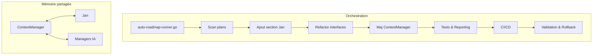

# 🤖 PLAN V70 : GÉNÉRATION CONTEXTUELLE HARMONISÉE COPILOT & MANAGERS

## 🌟 VISION & CONTEXTE

> **Clarification écosystème** :
> L’objectif est d’aligner la génération contextuelle de Copilot Github avec l’écosystème de managers, pour une production documentaire et logicielle cohérente, rapide et contextualisée, en exploitant le contexte partagé, la mémoire, et la synchronisation multi-agents.

## 🎯 OBJECTIFS MAJEURS

- Permettre à Copilot Github de générer des blocs documentaires/codes en harmonie avec les managers, workflows, et le contexte du dépôt.
- Exploiter la mémoire contextuelle, le cache, et les dépendances pour accélérer et fiabiliser la génération.
- Orchestrer la génération par blocs parallélisés, synchronisés avec le Context Manager et le Process Manager.
- Offrir une expérience de génération continue, validée, et traçable.

## 🔒 Contraintes et spécificités clés

- [ ] Génération contextuelle multi-niveaux (fichier, module, projet, écosystème)
- [ ] Synchronisation automatique du contexte entre Copilot, Context Manager, Process Manager
- [ ] Validation croisée des blocs générés (lint, tests, conventions)
- [ ] Historisation et audit des générations (logs, reporting)
- [x] Compatibilité multi-LLM et orchestration mono-agent (Jan) simulant plusieurs personas
- [ ] Documentation et guides d’intégration pour contributeurs

---

# 🗺️ ROADMAP DÉTAILLÉE

## [ ] 1. Initialisation et cadrage

- [ ] 1.1. Cartographier les besoins de génération contextuelle (types de blocs, usages, profils)
- [ ] 1.2. Définir les points d’intégration entre Copilot, Context Manager, Process Manager, n8n
- [ ] 1.3. Établir les conventions de structuration des prompts et du contexte partagé
- [ ] 1.4. Mettre en place un fichier centralisé de suivi des générations (GENERATION_AUDIT.md)

## [ ] 2. Orchestration de la génération par blocs

- [ ] 2.1. Décomposer les tâches en blocs indépendants (titre, objectif, schéma, code, exemples…)
- [x] 2.2. Séquentialiser la génération des blocs via l'orchestrateur Jan
- [ ] 2.3. Synchroniser le contexte entre chaque bloc via Context Manager
- [ ] 2.4. Assembler et valider les blocs générés (lint, tests, conventions)

## [ ] 3. Exploitation du cache et de la mémoire contextuelle

- [ ] 3.1. Mettre en place un cache contextuel partagé entre Copilot et les managers
- [ ] 3.2. Réutiliser les patterns, extraits, schémas, guides existants
- [ ] 3.3. Historiser les générations pour accélérer les itérations futures

## [ ] 4. Validation, audit et feedback

- [ ] 4.1. Valider chaque bloc généré (lint, tests, relecture croisée)
- [ ] 4.2. Générer des rapports d’audit (GENERATION_AUDIT.md)
- [ ] 4.3. Intégrer le feedback utilisateur et IA pour améliorer la génération

## [ ] 5. Documentation, guides et onboarding

- [ ] 5.1. Rédiger un guide d’intégration Copilot & Context Manager
- [ ] 5.2. Documenter les conventions de prompts, structuration, validation
- [ ] 5.3. Proposer des tutoriels pour contributeurs et IA

---

# 🏗️ NIVEAUX D’IMPLÉMENTATION & EXEMPLES

## NIVEAU 1 : Architecture de génération contextuelle

- **Contexte** : Orchestration Copilot + Context Manager + Process Manager, synchronisation du contexte, audit des générations.
- **Livrables** : README.md, GENERATION_AUDIT.md, guides/INTEGRATION_COPILOT.md

## NIVEAU 2 : Décomposition et parallélisation

- **Responsabilité** : Décomposer chaque tâche en blocs, générer en parallèle, assembler.
- **Livrables** : scripts/GEN_BLOCKS.sh, guides/EXEMPLES_BLOCS.md

## NIVEAU 3 : Cache et mémoire contextuelle

- **Responsabilité** : Stocker, réutiliser, historiser les blocs générés et le contexte.
- **Livrables** : cache/context_cache.json, guides/UTILISATION_CACHE.md

## NIVEAU 4 : Validation et audit

- **Responsabilité** : Linter, tester, relire, auditer chaque génération.
- **Livrables** : GENERATION_AUDIT.md, scripts/VALIDATE_BLOCKS.sh

## NIVEAU 5 : Documentation et guides

- **Responsabilité** : Expliquer l’intégration, les conventions, les workflows.
- **Livrables** : guides/INTEGRATION_COPILOT.md, guides/CONVENTIONS_PROMPTS.md

---

# 📊 VALIDATION & CONTRÔLE QUALITÉ

- [ ] Validation de chaque bloc généré par un relecteur (humain ou IA)
- [ ] Audit régulier des générations (GENERATION_AUDIT.md)
- [ ] Tests d’intégration Copilot + managers
- [ ] Feedback utilisateurs et IA intégré en continu

---

# 🧭 FAQ & GUIDES D’INTÉGRATION

## Exemples de questions/réponses

- **Q : Comment Copilot accède-t-il au contexte partagé ?**
  - R : Via le Context Manager, qui synchronise les informations pertinentes à chaque génération.

- **Q : Peut-on générer plusieurs blocs en parallèle ?**
  - R : Oui, grâce au Process Manager et à la décomposition des tâches.

- **Q : Comment valider la qualité des blocs générés ?**
  - R : Par linter, tests, relecture croisée, et audit documentaire.

---

# 🏁 LIVRABLES ATTENDUS

- README.md, GENERATION_AUDIT.md, guides/INTEGRATION_COPILOT.md, guides/CONVENTIONS_PROMPTS.md, scripts/GEN_BLOCKS.sh, scripts/VALIDATE_BLOCKS.sh, cache/context_cache.json, etc.

---

# 🚦 JALONS & SUIVI

- [ ] Initialisation et cadrage (cartographie, conventions, audit)
- [ ] Orchestration génération par blocs et parallélisation
- [ ] Mise en place du cache contextuel et de l’historique
- [ ] Validation, audit, feedback
- [ ] Documentation, guides, onboarding

---

# 🔥 RECOMMANDATIONS & AMÉLIORATIONS IMMÉDIATES

- Prioriser l’intégration Copilot + Context Manager
- Mettre en place la génération par blocs parallélisés dès la première itération
- Documenter les conventions de prompts et de structuration
- Organiser des sessions de feedback croisé (dev, IA, management)

---

Ce plan vise à faire de la génération contextuelle un atout stratégique, harmonisé avec l’écosystème de managers, pour accélérer et fiabiliser la production documentaire et logicielle.

## Orchestration séquentielle multi-personas avec Jan
Toutes les tâches IA sont orchestrées via Jan, en mode mono-agent séquentiel, chaque persona étant simulé par un prompt système/contextuel distinct. L’historique des échanges est géré par le ContextManager et injecté à chaque tour.
## Diagramme d'architecture (Jan)

