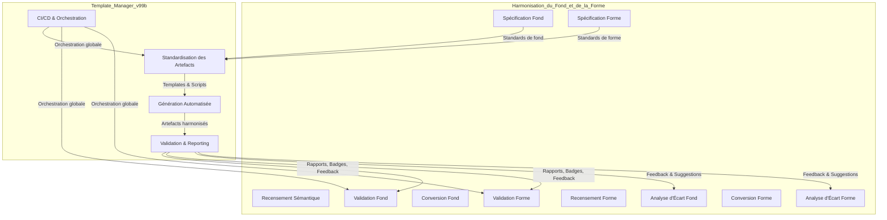

<create_file>
<path>projet/roadmaps/plans/consolidated/plan-dev-v99a-harmonisation-plans-dev.md</path>
---

## 🔗 Schéma Mermaid – Relation et Flux entre Harmonisation (v99a) et Template-Manager (v99b)



> **Ce schéma illustre la symbiose entre l’harmonisation du fond et de la forme (v99a) et le template-manager (v99b) : les standards issus de l’harmonisation alimentent le template-manager, qui génère, valide et orchestre les artefacts harmonisés, tout en renvoyant du feedback pour l’amélioration continue des deux roadmaps.**
<content>
# 🎯 Roadmap Légendaire – Harmonisation des Plans de Développement (Fond & Forme)

---

## 📋 Métadonnées du Plan

| Élément         | Valeur                                      |
|-----------------|---------------------------------------------|
| **ID Plan**     | PLAN-DEV-V99A-HARMONISATION                 |
| **Version**     | 1.0                                         |
| **Date**        | 2025-07-08                                  |
| **Responsable** | Équipe Architecture & Automatisation        |
| **Statut**      | 🔄 En cours                                 |
| **Complexité**  | ⭐⭐⭐ Légendaire                             |
| **Durée**       | 3 semaines (itératif, branches/merge)       |

---

# 1. 🚨 CONSIGNES CRITIQUES DE VÉRIFICATION

### Avant CHAQUE étape

- [ ] **VÉRIFIER la branche actuelle** : `git branch` et `git status`
- [ ] **VÉRIFIER les imports** : cohérence des chemins relatifs/absolus
- [ ] **VÉRIFIER la stack** : `go mod tidy` et `go build ./...`
- [ ] **VÉRIFIER les fichiers requis** : présence de tous les composants
- [ ] **VÉRIFIER la responsabilité** : éviter la duplication de code
- [ ] **TESTER avant commit** : `go test ./...` doit passer à 100%

### À CHAQUE section majeure

- [ ] **COMMITTER sur la bonne branche** : vérifier correspondance
- [ ] **PUSHER immédiatement** : `git push origin [branch-name]`
- [ ] **DOCUMENTER les changements** : mise à jour du README
- [ ] **VALIDER l'intégration** : tests end-to-end

### Responsabilités par branche

- **main** : Code de production stable uniquement
- **dev** : Intégration et tests de l'écosystème unifié  
- **harmonisation** : Développement et tests de l’harmonisation
- **consolidation-v99a** : Branche dédiée pour ce plan

---

# 2. 🏗️ SPÉCIFICATIONS TECHNIQUES GÉNÉRIQUES

## 📋 Stack Technique Complète

- **Go Version** : 1.21+ requis (`go version`)
- **Module System** : Go modules (`go mod init/tidy`)
- **Build Tool** : `go build ./...`
- **Dependency Management** : `go mod download` et `go mod verify`
- **Linting** : `golangci-lint run`
- **Formatting** : `gofmt -s -w .` et `goimports -w .`
- **Testing** : `go test -v -race -cover ./...`
- **Security** : `gosec ./...`

## 🗂️ Structure des Répertoires Normalisée

```
projet/
├── roadmaps/
│   ├── plans/
│   │   ├── consolidated/
│   │   │   ├── plan-dev-v99a-harmonisation-plans-dev.md
│   │   │   ├── ...
│   │   ├── harmonized/
│   │   └── _templates/
│   └── scripts/
├── internal/
├── pkg/
├── docs/
└── ...
```

---

# 3. 🧭 PHILOSOPHIE DE L’HARMONISATION

- **Harmonisation du fond** : convergence sémantique, suppression des incohérences, conflits et redondances entre plans (objectifs, granularité, terminologie, indicateurs, jalons, etc.).
- **Harmonisation de la forme** : standardisation de la structure, du style, des métadonnées, de la granularité, des émojis, des tableaux, des conventions de nommage, de la documentation, de la traçabilité, de l’automatisation.

---

# 4. 🎯 OBJECTIFS PRINCIPAUX

## 🏆 Objectif 1 : Harmonisation du Fond (Sémantique & Méthodique)
- **But** : Unifier la logique, la granularité, la terminologie, les objectifs et les indicateurs de tous les plans.
- **Indicateur** : 100% des plans convergent sur le fond, suppression des incohérences et redondances.
- **Échéance** : Semaine 2

## 🏆 Objectif 2 : Harmonisation de la Forme (Structure & Style)
- **But** : Standardiser la structure, la présentation, les métadonnées, la granularité, les émojis, la documentation et la traçabilité.
- **Indicateur** : 100% des plans conformes au template harmonisé, validés par scripts et CI/CD.
- **Échéance** : Semaine 3

---

# 5. 🛠️ ROADMAP GRANULARISÉE

## 5.1. HARMONISATION DU FOND

### 5.1.1. Recensement & Cartographie Sémantique

- [ ] **Script Go natif** : `cmd/harmonisation-recensement-fond/main.go`
  - Scanne tous les plans, extrait objectifs, actions, tâches, indicateurs, jalons, terminologie.
  - Génère `recensement_fond.json`.
- [ ] **Livrables** : `recensement_fond.json`, logs.
- [ ] **Commandes** :
  - `go run cmd/harmonisation-recensement-fond/main.go`
  - `go test ./cmd/harmonisation-recensement-fond/...`
- [ ] **Tests** : `harmonisation_recensement_fond_test.go`
- [ ] **Validation** : rapport validé par revue croisée.
- [ ] **Rollback** : `.bak` de l’ancien rapport.
- [ ] **CI/CD** : job `harmonisation-recensement-fond`.
- [ ] **Documentation** : README usage, logs.

---

### 5.1.2. Analyse d’écart & Détection des Incohérences

- [ ] **Script Go natif** : `cmd/harmonisation-gap-fond/main.go`
  - Compare les plans, détecte incohérences, conflits, redondances, granularité excessive.
  - Génère `gap_fond_report.md`.
- [ ] **Livrables** : `gap_fond_report.md`, logs.
- [ ] **Commandes** :
  - `go run cmd/harmonisation-gap-fond/main.go`
  - `go test ./cmd/harmonisation-gap-fond/...`
- [ ] **Tests** : `harmonisation_gap_fond_test.go`
- [ ] **Validation** : rapport validé par revue croisée.
- [ ] **Rollback** : `.bak` de l’ancien rapport.
- [ ] **CI/CD** : job `harmonisation-gap-fond`.
- [ ] **Documentation** : README, logs.

---

### 5.1.3. Spécification des Standards Sémantiques

- [ ] **Script Go natif** : `cmd/harmonisation-spec-fond/main.go`
  - Génère `spec_fond_harmonise.md` (structure, terminologie, granularité, indicateurs, jalons).
- [ ] **Livrables** : `spec_fond_harmonise.md`, logs.
- [ ] **Commandes** :
  - `go run cmd/harmonisation-spec-fond/main.go`
  - `go test ./cmd/harmonisation-spec-fond/...`
- [ ] **Tests** : `harmonisation_spec_fond_test.go`
- [ ] **Validation** : revue croisée, feedback équipe.
- [ ] **Rollback** : `.bak` de la spec précédente.
- [ ] **CI/CD** : job `harmonisation-spec-fond`.
- [ ] **Documentation** : README, logs.

---

### 5.1.4. Conversion & Refactoring Sémantique

- [ ] **Script Go natif** : `cmd/harmonisation-convert-fond/main.go`
  - Applique les standards sémantiques, refactore objectifs, granularité, terminologie, indicateurs.
  - Génère plans harmonisés dans `plans/harmonized/`.
- [ ] **Livrables** : plans harmonisés, logs, diff.
- [ ] **Commandes** :
  - `go run cmd/harmonisation-convert-fond/main.go`
  - `go test ./cmd/harmonisation-convert-fond/...`
- [ ] **Tests** : `harmonisation_convert_fond_test.go`
- [ ] **Validation** : revue croisée, feedback équipe.
- [ ] **Rollback** : sauvegarde `.bak` des plans originaux.
- [ ] **CI/CD** : job `harmonisation-convert-fond`.
- [ ] **Documentation** : README, logs.

---

### 5.1.5. Validation & Reporting Sémantique

- [ ] **Script Go natif** : `cmd/harmonisation-validate-fond/main.go`
  - Valide la conformité sémantique, génère rapports de couverture, badges, logs.
- [ ] **Livrables** : `validation_fond_report.md`, badges, logs.
- [ ] **Commandes** :
  - `go run cmd/harmonisation-validate-fond/main.go`
  - `go test ./cmd/harmonisation-validate-fond/...`
- [ ] **Tests** : `harmonisation_validate_fond_test.go`
- [ ] **Validation** : tests automatisés, feedback équipe.
- [ ] **Rollback** : `.bak` des rapports précédents.
- [ ] **CI/CD** : job `harmonisation-validate-fond`.
- [ ] **Documentation** : README, logs.

---

## 5.2. HARMONISATION DE LA FORME

### 5.2.1. Recensement & Cartographie des Formats

- [ ] **Script Go natif** : `cmd/harmonisation-recensement-forme/main.go`
  - Scanne tous les plans, extrait structure, style, granularité, émojis, tableaux, métadonnées.
  - Génère `recensement_forme.json`.
- [ ] **Livrables** : `recensement_forme.json`, logs.
- [ ] **Commandes** :
  - `go run cmd/harmonisation-recensement-forme/main.go`
  - `go test ./cmd/harmonisation-recensement-forme/...`
- [ ] **Tests** : `harmonisation_recensement_forme_test.go`
- [ ] **Validation** : rapport validé par revue croisée.
- [ ] **Rollback** : `.bak` de l’ancien rapport.
- [ ] **CI/CD** : job `harmonisation-recensement-forme`.
- [ ] **Documentation** : README usage, logs.

---

### 5.2.2. Analyse d’écart & Détection des Incohérences de Forme

- [ ] **Script Go natif** : `cmd/harmonisation-gap-forme/main.go`
  - Compare les plans, détecte incohérences de structure, granularité, style, émojis, tableaux, métadonnées.
  - Génère `gap_forme_report.md`.
- [ ] **Livrables** : `gap_forme_report.md`, logs.
- [ ] **Commandes** :
  - `go run cmd/harmonisation-gap-forme/main.go`
  - `go test ./cmd/harmonisation-gap-forme/...`
- [ ] **Tests** : `harmonisation_gap_forme_test.go`
- [ ] **Validation** : rapport validé par revue croisée.
- [ ] **Rollback** : `.bak` de l’ancien rapport.
- [ ] **CI/CD** : job `harmonisation-gap-forme`.
- [ ] **Documentation** : README, logs.

---

### 5.2.3. Spécification des Standards de Forme

- [ ] **Script Go natif** : `cmd/harmonisation-spec-forme/main.go`
  - Génère `spec_forme_harmonise.md` (structure, granularité, émojis, tableaux, conventions de nommage, doc, traçabilité).
- [ ] **Livrables** : `spec_forme_harmonise.md`, logs.
- [ ] **Commandes** :
  - `go run cmd/harmonisation-spec-forme/main.go`
  - `go test ./cmd/harmonisation-spec-forme/...`
- [ ] **Tests** : `harmonisation_spec_forme_test.go`
- [ ] **Validation** : revue croisée, feedback équipe.
- [ ] **Rollback** : `.bak` de la spec précédente.
- [ ] **CI/CD** : job `harmonisation-spec-forme`.
- [ ] **Documentation** : README, logs.

---

### 5.2.4. Conversion & Refactoring de la Forme

- [ ] **Script Go natif** : `cmd/harmonisation-convert-forme/main.go`
  - Applique les standards de forme, refactore structure, granularité, émojis, tableaux, métadonnées.
  - Génère plans harmonisés dans `plans/harmonized/`.
- [ ] **Livrables** : plans harmonisés, logs, diff.
- [ ] **Commandes** :
  - `go run cmd/harmonisation-convert-forme/main.go`
  - `go test ./cmd/harmonisation-convert-forme/...`
- [ ] **Tests** : `harmonisation_convert_forme_test.go`
- [ ] **Validation** : revue croisée, feedback équipe.
- [ ] **Rollback** : sauvegarde `.bak` des plans originaux.
- [ ] **CI/CD** : job `harmonisation-convert-forme`.
- [ ] **Documentation** : README, logs.

---

### 5.2.5. Validation & Reporting de la Forme

- [ ] **Script Go natif** : `cmd/harmonisation-validate-forme/main.go`
  - Valide la conformité de forme, génère rapports de couverture, badges, logs.
- [ ] **Livrables** : `validation_forme_report.md`, badges, logs.
- [ ] **Commandes** :
  - `go run cmd/harmonisation-validate-forme/main.go`
  - `go test ./cmd/harmonisation-validate-forme/...`
- [ ] **Tests** : `harmonisation_validate_forme_test.go`
- [ ] **Validation** : tests automatisés, feedback équipe.
- [ ] **Rollback** : `.bak` des rapports précédents.
- [ ] **CI/CD** : job `harmonisation-validate-forme`.
- [ ] **Documentation** : README, logs.

---

## 5.3. ORCHESTRATION & CI/CD

### 5.3.1. Orchestrateur global d’harmonisation

- [ ] **Script Go natif** : `cmd/auto-harmonisation-runner/main.go`
  - Orchestration de tous les scans, analyses, conversions, tests, rapports, feedback, sauvegardes, notifications.
- [ ] **Livrables** : logs, rapports, notifications automatisées.
- [ ] **Commandes** :
  - `go run cmd/auto-harmonisation-runner/main.go`
  - `go test ./cmd/auto-harmonisation-runner/...`
- [ ] **Tests** : `auto_harmonisation_runner_test.go`
- [ ] **Validation** : logs complets, feedback automatisé.
- [ ] **Rollback** : `.bak` des logs précédents.
- [ ] **CI/CD** : job `auto-harmonisation-runner`.
- [ ] **Documentation** : README, logs.

---

### 5.3.2. Intégration CI/CD & Reporting

- [ ] **Script Go natif** : `cmd/harmonisation-ci-cd-integrator/main.go`
  - Génère/actualise `.gitlab-ci.yml` pour l’harmonisation.
- [ ] **Livrables** : `.gitlab-ci.yml`, logs, artefacts CI.
- [ ] **Commandes** :
  - `go run cmd/harmonisation-ci-cd-integrator/main.go`
  - `go test ./cmd/harmonisation-ci-cd-integrator/...`
- [ ] **Tests** : `harmonisation_ci_cd_integrator_test.go`
- [ ] **Validation** : pipeline vert, artefacts archivés.
- [ ] **Rollback** : `.bak` des pipelines précédents.
- [ ] **CI/CD** : job `harmonisation-ci-cd-integration`.
- [ ] **Documentation** : README, logs.

---

# 6. 🧪 TESTS, VALIDATION & ROBUSTESSE

- [ ] **Tests unitaires** : chaque script Go, chaque conversion, chaque validation.
- [ ] **Tests d’intégration** : conversion bout en bout de plans, reporting, rollback.
- [ ] **Tests de performance** : conversion de masse, temps de traitement.
- [ ] **Tests de robustesse** : gestion des erreurs, rollback, logs.
- [ ] **Validation croisée** : revue humaine sur échantillon, feedback équipe.
- [ ] **Reporting automatisé** : badges, dashboards, logs, notifications.

---

# 7. 📚 DOCUMENTATION & GUIDES

- [ ] **README harmonisation** : usage, scripts, conventions, troubleshooting.
- [ ] **Guide de style harmonisation** : conventions, granularité, émojis, tableaux, numérotation.
- [ ] **Glossaire harmonisation** : terminologie unifiée, définitions, synonymes, termes interdits.
- [ ] **Guide de contribution** : process, checklist, validation, rollback.
- [ ] **Logs et traçabilité** : historique des conversions, feedback, corrections.

---

# 8. 🔄 ROLLBACK, VERSIONNING & TRAÇABILITÉ

- [ ] **Sauvegarde automatique** : `.bak` de chaque plan avant conversion.
- [ ] **Historique des conversions** : logs, diff, reporting.
- [ ] **Versionning Git** : commits atomiques, branches dédiées, PR/MR, validation CI/CD.
- [ ] **Rollback automatisé** : script Go `cmd/harmonisation-rollback/main.go` pour restaurer un plan à l’état antérieur.
- [ ] **Reporting rollback** : logs, notifications, badges.

---

# 9. 🏁 CRITÈRES D’ACCEPTANCE & INDICATEURS DE SUCCÈS

- [ ] 100% des plans harmonisés sur le fond et la forme
- [ ] 100% des plans validés par scripts et CI/CD
- [ ] 0 incohérence sémantique ou de forme détectée
- [ ] 100% des plans avec métadonnées, granularité, émojis, tableaux, doc, traçabilité
- [ ] Reporting automatisé, logs, badges, dashboards à jour

---

# 10. 📚 RÉFÉRENCES & ANNEXES

- [ ] Analyse des formats existants
- [ ] Template harmonisé standard
- [ ] Guide de style harmonisation
- [ ] Glossaire harmonisation
- [ ] Scripts Go/Bash d’harmonisation
- [ ] Exemples de plans harmonisés

---

> **Ce plan d’harmonisation est conçu pour être actionnable, automatisable, traçable, testé, robuste et reproductible, aligné sur la stack Go, les standards avancés d’ingénierie, et l’écosystème documentaire du projet.**
</content>
</create_file>
---
## Orchestration séquentielle multi-personas avec Jan
Toutes les tâches IA sont orchestrées via Jan, en mode mono-agent séquentiel, chaque persona étant simulé par un prompt système/contextuel distinct. L’historique des échanges est géré par le ContextManager et injecté à chaque tour.