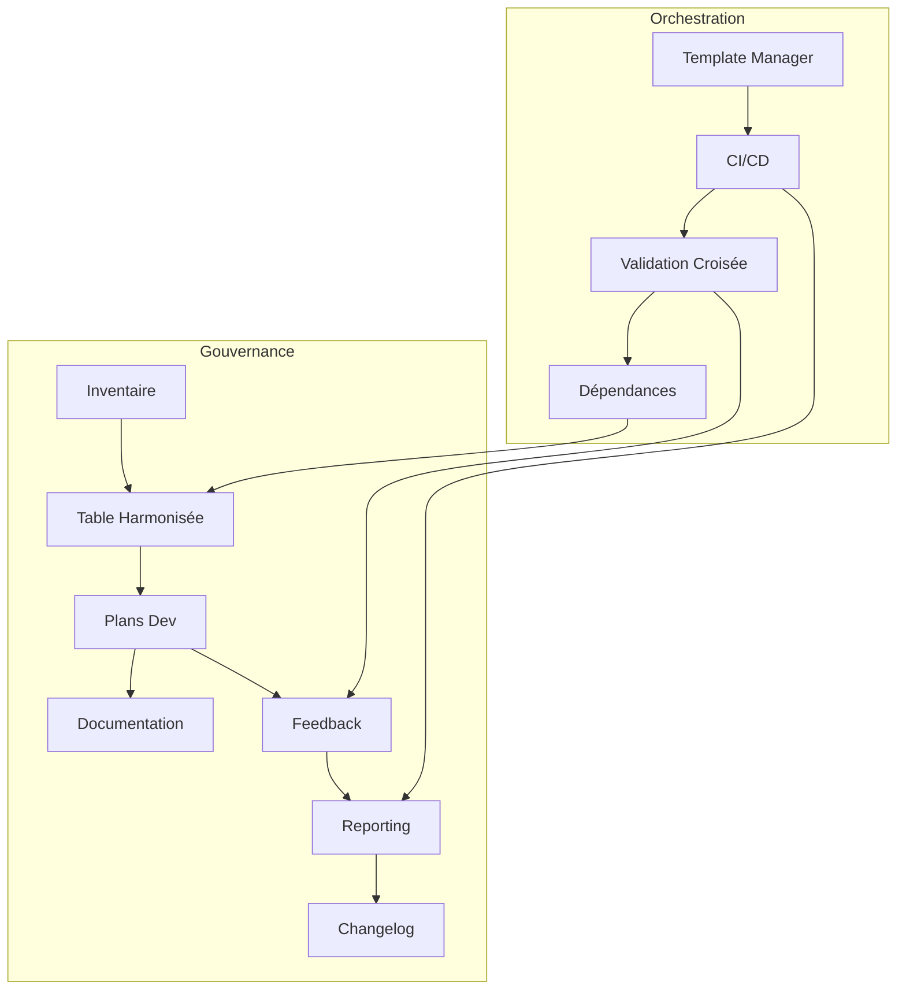

# 🏗️ Roadmap Actionnable et Automatisable – Template Manager Go (v99b amélioré)

## 1. Recensement initial
- [x] Générer la structure de base du template-manager Go (`cmd/manager-recensement/main.go`)
  - **Livrable :** `recensement.json`
  - **Commande :** `go run cmd/manager-recensement/main.go`
  - **Script Go natif fourni, test :** `manager_recensement_test.go`
  - **Format :** JSON
  - **Validation :** rapport exhaustif, revue croisée
  - **Rollback :** sauvegarde `.bak`
  - **CI/CD :** job `recensement`
  - **Documentation :** README usage, logs
  - **Traçabilité :** logs, versionning

## 2. Analyse d’écart & recueil des besoins
- [x] Comparer artefacts existants vs standards (`cmd/manager-gap-analysis/main.go`)
  - **Livrable :** `gap_report.md`
  - **Commande :** `go run cmd/manager-gap-analysis/main.go`
  - **Script Go natif fourni, test :** `gap_analysis_test.go`
  - **Format :** Markdown
  - **Validation :** rapport validé, feedback intégré
  - **Rollback :** sauvegarde `.bak`
  - **CI/CD :** job `gap-analysis`
  - **Documentation :** README, logs
  - **Traçabilité :** logs, versionning

## 3. Spécification des standards
- [ ] Générer les specs pour chaque manager (`cmd/spec-generator/main.go`)
  - **Livrable :** `spec_<manager>.md`
  - **Commande :** `go run cmd/spec-generator/main.go`
  - **Script Go natif fourni, test :** `spec_generator_test.go`
  - **Format :** Markdown
  - **Validation :** revue croisée
  - **Rollback :** sauvegarde `.bak`
  - **CI/CD :** job `spec-generation`
  - **Documentation :** README, logs
  - **Traçabilité :** logs, versionning

## 4. Génération des templates et scripts
- [ ] Générer README, plans, configs, tests, scripts (`pkg/templategen/generate_templates.go`)
  - **Livrables :** `README.md`, `plan.md`, `config.yaml`, `*_test.go`
  - **Commande :** `go run pkg/templategen/generate_templates.go`
  - **Script Go natif fourni, test :** `templategen_test.go`
  - **Formats :** Markdown, YAML, Go
  - **Validation :** revue croisée, feedback équipe
  - **Rollback :** sauvegarde `.bak`
  - **CI/CD :** job `template-generation`
  - **Documentation :** README, logs
  - **Traçabilité :** logs, versionning

## 5. Développement, automatisation & tests
- [ ] Générer, valider, reporter (`cmd/dev-tools/main.go`)
  - **Livrables :** scripts Go, logs
  - **Commande :** `go run cmd/dev-tools/main.go`
  - **Script Go natif fourni, test :** `dev_tools_test.go`
  - **Validation :** tests unitaires, lint
  - **Rollback :** sauvegarde `.bak`
  - **CI/CD :** job `dev-tools`
  - **Documentation :** README, logs
  - **Traçabilité :** logs, versionning

## 6. Intégration arborescence
- [ ] Vérifier/adapter la structure des dossiers (`cmd/structure-integrator/main.go`)
  - **Livrables :** fichiers déplacés/générés, logs
  - **Commande :** `go run cmd/structure-integrator/main.go`
  - **Script Go natif fourni, test :** `structure_integrator_test.go`
  - **Validation :** structure validée
  - **Rollback :** sauvegarde `.bak`
  - **CI/CD :** job `structure-integration`
  - **Documentation :** README, logs
  - **Traçabilité :** logs, versionning

## 7. Automatisation des tests & reporting
- [ ] Lancer tous les tests, générer rapport de couverture (`cmd/test-runner/main.go`)
  - **Livrables :** `coverage_<manager>.out`, badge, logs
  - **Commande :** `go run cmd/test-runner/main.go`
  - **Script Go natif fourni, test :** `test_runner_test.go`
  - **Validation :** couverture > 85%
  - **Rollback :** sauvegarde `.bak`
  - **CI/CD :** job `test-runner`
  - **Documentation :** README, logs
  - **Traçabilité :** logs, versionning

## 8. Documentation et guides d’usage
- [ ] Générer/actualiser README, guides, docs techniques (`cmd/doc-generator/main.go`)
  - **Livrables :** `README_<manager>.md`, guides, logs
  - **Commande :** `go run cmd/doc-generator/main.go`
  - **Script Go natif fourni, test :** `doc_generator_test.go`
  - **Validation :** revue croisée
  - **Rollback :** sauvegarde `.bak`
  - **CI/CD :** job `doc-generation`
  - **Documentation :** README, logs
  - **Traçabilité :** logs, versionning

## 9. Orchestration & CI/CD
- [ ] Orchestrateur global (`cmd/auto-roadmap-runner/main.go`)
  - **Livrables :** logs, rapports, notifications
  - **Commande :** `go run cmd/auto-roadmap-runner/main.go`
  - **Script Go natif fourni, test :** `auto_roadmap_runner_test.go`
  - **CI/CD :** pipeline `.gitlab-ci.yml`, badges, triggers, reporting

---
---

## 10. Gouvernance, Table Harmonisée & Inventaire

- [x] Générer et synchroniser la table harmonisée (`plans_harmonized.md`) et l’inventaire dynamique (`plans_inventory.md`)
  - **Livrables :** `plans_harmonized.md`, `plans_inventory.md`
  - **Commandes :** `go run cmd/table-harmonisation/main.go`, `go run cmd/inventory-generator/main.go`
  - **Scripts Go natifs :** `cmd/table-harmonisation/main.go`, `cmd/inventory-generator/main.go`, tests associés
  - **Formats :** Markdown, CSV, JSON
  - **Validation :** revue croisée, reporting automatisé
  - **Rollback :** sauvegarde `.bak`, versionning git
  - **CI/CD :** jobs dédiés, archivage des rapports
  - **Documentation :** README, guides d’usage
  - **Traçabilité :** logs, historique des outputs

---

## 11. Feedback, Reporting & Amélioration Continue

- [x] Mettre en place le feedback automatisé et la boucle d’amélioration continue
  - **Livrables :** rapports de conformité, feedback automatisé, changelog (`CHANGELOG.md`)
  - **Commandes :** `go run cmd/feedback-generator/main.go`, `go run cmd/reporting/main.go`
  - **Scripts Go natifs :** `cmd/feedback-generator/main.go`, `cmd/reporting/main.go`, tests associés
  - **Formats :** Markdown, JSON
  - **Validation :** reporting CI/CD, revue croisée
  - **Rollback :** sauvegarde `.bak`, versionning git
  - **CI/CD :** jobs reporting, feedback, changelog
  - **Documentation :** README, guides, FAQ
  - **Traçabilité :** logs, reporting automatisé

---

## 12. Documentation Centralisée & Guides

- [x] Générer et maintenir les guides, FAQ, CONTRIBUTING, README centralisés
  - **Livrables :** `GUIDE.md`, `FAQ.md`, `CONTRIBUTING.md`, `README.md`
  - **Commandes :** `go run cmd/doc-generator/main.go`
  - **Scripts Go natifs :** `cmd/doc-generator/main.go`, tests associés
  - **Formats :** Markdown
  - **Validation :** revue croisée, feedback équipe
  - **Rollback :** sauvegarde `.bak`, versionning git
  - **CI/CD :** job documentation
  - **Documentation :** guides, FAQ, README
  - **Traçabilité :** logs, historique des docs

---

## 13. Dépendances, Validation Croisée & Granularité

- [ ] Formaliser la gestion des dépendances entre plans, tâches, managers, modules
  - **Livrables :** schémas Mermaid, tableaux de dépendances, rapports de validation croisée
  - **Commandes :** `go run cmd/dependency-analyzer/main.go`
  - **Scripts Go natifs :** `cmd/dependency-analyzer/main.go`, tests associés
  - **Formats :** Markdown, Mermaid, JSON
  - **Validation :** revue croisée, reporting automatisé
  - **Rollback :** sauvegarde `.bak`, versionning git
  - **CI/CD :** job dépendances, validation croisée
  - **Documentation :** README, guides
  - **Traçabilité :** logs, reporting automatisé

---

## 14. Schéma Mermaid – Gouvernance & Orchestration

---

Chaque section complémentaire est alignée sur les standards d’ingénierie avancée, avec granularité, automatisation, traçabilité, documentation et validation croisée. Les dépendances entre étapes sont explicites, chaque livrable/action est traçable et automatisable, et la gouvernance est visualisée pour garantir l’harmonisation complète du plan v99b avec v99a et v104.

Chaque étape est atomique, traçable, validée et automatisable. Les scripts Go natifs sont prioritaires, chaque livrable est associé à une commande reproductible, une documentation et une procédure de rollback/versionnement. Les cases à cocher permettent le suivi exhaustif et la robustesse du process.