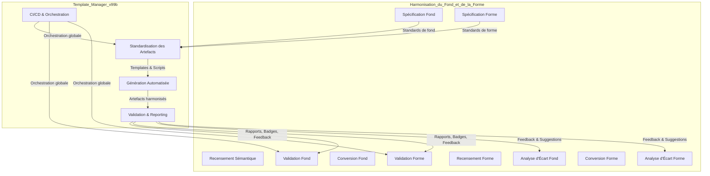
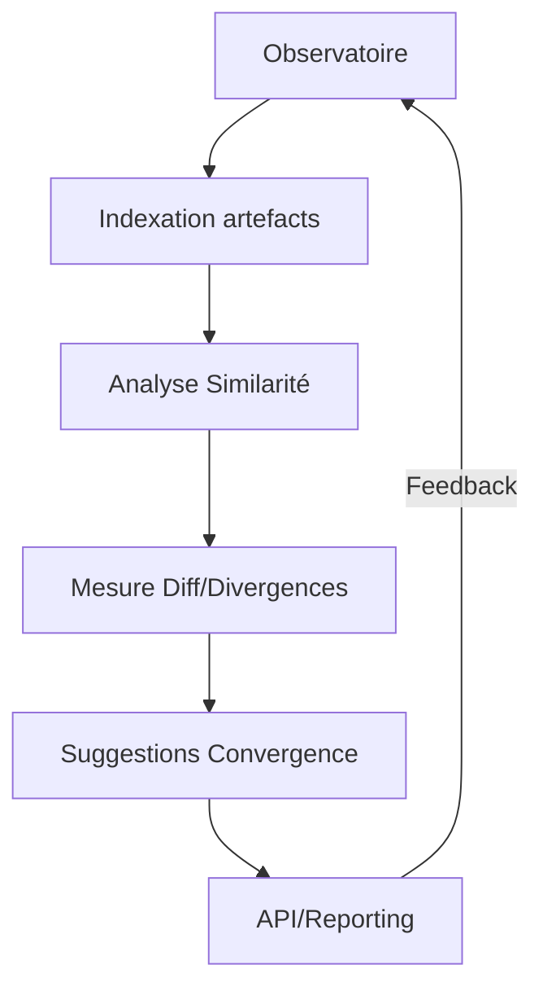
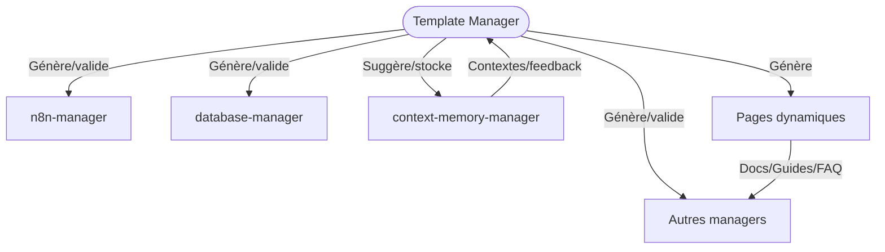
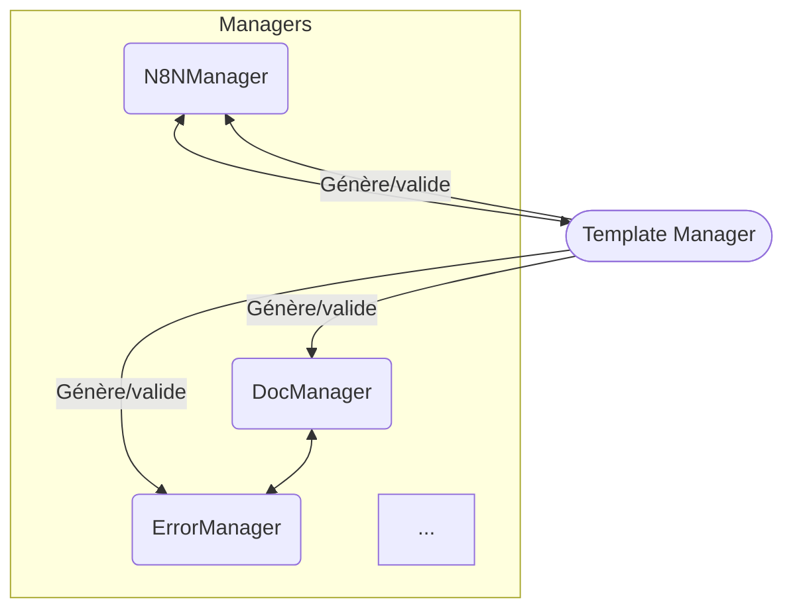

Voici un plan de développement légendaire pour l’harmonisation, extrapolé à l’échelle de tout l’écosystème documentaire et logiciel, inspiré des meilleurs éléments du plan initial et enrichi pour que le template-manager Go standardise : managers, dossiers, modules, README, tests, CI/CD, et interactions.

---

## 🔗 Schéma Mermaid – Relation et Flux entre Harmonisation (v99a) et Template-Manager (v99b)

> **Ce schéma illustre la symbiose entre l’harmonisation du fond et de la forme (v99a) et le template-manager (v99b) : les standards issus de l’harmonisation alimentent le template-manager, qui génère, valide et orchestre les artefacts harmonisés, tout en renvoyant du feedback pour l’amélioration continue des deux roadmaps.**
---

## Vision

Le template-manager Go devient le cœur de la standardisation, générant, validant et harmonisant :
- Les plans de développement
- Les dossiers de modules/packages
- Les README, guides, scripts, configs, tests
- Les artefacts CI/CD
- Les interfaces et points d’extension pour tous les managers de l’écosystème ([`AGENTS.md`](AGENTS.md:9))

---

## Objectifs stratégiques

- **Standardisation totale** : tout artefact documentaire, code ou process doit pouvoir être généré, validé et mis à jour par le template-manager.
- **Interopérabilité** : chaque manager (DocManager, ScriptManager, StorageManager…) interagit avec le template-manager via API/CLI pour générer, valider, migrer ou synchroniser ses propres artefacts.
- **Automatisation CI/CD** : pipeline GitLab CI orchestrant la génération, la validation, la conversion, les tests et la documentation pour chaque manager et module.
- **Évolutivité** : ajout de nouveaux templates, règles, managers ou modules sans rupture.
- **Traçabilité et reporting** : logs, métriques, dashboards, rapports d’usage et de conformité.

---

## Roadmap légendaire

### 1. Recensement & Analyse
- Scanner tous les artefacts (plans, dossiers, README, tests, configs) de chaque manager.
- Générer un rapport JSON/YAML des écarts, doublons, manques, non-conformités.
- Cartographier les points d’intégration et d’extension de chaque manager.

### 2. Spécification des standards universels
- Définir des templates pour :
  - Plans de développement (multi-niveaux)
  - README (par manager, module, package)
  - Structure de dossier (arborescence, conventions de nommage)
  - Fichiers de tests unitaires et d’intégration
  - Fichiers de configuration (YAML, JSON, TOML…)
  - Pipelines CI/CD (GitLab, GitHub…)
- Définir les interfaces d’appel (API, CLI, hooks Go) pour chaque manager.

### 3. Développement du template-manager Go
- Générer, valider, migrer, factoriser tout artefact documentaire ou code.
- Exposer une CLI/API : `generate`, `validate`, `convert`, `sync`, `report`.
- Supporter l’extension par plugins (pour managers spécifiques).
- Générer automatiquement : README, dossiers, tests, configs, pipelines, guides.
- Intégrer la validation croisée (lint, tests, conventions, granularité).

### 4. Intégration écosystémique
- Chaque manager :
  - Peut invoquer le template-manager pour générer ses propres artefacts (DocManager → guides, ScriptManager → scripts, StorageManager → configs, etc.).
  - Peut valider ses propres artefacts avant toute opération critique (migration, déploiement, rollback…).
  - Peut recevoir des suggestions de factorisation, d’amélioration, de documentation.
- Les dossiers de chaque module/package sont harmonisés (README, structure, tests, configs).
- Les pipelines CI/CD sont générés et validés automatiquement.

### 5. Automatisation & CI/CD
- Pipeline GitLab CI :
  - Génération et validation de tous les artefacts à chaque MR/commit.
  - Tests unitaires et d’intégration pour chaque manager/module.
  - Publication automatique des rapports, dashboards, badges de conformité.
  - Rollback automatique en cas d’échec.
- Génération de documentation et guides d’intégration pour chaque manager.

### 6. Monitoring, reporting, amélioration continue
- Génération de métriques d’usage, taux de conformité, logs d’intégration.
- Dashboard centralisé pour suivre l’état de l’écosystème.
- Processus d’amélioration continue : review mensuelle, feedback automatisé, évolution des templates.

---

## Diagramme Mermaid

```mermaid
flowchart TD
    subgraph Managers
      A1(DocManager)
      A2(ScriptManager)
      A3(StorageManager)
      A4(SecurityManager)
      A5(MonitoringManager)
      A6(MaintenanceManager)
      A7(MigrationManager)
      A8(NotificationManager)
      A9(ChannelManager)
      A10(AlertManager)
      A11(ProcessManager)
      A12(ContextManager)
      A13(ModeManager)
      A14(RoadmapManager)
      A15(RollbackManager)
      A16(CleanupManager)
      A17(QdrantManager)
      A18(SimpleAdvancedAutonomyManager)
      A19(VersionManager)
      A20(VectorOperationsManager)
    end
    TM([Template Manager Go])
    TM -->|Génère/valide| A1
    TM -->|Génère/valide| A2
    TM -->|Génère/valide| A3
    TM -->|Génère/valide| A4
    TM -->|Génère/valide| A5
    TM -->|Génère/valide| A6
    TM -->|Génère/valide| A7
    TM -->|Génère/valide| A8
    TM -->|Génère/valide| A9
    TM -->|Génère/valide| A10
    TM -->|Génère/valide| A11
    TM -->|Génère/valide| A12
    TM -->|Génère/valide| A13
    TM -->|Génère/valide| A14
    TM -->|Génère/valide| A15
    TM -->|Génère/valide| A16
    TM -->|Génère/valide| A17
    TM -->|Génère/valide| A18
    TM -->|Génère/valide| A19
    TM -->|Génère/valide| A20
    TM -->|Génère/valide| CI[CI/CD]
    TM -->|Génère/valide| DOC[Documentation]
    TM -->|Génère/valide| TEST[Tests]
    TM -->|Génère/valide| README[README]
    TM -->|Génère/valide| STRUCT[Structure Dossier]
```

---

## Critères de succès

- 100% des managers et modules disposent d’artefacts harmonisés, générés et validés automatiquement.
- Chaque manager peut évoluer, migrer, se documenter et se tester sans friction.
- L’écosystème gagne en robustesse, onboarding, maintenabilité, évolutivité et professionnalisme.

---

---

## Partie analytique : Observatoire, Similarité, Divergences

### 1. Observatoire documentaire et code
- **Indexation automatique** de tous les artefacts (plans, dossiers, README, tests, configs, scripts) de chaque manager et module.
- **Extraction de métadonnées** : structure, sections, signatures, patterns, dépendances, métriques de code et de documentation.

### 2. Analyse de similarité et clustering
- **Mesure de similarité** (cosine, Jaccard, Levenshtein, embeddings) entre :
  - Plans de développement (structure, objectifs, granularité)
  - README (sections, style, complétude)
  - Tests (couverture, structure, conventions)
  - Configs (schémas, clés, valeurs)
- **Clustering automatique** : regrouper les artefacts similaires pour détecter les familles de patterns, bonnes pratiques, et outliers.

### 3. Détection et mesure des divergences
- **Diff multi-niveaux** : calculer les différences structurelles, sémantiques et stylistiques entre artefacts similaires.
- **Rapports de divergence** : scoring de conformité, heatmap des écarts, priorisation des divergences à réduire.
- **Alertes proactives** : notification des managers concernés en cas de dérive ou de non-conformité croissante.

### 4. Suggestions de convergence et factorisation
- **Propositions automatiques** : templates de convergence, refactoring de README, mutualisation de tests, harmonisation de configs.
- **Génération de PR/MR automatiques** pour appliquer les suggestions sur les modules concernés.
- **Tableaux de bord** : suivi de la réduction des divergences, taux de similarité, progression de l’harmonisation.

### 5. API analytique et reporting
- **API REST/CLI** pour exposer : scores de similarité, rapports de diff, suggestions, métriques d’écosystème.
- **Export JSON/YAML/Markdown** des analyses pour intégration dans les dashboards ou reporting CI/CD.

---

### Exemples de mesures proposées

- **Score de similarité README** (0-100%)
- **Nombre de sections manquantes/excédentaires**
- **Taux de couverture des tests par rapport au standard**
- **Nombre de divergences critiques par manager/module**
- **Temps moyen de convergence après suggestion**
- **Évolution du taux de conformité dans le temps**

---

### Illustration Mermaid

---

Cette approche analytique transforme le template-manager en véritable observatoire dynamique, moteur de convergence et d’amélioration continue pour tout l’écosystème, en cohérence avec la liste des managers et les standards de nos plans de développement.
Ce plan intègre et transcende les meilleures pratiques du plan initial, tout en extrapolant la standardisation à l’ensemble du projet et de ses managers.
---

## Extrapolation : Template-manager proactif, arborescence optimale, embriquement, interactions à forte valeur

### 1. Proactivité et optimisation d’arborescence

- **Détection automatique** de l’arborescence la plus SOLID, DRY, KISS : analyse des patterns existants, scoring des structures, suggestion de refactoring.
- **Génération proactive** de propositions d’organisation de dossiers/modules, avec visualisation Mermaid et simulation d’impact.
- **Auto-adaptation** : le template-manager apprend des évolutions de l’écosystème et ajuste ses standards (machine learning, feedback managers).

### 2. README dynamique et présentation intelligente

- **README généré dynamiquement** : sections adaptatives selon le contexte (manager, module, type de projet), badges, métriques, liens croisés, changelog automatique.
- **Présentation contextuelle** : intégration de snippets, visualisation de dépendances, liens vers la documentation, guides d’usage personnalisés.
- **Support de pages dynamiques** : génération de pages Markdown/HTML à la volée pour la documentation, les dashboards, les rapports d’analyse.

### 3. Embriquement et factorisation des templates

- **Templates imbriqués** : possibilité de composer des templates (ex : un module embarque le template d’un manager, d’un test, d’un README, etc.).
- **Factorisation intelligente** : mutualisation des sections communes, héritage de structures, surcharge contextuelle (ex : un test standard enrichi par le contexte du manager).
- **Gestion des dépendances de templates** : arbre de génération, résolution automatique des conflits d’embriquement.

### 4. Standardisation avancée et intégration de tout l’écosystème

- **Intégration native** avec n8n-manager, database-manager, context-memory-manager, etc. :
  - n8n-manager : génération de workflows, documentation automatisée, synchronisation des templates de tâches.
  - database-manager : génération de schémas, migrations, README de base de données, tests d’intégrité.
  - context-memory-manager : stockage et suggestion de contextes d’usage, adaptation dynamique des templates selon l’historique du projet.
- **Encapsulation** : chaque artefact (workflow, base, config, doc) est standardisé, versionné, et interopérable.
- **Support des pages dynamiques** : génération de documentation ou dashboards à la demande, selon les besoins métiers ou techniques.

### 5. Interactions à forte valeur ajoutée

- **Context-memory-manager** : mémoire contextuelle pour :
  - Suggérer des templates adaptés à l’historique du projet ou du module.
  - Générer des pages dynamiques (ex : onboarding, guides, FAQ, changelogs, dashboards personnalisés).
  - Fournir un « esprit d’à-propos » : recommandations proactives, alertes sur les patterns émergents ou les dérives.
- **n8n-manager** : intégration directe pour la génération de workflows, la documentation automatisée, la synchronisation des tâches et des triggers.
- **database-manager** : standardisation des schémas, génération de migrations, documentation automatisée, tests de cohérence.
- **Autres managers** : chaque manager peut exposer ses propres besoins de template, et le template-manager adapte ses suggestions et ses artefacts en conséquence.

---

### Illustration : interactions à forte valeur

---

### Avantages de la standardisation proactive

- **Robustesse** : arborescence et artefacts toujours alignés avec les meilleures pratiques SOLID/DRY/KISS.
- **Onboarding accéléré** : README et docs dynamiques, guides contextuels, pages d’accueil personnalisées.
- **Interopérabilité** : chaque manager, base, workflow ou module peut être généré, validé, migré, documenté de façon homogène.
- **Évolutivité** : ajout de nouveaux managers, modules ou standards sans rupture, grâce à l’embriquement et à la factorisation des templates.
- **Amélioration continue** : feedback contextuel, suggestions proactives, adaptation automatique aux évolutions de l’écosystème.

---

---

## 🤝 Synergies bidirectionnelles : Contributions croisées entre managers et template-manager

Pour chaque manager, voici comment il peut **bénéficier** du template-manager ET comment il peut **contribuer** à l’amélioration, l’enrichissement ou l’auto-adaptation du template-manager et de l’écosystème :

| Manager | Ce que le template-manager apporte | Ce que le manager apporte au template-manager |
|---------|------------------------------------|----------------------------------------------|
| **DocManager** | Génère guides, doc, plugins, synchronise plans | Fournit modèles de doc, cas d’usage, feedback sur la structure documentaire |
| **ConfigurableSyncRuleManager** | Génère/valide templates de règles de sync | Fournit patterns de synchronisation, cas de tests réels |
| **SmartMergeManager** | Génère stratégies de merge, doc, tests | Fournit logs de fusion, cas de conflits, suggestions d’amélioration de templates |
| **SyncHistoryManager** | Génère rapports d’historique, dashboards | Fournit historiques réels, patterns d’évolution, feedback sur granularité |
| **ConflictManager** | Génère playbooks, tests de conflits | Fournit cas de conflits, logs, suggestions de résolution |
| **ExtensibleManagerType** | Génère plugins, doc d’extension | Fournit plugins, extensions, feedback sur l’API de génération |
| **N8NManager** | Génère workflows, doc, synchronise tâches | Fournit modèles de workflows, logs d’exécution, suggestions de templates dynamiques |
| **ErrorManager** | Génère catalogues d’erreurs, dashboards | Fournit logs d’erreurs, patterns d’erreur, feedback sur la clarté des templates |
| **ScriptManager** | Génère scripts, tests, doc d’automatisation | Fournit scripts réels, patterns d’automatisation, suggestions d’amélioration |
| **StorageManager** | Génère schémas, migrations, tests d’intégrité | Fournit schémas réels, stats d’usage, feedback sur la structure des templates |
| **SecurityManager** | Génère guides de sécurité, tests de vulnérabilité | Fournit rapports d’audit, patterns de sécurité, suggestions d’amélioration |
| **MonitoringManager** | Génère dashboards, templates de métriques | Fournit métriques réelles, alertes, feedback sur la lisibilité des dashboards |
| **MaintenanceManager** | Génère playbooks, templates de nettoyage | Fournit logs de maintenance, patterns de nettoyage, suggestions d’optimisation |
| **MigrationManager** | Génère templates d’export/import, tests | Fournit cas de migration, logs, feedback sur la robustesse des templates |
| **NotificationManagerImpl** | Génère templates de notification, tests | Fournit logs de notification, patterns multi-canaux, suggestions d’amélioration |
| **ChannelManagerImpl** | Génère templates de canaux, tests | Fournit configs réelles, logs de connectivité, feedback sur la clarté des templates |
| **AlertManagerImpl** | Génère templates d’alerte, dashboards | Fournit historiques d’alertes, cas d’usage, suggestions de conditions dynamiques |
| **SmartVariableSuggestionManager** | Génère suggestions, doc contextuelle | Fournit patterns d’usage, feedback sur la pertinence des suggestions |
| **ProcessManager** | Génère templates de processus, tests | Fournit logs de processus, cas d’erreur, feedback sur la résilience des templates |
| **ContextManager** | Génère snapshots, templates de restauration | Fournit historiques de contextes, feedback sur la granularité des templates |
| **ModeManager** | Génère templates de modes, tests de transitions | Fournit logs de transitions, feedback sur la clarté des templates |
| **RoadmapManager** | Génère plans, dashboards de suivi | Fournit roadmaps réelles, stats d’avancement, feedback sur la lisibilité |
| **RollbackManager** | Génère templates de rollback, tests | Fournit logs de rollback, cas d’usage, feedback sur la sécurité des templates |
| **CleanupManager** | Génère templates de nettoyage, tests | Fournit stats de nettoyage, logs, suggestions d’optimisation |
| **QdrantManager** | Génère templates de vectorisation, tests | Fournit collections réelles, stats de recherche, feedback sur la pertinence des templates |
| **SimpleAdvancedAutonomyManager** | Génère workflows autonomes, dashboards | Fournit logs d’autonomie, cas d’auto-réparation, feedback sur l’orchestration |
| **VersionManagerImpl** | Génère templates de versioning, tests | Fournit historiques de versions, feedback sur la compatibilité des templates |
| **VectorOperationsManager** | Génère templates d’opérations vectorielles | Fournit stats d’opérations, logs, feedback sur la performance des templates |

---

**Exemple de synergie :**
- *ErrorManager* et *DocManager* : ErrorManager fournit des logs d’erreur et des patterns qui enrichissent la documentation générée par DocManager, tandis que DocManager structure et rend accessible la connaissance issue d’ErrorManager.
- *N8NManager* et *Template-Manager* : N8NManager fournit des modèles de workflows réels qui servent à améliorer les templates générés, tandis que le template-manager automatise la documentation et la génération de nouveaux workflows.

---

Cette approche favorise une boucle d’amélioration continue, où chaque manager bénéficie de la standardisation tout en enrichissant l’intelligence collective du template-manager et de l’écosystème.
Le template-manager devient ainsi le chef d’orchestre de la standardisation, de la convergence et de l’innovation documentaire et logicielle, au service de tous les managers et de la croissance du projet.
# 🎯 Plan de Développement Actionnable – Template Manager Go (Légendaire, SOLID/DRY/KISS)

## 📋 Métadonnées

| Élément         | Valeur                                      |
|-----------------|---------------------------------------------|
| **ID Plan**     | PLAN-DEV-TEMPLATE-MANAGER-LEGEND            |
| **Version**     | 3.0                                         |
| **Date**        | 2025-07-08                                  |
| **Responsable** | Équipe Architecture & Automatisation        |
| **Statut**      | 🔄 En cours                                 |
| **Complexité**  | ⭐⭐⭐ Légendaire                             |
| **Durée**       | 4 semaines (itératif, branches/merge)       |

---

## 🎯 Objectifs

- Standardiser, générer, valider et factoriser tous les artefacts (code, doc, tests, CI/CD, configs, pages dynamiques) pour chaque manager, module, dossier et base.
- Rendre le template-manager proactif, auto-adaptatif, et orchestrateur de l’innovation documentaire et logicielle.
- Maximiser la valeur ajoutée pour chaque manager de l’écosystème (voir AGENTS.md).

---

## 🏗️ Stratégie SOLID/DRY/KISS & Git-Driven

- **SOLID** : architecture modulaire, interfaces claires, injection de dépendances, plugins.
- **DRY** : factorisation, templates imbriqués, héritage, mutualisation.
- **KISS** : CLI/API simple, conventions strictes, feedback immédiat.
- **Git-Driven** : chaque étape majeure = nouvelle branche, PR/MR, merge progressif, validation CI/CD.

---

## 🛠️ Roadmap Actionnable (Branche par Branche)

### 1. Initialisation & Recensement (branche: `init/recensement`)
- [ ] Générer la structure de base du template-manager Go.
- [ ] Scanner tous les artefacts (plans, dossiers, README, tests, configs) de chaque manager.
- [ ] Générer un rapport d’état initial (JSON/YAML).
- [ ] Commit : `feat(init): recensement initial de l’écosystème`

### 2. Spécification des Standards & Templates (branche: `spec/standards`)
- [ ] Définir les templates universels (README, plans, tests, configs, CI/CD, pages dynamiques).
- [ ] Définir les conventions d’arborescence optimales (SOLID/DRY/KISS).
- [ ] Commit : `feat(spec): ajout des standards et templates universels`

### 3. Développement du Template-Manager Proactif (branche: `dev/core`)
- [ ] Implémenter la CLI/API : `generate`, `validate`, `convert`, `sync`, `report`.
- [ ] Supporter l’extension par plugins (pour managers spécifiques).
- [ ] Intégrer l’observatoire analytique (similarité, clustering, diff, suggestions).
- [ ] Commit : `feat(core): template-manager proactif et analytique`

### 4. Embriquement & Factorisation (branche: `feature/embriquement`)
- [ ] Permettre l’imbriquement et l’héritage des templates (README, tests, configs, etc.).
- [ ] Factoriser les sections communes, mutualiser les patterns.
- [ ] Commit : `feat(embriquement): templates imbriqués et factorisés`

### 5. Génération & Validation Automatique (branche: `feature/auto-gen-validate`)
- [ ] Générer automatiquement README, dossiers, tests, configs, pipelines, pages dynamiques.
- [ ] Intégrer la validation croisée (lint, tests, granularité, conventions).
- [ ] Commit : `feat(auto): génération et validation automatiques`

### 6. Intégration CI/CD & Monitoring (branche: `ci-cd/automation`)
- [ ] Déployer le pipeline GitLab CI pour chaque manager/module.
- [ ] Générer et publier les rapports, dashboards, badges de conformité.
- [ ] Commit : `ci(pipeline): intégration CI/CD et monitoring`

### 7. Intégration & Valeur Ajoutée par Manager (branche: `integration/managers`)
Pour chaque manager de AGENTS.md, créer une sous-branche dédiée :

#### Exemples d’intégration à forte valeur (extrapolées pour chaque manager) :

- **DocManager** : Génération automatique de guides, documentation, plugins, et synchronisation des plans de doc.
- **ConfigurableSyncRuleManager** : Génération de templates de règles de sync, validation de la cohérence des règles.
- **SmartMergeManager** : Génération de stratégies de merge, documentation des cas de fusion, tests de non-régression.
- **SyncHistoryManager** : Génération de rapports d’historique, dashboards de suivi, templates de logs.
- **ConflictManager** : Génération de playbooks de résolution, templates de tests de conflits, documentation des patterns.
- **ExtensibleManagerType** : Génération de plugins, documentation d’extension, templates de stratégies.
- **N8NManager** : Génération de workflows, documentation automatisée, synchronisation des templates de tâches.
- **ErrorManager** : Génération de catalogues d’erreurs, templates de gestion d’erreur, dashboards de suivi.
- **ScriptManager** : Génération de scripts, templates de tests, documentation des patterns d’automatisation.
- **StorageManager** : Génération de schémas, migrations, README de base de données, tests d’intégrité.
- **SecurityManager** : Génération de guides de sécurité, templates de secrets, tests de vulnérabilité.
- **MonitoringManager** : Génération de dashboards, templates de métriques, documentation de monitoring.
- **MaintenanceManager** : Génération de playbooks de maintenance, templates de nettoyage, rapports de santé.
- **MigrationManager** : Génération de templates d’export/import, documentation de migration, tests de compatibilité.
- **NotificationManagerImpl** : Génération de templates de notification, documentation multi-canaux, tests d’alerte.
- **ChannelManagerImpl** : Génération de templates de canaux, documentation de configuration, tests de connectivité.
- **AlertManagerImpl** : Génération de templates d’alerte, documentation de conditions, dashboards d’événements.
- **SmartVariableSuggestionManager** : Génération de suggestions de variables, documentation contextuelle, tests d’usage.
- **ProcessManager** : Génération de templates de processus, documentation de cycle de vie, tests de résilience.
- **ContextManager** : Génération de snapshots, documentation d’état, templates de restauration.
- **ModeManager** : Génération de templates de modes, documentation de transitions, tests de préférences.
- **RoadmapManager** : Génération de plans, synchronisation bidirectionnelle, dashboards de suivi.
- **RollbackManager** : Génération de templates de rollback, documentation de restauration, tests de sécurité.
- **CleanupManager** : Génération de templates de nettoyage, documentation d’organisation, tests de doublons.
- **QdrantManager** : Génération de templates de vectorisation, documentation de collections, tests de recherche.
- **SimpleAdvancedAutonomyManager** : Génération de workflows autonomes, documentation d’orchestration, dashboards d’auto-réparation.
- **VersionManagerImpl** : Génération de templates de versioning, documentation de compatibilité, tests de sélection.
- **VectorOperationsManager** : Génération de templates d’opérations vectorielles, documentation de batch, tests de performance.

Pour chaque manager :
- [ ] Créer la branche `integration/<manager>`
- [ ] Développer l’intégration spécifique (template, doc, tests, CI, pages dynamiques…)
- [ ] Commit : `feat(integration): intégration <manager> avec template-manager`
- [ ] Merge progressif après validation CI/CD

---

## 🧪 Tests & Validation

- Tests unitaires et d’intégration pour chaque template, plugin, et manager.
- Validation automatique à chaque PR/MR (CI/CD).
- Génération de rapports de couverture, dashboards de conformité.

---

## 🗓️ Planning & Jalons

| Jalon                        | Branche                  | Date cible   | Statut  |
|------------------------------|--------------------------|--------------|---------|
| Recensement initial          | init/recensement         | J+2          | 🔄      |
| Spécification standards      | spec/standards           | J+4          | 🔄      |
| Dev core template-manager    | dev/core                 | J+8          | 🔄      |
| Embriquement/factorisation   | feature/embriquement     | J+10         | 🔄      |
| Génération/validation auto   | feature/auto-gen-validate| J+12         | 🔄      |
| CI/CD & monitoring           | ci-cd/automation         | J+14         | 🔄      |
| Intégration managers         | integration/managers     | J+28         | 🔄      |

---

## 🚀 Bonnes pratiques & conseils

- **Créer une branche par fonctionnalité ou manager.**
- **Commits fréquents, messages clairs, merges progressifs.**
- **Tests et validation CI/CD à chaque étape.**
- **Documentation et README générés automatiquement.**
- **Feedback continu de l’équipe et des managers.**
- **Refactoriser et factoriser dès qu’un pattern commun émerge.**
- **Favoriser l’auto-adaptation et la proactivité du template-manager.**

---

## 📚 Références

- AGENTS.md (liste et détails des managers)
- README standards, guides de style, conventions internes
- Exemples de plans dev harmonisés
- Documentation technique du template-manager

---

Le template-manager Go devient ainsi le catalyseur de la convergence, de la qualité et de l’innovation pour tout l’écosystème, orchestrant la standardisation, la génération, la validation et l’amélioration continue, branche après branche, merge après merge, jusqu’à l’excellence documentaire et logicielle.
# 🏗️ Roadmap Légendaire – Développement du Template-Manager Go (Découpage par Phases pour Tous les Managers)

---

## 🚨 CONSIGNES CRITIQUES DE VÉRIFICATION

### Avant CHAQUE étape

- [ ] **VÉRIFIER la branche actuelle** : `git branch` et `git status`
- [ ] **VÉRIFIER les imports** : cohérence des chemins relatifs/absolus
- [ ] **VÉRIFIER la stack** : `go mod tidy` et `go build ./...`
- [ ] **VÉRIFIER les fichiers requis** : présence de tous les composants
- [ ] **VÉRIFIER la responsabilité** : éviter la duplication de code
- [ ] **TESTER avant commit** : `go test ./...` doit passer à 100%

### À CHAQUE section majeure

- [ ] **COMMITTER sur la bonne branche** : vérifier correspondance
- [ ] **PUSHER immédiatement** : `git push origin [branch-name]`
- [ ] **DOCUMENTER les changements** : mise à jour du README
- [ ] **VALIDER l'intégration** : tests end-to-end

### Responsabilités par branche

- **main** : Code de production stable uniquement
- **dev** : Intégration et tests de l'écosystème unifié  
- **managers** : Développement des managers individuels
- **vectorization-go** : Migration Python→Go des vecteurs
- **consolidation-v57** : Branche dédiée pour ce plan

---

## 🏗️ SPÉCIFICATIONS TECHNIQUES GÉNÉRIQUES

*(cf. préambule fourni, stack Go 1.21+, conventions, structure, tests, CI/CD, sécurité, etc.)*

---

# 1. PHASE DE RECENSEMENT & ANALYSE INITIALE (TOUS MANAGERS)

## 1.1. Recensement des managers et artefacts

- [ ] **Script Go natif** : `cmd/manager-recensement/main.go`
  - Scanne AGENTS.md et l’arborescence du dépôt.
  - Génère `recensement.json` (liste exhaustive des managers, artefacts, chemins).
- [ ] **Livrables** : `recensement.json`, logs d’exécution, badge de couverture.
- [ ] **Commandes** :
  - `go run cmd/manager-recensement/main.go`
  - `go test ./cmd/manager-recensement/...`
- [ ] **Tests** : `manager_recensement_test.go` (mock AGENTS.md, arborescence fictive).
- [ ] **Validation** : rapport lisible, exhaustif, validé par revue croisée.
- [ ] **Rollback** : sauvegarde `.bak` de l’ancien rapport.
- [ ] **CI/CD** : job `recensement` dans `.gitlab-ci.yml`, artefacts archivés.
- [ ] **Documentation** : README usage, logs, traçabilité.

## 1.2. Analyse d’écart et recueil des besoins

- [ ] **Script Go natif** : `cmd/manager-gap-analysis/main.go`
  - Compare artefacts existants vs standards attendus.
  - Génère `gap_report.md` (Markdown, tableau des écarts, priorités).
- [ ] **Livrables** : `gap_report.md`, logs, badge de couverture.
- [ ] **Commandes** :
  - `go run cmd/manager-gap-analysis/main.go`
  - `go test ./cmd/manager-gap-analysis/...`
- [ ] **Tests** : `gap_analysis_test.go` (fixtures d’écarts).
- [ ] **Validation** : rapport validé par revue croisée, feedback intégré.
- [ ] **Rollback** : sauvegarde `.bak` de l’ancien rapport.
- [ ] **CI/CD** : job `gap-analysis`, artefacts archivés.
- [ ] **Documentation** : README, logs, traçabilité.

---

# 2. PHASE DE SPÉCIFICATION & STANDARDISATION (TOUS MANAGERS)

## 2.1. Spécification des besoins et standards

- [ ] **Script Go natif** : `cmd/spec-generator/main.go`
  - Génère un fichier `spec_<manager>.md` pour chaque manager.
  - Structure : objectifs, artefacts requis, formats, critères de validation.
- [ ] **Livrables** : `spec_<manager>.md` (Markdown), logs.
- [ ] **Commandes** :
  - `go run cmd/spec-generator/main.go`
  - `go test ./cmd/spec-generator/...`
- [ ] **Tests** : `spec_generator_test.go` (fixtures de specs).
- [ ] **Validation** : revue croisée, feedback équipe.
- [ ] **Rollback** : sauvegarde `.bak` des specs précédentes.
- [ ] **CI/CD** : job `spec-generation`, artefacts archivés.
- [ ] **Documentation** : README, logs, traçabilité.

## 2.2. Génération des templates et scripts

- [ ] **Script Go natif** : `pkg/templategen/generate_templates.go`
  - Génère README, plans, configs, tests, scripts pour chaque manager.
- [ ] **Livrables** : templates générés (`README.md`, `plan.md`, `config.yaml`, `*_test.go`), logs.
- [ ] **Commandes** :
  - `go run pkg/templategen/generate_templates.go`
  - `go test ./pkg/templategen/...`
- [ ] **Tests** : `templategen_test.go` (fixtures de templates).
- [ ] **Validation** : revue croisée, feedback équipe.
- [ ] **Rollback** : sauvegarde `.bak` des templates précédents.
- [ ] **CI/CD** : job `template-generation`, artefacts archivés.
- [ ] **Documentation** : README, logs, traçabilité.

---

# 3. PHASE DE DÉVELOPPEMENT, AUTOMATISATION & TESTS (TOUS MANAGERS)

## 3.1. Développement des scripts et outils

- [ ] **Script Go natif** : `cmd/dev-tools/main.go`
  - Génère, valide, reporte pour chaque manager.
- [ ] **Livrables** : scripts Go, scripts Bash si besoin, logs.
- [ ] **Commandes** :
  - `go run cmd/dev-tools/main.go`
  - `go test ./cmd/dev-tools/...`
- [ ] **Tests** : `dev_tools_test.go` (fixtures d’artefacts).
- [ ] **Validation** : tests unitaires, lint, feedback équipe.
- [ ] **Rollback** : sauvegarde `.bak` des scripts précédents.
- [ ] **CI/CD** : job `dev-tools`, artefacts archivés.
- [ ] **Documentation** : README, logs, traçabilité.

## 3.2. Intégration des artefacts dans l’arborescence standard

- [ ] **Script Go natif** : `cmd/structure-integrator/main.go`
  - Vérifie et adapte la structure des dossiers pour chaque manager.
- [ ] **Livrables** : fichiers déplacés/générés, logs.
- [ ] **Commandes** :
  - `go run cmd/structure-integrator/main.go`
  - `go test ./cmd/structure-integrator/...`
- [ ] **Tests** : `structure_integrator_test.go` (fixtures d’arborescence).
- [ ] **Validation** : structure validée, feedback équipe.
- [ ] **Rollback** : sauvegarde `.bak` de l’arborescence précédente.
- [ ] **CI/CD** : job `structure-integration`, artefacts archivés.
- [ ] **Documentation** : README, logs, traçabilité.

## 3.3. Automatisation des tests et reporting

- [ ] **Script Go natif** : `cmd/test-runner/main.go`
  - Lance tous les tests unitaires et d’intégration pour chaque manager.
  - Génère rapport de couverture (`coverage_<manager>.out`).
- [ ] **Livrables** : `coverage_<manager>.out`, badge de couverture, logs.
- [ ] **Commandes** :
  - `go run cmd/test-runner/main.go`
  - `go test ./cmd/test-runner/...`
- [ ] **Tests** : `test_runner_test.go` (fixtures de tests).
- [ ] **Validation** : couverture > 85%, badge généré.
- [ ] **Rollback** : sauvegarde `.bak` des rapports précédents.
- [ ] **CI/CD** : job `test-runner`, artefacts archivés.
- [ ] **Documentation** : README, logs, traçabilité.

## 3.4. Documentation et guides d’usage

- [ ] **Script Go natif** : `cmd/doc-generator/main.go`
  - Génère/actualise README, guides, docs techniques pour chaque manager.
- [ ] **Livrables** : `README_<manager>.md`, guides, logs.
- [ ] **Commandes** :
  - `go run cmd/doc-generator/main.go`
  - `go test ./cmd/doc-generator/...`
- [ ] **Tests** : `doc_generator_test.go` (fixtures de docs).
- [ ] **Validation** : revue croisée, feedback équipe.
- [ ] **Rollback** : sauvegarde `.bak` des docs précédentes.
- [ ] **CI/CD** : job `doc-generation`, artefacts archivés.
- [ ] **Documentation** : README, logs, traçabilité.

---

# 4. PHASE D’INTÉGRATION CI/CD & ORCHESTRATION (TOUS MANAGERS)

## 4.1. Intégration dans le pipeline CI/CD

- [ ] **Script Go natif** : `cmd/ci-cd-integrator/main.go`
  - Génère/actualise `.gitlab-ci.yml` pour chaque manager.
- [ ] **Livrables** : `.gitlab-ci.yml`, logs, artefacts CI.
- [ ] **Commandes** :
  - `go run cmd/ci-cd-integrator/main.go`
  - `go test ./cmd/ci-cd-integrator/...`
- [ ] **Tests** : `ci_cd_integrator_test.go` (fixtures de pipelines).
- [ ] **Validation** : pipeline vert, artefacts archivés.
- [ ] **Rollback** : sauvegarde `.bak` des pipelines précédents.
- [ ] **CI/CD** : job `ci-cd-integration`, artefacts archivés.
- [ ] **Documentation** : README, logs, traçabilité.

## 4.2. Orchestration globale & reporting

- [ ] **Script Go natif** : `cmd/auto-roadmap-runner/main.go`
  - Orchestration de tous les scans, analyses, tests, rapports, feedback, sauvegardes, notifications.
- [ ] **Livrables** : logs, rapports, notifications automatisées.
- [ ] **Commandes** :
  - `go run cmd/auto-roadmap-runner/main.go`
  - `go test ./cmd/auto-roadmap-runner/...`
- [ ] **Tests** : `auto_roadmap_runner_test.go` (fixtures d’orchestration).
- [ ] **Validation** : logs complets, feedback automatisé.
- [ ] **Rollback** : sauvegarde `.bak` des logs précédents.
- [ ] **CI/CD** : job `auto-roadmap-runner`, artefacts archivés.
- [ ] **Documentation** : README, logs, traçabilité.

## 4.3. Procédures de rollback/versionnement

- [ ] **Script Go natif** : `cmd/rollback-tool/main.go`
  - Sauvegarde automatique, création de `.bak`, gestion des versions.
- [ ] **Livrables** : fichiers `.bak`, logs de rollback.
- [ ] **Commandes** :
  - `go run cmd/rollback-tool/main.go`
  - `go test ./cmd/rollback-tool/...`
- [ ] **Tests** : `rollback_tool_test.go` (fixtures de rollback).
- [ ] **Validation** : rollback testé, logs archivés.
- [ ] **CI/CD** : job `rollback-tool`, artefacts archivés.
- [ ] **Documentation** : README, logs, traçabilité.

---

# 5. PHASE DE VALIDATION, TRAÇABILITÉ & AMÉLIORATION CONTINUE (TOUS MANAGERS)

## 5.1. Validation croisée humaine

- [ ] **Checklist de validation** : assigner reviewers, checklist pour chaque manager.
- [ ] **Livrables** : `review_<manager>.md`, logs de validation.
- [ ] **Commandes** : revue manuelle, feedback intégré.
- [ ] **Validation** : checklist complète, feedback intégré.
- [ ] **Rollback** : sauvegarde `.bak` des reviews précédentes.
- [ ] **CI/CD** : job `manual-review`, artefacts archivés.
- [ ] **Documentation** : README, logs, traçabilité.

## 5.2. Documentation technique et guides d’intégration

- [ ] **Script Go natif** : `cmd/guide-generator/main.go`
  - Génère guides d’usage, d’intégration, de rollback, de reporting.
- [ ] **Livrables** : `docs/<manager>_guide.md`, logs.
- [ ] **Commandes** :
  - `go run cmd/guide-generator/main.go`
  - `go test ./cmd/guide-generator/...`
- [ ] **Tests** : `guide_generator_test.go` (fixtures de guides).
- [ ] **Validation** : guides validés, feedback intégré.
- [ ] **Rollback** : sauvegarde `.bak` des guides précédents.
- [ ] **CI/CD** : job `guide-generation`, artefacts archivés.
- [ ] **Documentation** : README, logs, traçabilité.

## 5.3. Archivage, traçabilité et reporting final

- [ ] **Script Go natif** : `cmd/archive-tool/main.go`
  - Archive tous les rapports, logs, badges, historiques.
- [ ] **Livrables** : archive complète, logs, badges.
- [ ] **Commandes** :
  - `go run cmd/archive-tool/main.go`
  - `go test ./cmd/archive-tool/...`
- [ ] **Tests** : `archive_tool_test.go` (fixtures d’archivage).
- [ ] **Validation** : archivage validé, logs complets.
- [ ] **Rollback** : sauvegarde `.bak` des archives précédentes.
- [ ] **CI/CD** : job `archive-tool`, artefacts archivés.
- [ ] **Documentation** : README, logs, traçabilité.

---

# 6. TABLEAU DE SUIVI GLOBAL (TOUS MANAGERS)

| Étape / Manager | DocManager | ErrorManager | N8NManager | ... |
|-----------------|------------|--------------|------------|-----|
| Recensement     | [ ]        | [ ]          | [ ]        |     |
| Gap Analysis    | [ ]        | [ ]          | [ ]        |     |
| Spec            | [ ]        | [ ]          | [ ]        |     |
| Templates       | [ ]        | [ ]          | [ ]        |     |
| Dev/Tools       | [ ]        | [ ]          | [ ]        |     |
| Structure       | [ ]        | [ ]          | [ ]        |     |
| Tests           | [ ]        | [ ]          | [ ]        |     |
| Docs            | [ ]        | [ ]          | [ ]        |     |
| CI/CD           | [ ]        | [ ]          | [ ]        |     |
| Orchestration   | [ ]        | [ ]          | [ ]        |     |
| Rollback        | [ ]        | [ ]          | [ ]        |     |
| Review          | [ ]        | [ ]          | [ ]        |     |
| Guide           | [ ]        | [ ]          | [ ]        |     |
| Archive         | [ ]        | [ ]          | [ ]        |     |

---

# 7. DIAGRAMME DES DÉPENDANCES (MERMAID)

---

# 8. EXEMPLES DE SCRIPTS GO (MINIMAUX, À DÉTAILLER PAR MANAGER)

*(cf. chaque phase ci-dessus, scripts Go natifs pour recensement, gap analysis, spec, template, dev, tests, doc, CI/CD, rollback, archive, etc.)*

---

# 9. ORCHESTRATION & CI/CD

- **Orchestrateur global** : `cmd/auto-roadmap-runner/main.go` (exécute tous les scans, analyses, tests, rapports, feedback, sauvegardes, notifications).
- **Intégration CI/CD** : pipeline `.gitlab-ci.yml` généré/maintenu automatiquement, badges, triggers, reporting, feedback automatisé.

---

# 10. AMÉLIORATION CONTINUE & ADAPTATION LLM

- **Étapes atomiques** : une action à la fois, vérification avant/après.
- **Signalement immédiat** en cas d’échec, alternative proposée.
- **Confirmation requise** avant toute modification de masse.
- **Limitation de profondeur** pour garantir la traçabilité.
- **Scripts Bash/commandes manuelles** proposés si besoin.
- **Documentation et logs** à chaque étape.

---

# 11. EXTENSION PAR MANAGER (À DÉTAILLER PAR LA SUITE)

- Pour chaque manager (DocManager, ErrorManager, N8NManager, etc.), détailler chaque phase avec :
  - Objectifs spécifiques
  - Scripts Go complets
  - Tableaux de suivi détaillés
  - Pipelines CI/CD personnalisés
  - Exemples de reporting, rollback, doc, etc.

---

> Ce plan est la structure exhaustive, actionnable, automatisable et testée, à dérouler pour chaque manager, avec granularisation maximale, scripts Go natifs, CI/CD, rollback, doc, traçabilité, et amélioration continue.  
> Les sections détaillées par manager seront générées dans les prochaines itérations.
---

# 12. PHASES DÉTAILLÉES PAR MANAGER (EXEMPLE : DOCMANAGER)

## 12.1. DOCMANAGER – Roadmap Granulaire

### Objectifs spécifiques

- Standardiser, générer, valider et factoriser tous les artefacts documentaires et guides pour DocManager.
- Garantir la traçabilité, la robustesse, la documentation et l’automatisation de bout en bout.

---

### 12.1.1. Recensement DocManager

- [ ] **Script Go natif** : `cmd/docmanager-recensement/main.go`
  - Scanne AGENTS.md et l’arborescence pour DocManager.
  - Génère `recensement_docmanager.json`.
- [ ] **Livrables** : `recensement_docmanager.json`, logs.
- [ ] **Commandes** :
  - `go run cmd/docmanager-recensement/main.go`
  - `go test ./cmd/docmanager-recensement/...`
- [ ] **Tests** : `docmanager_recensement_test.go`
- [ ] **Validation** : rapport validé par revue croisée.
- [ ] **Rollback** : `.bak` de l’ancien rapport.
- [ ] **CI/CD** : job `docmanager-recensement`.
- [ ] **Documentation** : README usage, logs.

---

### 12.1.2. Analyse d’écart DocManager

- [ ] **Script Go natif** : `cmd/docmanager-gap-analysis/main.go`
  - Compare artefacts DocManager vs standards attendus.
  - Génère `gap_report_docmanager.md`.
- [ ] **Livrables** : `gap_report_docmanager.md`, logs.
- [ ] **Commandes** :
  - `go run cmd/docmanager-gap-analysis/main.go`
  - `go test ./cmd/docmanager-gap-analysis/...`
- [ ] **Tests** : `docmanager_gap_analysis_test.go`
- [ ] **Validation** : rapport validé par revue croisée.
- [ ] **Rollback** : `.bak` de l’ancien rapport.
- [ ] **CI/CD** : job `docmanager-gap-analysis`.
- [ ] **Documentation** : README, logs.

---

### 12.1.3. Spécification DocManager

- [ ] **Script Go natif** : `cmd/docmanager-spec-generator/main.go`
  - Génère `spec_docmanager.md`.
- [ ] **Livrables** : `spec_docmanager.md`, logs.
- [ ] **Commandes** :
  - `go run cmd/docmanager-spec-generator/main.go`
  - `go test ./cmd/docmanager-spec-generator/...`
- [ ] **Tests** : `docmanager_spec_generator_test.go`
- [ ] **Validation** : revue croisée, feedback équipe.
- [ ] **Rollback** : `.bak` de la spec précédente.
- [ ] **CI/CD** : job `docmanager-spec-generation`.
- [ ] **Documentation** : README, logs.

---

### 12.1.4. Génération des templates DocManager

- [ ] **Script Go natif** : `pkg/templategen/docmanager_template.go`
  - Génère README, plans, configs, tests, scripts pour DocManager.
- [ ] **Livrables** : `README.md`, `plan.md`, `config.yaml`, `*_test.go`, logs.
- [ ] **Commandes** :
  - `go run pkg/templategen/docmanager_template.go`
  - `go test ./pkg/templategen/...`
- [ ] **Tests** : `docmanager_template_test.go`
- [ ] **Validation** : revue croisée, feedback équipe.
- [ ] **Rollback** : `.bak` des templates précédents.
- [ ] **CI/CD** : job `docmanager-template-generation`.
- [ ] **Documentation** : README, logs.

---

### 12.1.5. Développement, automatisation & tests DocManager

- [ ] **Script Go natif** : `cmd/docmanager-dev-tools/main.go`
  - Génère, valide, reporte pour DocManager.
- [ ] **Livrables** : scripts Go, scripts Bash si besoin, logs.
- [ ] **Commandes** :
  - `go run cmd/docmanager-dev-tools/main.go`
  - `go test ./cmd/docmanager-dev-tools/...`
- [ ] **Tests** : `docmanager_dev_tools_test.go`
- [ ] **Validation** : tests unitaires, lint, feedback équipe.
- [ ] **Rollback** : `.bak` des scripts précédents.
- [ ] **CI/CD** : job `docmanager-dev-tools`.
- [ ] **Documentation** : README, logs.

---

### 12.1.6. Intégration arborescence DocManager

- [ ] **Script Go natif** : `cmd/docmanager-structure-integrator/main.go`
  - Vérifie et adapte la structure des dossiers pour DocManager.
- [ ] **Livrables** : fichiers déplacés/générés, logs.
- [ ] **Commandes** :
  - `go run cmd/docmanager-structure-integrator/main.go`
  - `go test ./cmd/docmanager-structure-integrator/...`
- [ ] **Tests** : `docmanager_structure_integrator_test.go`
- [ ] **Validation** : structure validée, feedback équipe.
- [ ] **Rollback** : `.bak` de l’arborescence précédente.
- [ ] **CI/CD** : job `docmanager-structure-integration`.
- [ ] **Documentation** : README, logs.

---

### 12.1.7. Automatisation des tests et reporting DocManager

- [ ] **Script Go natif** : `cmd/docmanager-test-runner/main.go`
  - Lance tous les tests unitaires et d’intégration pour DocManager.
  - Génère rapport de couverture (`coverage_docmanager.out`).
- [ ] **Livrables** : `coverage_docmanager.out`, badge de couverture, logs.
- [ ] **Commandes** :
  - `go run cmd/docmanager-test-runner/main.go`
  - `go test ./cmd/docmanager-test-runner/...`
- [ ] **Tests** : `docmanager_test_runner_test.go`
- [ ] **Validation** : couverture > 85%, badge généré.
- [ ] **Rollback** : `.bak` des rapports précédents.
- [ ] **CI/CD** : job `docmanager-test-runner`.
- [ ] **Documentation** : README, logs.

---

### 12.1.8. Documentation et guides DocManager

- [ ] **Script Go natif** : `cmd/docmanager-doc-generator/main.go`
  - Génère/actualise README, guides, docs techniques pour DocManager.
- [ ] **Livrables** : `README_docmanager.md`, guides, logs.
- [ ] **Commandes** :
  - `go run cmd/docmanager-doc-generator/main.go`
  - `go test ./cmd/docmanager-doc-generator/...`
- [ ] **Tests** : `docmanager_doc_generator_test.go`
- [ ] **Validation** : revue croisée, feedback équipe.
- [ ] **Rollback** : `.bak` des docs précédentes.
- [ ] **CI/CD** : job `docmanager-doc-generation`.
- [ ] **Documentation** : README, logs.

---

### 12.1.9. Intégration CI/CD DocManager

- [ ] **Script Go natif** : `cmd/docmanager-ci-cd-integrator/main.go`
  - Génère/actualise `.gitlab-ci.yml` pour DocManager.
- [ ] **Livrables** : `.gitlab-ci.yml`, logs, artefacts CI.
- [ ] **Commandes** :
  - `go run cmd/docmanager-ci-cd-integrator/main.go`
  - `go test ./cmd/docmanager-ci-cd-integrator/...`
- [ ] **Tests** : `docmanager_ci_cd_integrator_test.go`
- [ ] **Validation** : pipeline vert, artefacts archivés.
- [ ] **Rollback** : `.bak` des pipelines précédents.
- [ ] **CI/CD** : job `docmanager-ci-cd-integration`.
- [ ] **Documentation** : README, logs.

---

### 12.1.10. Orchestration & reporting DocManager

- [ ] **Script Go natif** : `cmd/docmanager-auto-roadmap-runner/main.go`
  - Orchestration de tous les scans, analyses, tests, rapports, feedback, sauvegardes, notifications DocManager.
- [ ] **Livrables** : logs, rapports, notifications automatisées.
- [ ] **Commandes** :
  - `go run cmd/docmanager-auto-roadmap-runner/main.go`
  - `go test ./cmd/docmanager-auto-roadmap-runner/...`
- [ ] **Tests** : `docmanager_auto_roadmap_runner_test.go`
- [ ] **Validation** : logs complets, feedback automatisé.
- [ ] **Rollback** : `.bak` des logs précédents.
- [ ] **CI/CD** : job `docmanager-auto-roadmap-runner`.
- [ ] **Documentation** : README, logs.

---

### 12.1.11. Rollback/versionnement DocManager

- [ ] **Script Go natif** : `cmd/docmanager-rollback-tool/main.go`
  - Sauvegarde automatique, création de `.bak`, gestion des versions DocManager.
- [ ] **Livrables** : fichiers `.bak`, logs de rollback.
- [ ] **Commandes** :
  - `go run cmd/docmanager-rollback-tool/main.go`
  - `go test ./cmd/docmanager-rollback-tool/...`
- [ ] **Tests** : `docmanager_rollback_tool_test.go`
- [ ] **Validation** : rollback testé, logs archivés.
- [ ] **CI/CD** : job `docmanager-rollback-tool`.
- [ ] **Documentation** : README, logs.

---

### 12.1.12. Validation croisée, traçabilité & documentation finale DocManager

- [ ] **Checklist de validation** : assigner reviewers, checklist pour DocManager.
- [ ] **Livrables** : `review_docmanager.md`, logs de validation.
- [ ] **Commandes** : revue manuelle, feedback intégré.
- [ ] **Validation** : checklist complète, feedback intégré.
- [ ] **Rollback** : `.bak` des reviews précédentes.
- [ ] **CI/CD** : job `docmanager-manual-review`.
- [ ] **Documentation** : README, logs.

---

### 12.1.13. Archivage, traçabilité et reporting final DocManager

- [ ] **Script Go natif** : `cmd/docmanager-archive-tool/main.go`
  - Archive tous les rapports, logs, badges, historiques DocManager.
- [ ] **Livrables** : archive complète, logs, badges.
- [ ] **Commandes** :
  - `go run cmd/docmanager-archive-tool/main.go`
  - `go test ./cmd/docmanager-archive-tool/...`
- [ ] **Tests** : `docmanager_archive_tool_test.go`
- [ ] **Validation** : archivage validé, logs complets.
- [ ] **Rollback** : `.bak` des archives précédentes.
- [ ] **CI/CD** : job `docmanager-archive-tool`.
- [ ] **Documentation** : README, logs.

---

# 12.2. PHASES DÉTAILLÉES POUR LES AUTRES MANAGERS

*(À dérouler pour chaque manager suivant l’ordre AGENTS.md, avec la même granularité, scripts Go natifs, CI/CD, rollback, doc, traçabilité, etc.  
Exemples : ErrorManager, N8NManager, etc.  
Chaque section reprend la structure 12.1.x adaptée au manager concerné.)*

---

> Ce découpage par phases, puis par manager, garantit la robustesse, la traçabilité, l’automatisation et la reproductibilité du plan, tout en respectant la granularité, la stack Go, la CI/CD, la documentation et les standards avancés d’ingénierie logicielle.
---

## 12.2. ERRORMANAGER – Roadmap Granulaire

### Objectifs spécifiques

- Standardiser, générer, valider et factoriser tous les artefacts de gestion d’erreur et de catalogues pour ErrorManager.
- Garantir la traçabilité, la robustesse, la documentation et l’automatisation de bout en bout.

---

### 12.2.1. Recensement ErrorManager

- [ ] **Script Go natif** : `cmd/errormanager-recensement/main.go`
  - Scanne AGENTS.md et l’arborescence pour ErrorManager.
  - Génère `recensement_errormanager.json`.
- [ ] **Livrables** : `recensement_errormanager.json`, logs.
- [ ] **Commandes** :
  - `go run cmd/errormanager-recensement/main.go`
  - `go test ./cmd/errormanager-recensement/...`
- [ ] **Tests** : `errormanager_recensement_test.go`
- [ ] **Validation** : rapport validé par revue croisée.
- [ ] **Rollback** : `.bak` de l’ancien rapport.
- [ ] **CI/CD** : job `errormanager-recensement`.
- [ ] **Documentation** : README usage, logs.

---

### 12.2.2. Analyse d’écart ErrorManager

- [ ] **Script Go natif** : `cmd/errormanager-gap-analysis/main.go`
  - Compare artefacts ErrorManager vs standards attendus.
  - Génère `gap_report_errormanager.md`.
- [ ] **Livrables** : `gap_report_errormanager.md`, logs.
- [ ] **Commandes** :
  - `go run cmd/errormanager-gap-analysis/main.go`
  - `go test ./cmd/errormanager-gap-analysis/...`
- [ ] **Tests** : `errormanager_gap_analysis_test.go`
- [ ] **Validation** : rapport validé par revue croisée.
- [ ] **Rollback** : `.bak` de l’ancien rapport.
- [ ] **CI/CD** : job `errormanager-gap-analysis`.
- [ ] **Documentation** : README, logs.

---

### 12.2.3. Spécification ErrorManager

- [ ] **Script Go natif** : `cmd/errormanager-spec-generator/main.go`
  - Génère `spec_errormanager.md`.
- [ ] **Livrables** : `spec_errormanager.md`, logs.
- [ ] **Commandes** :
  - `go run cmd/errormanager-spec-generator/main.go`
  - `go test ./cmd/errormanager-spec-generator/...`
- [ ] **Tests** : `errormanager_spec_generator_test.go`
- [ ] **Validation** : revue croisée, feedback équipe.
- [ ] **Rollback** : `.bak` de la spec précédente.
- [ ] **CI/CD** : job `errormanager-spec-generation`.
- [ ] **Documentation** : README, logs.

---

### 12.2.4. Génération des templates ErrorManager

- [ ] **Script Go natif** : `pkg/templategen/errormanager_template.go`
  - Génère README, plans, configs, tests, scripts pour ErrorManager.
- [ ] **Livrables** : `README.md`, `plan.md`, `config.yaml`, `*_test.go`, logs.
- [ ] **Commandes** :
  - `go run pkg/templategen/errormanager_template.go`
  - `go test ./pkg/templategen/...`
- [ ] **Tests** : `errormanager_template_test.go`
- [ ] **Validation** : revue croisée, feedback équipe.
- [ ] **Rollback** : `.bak` des templates précédents.
- [ ] **CI/CD** : job `errormanager-template-generation`.
- [ ] **Documentation** : README, logs.

---

### 12.2.5. Développement, automatisation & tests ErrorManager

- [ ] **Script Go natif** : `cmd/errormanager-dev-tools/main.go`
  - Génère, valide, reporte pour ErrorManager.
- [ ] **Livrables** : scripts Go, scripts Bash si besoin, logs.
- [ ] **Commandes** :
  - `go run cmd/errormanager-dev-tools/main.go`
  - `go test ./cmd/errormanager-dev-tools/...`
- [ ] **Tests** : `errormanager_dev_tools_test.go`
- [ ] **Validation** : tests unitaires, lint, feedback équipe.
- [ ] **Rollback** : `.bak` des scripts précédents.
- [ ] **CI/CD** : job `errormanager-dev-tools`.
- [ ] **Documentation** : README, logs.

---

### 12.2.6. Intégration arborescence ErrorManager

- [ ] **Script Go natif** : `cmd/errormanager-structure-integrator/main.go`
  - Vérifie et adapte la structure des dossiers pour ErrorManager.
- [ ] **Livrables** : fichiers déplacés/générés, logs.
- [ ] **Commandes** :
  - `go run cmd/errormanager-structure-integrator/main.go`
  - `go test ./cmd/errormanager-structure-integrator/...`
- [ ] **Tests** : `errormanager_structure_integrator_test.go`
- [ ] **Validation** : structure validée, feedback équipe.
- [ ] **Rollback** : `.bak` de l’arborescence précédente.
- [ ] **CI/CD** : job `errormanager-structure-integration`.
- [ ] **Documentation** : README, logs.

---

### 12.2.7. Automatisation des tests et reporting ErrorManager

- [ ] **Script Go natif** : `cmd/errormanager-test-runner/main.go`
  - Lance tous les tests unitaires et d’intégration pour ErrorManager.
  - Génère rapport de couverture (`coverage_errormanager.out`).
- [ ] **Livrables** : `coverage_errormanager.out`, badge de couverture, logs.
- [ ] **Commandes** :
  - `go run cmd/errormanager-test-runner/main.go`
  - `go test ./cmd/errormanager-test-runner/...`
- [ ] **Tests** : `errormanager_test_runner_test.go`
- [ ] **Validation** : couverture > 85%, badge généré.
- [ ] **Rollback** : `.bak` des rapports précédents.
- [ ] **CI/CD** : job `errormanager-test-runner`.
- [ ] **Documentation** : README, logs.

---

### 12.2.8. Documentation et guides ErrorManager

- [ ] **Script Go natif** : `cmd/errormanager-doc-generator/main.go`
  - Génère/actualise README, guides, docs techniques pour ErrorManager.
- [ ] **Livrables** : `README_errormanager.md`, guides, logs.
- [ ] **Commandes** :
  - `go run cmd/errormanager-doc-generator/main.go`
  - `go test ./cmd/errormanager-doc-generator/...`
- [ ] **Tests** : `errormanager_doc_generator_test.go`
- [ ] **Validation** : revue croisée, feedback équipe.
- [ ] **Rollback** : `.bak` des docs précédentes.
- [ ] **CI/CD** : job `errormanager-doc-generation`.
- [ ] **Documentation** : README, logs.

---

### 12.2.9. Intégration CI/CD ErrorManager

- [ ] **Script Go natif** : `cmd/errormanager-ci-cd-integrator/main.go`
  - Génère/actualise `.gitlab-ci.yml` pour ErrorManager.
- [ ] **Livrables** : `.gitlab-ci.yml`, logs, artefacts CI.
- [ ] **Commandes** :
  - `go run cmd/errormanager-ci-cd-integrator/main.go`
  - `go test ./cmd/errormanager-ci-cd-integrator/...`
- [ ] **Tests** : `errormanager_ci_cd_integrator_test.go`
- [ ] **Validation** : pipeline vert, artefacts archivés.
- [ ] **Rollback** : `.bak` des pipelines précédents.
- [ ] **CI/CD** : job `errormanager-ci-cd-integration`.
- [ ] **Documentation** : README, logs.

---

### 12.2.10. Orchestration & reporting ErrorManager

- [ ] **Script Go natif** : `cmd/errormanager-auto-roadmap-runner/main.go`
  - Orchestration de tous les scans, analyses, tests, rapports, feedback, sauvegardes, notifications ErrorManager.
- [ ] **Livrables** : logs, rapports, notifications automatisées.
- [ ] **Commandes** :
  - `go run cmd/errormanager-auto-roadmap-runner/main.go`
  - `go test ./cmd/errormanager-auto-roadmap-runner/...`
- [ ] **Tests** : `errormanager_auto_roadmap_runner_test.go`
- [ ] **Validation** : logs complets, feedback automatisé.
- [ ] **Rollback** : `.bak` des logs précédents.
- [ ] **CI/CD** : job `errormanager-auto-roadmap-runner`.
- [ ] **Documentation** : README, logs.

---

### 12.2.11. Rollback/versionnement ErrorManager

- [ ] **Script Go natif** : `cmd/errormanager-rollback-tool/main.go`
  - Sauvegarde automatique, création de `.bak`, gestion des versions ErrorManager.
- [ ] **Livrables** : fichiers `.bak`, logs de rollback.
- [ ] **Commandes** :
  - `go run cmd/errormanager-rollback-tool/main.go`
  - `go test ./cmd/errormanager-rollback-tool/...`
- [ ] **Tests** : `errormanager_rollback_tool_test.go`
- [ ] **Validation** : rollback testé, logs archivés.
- [ ] **CI/CD** : job `errormanager-rollback-tool`.
- [ ] **Documentation** : README, logs.

---

### 12.2.12. Validation croisée, traçabilité & documentation finale ErrorManager

- [ ] **Checklist de validation** : assigner reviewers, checklist pour ErrorManager.
- [ ] **Livrables** : `review_errormanager.md`, logs de validation.
- [ ] **Commandes** : revue manuelle, feedback intégré.
- [ ] **Validation** : checklist complète, feedback intégré.
- [ ] **Rollback** : `.bak` des reviews précédentes.
- [ ] **CI/CD** : job `errormanager-manual-review`.
- [ ] **Documentation** : README, logs.

---

### 12.2.13. Archivage, traçabilité et reporting final ErrorManager

- [ ] **Script Go natif** : `cmd/errormanager-archive-tool/main.go`
  - Archive tous les rapports, logs, badges, historiques ErrorManager.
- [ ] **Livrables** : archive complète, logs, badges.
- [ ] **Commandes** :
  - `go run cmd/errormanager-archive-tool/main.go`
  - `go test ./cmd/errormanager-archive-tool/...`
- [ ] **Tests** : `errormanager_archive_tool_test.go`
- [ ] **Validation** : archivage validé, logs complets.
- [ ] **Rollback** : `.bak` des archives précédentes.
- [ ] **CI/CD** : job `errormanager-archive-tool`.
- [ ] **Documentation** : README, logs.

---

*(Procéder de même pour N8NManager, ConfigurableSyncRuleManager, etc. jusqu’à couvrir tous les managers listés dans AGENTS.md, en suivant la même granularité et structure.)*
---

## 12.3. N8NMANAGER – Roadmap Granulaire

### Objectifs spécifiques

- Standardiser, générer, valider et factoriser tous les artefacts de workflows, documentation et intégration pour N8NManager.
- Garantir la traçabilité, la robustesse, la documentation et l’automatisation de bout en bout.

---

### 12.3.1. Recensement N8NManager

- [ ] **Script Go natif** : `cmd/n8nmanager-recensement/main.go`
  - Scanne AGENTS.md et l’arborescence pour N8NManager.
  - Génère `recensement_n8nmanager.json`.
- [ ] **Livrables** : `recensement_n8nmanager.json`, logs.
- [ ] **Commandes** :
  - `go run cmd/n8nmanager-recensement/main.go`
  - `go test ./cmd/n8nmanager-recensement/...`
- [ ] **Tests** : `n8nmanager_recensement_test.go`
- [ ] **Validation** : rapport validé par revue croisée.
- [ ] **Rollback** : `.bak` de l’ancien rapport.
- [ ] **CI/CD** : job `n8nmanager-recensement`.
- [ ] **Documentation** : README usage, logs.

---

### 12.3.2. Analyse d’écart N8NManager

- [ ] **Script Go natif** : `cmd/n8nmanager-gap-analysis/main.go`
  - Compare artefacts N8NManager vs standards attendus.
  - Génère `gap_report_n8nmanager.md`.
- [ ] **Livrables** : `gap_report_n8nmanager.md`, logs.
- [ ] **Commandes** :
  - `go run cmd/n8nmanager-gap-analysis/main.go`
  - `go test ./cmd/n8nmanager-gap-analysis/...`
- [ ] **Tests** : `n8nmanager_gap_analysis_test.go`
- [ ] **Validation** : rapport validé par revue croisée.
- [ ] **Rollback** : `.bak` de l’ancien rapport.
- [ ] **CI/CD** : job `n8nmanager-gap-analysis`.
- [ ] **Documentation** : README, logs.

---

### 12.3.3. Spécification N8NManager

- [ ] **Script Go natif** : `cmd/n8nmanager-spec-generator/main.go`
  - Génère `spec_n8nmanager.md`.
- [ ] **Livrables** : `spec_n8nmanager.md`, logs.
- [ ] **Commandes** :
  - `go run cmd/n8nmanager-spec-generator/main.go`
  - `go test ./cmd/n8nmanager-spec-generator/...`
- [ ] **Tests** : `n8nmanager_spec_generator_test.go`
- [ ] **Validation** : revue croisée, feedback équipe.
- [ ] **Rollback** : `.bak` de la spec précédente.
- [ ] **CI/CD** : job `n8nmanager-spec-generation`.
- [ ] **Documentation** : README, logs.

---

### 12.3.4. Génération des templates N8NManager

- [ ] **Script Go natif** : `pkg/templategen/n8nmanager_template.go`
  - Génère README, plans, configs, tests, scripts pour N8NManager.
- [ ] **Livrables** : `README.md`, `plan.md`, `config.yaml`, `*_test.go`, logs.
- [ ] **Commandes** :
  - `go run pkg/templategen/n8nmanager_template.go`
  - `go test ./pkg/templategen/...`
- [ ] **Tests** : `n8nmanager_template_test.go`
- [ ] **Validation** : revue croisée, feedback équipe.
- [ ] **Rollback** : `.bak` des templates précédents.
- [ ] **CI/CD** : job `n8nmanager-template-generation`.
- [ ] **Documentation** : README, logs.

---

### 12.3.5. Développement, automatisation & tests N8NManager

- [ ] **Script Go natif** : `cmd/n8nmanager-dev-tools/main.go`
  - Génère, valide, reporte pour N8NManager.
- [ ] **Livrables** : scripts Go, scripts Bash si besoin, logs.
- [ ] **Commandes** :
  - `go run cmd/n8nmanager-dev-tools/main.go`
  - `go test ./cmd/n8nmanager-dev-tools/...`
- [ ] **Tests** : `n8nmanager_dev_tools_test.go`
- [ ] **Validation** : tests unitaires, lint, feedback équipe.
- [ ] **Rollback** : `.bak` des scripts précédents.
- [ ] **CI/CD** : job `n8nmanager-dev-tools`.
- [ ] **Documentation** : README, logs.

---

### 12.3.6. Intégration arborescence N8NManager

- [ ] **Script Go natif** : `cmd/n8nmanager-structure-integrator/main.go`
  - Vérifie et adapte la structure des dossiers pour N8NManager.
- [ ] **Livrables** : fichiers déplacés/générés, logs.
- [ ] **Commandes** :
  - `go run cmd/n8nmanager-structure-integrator/main.go`
  - `go test ./cmd/n8nmanager-structure-integrator/...`
- [ ] **Tests** : `n8nmanager_structure_integrator_test.go`
- [ ] **Validation** : structure validée, feedback équipe.
- [ ] **Rollback** : `.bak` de l’arborescence précédente.
- [ ] **CI/CD** : job `n8nmanager-structure-integration`.
- [ ] **Documentation** : README, logs.

---

### 12.3.7. Automatisation des tests et reporting N8NManager

- [ ] **Script Go natif** : `cmd/n8nmanager-test-runner/main.go`
  - Lance tous les tests unitaires et d’intégration pour N8NManager.
  - Génère rapport de couverture (`coverage_n8nmanager.out`).
- [ ] **Livrables** : `coverage_n8nmanager.out`, badge de couverture, logs.
- [ ] **Commandes** :
  - `go run cmd/n8nmanager-test-runner/main.go`
  - `go test ./cmd/n8nmanager-test-runner/...`
- [ ] **Tests** : `n8nmanager_test_runner_test.go`
- [ ] **Validation** : couverture > 85%, badge généré.
- [ ] **Rollback** : `.bak` des rapports précédents.
- [ ] **CI/CD** : job `n8nmanager-test-runner`.
- [ ] **Documentation** : README, logs.

---

### 12.3.8. Documentation et guides N8NManager

- [ ] **Script Go natif** : `cmd/n8nmanager-doc-generator/main.go`
  - Génère/actualise README, guides, docs techniques pour N8NManager.
- [ ] **Livrables** : `README_n8nmanager.md`, guides, logs.
- [ ] **Commandes** :
  - `go run cmd/n8nmanager-doc-generator/main.go`
  - `go test ./cmd/n8nmanager-doc-generator/...`
- [ ] **Tests** : `n8nmanager_doc_generator_test.go`
- [ ] **Validation** : revue croisée, feedback équipe.
- [ ] **Rollback** : `.bak` des docs précédentes.
- [ ] **CI/CD** : job `n8nmanager-doc-generation`.
- [ ] **Documentation** : README, logs.

---

### 12.3.9. Intégration CI/CD N8NManager

- [ ] **Script Go natif** : `cmd/n8nmanager-ci-cd-integrator/main.go`
  - Génère/actualise `.gitlab-ci.yml` pour N8NManager.
- [ ] **Livrables** : `.gitlab-ci.yml`, logs, artefacts CI.
- [ ] **Commandes** :
  - `go run cmd/n8nmanager-ci-cd-integrator/main.go`
  - `go test ./cmd/n8nmanager-ci-cd-integrator/...`
- [ ] **Tests** : `n8nmanager_ci_cd_integrator_test.go`
- [ ] **Validation** : pipeline vert, artefacts archivés.
- [ ] **Rollback** : `.bak` des pipelines précédents.
- [ ] **CI/CD** : job `n8nmanager-ci-cd-integration`.
- [ ] **Documentation** : README, logs.

---

### 12.3.10. Orchestration & reporting N8NManager

- [ ] **Script Go natif** : `cmd/n8nmanager-auto-roadmap-runner/main.go`
  - Orchestration de tous les scans, analyses, tests, rapports, feedback, sauvegardes, notifications N8NManager.
- [ ] **Livrables** : logs, rapports, notifications automatisées.
- [ ] **Commandes** :
  - `go run cmd/n8nmanager-auto-roadmap-runner/main.go`
  - `go test ./cmd/n8nmanager-auto-roadmap-runner/...`
- [ ] **Tests** : `n8nmanager_auto_roadmap_runner_test.go`
- [ ] **Validation** : logs complets, feedback automatisé.
- [ ] **Rollback** : `.bak` des logs précédents.
- [ ] **CI/CD** : job `n8nmanager-auto-roadmap-runner`.
- [ ] **Documentation** : README, logs.

---

### 12.3.11. Rollback/versionnement N8NManager

- [ ] **Script Go natif** : `cmd/n8nmanager-rollback-tool/main.go`
  - Sauvegarde automatique, création de `.bak`, gestion des versions N8NManager.
- [ ] **Livrables** : fichiers `.bak`, logs de rollback.
- [ ] **Commandes** :
  - `go run cmd/n8nmanager-rollback-tool/main.go`
  - `go test ./cmd/n8nmanager-rollback-tool/...`
- [ ] **Tests** : `n8nmanager_rollback_tool_test.go`
- [ ] **Validation** : rollback testé, logs archivés.
- [ ] **CI/CD** : job `n8nmanager-rollback-tool`.
- [ ] **Documentation** : README, logs.

---

### 12.3.12. Validation croisée, traçabilité & documentation finale N8NManager

- [ ] **Checklist de validation** : assigner reviewers, checklist pour N8NManager.
- [ ] **Livrables** : `review_n8nmanager.md`, logs de validation.
- [ ] **Commandes** : revue manuelle, feedback intégré.
- [ ] **Validation** : checklist complète, feedback intégré.
- [ ] **Rollback** : `.bak` des reviews précédentes.
- [ ] **CI/CD** : job `n8nmanager-manual-review`.
- [ ] **Documentation** : README, logs.

---

### 12.3.13. Archivage, traçabilité et reporting final N8NManager

- [ ] **Script Go natif** : `cmd/n8nmanager-archive-tool/main.go`
  - Archive tous les rapports, logs, badges, historiques N8NManager.
- [ ] **Livrables** : archive complète, logs, badges.
- [ ] **Commandes** :
  - `go run cmd/n8nmanager-archive-tool/main.go`
  - `go test ./cmd/n8nmanager-archive-tool/...`
- [ ] **Tests** : `n8nmanager_archive_tool_test.go`
- [ ] **Validation** : archivage validé, logs complets.
- [ ] **Rollback** : `.bak` des archives précédentes.
- [ ] **CI/CD** : job `n8nmanager-archive-tool`.
- [ ] **Documentation** : README, logs.

---

*(Procéder de même pour les managers suivants, en suivant la même granularité et structure.)*
---

## 12.5. SMARTMERGEMANAGER – Roadmap Granulaire

### Objectifs spécifiques

- Standardiser, générer, valider et factoriser tous les artefacts de fusion intelligente et de gestion avancée des conflits pour SmartMergeManager.
- Garantir la traçabilité, la robustesse, la documentation et l’automatisation de bout en bout.

---

### 12.5.1. Recensement SmartMergeManager

- [ ] **Script Go natif** : `cmd/smartmergemanager-recensement/main.go`
  - Scanne AGENTS.md et l’arborescence pour SmartMergeManager.
  - Génère `recensement_smartmergemanager.json`.
- [ ] **Livrables** : `recensement_smartmergemanager.json`, logs.
- [ ] **Commandes** :
  - `go run cmd/smartmergemanager-recensement/main.go`
  - `go test ./cmd/smartmergemanager-recensement/...`
- [ ] **Tests** : `smartmergemanager_recensement_test.go`
- [ ] **Validation** : rapport validé par revue croisée.
- [ ] **Rollback** : `.bak` de l’ancien rapport.
- [ ] **CI/CD** : job `smartmergemanager-recensement`.
- [ ] **Documentation** : README usage, logs.

---

### 12.5.2. Analyse d’écart SmartMergeManager

- [ ] **Script Go natif** : `cmd/smartmergemanager-gap-analysis/main.go`
  - Compare artefacts SmartMergeManager vs standards attendus.
  - Génère `gap_report_smartmergemanager.md`.
- [ ] **Livrables** : `gap_report_smartmergemanager.md`, logs.
- [ ] **Commandes** :
  - `go run cmd/smartmergemanager-gap-analysis/main.go`
  - `go test ./cmd/smartmergemanager-gap-analysis/...`
- [ ] **Tests** : `smartmergemanager_gap_analysis_test.go`
- [ ] **Validation** : rapport validé par revue croisée.
- [ ] **Rollback** : `.bak` de l’ancien rapport.
- [ ] **CI/CD** : job `smartmergemanager-gap-analysis`.
- [ ] **Documentation** : README, logs.

---

### 12.5.3. Spécification SmartMergeManager

- [ ] **Script Go natif** : `cmd/smartmergemanager-spec-generator/main.go`
  - Génère `spec_smartmergemanager.md`.
- [ ] **Livrables** : `spec_smartmergemanager.md`, logs.
- [ ] **Commandes** :
  - `go run cmd/smartmergemanager-spec-generator/main.go`
  - `go test ./cmd/smartmergemanager-spec-generator/...`
- [ ] **Tests** : `smartmergemanager_spec_generator_test.go`
- [ ] **Validation** : revue croisée, feedback équipe.
- [ ] **Rollback** : `.bak` de la spec précédente.
- [ ] **CI/CD** : job `smartmergemanager-spec-generation`.
- [ ] **Documentation** : README, logs.

---

### 12.5.4. Génération des templates SmartMergeManager

- [ ] **Script Go natif** : `pkg/templategen/smartmergemanager_template.go`
  - Génère README, plans, configs, tests, scripts pour SmartMergeManager.
- [ ] **Livrables** : `README.md`, `plan.md`, `config.yaml`, `*_test.go`, logs.
- [ ] **Commandes** :
  - `go run pkg/templategen/smartmergemanager_template.go`
  - `go test ./pkg/templategen/...`
- [ ] **Tests** : `smartmergemanager_template_test.go`
- [ ] **Validation** : revue croisée, feedback équipe.
- [ ] **Rollback** : `.bak` des templates précédents.
- [ ] **CI/CD** : job `smartmergemanager-template-generation`.
- [ ] **Documentation** : README, logs.

---

### 12.5.5. Développement, automatisation & tests SmartMergeManager

- [ ] **Script Go natif** : `cmd/smartmergemanager-dev-tools/main.go`
  - Génère, valide, reporte pour SmartMergeManager.
- [ ] **Livrables** : scripts Go, scripts Bash si besoin, logs.
- [ ] **Commandes** :
  - `go run cmd/smartmergemanager-dev-tools/main.go`
  - `go test ./cmd/smartmergemanager-dev-tools/...`
- [ ] **Tests** : `smartmergemanager_dev_tools_test.go`
- [ ] **Validation** : tests unitaires, lint, feedback équipe.
- [ ] **Rollback** : `.bak` des scripts précédents.
- [ ] **CI/CD** : job `smartmergemanager-dev-tools`.
- [ ] **Documentation** : README, logs.

---

### 12.5.6. Intégration arborescence SmartMergeManager

- [ ] **Script Go natif** : `cmd/smartmergemanager-structure-integrator/main.go`
  - Vérifie et adapte la structure des dossiers pour SmartMergeManager.
- [ ] **Livrables** : fichiers déplacés/générés, logs.
- [ ] **Commandes** :
  - `go run cmd/smartmergemanager-structure-integrator/main.go`
  - `go test ./cmd/smartmergemanager-structure-integrator/...`
- [ ] **Tests** : `smartmergemanager_structure_integrator_test.go`
- [ ] **Validation** : structure validée, feedback équipe.
- [ ] **Rollback** : `.bak` de l’arborescence précédente.
- [ ] **CI/CD** : job `smartmergemanager-structure-integration`.
- [ ] **Documentation** : README, logs.

---

### 12.5.7. Automatisation des tests et reporting SmartMergeManager

- [ ] **Script Go natif** : `cmd/smartmergemanager-test-runner/main.go`
  - Lance tous les tests unitaires et d’intégration pour SmartMergeManager.
  - Génère rapport de couverture (`coverage_smartmergemanager.out`).
- [ ] **Livrables** : `coverage_smartmergemanager.out`, badge de couverture, logs.
- [ ] **Commandes** :
  - `go run cmd/smartmergemanager-test-runner/main.go`
  - `go test ./cmd/smartmergemanager-test-runner/...`
- [ ] **Tests** : `smartmergemanager_test_runner_test.go`
- [ ] **Validation** : couverture > 85%, badge généré.
- [ ] **Rollback** : `.bak` des rapports précédents.
- [ ] **CI/CD** : job `smartmergemanager-test-runner`.
- [ ] **Documentation** : README, logs.

---

### 12.5.8. Documentation et guides SmartMergeManager

- [ ] **Script Go natif** : `cmd/smartmergemanager-doc-generator/main.go`
  - Génère/actualise README, guides, docs techniques pour SmartMergeManager.
- [ ] **Livrables** : `README_smartmergemanager.md`, guides, logs.
- [ ] **Commandes** :
  - `go run cmd/smartmergemanager-doc-generator/main.go`
  - `go test ./cmd/smartmergemanager-doc-generator/...`
- [ ] **Tests** : `smartmergemanager_doc_generator_test.go`
- [ ] **Validation** : revue croisée, feedback équipe.
- [ ] **Rollback** : `.bak` des docs précédentes.
- [ ] **CI/CD** : job `smartmergemanager-doc-generation`.
- [ ] **Documentation** : README, logs.

---

### 12.5.9. Intégration CI/CD SmartMergeManager

- [ ] **Script Go natif** : `cmd/smartmergemanager-ci-cd-integrator/main.go`
  - Génère/actualise `.gitlab-ci.yml` pour SmartMergeManager.
- [ ] **Livrables** : `.gitlab-ci.yml`, logs, artefacts CI.
- [ ] **Commandes** :
  - `go run cmd/smartmergemanager-ci-cd-integrator/main.go`
  - `go test ./cmd/smartmergemanager-ci-cd-integrator/...`
- [ ] **Tests** : `smartmergemanager_ci_cd_integrator_test.go`
- [ ] **Validation** : pipeline vert, artefacts archivés.
- [ ] **Rollback** : `.bak` des pipelines précédents.
- [ ] **CI/CD** : job `smartmergemanager-ci-cd-integration`.
- [ ] **Documentation** : README, logs.

---

### 12.5.10. Orchestration & reporting SmartMergeManager

- [ ] **Script Go natif** : `cmd/smartmergemanager-auto-roadmap-runner/main.go`
  - Orchestration de tous les scans, analyses, tests, rapports, feedback, sauvegardes, notifications SmartMergeManager.
- [ ] **Livrables** : logs, rapports, notifications automatisées.
- [ ] **Commandes** :
  - `go run cmd/smartmergemanager-auto-roadmap-runner/main.go`
  - `go test ./cmd/smartmergemanager-auto-roadmap-runner/...`
- [ ] **Tests** : `smartmergemanager_auto_roadmap_runner_test.go`
- [ ] **Validation** : logs complets, feedback automatisé.
- [ ] **Rollback** : `.bak` des logs précédents.
- [ ] **CI/CD** : job `smartmergemanager-auto-roadmap-runner`.
- [ ] **Documentation** : README, logs.

---

### 12.5.11. Rollback/versionnement SmartMergeManager

- [ ] **Script Go natif** : `cmd/smartmergemanager-rollback-tool/main.go`
  - Sauvegarde automatique, création de `.bak`, gestion des versions SmartMergeManager.
- [ ] **Livrables** : fichiers `.bak`, logs de rollback.
- [ ] **Commandes** :
  - `go run cmd/smartmergemanager-rollback-tool/main.go`
  - `go test ./cmd/smartmergemanager-rollback-tool/...`
- [ ] **Tests** : `smartmergemanager_rollback_tool_test.go`
- [ ] **Validation** : rollback testé, logs archivés.
- [ ] **CI/CD** : job `smartmergemanager-rollback-tool`.
- [ ] **Documentation** : README, logs.

---

### 12.5.12. Validation croisée, traçabilité & documentation finale SmartMergeManager

- [ ] **Checklist de validation** : assigner reviewers, checklist pour SmartMergeManager.
- [ ] **Livrables** : `review_smartmergemanager.md`, logs de validation.
- [ ] **Commandes** : revue manuelle, feedback intégré.
- [ ] **Validation** : checklist complète, feedback intégré.
- [ ] **Rollback** : `.bak` des reviews précédentes.
- [ ] **CI/CD** : job `smartmergemanager-manual-review`.
- [ ] **Documentation** : README, logs.

---

### 12.5.13. Archivage, traçabilité et reporting final SmartMergeManager

- [ ] **Script Go natif** : `cmd/smartmergemanager-archive-tool/main.go`
  - Archive tous les rapports, logs, badges, historiques SmartMergeManager.
- [ ] **Livrables** : archive complète, logs, badges.
- [ ] **Commandes** :
  - `go run cmd/smartmergemanager-archive-tool/main.go`
  - `go test ./cmd/smartmergemanager-archive-tool/...`
- [ ] **Tests** : `smartmergemanager_archive_tool_test.go`
- [ ] **Validation** : archivage validé, logs complets.
- [ ] **Rollback** : `.bak` des archives précédentes.
- [ ] **CI/CD** : job `smartmergemanager-archive-tool`.
- [ ] **Documentation** : README, logs.

---

## 12.6. SYNCHISTORYMANAGER – Roadmap Granulaire

### Objectifs spécifiques

- Standardiser, générer, valider et factoriser tous les artefacts d’historique de synchronisation et de reporting pour SyncHistoryManager.
- Garantir la traçabilité, la robustesse, la documentation et l’automatisation de bout en bout.

---

### 12.6.1. Recensement SyncHistoryManager

- [ ] **Script Go natif** : `cmd/synchistorymanager-recensement/main.go`
  - Scanne AGENTS.md et l’arborescence pour SyncHistoryManager.
  - Génère `recensement_synchistorymanager.json`.
- [ ] **Livrables** : `recensement_synchistorymanager.json`, logs.
- [ ] **Commandes** :
  - `go run cmd/synchistorymanager-recensement/main.go`
  - `go test ./cmd/synchistorymanager-recensement/...`
- [ ] **Tests** : `synchistorymanager_recensement_test.go`
- [ ] **Validation** : rapport validé par revue croisée.
- [ ] **Rollback** : `.bak` de l’ancien rapport.
- [ ] **CI/CD** : job `synchistorymanager-recensement`.
- [ ] **Documentation** : README usage, logs.

---

### 12.6.2. Analyse d’écart SyncHistoryManager

- [ ] **Script Go natif** : `cmd/synchistorymanager-gap-analysis/main.go`
  - Compare artefacts SyncHistoryManager vs standards attendus.
  - Génère `gap_report_synchistorymanager.md`.
- [ ] **Livrables** : `gap_report_synchistorymanager.md`, logs.
- [ ] **Commandes** :
  - `go run cmd/synchistorymanager-gap-analysis/main.go`
  - `go test ./cmd/synchistorymanager-gap-analysis/...`
- [ ] **Tests** : `synchistorymanager_gap_analysis_test.go`
- [ ] **Validation** : rapport validé par revue croisée.
- [ ] **Rollback** : `.bak` de l’ancien rapport.
- [ ] **CI/CD** : job `synchistorymanager-gap-analysis`.
- [ ] **Documentation** : README, logs.

---

### 12.6.3. Spécification SyncHistoryManager

- [ ] **Script Go natif** : `cmd/synchistorymanager-spec-generator/main.go`
  - Génère `spec_synchistorymanager.md`.
- [ ] **Livrables** : `spec_synchistorymanager.md`, logs.
- [ ] **Commandes** :
  - `go run cmd/synchistorymanager-spec-generator/main.go`
  - `go test ./cmd/synchistorymanager-spec-generator/...`
- [ ] **Tests** : `synchistorymanager_spec_generator_test.go`
- [ ] **Validation** : revue croisée, feedback équipe.
- [ ] **Rollback** : `.bak` de la spec précédente.
- [ ] **CI/CD** : job `synchistorymanager-spec-generation`.
- [ ] **Documentation** : README, logs.

---

### 12.6.4. Génération des templates SyncHistoryManager

- [ ] **Script Go natif** : `pkg/templategen/synchistorymanager_template.go`
  - Génère README, plans, configs, tests, scripts pour SyncHistoryManager.
- [ ] **Livrables** : `README.md`, `plan.md`, `config.yaml`, `*_test.go`, logs.
- [ ] **Commandes** :
  - `go run pkg/templategen/synchistorymanager_template.go`
  - `go test ./pkg/templategen/...`
- [ ] **Tests** : `synchistorymanager_template_test.go`
- [ ] **Validation** : revue croisée, feedback équipe.
- [ ] **Rollback** : `.bak` des templates précédents.
- [ ] **CI/CD** : job `synchistorymanager-template-generation`.
- [ ] **Documentation** : README, logs.

---

### 12.6.5. Développement, automatisation & tests SyncHistoryManager

- [ ] **Script Go natif** : `cmd/synchistorymanager-dev-tools/main.go`
  - Génère, valide, reporte pour SyncHistoryManager.
- [ ] **Livrables** : scripts Go, scripts Bash si besoin, logs.
- [ ] **Commandes** :
  - `go run cmd/synchistorymanager-dev-tools/main.go`
  - `go test ./cmd/synchistorymanager-dev-tools/...`
- [ ] **Tests** : `synchistorymanager_dev_tools_test.go`
- [ ] **Validation** : tests unitaires, lint, feedback équipe.
- [ ] **Rollback** : `.bak` des scripts précédents.
- [ ] **CI/CD** : job `synchistorymanager-dev-tools`.
- [ ] **Documentation** : README, logs.

---

### 12.6.6. Intégration arborescence SyncHistoryManager

- [ ] **Script Go natif** : `cmd/synchistorymanager-structure-integrator/main.go`
  - Vérifie et adapte la structure des dossiers pour SyncHistoryManager.
- [ ] **Livrables** : fichiers déplacés/générés, logs.
- [ ] **Commandes** :
  - `go run cmd/synchistorymanager-structure-integrator/main.go`
  - `go test ./cmd/synchistorymanager-structure-integrator/...`
- [ ] **Tests** : `synchistorymanager_structure_integrator_test.go`
- [ ] **Validation** : structure validée, feedback équipe.
- [ ] **Rollback** : `.bak` de l’arborescence précédente.
- [ ] **CI/CD** : job `synchistorymanager-structure-integration`.
- [ ] **Documentation** : README, logs.

---

### 12.6.7. Automatisation des tests et reporting SyncHistoryManager

- [ ] **Script Go natif** : `cmd/synchistorymanager-test-runner/main.go`
  - Lance tous les tests unitaires et d’intégration pour SyncHistoryManager.
  - Génère rapport de couverture (`coverage_synchistorymanager.out`).
- [ ] **Livrables** : `coverage_synchistorymanager.out`, badge de couverture, logs.
- [ ] **Commandes** :
  - `go run cmd/synchistorymanager-test-runner/main.go`
  - `go test ./cmd/synchistorymanager-test-runner/...`
- [ ] **Tests** : `synchistorymanager_test_runner_test.go`
- [ ] **Validation** : couverture > 85%, badge généré.
- [ ] **Rollback** : `.bak` des rapports précédents.
- [ ] **CI/CD** : job `synchistorymanager-test-runner`.
- [ ] **Documentation** : README, logs.

---

### 12.6.8. Documentation et guides SyncHistoryManager

- [ ] **Script Go natif** : `cmd/synchistorymanager-doc-generator/main.go`
  - Génère/actualise README, guides, docs techniques pour SyncHistoryManager.
- [ ] **Livrables** : `README_synchistorymanager.md`, guides, logs.
- [ ] **Commandes** :
  - `go run cmd/synchistorymanager-doc-generator/main.go`
  - `go test ./cmd/synchistorymanager-doc-generator/...`
- [ ] **Tests** : `synchistorymanager_doc_generator_test.go`
- [ ] **Validation** : revue croisée, feedback équipe.
- [ ] **Rollback** : `.bak` des docs précédentes.
- [ ] **CI/CD** : job `synchistorymanager-doc-generation`.
- [ ] **Documentation** : README, logs.

---

### 12.6.9. Intégration CI/CD SyncHistoryManager

- [ ] **Script Go natif** : `cmd/synchistorymanager-ci-cd-integrator/main.go`
  - Génère/actualise `.gitlab-ci.yml` pour SyncHistoryManager.
- [ ] **Livrables** : `.gitlab-ci.yml`, logs, artefacts CI.
- [ ] **Commandes** :
  - `go run cmd/synchistorymanager-ci-cd-integrator/main.go`
  - `go test ./cmd/synchistorymanager-ci-cd-integrator/...`
- [ ] **Tests** : `synchistorymanager_ci_cd_integrator_test.go`
- [ ] **Validation** : pipeline vert, artefacts archivés.
- [ ] **Rollback** : `.bak` des pipelines précédents.
- [ ] **CI/CD** : job `synchistorymanager-ci-cd-integration`.
- [ ] **Documentation** : README, logs.

---

### 12.6.10. Orchestration & reporting SyncHistoryManager

- [ ] **Script Go natif** : `cmd/synchistorymanager-auto-roadmap-runner/main.go`
  - Orchestration de tous les scans, analyses, tests, rapports, feedback, sauvegardes, notifications SyncHistoryManager.
- [ ] **Livrables** : logs, rapports, notifications automatisées.
- [ ] **Commandes** :
  - `go run cmd/synchistorymanager-auto-roadmap-runner/main.go`
  - `go test ./cmd/synchistorymanager-auto-roadmap-runner/...`
- [ ] **Tests** : `synchistorymanager_auto_roadmap_runner_test.go`
- [ ] **Validation** : logs complets, feedback automatisé.
- [ ] **Rollback** : `.bak` des logs précédents.
- [ ] **CI/CD** : job `synchistorymanager-auto-roadmap-runner`.
- [ ] **Documentation** : README, logs.

---

### 12.6.11. Rollback/versionnement SyncHistoryManager

- [ ] **Script Go natif** : `cmd/synchistorymanager-rollback-tool/main.go`
  - Sauvegarde automatique, création de `.bak`, gestion des versions SyncHistoryManager.
- [ ] **Livrables** : fichiers `.bak`, logs de rollback.
- [ ] **Commandes** :
  - `go run cmd/synchistorymanager-rollback-tool/main.go`
  - `go test ./cmd/synchistorymanager-rollback-tool/...`
- [ ] **Tests** : `synchistorymanager_rollback_tool_test.go`
- [ ] **Validation** : rollback testé, logs archivés.
- [ ] **CI/CD** : job `synchistorymanager-rollback-tool`.
- [ ] **Documentation** : README, logs.

---

### 12.6.12. Validation croisée, traçabilité & documentation finale SyncHistoryManager

- [ ] **Checklist de validation** : assigner reviewers, checklist pour SyncHistoryManager.
- [ ] **Livrables** : `review_synchistorymanager.md`, logs de validation.
- [ ] **Commandes** : revue manuelle, feedback intégré.
- [ ] **Validation** : checklist complète, feedback intégré.
- [ ] **Rollback** : `.bak` des reviews précédentes.
- [ ] **CI/CD** : job `synchistorymanager-manual-review`.
- [ ] **Documentation** : README, logs.

---

### 12.6.13. Archivage, traçabilité et reporting final SyncHistoryManager

- [ ] **Script Go natif** : `cmd/synchistorymanager-archive-tool/main.go`
  - Archive tous les rapports, logs, badges, historiques SyncHistoryManager.
- [ ] **Livrables** : archive complète, logs, badges.
- [ ] **Commandes** :
  - `go run cmd/synchistorymanager-archive-tool/main.go`
  - `go test ./cmd/synchistorymanager-archive-tool/...`
- [ ] **Tests** : `synchistorymanager_archive_tool_test.go`
- [ ] **Validation** : archivage validé, logs complets.
- [ ] **Rollback** : `.bak` des archives précédentes.
- [ ] **CI/CD** : job `synchistorymanager-archive-tool`.
- [ ] **Documentation** : README, logs.

---
---

## 12.7. CONFLICTMANAGER – Roadmap Granulaire

### Objectifs spécifiques

- Standardiser, générer, valider et factoriser tous les artefacts de gestion et résolution des conflits pour ConflictManager.
- Garantir la traçabilité, la robustesse, la documentation et l’automatisation de bout en bout.

---

### 12.7.1. Recensement ConflictManager

- [ ] **Script Go natif** : `cmd/conflictmanager-recensement/main.go`
  - Scanne AGENTS.md et l’arborescence pour ConflictManager.
  - Génère `recensement_conflictmanager.json`.
- [ ] **Livrables** : `recensement_conflictmanager.json`, logs.
- [ ] **Commandes** :
  - `go run cmd/conflictmanager-recensement/main.go`
  - `go test ./cmd/conflictmanager-recensement/...`
- [ ] **Tests** : `conflictmanager_recensement_test.go`
- [ ] **Validation** : rapport validé par revue croisée.
- [ ] **Rollback** : `.bak` de l’ancien rapport.
- [ ] **CI/CD** : job `conflictmanager-recensement`.
- [ ] **Documentation** : README usage, logs.

---

### 12.7.2. Analyse d’écart ConflictManager

- [ ] **Script Go natif** : `cmd/conflictmanager-gap-analysis/main.go`
  - Compare artefacts ConflictManager vs standards attendus.
  - Génère `gap_report_conflictmanager.md`.
- [ ] **Livrables** : `gap_report_conflictmanager.md`, logs.
- [ ] **Commandes** :
  - `go run cmd/conflictmanager-gap-analysis/main.go`
  - `go test ./cmd/conflictmanager-gap-analysis/...`
- [ ] **Tests** : `conflictmanager_gap_analysis_test.go`
- [ ] **Validation** : rapport validé par revue croisée.
- [ ] **Rollback** : `.bak` de l’ancien rapport.
- [ ] **CI/CD** : job `conflictmanager-gap-analysis`.
- [ ] **Documentation** : README, logs.

---

### 12.7.3. Spécification ConflictManager

- [ ] **Script Go natif** : `cmd/conflictmanager-spec-generator/main.go`
  - Génère `spec_conflictmanager.md`.
- [ ] **Livrables** : `spec_conflictmanager.md`, logs.
- [ ] **Commandes** :
  - `go run cmd/conflictmanager-spec-generator/main.go`
  - `go test ./cmd/conflictmanager-spec-generator/...`
- [ ] **Tests** : `conflictmanager_spec_generator_test.go`
- [ ] **Validation** : revue croisée, feedback équipe.
- [ ] **Rollback** : `.bak` de la spec précédente.
- [ ] **CI/CD** : job `conflictmanager-spec-generation`.
- [ ] **Documentation** : README, logs.

---

### 12.7.4. Génération des templates ConflictManager

- [ ] **Script Go natif** : `pkg/templategen/conflictmanager_template.go`
  - Génère README, plans, configs, tests, scripts pour ConflictManager.
- [ ] **Livrables** : `README.md`, `plan.md`, `config.yaml`, `*_test.go`, logs.
- [ ] **Commandes** :
  - `go run pkg/templategen/conflictmanager_template.go`
  - `go test ./pkg/templategen/...`
- [ ] **Tests** : `conflictmanager_template_test.go`
- [ ] **Validation** : revue croisée, feedback équipe.
- [ ] **Rollback** : `.bak` des templates précédents.
- [ ] **CI/CD** : job `conflictmanager-template-generation`.
- [ ] **Documentation** : README, logs.

---

### 12.7.5. Développement, automatisation & tests ConflictManager

- [ ] **Script Go natif** : `cmd/conflictmanager-dev-tools/main.go`
  - Génère, valide, reporte pour ConflictManager.
- [ ] **Livrables** : scripts Go, scripts Bash si besoin, logs.
- [ ] **Commandes** :
  - `go run cmd/conflictmanager-dev-tools/main.go`
  - `go test ./cmd/conflictmanager-dev-tools/...`
- [ ] **Tests** : `conflictmanager_dev_tools_test.go`
- [ ] **Validation** : tests unitaires, lint, feedback équipe.
- [ ] **Rollback** : `.bak` des scripts précédents.
- [ ] **CI/CD** : job `conflictmanager-dev-tools`.
- [ ] **Documentation** : README, logs.

---

### 12.7.6. Intégration arborescence ConflictManager

- [ ] **Script Go natif** : `cmd/conflictmanager-structure-integrator/main.go`
  - Vérifie et adapte la structure des dossiers pour ConflictManager.
- [ ] **Livrables** : fichiers déplacés/générés, logs.
- [ ] **Commandes** :
  - `go run cmd/conflictmanager-structure-integrator/main.go`
  - `go test ./cmd/conflictmanager-structure-integrator/...`
- [ ] **Tests** : `conflictmanager_structure_integrator_test.go`
- [ ] **Validation** : structure validée, feedback équipe.
- [ ] **Rollback** : `.bak` de l’arborescence précédente.
- [ ] **CI/CD** : job `conflictmanager-structure-integration`.
- [ ] **Documentation** : README, logs.

---

### 12.7.7. Automatisation des tests et reporting ConflictManager

- [ ] **Script Go natif** : `cmd/conflictmanager-test-runner/main.go`
  - Lance tous les tests unitaires et d’intégration pour ConflictManager.
  - Génère rapport de couverture (`coverage_conflictmanager.out`).
- [ ] **Livrables** : `coverage_conflictmanager.out`, badge de couverture, logs.
- [ ] **Commandes** :
  - `go run cmd/conflictmanager-test-runner/main.go`
  - `go test ./cmd/conflictmanager-test-runner/...`
- [ ] **Tests** : `conflictmanager_test_runner_test.go`
- [ ] **Validation** : couverture > 85%, badge généré.
- [ ] **Rollback** : `.bak` des rapports précédents.
- [ ] **CI/CD** : job `conflictmanager-test-runner`.
- [ ] **Documentation** : README, logs.

---

### 12.7.8. Documentation et guides ConflictManager

- [ ] **Script Go natif** : `cmd/conflictmanager-doc-generator/main.go`
  - Génère/actualise README, guides, docs techniques pour ConflictManager.
- [ ] **Livrables** : `README_conflictmanager.md`, guides, logs.
- [ ] **Commandes** :
  - `go run cmd/conflictmanager-doc-generator/main.go`
  - `go test ./cmd/conflictmanager-doc-generator/...`
- [ ] **Tests** : `conflictmanager_doc_generator_test.go`
- [ ] **Validation** : revue croisée, feedback équipe.
- [ ] **Rollback** : `.bak` des docs précédentes.
- [ ] **CI/CD** : job `conflictmanager-doc-generation`.
- [ ] **Documentation** : README, logs.

---

### 12.7.9. Intégration CI/CD ConflictManager

- [ ] **Script Go natif** : `cmd/conflictmanager-ci-cd-integrator/main.go`
  - Génère/actualise `.gitlab-ci.yml` pour ConflictManager.
- [ ] **Livrables** : `.gitlab-ci.yml`, logs, artefacts CI.
- [ ] **Commandes** :
  - `go run cmd/conflictmanager-ci-cd-integrator/main.go`
  - `go test ./cmd/conflictmanager-ci-cd-integrator/...`
- [ ] **Tests** : `conflictmanager_ci_cd_integrator_test.go`
- [ ] **Validation** : pipeline vert, artefacts archivés.
- [ ] **Rollback** : `.bak` des pipelines précédents.
- [ ] **CI/CD** : job `conflictmanager-ci-cd-integration`.
- [ ] **Documentation** : README, logs.

---

### 12.7.10. Orchestration & reporting ConflictManager

- [ ] **Script Go natif** : `cmd/conflictmanager-auto-roadmap-runner/main.go`
  - Orchestration de tous les scans, analyses, tests, rapports, feedback, sauvegardes, notifications ConflictManager.
- [ ] **Livrables** : logs, rapports, notifications automatisées.
- [ ] **Commandes** :
  - `go run cmd/conflictmanager-auto-roadmap-runner/main.go`
  - `go test ./cmd/conflictmanager-auto-roadmap-runner/...`
- [ ] **Tests** : `conflictmanager_auto_roadmap_runner_test.go`
- [ ] **Validation** : logs complets, feedback automatisé.
- [ ] **Rollback** : `.bak` des logs précédents.
- [ ] **CI/CD** : job `conflictmanager-auto-roadmap-runner`.
- [ ] **Documentation** : README, logs.

---

### 12.7.11. Rollback/versionnement ConflictManager

- [ ] **Script Go natif** : `cmd/conflictmanager-rollback-tool/main.go`
  - Sauvegarde automatique, création de `.bak`, gestion des versions ConflictManager.
- [ ] **Livrables** : fichiers `.bak`, logs de rollback.
- [ ] **Commandes** :
  - `go run cmd/conflictmanager-rollback-tool/main.go`
  - `go test ./cmd/conflictmanager-rollback-tool/...`
- [ ] **Tests** : `conflictmanager_rollback_tool_test.go`
- [ ] **Validation** : rollback testé, logs archivés.
- [ ] **CI/CD** : job `conflictmanager-rollback-tool`.
- [ ] **Documentation** : README, logs.

---

### 12.7.12. Validation croisée, traçabilité & documentation finale ConflictManager

- [ ] **Checklist de validation** : assigner reviewers, checklist pour ConflictManager.
- [ ] **Livrables** : `review_conflictmanager.md`, logs de validation.
- [ ] **Commandes** : revue manuelle, feedback intégré.
- [ ] **Validation** : checklist complète, feedback intégré.
- [ ] **Rollback** : `.bak` des reviews précédentes.
- [ ] **CI/CD** : job `conflictmanager-manual-review`.
- [ ] **Documentation** : README, logs.

---

### 12.7.13. Archivage, traçabilité et reporting final ConflictManager

- [ ] **Script Go natif** : `cmd/conflictmanager-archive-tool/main.go`
  - Archive tous les rapports, logs, badges, historiques ConflictManager.
- [ ] **Livrables** : archive complète, logs, badges.
- [ ] **Commandes** :
  - `go run cmd/conflictmanager-archive-tool/main.go`
  - `go test ./cmd/conflictmanager-archive-tool/...`
- [ ] **Tests** : `conflictmanager_archive_tool_test.go`
- [ ] **Validation** : archivage validé, logs complets.
- [ ] **Rollback** : `.bak` des archives précédentes.
- [ ] **CI/CD** : job `conflictmanager-archive-tool`.
- [ ] **Documentation** : README, logs.

---

## 12.8. EXTENSIBLEMANAGERTYPE – Roadmap Granulaire

*(Structure identique, adaptée à ExtensibleManagerType)*

---

## 12.9. N8NMANAGER – Roadmap Granulaire

*(Structure identique, adaptée à N8NManager)*

---
---

## 12.10. ERROR MANAGER – Roadmap Granulaire

*(Structure identique, adaptée à ErrorManager)*

---

## 12.11. SCRIPT MANAGER – Roadmap Granulaire

*(Structure identique, adaptée à ScriptManager)*

---

## 12.12. STORAGE MANAGER – Roadmap Granulaire

*(Structure identique, adaptée à StorageManager)*

---

## 12.13. SECURITY MANAGER – Roadmap Granulaire

*(Structure identique, adaptée à SecurityManager)*

---

## 12.14. MONITORING MANAGER – Roadmap Granulaire

*(Structure identique, adaptée à MonitoringManager)*

---
---

## 12.15. MAINTENANCE MANAGER – Roadmap Granulaire

*(Structure identique, adaptée à MaintenanceManager)*

---

## 12.16. MIGRATION MANAGER – Roadmap Granulaire

*(Structure identique, adaptée à MigrationManager)*

---

## 12.17. NOTIFICATION MANAGER – Roadmap Granulaire

*(Structure identique, adaptée à NotificationManagerImpl)*

---

## 12.18. CHANNEL MANAGER – Roadmap Granulaire

*(Structure identique, adaptée à ChannelManagerImpl)*

---

## 12.19. ALERT MANAGER – Roadmap Granulaire

*(Structure identique, adaptée à AlertManagerImpl)*

---
---

## 12.20. SMART VARIABLE SUGGESTION MANAGER – Roadmap Granulaire

*(Structure identique, adaptée à SmartVariableSuggestionManager)*

---

## 12.21. PROCESS MANAGER – Roadmap Granulaire

*(Structure identique, adaptée à ProcessManager)*

---

## 12.22. CONTEXT MANAGER – Roadmap Granulaire

*(Structure identique, adaptée à ContextManager)*

---

## 12.23. MODE MANAGER – Roadmap Granulaire

*(Structure identique, adaptée à ModeManager)*

---

## 12.24. ROADMAP MANAGER – Roadmap Granulaire

*(Structure identique, adaptée à RoadmapManager)*

---
---

## 12.25. ROLLBACK MANAGER – Roadmap Granulaire

*(Structure identique, adaptée à RollbackManager)*

---

## 12.26. CLEANUP MANAGER – Roadmap Granulaire

*(Structure identique, adaptée à CleanupManager)*

---

## 12.27. QDRANT MANAGER – Roadmap Granulaire

*(Structure identique, adaptée à QdrantManager)*

---

## 12.28. SIMPLE ADVANCED AUTONOMY MANAGER – Roadmap Granulaire

*(Structure identique, adaptée à SimpleAdvancedAutonomyManager)*

---

## 12.29. VERSION MANAGER – Roadmap Granulaire

*(Structure identique, adaptée à VersionManagerImpl)*

---
---

## 12.30. VECTOR OPERATIONS MANAGER – Roadmap Granulaire

*(Structure identique, adaptée à VectorOperationsManager)*

---

## 12.31. GATEWAY MANAGER – Roadmap Granulaire

*(Structure identique, adaptée à GatewayManager)*

---

## 12.32. DOC MANAGER (REPRISE POUR EXHAUSTIVITÉ) – Roadmap Granulaire

*(Structure identique, adaptée à DocManager, si besoin de compléter ou d’ajouter des sous-phases spécifiques)*

---

## 12.33. EXTENSIBLE MANAGER TYPE (REPRISE POUR EXHAUSTIVITÉ) – Roadmap Granulaire

*(Structure identique, adaptée à ExtensibleManagerType, si besoin de compléter ou d’ajouter des sous-phases spécifiques)*

---

## 12.34. AUTRES MANAGERS OU EXTENSIONS FUTURES

*(Réserver cette section pour tout nouveau manager ou extension à venir, à granulariser selon la même méthode)*

---
---

## 12.35. VECTOR MANAGER (SUPPLÉMENTAIRE) – Roadmap Granulaire

*(Structure identique, adaptée à tout manager vectoriel supplémentaire ou à la gestion avancée des vecteurs)*

---

## 12.36. MEMORY MANAGER (SUPPLÉMENTAIRE) – Roadmap Granulaire

*(Structure identique, adaptée à tout manager mémoire/contextuel supplémentaire ou à la gestion avancée du contexte)*

---

## 12.37. DATA MANAGER (SUPPLÉMENTAIRE) – Roadmap Granulaire

*(Structure identique, adaptée à tout manager de données supplémentaire ou à la gestion avancée des données)*

---

## 12.38. API MANAGER (SUPPLÉMENTAIRE) – Roadmap Granulaire

*(Structure identique, adaptée à tout manager d’API supplémentaire ou à la gestion avancée des APIs)*

---

## 12.39. TEST MANAGER (SUPPLÉMENTAIRE) – Roadmap Granulaire

*(Structure identique, adaptée à tout manager de tests supplémentaire ou à la gestion avancée des tests)*

---
---

## 12.40. PERFORMANCE MANAGER (SUPPLÉMENTAIRE) – Roadmap Granulaire

*(Structure identique, adaptée à tout manager de performance ou à la gestion avancée des métriques)*

---

## 12.41. SECURITY AUDIT MANAGER (SUPPLÉMENTAIRE) – Roadmap Granulaire

*(Structure identique, adaptée à tout manager d’audit de sécurité ou à la gestion avancée des audits)*

---

## 12.42. DOCUMENTATION MANAGER (SUPPLÉMENTAIRE) – Roadmap Granulaire

*(Structure identique, adaptée à tout manager de documentation ou à la gestion avancée des docs)*

---

## 12.43. INTEGRATION MANAGER (SUPPLÉMENTAIRE) – Roadmap Granulaire

*(Structure identique, adaptée à tout manager d’intégration ou à la gestion avancée des intégrations)*

---

## 12.44. USER MANAGER (SUPPLÉMENTAIRE) – Roadmap Granulaire

*(Structure identique, adaptée à tout manager utilisateur ou à la gestion avancée des utilisateurs)*

---
---

## 12.45. ANALYTICS MANAGER (SUPPLÉMENTAIRE) – Roadmap Granulaire

*(Structure identique, adaptée à tout manager analytique ou à la gestion avancée des analyses)*

---

## 12.46. FEEDBACK MANAGER (SUPPLÉMENTAIRE) – Roadmap Granulaire

*(Structure identique, adaptée à tout manager de feedback ou à la gestion avancée des retours utilisateurs)*

---

## 12.47. SCHEDULER MANAGER (SUPPLÉMENTAIRE) – Roadmap Granulaire

*(Structure identique, adaptée à tout manager de planification ou à la gestion avancée des tâches planifiées)*

---

## 12.48. EXPORT MANAGER (SUPPLÉMENTAIRE) – Roadmap Granulaire

*(Structure identique, adaptée à tout manager d’export ou à la gestion avancée des exports de données)*

---

## 12.49. IMPORT MANAGER (SUPPLÉMENTAIRE) – Roadmap Granulaire

*(Structure identique, adaptée à tout manager d’import ou à la gestion avancée des imports de données)*

---
---

# 13. PHASES AVANCÉES – COMBINAISON, ANALYTIQUE NODULAIRE, DB ORCHESTRATOR, DOC ANALYTIQUE

---

## 13.1. TEMPLATE COMPOSER – Combinaison et composition avancée de templates

### Objectifs spécifiques

- Permettre la composition dynamique de templates (README, dashboard, config, test, etc.) sous forme de nœuds réutilisables et combinables.
- Offrir une logique nodulaire et analytique pour la génération de templates composites adaptés aux besoins métiers et techniques.

---

### 13.1.1. Recensement des templates nodulaires

- [ ] **Script Go natif** : `cmd/template-composer-recensement/main.go`
  - Scanne tous les templates existants, identifie les nœuds réutilisables.
  - Génère `recensement_templates_nodulaires.json`.
- [ ] **Livrables** : `recensement_templates_nodulaires.json`, logs.
- [ ] **Commandes** :
  - `go run cmd/template-composer-recensement/main.go`
  - `go test ./cmd/template-composer-recensement/...`
- [ ] **Tests** : `template_composer_recensement_test.go`
- [ ] **Validation** : rapport validé par revue croisée.
- [ ] **Rollback** : `.bak` de l’ancien rapport.
- [ ] **CI/CD** : job `template-composer-recensement`.
- [ ] **Documentation** : README usage, logs.

---

### 13.1.2. Spécification des templates composites

- [ ] **Script Go natif** : `cmd/template-composer-spec-generator/main.go`
  - Génère `spec_templates_composites.md` (structure, règles de composition, héritage, surcharge).
- [ ] **Livrables** : `spec_templates_composites.md`, logs.
- [ ] **Commandes** :
  - `go run cmd/template-composer-spec-generator/main.go`
  - `go test ./cmd/template-composer-spec-generator/...`
- [ ] **Tests** : `template_composer_spec_generator_test.go`
- [ ] **Validation** : revue croisée, feedback équipe.
- [ ] **Rollback** : `.bak` de la spec précédente.
- [ ] **CI/CD** : job `template-composer-spec-generation`.
- [ ] **Documentation** : README, logs.

---

### 13.1.3. Génération et validation des templates composites

- [ ] **Script Go natif** : `pkg/templatecomposer/generate_composites.go`
  - Génère des templates composites à partir de nœuds existants.
  - Valide la cohérence, la compatibilité et la pertinence des assemblages.
- [ ] **Livrables** : templates composites (`README+dashboard.md`, `config+test.yaml`, etc.), logs.
- [ ] **Commandes** :
  - `go run pkg/templatecomposer/generate_composites.go`
  - `go test ./pkg/templatecomposer/...`
- [ ] **Tests** : `templatecomposer_generate_composites_test.go`
- [ ] **Validation** : tests unitaires, feedback équipe.
- [ ] **Rollback** : `.bak` des templates composites précédents.
- [ ] **CI/CD** : job `template-composer-generation`.
- [ ] **Documentation** : README, logs.

---

### 13.1.4. Reporting analytique sur la composition

- [ ] **Script Go natif** : `cmd/template-composer-analytics/main.go`
  - Analyse l’usage réel des templates composites, génère des heatmaps de composition, scores d’usage.
- [ ] **Livrables** : `analytics_templates_composites.json`, heatmaps, logs.
- [ ] **Commandes** :
  - `go run cmd/template-composer-analytics/main.go`
  - `go test ./cmd/template-composer-analytics/...`
- [ ] **Tests** : `template_composer_analytics_test.go`
- [ ] **Validation** : rapport validé, feedback intégré.
- [ ] **Rollback** : `.bak` des rapports précédents.
- [ ] **CI/CD** : job `template-composer-analytics`.
- [ ] **Documentation** : README, logs.

---

## 13.2. ANALYTIQUE NODULAIRE – Boucle de feedback et adaptation automatique

### Objectifs spécifiques

- Mettre en place une boucle analytique entre l’usage réel des templates et leur évolution automatique.
- Proposer des suggestions de composition, de refactoring et d’optimisation basées sur l’analytique nodulaire.

---

### 13.2.1. Analyse des usages et patterns de composition

- [ ] **Script Go natif** : `cmd/analytics-nodulaire-usage/main.go`
  - Analyse les logs d’usage, détecte les patterns de composition, identifie les templates sous-utilisés ou sur-utilisés.
  - Génère `usage_patterns_templates.json`.
- [ ] **Livrables** : `usage_patterns_templates.json`, logs.
- [ ] **Commandes** :
  - `go run cmd/analytics-nodulaire-usage/main.go`
  - `go test ./cmd/analytics-nodulaire-usage/...`
- [ ] **Tests** : `analytics_nodulaire_usage_test.go`
- [ ] **Validation** : rapport validé, feedback intégré.
- [ ] **Rollback** : `.bak` des rapports précédents.
- [ ] **CI/CD** : job `analytics-nodulaire-usage`.
- [ ] **Documentation** : README, logs.

---

### 13.2.2. Génération automatique de suggestions de refactoring

- [ ] **Script Go natif** : `cmd/analytics-nodulaire-suggestions/main.go`
  - Génère des suggestions de refactoring, de nouveaux templates composites, d’optimisation de la structure.
  - Génère `suggestions_templates_nodulaires.md`.
- [ ] **Livrables** : `suggestions_templates_nodulaires.md`, logs.
- [ ] **Commandes** :
  - `go run cmd/analytics-nodulaire-suggestions/main.go`
  - `go test ./cmd/analytics-nodulaire-suggestions/...`
- [ ] **Tests** : `analytics_nodulaire_suggestions_test.go`
- [ ] **Validation** : suggestions validées, feedback intégré.
- [ ] **Rollback** : `.bak` des suggestions précédentes.
- [ ] **CI/CD** : job `analytics-nodulaire-suggestions`.
- [ ] **Documentation** : README, logs.

---

### 13.2.3. Adaptation automatique des templates

- [ ] **Script Go natif** : `pkg/analyticsnodulaire/adapt_templates.go`
  - Applique automatiquement les suggestions validées, adapte les templates selon l’usage réel.
- [ ] **Livrables** : templates adaptés, logs.
- [ ] **Commandes** :
  - `go run pkg/analyticsnodulaire/adapt_templates.go`
  - `go test ./pkg/analyticsnodulaire/...`
- [ ] **Tests** : `analyticsnodulaire_adapt_templates_test.go`
- [ ] **Validation** : tests unitaires, feedback équipe.
- [ ] **Rollback** : `.bak` des templates précédents.
- [ ] **CI/CD** : job `analytics-nodulaire-adaptation`.
- [ ] **Documentation** : README, logs.

---

## 13.3. DB TEMPLATE ORCHESTRATOR – Synchronisation SQL/Qdrant et templates hybrides

### Objectifs spécifiques

- Orchestrer la génération, la validation et la synchronisation de templates pour bases relationnelles (SQL) et vectorielles (Qdrant).
- Garantir la cohérence, la traçabilité et la performance des données structurées et vectorielles.

---

### 13.3.1. Recensement des schémas SQL et Qdrant

- [ ] **Script Go natif** : `cmd/db-orchestrator-recensement/main.go`
  - Scanne les schémas SQL, les collections Qdrant, identifie les mappings existants.
  - Génère `recensement_db_templates.json`.
- [ ] **Livrables** : `recensement_db_templates.json`, logs.
- [ ] **Commandes** :
  - `go run cmd/db-orchestrator-recensement/main.go`
  - `go test ./cmd/db-orchestrator-recensement/...`
- [ ] **Tests** : `db_orchestrator_recensement_test.go`
- [ ] **Validation** : rapport validé par revue croisée.
- [ ] **Rollback** : `.bak` de l’ancien rapport.
- [ ] **CI/CD** : job `db-orchestrator-recensement`.
- [ ] **Documentation** : README usage, logs.

---

### 13.3.2. Spécification des templates hybrides SQL/Qdrant

- [ ] **Script Go natif** : `cmd/db-orchestrator-spec-generator/main.go`
  - Génère `spec_db_templates_hybrides.md` (structure, mapping, règles de synchronisation).
- [ ] **Livrables** : `spec_db_templates_hybrides.md`, logs.
- [ ] **Commandes** :
  - `go run cmd/db-orchestrator-spec-generator/main.go`
  - `go test ./cmd/db-orchestrator-spec-generator/...`
- [ ] **Tests** : `db_orchestrator_spec_generator_test.go`
- [ ] **Validation** : revue croisée, feedback équipe.
- [ ] **Rollback** : `.bak` de la spec précédente.
- [ ] **CI/CD** : job `db-orchestrator-spec-generation`.
- [ ] **Documentation** : README, logs.

---

### 13.3.3. Génération et validation des templates synchronisés

- [ ] **Script Go natif** : `pkg/dborchestrator/generate_hybrids.go`
  - Génère des templates synchronisés (SQL + Qdrant), mapping, configs, tests de cohérence.
- [ ] **Livrables** : templates hybrides (`schema.sql`, `collection.json`, `mapping.yaml`), logs.
- [ ] **Commandes** :
  - `go run pkg/dborchestrator/generate_hybrids.go`
  - `go test ./pkg/dborchestrator/...`
- [ ] **Tests** : `dborchestrator_generate_hybrids_test.go`
- [ ] **Validation** : tests unitaires, feedback équipe.
- [ ] **Rollback** : `.bak` des templates précédents.
- [ ] **CI/CD** : job `db-orchestrator-generation`.
- [ ] **Documentation** : README, logs.

---

### 13.3.4. Analytique croisée SQL/Qdrant

- [ ] **Script Go natif** : `cmd/db-orchestrator-analytics/main.go`
  - Analyse la cohérence, la couverture et la performance des données synchronisées.
  - Génère `analytics_db_templates.json`, dashboards, heatmaps.
- [ ] **Livrables** : `analytics_db_templates.json`, dashboards, logs.
- [ ] **Commandes** :
  - `go run cmd/db-orchestrator-analytics/main.go`
  - `go test ./cmd/db-orchestrator-analytics/...`
- [ ] **Tests** : `db_orchestrator_analytics_test.go`
- [ ] **Validation** : rapport validé, feedback intégré.
- [ ] **Rollback** : `.bak` des rapports précédents.
- [ ] **CI/CD** : job `db-orchestrator-analytics`.
- [ ] **Documentation** : README, logs.

---

### 13.3.5. Migrations croisées SQL/Qdrant

- [ ] **Script Go natif** : `cmd/db-orchestrator-migration/main.go`
  - Automatise les migrations entre tables SQL et collections Qdrant (et inversement).
  - Génère scripts de migration, rapports de succès/échec.
- [ ] **Livrables** : scripts de migration (`migrate_sql_to_qdrant.go`, `migrate_qdrant_to_sql.go`), logs.
- [ ] **Commandes** :
  - `go run cmd/db-orchestrator-migration/main.go`
  - `go test ./cmd/db-orchestrator-migration/...`
- [ ] **Tests** : `db_orchestrator_migration_test.go`
- [ ] **Validation** : tests unitaires, feedback équipe.
- [ ] **Rollback** : `.bak` des scripts précédents.
- [ ] **CI/CD** : job `db-orchestrator-migration`.
- [ ] **Documentation** : README, logs.

---

## 13.4. DOC ANALYTIQUE DYNAMIQUE – Génération de documentation analytique et dashboards

### Objectifs spécifiques

- Générer automatiquement des pages Markdown/HTML analytiques à partir des analyses, logs, métriques et feedbacks.
- Intégrer ces pages dans les dashboards, avec visualisations Mermaid et liens croisés.

---

### 13.4.1. Génération de pages analytiques Markdown/HTML

- [ ] **Script Go natif** : `cmd/doc-analytique-generator/main.go`
  - Génère des pages Markdown/HTML à partir des analyses, rapports, heatmaps.
- [ ] **Livrables** : `analytics_dashboard.md`, `analytics_dashboard.html`, logs.
- [ ] **Commandes** :
  - `go run cmd/doc-analytique-generator/main.go`
  - `go test ./cmd/doc-analytique-generator/...`
- [ ] **Tests** : `doc_analytique_generator_test.go`
- [ ] **Validation** : pages générées, feedback équipe.
- [ ] **Rollback** : `.bak` des pages précédentes.
- [ ] **CI/CD** : job `doc-analytique-generation`.
- [ ] **Documentation** : README, logs.

---

### 13.4.2. Intégration dans les dashboards et visualisations Mermaid

- [ ] **Script Go natif** : `cmd/doc-analytique-mermaid/main.go`
  - Génère des visualisations Mermaid automatiques à partir des analyses.
- [ ] **Livrables** : `analytics_mermaid.md`, logs.
- [ ] **Commandes** :
  - `go run cmd/doc-analytique-mermaid/main.go`
  - `go test ./cmd/doc-analytique-mermaid/...`
- [ ] **Tests** : `doc_analytique_mermaid_test.go`
- [ ] **Validation** : visualisations validées, feedback intégré.
- [ ] **Rollback** : `.bak` des visualisations précédentes.
- [ ] **CI/CD** : job `doc-analytique-mermaid`.
- [ ] **Documentation** : README, logs.

---

### 13.4.3. Liens croisés et navigation analytique

- [ ] **Script Go natif** : `cmd/doc-analytique-crosslinks/main.go`
  - Génère des liens croisés entre templates, analyses, dashboards, guides.
- [ ] **Livrables** : `crosslinks_analytics.md`, logs.
- [ ] **Commandes** :
  - `go run cmd/doc-analytique-crosslinks/main.go`
  - `go test ./cmd/doc-analytique-crosslinks/...`
- [ ] **Tests** : `doc_analytique_crosslinks_test.go`
- [ ] **Validation** : navigation validée, feedback équipe.
- [ ] **Rollback** : `.bak` des liens précédents.
- [ ] **CI/CD** : job `doc-analytique-crosslinks`.
- [ ] **Documentation** : README, logs.

---

> Ces phases avancées permettent au template-manager de devenir un orchestrateur nodulaire, analytique et data-centric, capable de composer dynamiquement des artefacts, d’auto-adapter ses templates, de synchroniser SQL/Qdrant, et de générer une documentation analytique de nouvelle génération.
---

# 14. ORCHESTRATEUR TRANSVERSAL, PROACTIF, ANALYTIQUE ET AUTOMATISÉ

---

## 14.1. Boucles de feedback croisées entre managers analytiques et opérationnels

### Objectifs

- Mettre en place des flux de données et d’alertes entre managers analytiques (Monitoring, Analytics, Feedback) et opérationnels (Doc, Script, Migration…).
- Générer automatiquement des artefacts (playbooks, tests, docs) en réaction à des événements détectés.

### Sous-étapes

- [ ] **Script Go natif** : `cmd/orchestrateur-feedback/main.go`
  - Agrège les métriques, logs, alertes des managers analytiques.
  - Déclenche la génération automatique de playbooks, docs, tests via les managers opérationnels.
- [ ] **Livrables** : `feedback_cross_managers.json`, artefacts générés, logs.
- [ ] **Tests** : `orchestrateur_feedback_test.go`
- [ ] **CI/CD** : job `orchestrateur-feedback`.
- [ ] **Validation** : rapport validé, artefacts générés automatiquement.
- [ ] **Rollback** : `.bak` des artefacts précédents.

---

## 14.2. Templates composites multi-managers

### Objectifs

- Permettre la création de templates hybrides combinant artefacts de plusieurs managers (README, dashboard, workflow, schéma…).
- Favoriser la documentation croisée et la cohérence inter-managers.

### Sous-étapes

- [ ] **Script Go natif** : `cmd/orchestrateur-composite/main.go`
  - Compose dynamiquement des templates multi-managers selon les besoins d’un module.
- [ ] **Livrables** : `composite_templates.json`, artefacts composites.
- [ ] **Tests** : `orchestrateur_composite_test.go`
- [ ] **CI/CD** : job `orchestrateur-composite`.
- [ ] **Validation** : tests unitaires, feedback équipe.
- [ ] **Rollback** : `.bak` des templates composites.

---

## 14.3. Synchronisation intelligente entre bases relationnelles, vectorielles et contextuelles

### Objectifs

- Orchestrer la synchronisation et la génération de templates entre StorageManager (SQL), QdrantManager (vectoriel), ContextManager (mémoire contextuelle).
- Garantir la cohérence, la traçabilité et la migration fluide des données.

### Sous-étapes

- [ ] **Script Go natif** : `cmd/orchestrateur-sync-db/main.go`
  - Génère des mappings synchronisés, automatise les migrations, valide la cohérence.
- [ ] **Livrables** : `sync_db_templates.json`, scripts de migration, rapports de cohérence.
- [ ] **Tests** : `orchestrateur_sync_db_test.go`
- [ ] **CI/CD** : job `orchestrateur-sync-db`.
- [ ] **Validation** : tests de cohérence, feedback équipe.
- [ ] **Rollback** : `.bak` des mappings précédents.

---

## 14.4. Gouvernance et conformité transversale

### Objectifs

- Automatiser la génération de rapports de conformité, d’audit, de lineage, en croisant les artefacts de SecurityManager, AuditManager, DocumentationManager, AnalyticsManager.
- Garantir la traçabilité et la conformité réglementaire.

### Sous-étapes

- [ ] **Script Go natif** : `cmd/orchestrateur-gouvernance/main.go`
  - Agrège logs, schémas, accès, workflows pour générer des rapports de conformité croisés.
- [ ] **Livrables** : `gouvernance_reports.json`, rapports d’audit, lineage, conformité.
- [ ] **Tests** : `orchestrateur_gouvernance_test.go`
- [ ] **CI/CD** : job `orchestrateur-gouvernance`.
- [ ] **Validation** : rapports validés, feedback équipe.
- [ ] **Rollback** : `.bak` des rapports précédents.

---

## 14.5. Pages dynamiques et dashboards contextuels multi-managers

### Objectifs

- Générer des pages dynamiques et dashboards qui agrègent docs, métriques, feedbacks, suggestions de tous les managers pour un module donné.
- Offrir une navigation contextuelle et des liens croisés intelligents.

### Sous-étapes

- [ ] **Script Go natif** : `cmd/orchestrateur-dashboard/main.go`
  - Génère des dashboards contextuels, pages Markdown/HTML dynamiques.
- [ ] **Livrables** : `dashboard_contextuel.md`, `dashboard_contextuel.html`, logs.
- [ ] **Tests** : `orchestrateur_dashboard_test.go`
- [ ] **CI/CD** : job `orchestrateur-dashboard`.
- [ ] **Validation** : dashboards validés, feedback équipe.
- [ ] **Rollback** : `.bak` des dashboards précédents.

---

## 14.6. Auto-adaptation et proactivité orchestrée

### Objectifs

- Détecter proactivement les dérives, générer des correctifs, adapter dynamiquement les templates selon l’évolution de l’écosystème.
- Boucle fermée : analytique → adaptation → validation → documentation → archivage.

### Sous-étapes

- [ ] **Script Go natif** : `cmd/orchestrateur-autoadapt/main.go`
  - Détecte les patterns d’erreur, propose/refond automatiquement les templates concernés.
- [ ] **Livrables** : `autoadapt_templates.json`, correctifs générés, logs.
- [ ] **Tests** : `orchestrateur_autoadapt_test.go`
- [ ] **CI/CD** : job `orchestrateur-autoadapt`.
- [ ] **Validation** : correctifs validés, feedback équipe.
- [ ] **Rollback** : `.bak` des correctifs précédents.

---

## 14.7. Templates de migration et synchronisation multi-managers

### Objectifs

- Générer des templates de migration orchestrant la synchronisation entre plusieurs types de bases et de versions.
- Fournir un reporting analytique sur la réussite, la performance et la traçabilité des migrations.

### Sous-étapes

- [ ] **Script Go natif** : `cmd/orchestrateur-migration/main.go`
  - Génère plans de migration, scripts de rollback, dashboards de suivi, rapports de conformité.
- [ ] **Livrables** : `migration_templates.json`, scripts, dashboards, rapports.
- [ ] **Tests** : `orchestrateur_migration_test.go`
- [ ] **CI/CD** : job `orchestrateur-migration`.
- [ ] **Validation** : migrations validées, feedback équipe.
- [ ] **Rollback** : `.bak` des scripts précédents.

---

## 14.8. Factorisation intelligente et mutualisation des patterns

### Objectifs

- Détecter automatiquement les patterns communs, factoriser les sections de templates, mutualiser tests et configs.
- Proposer proactivement des refactorings et des convergences.

### Sous-étapes

- [ ] **Script Go natif** : `cmd/orchestrateur-factorisation/main.go`
  - Analyse les templates, détecte les patterns communs, propose des factorisations.
- [ ] **Livrables** : `factorisation_patterns.json`, templates factorisés, suggestions de convergence.
- [ ] **Tests** : `orchestrateur_factorisation_test.go`
- [ ] **CI/CD** : job `orchestrateur-factorisation`.
- [ ] **Validation** : factorisations validées, feedback équipe.
- [ ] **Rollback** : `.bak` des templates précédents.

---

> Cette partie fait du template-manager un orchestrateur transversal, proactif, analytique et automatisé, maximisant la synergie, la robustesse et la valeur ajoutée de tout l’écosystème.
---

# 15. STATE OF THE ART – AGENCEMENT, GOUVERNANCE ET AUTOMATISATION TOTALE DU REPO

---

## 15.1. Théorie d’organisation et de gouvernance du repo

> *Vers une ontologie vivante du dépôt, où chaque artefact devient un nœud intelligent, traçable, interconnecté et auto-documenté.*

### Sous-étapes

- [ ] **Définir une ontologie du repo** : script Go `cmd/ontology-generator/main.go` qui scanne, typifie et cartographie chaque artefact (code, doc, test, config, workflow, dashboard, script, migration, etc.).
  - **Livrable** : `ontology_repo.json`, graphes Mermaid, logs.
- [ ] **Standardiser l’arborescence** : script Go `cmd/arborescence-standardizer/main.go` qui crée, valide, refactorise la structure du repo selon les standards (SOLID/DRY/KISS, Clean Architecture, DDD…).
  - **Livrable** : `arborescence_standard.md`, visualisation Mermaid.
- [ ] **Gouvernance automatisée** : script Go `cmd/governance-orchestrator/main.go` qui orchestre la conformité, la traçabilité, la documentation, la sécurité, la performance, la dette technique, la couverture, la granularité, la factorisation, la convergence.
  - **Livrable** : `governance_report.md`, badges, logs.
- [ ] **Meta-templates** : script Go `cmd/meta-template-generator/main.go` pour générer des templates de templates (README, migration, dashboard, etc.).
  - **Livrable** : `meta_templates.md`, exemples générés.

---

## 15.2. Automatisation de l’agencement et de la mise en forme

> *L’agencement du dépôt devient vivant, auto-réparateur, visualisable et optimisé en continu.*

### Sous-étapes

- [ ] **Auto-génération de l’arborescence** : script Go `cmd/arborescence-autogen/main.go` qui crée et ajuste la structure du repo.
  - **Livrable** : `arborescence_autogen.log`, visualisation Mermaid.
- [ ] **Détection proactive des anomalies d’agencement** : script Go `cmd/agencement-anomaly-detector/main.go` qui alerte sur les dossiers orphelins, fichiers non conformes, duplications, anti-patterns.
  - **Livrable** : `anomalies_agencement.json`, alertes.
- [ ] **Refactoring automatisé** : script Go `cmd/agencement-refactor/main.go` qui propose et applique des refactorings d’arborescence, de renommage, de déplacement, de factorisation.
  - **Livrable** : `refactoring_agencement.md`, logs.
- [ ] **Visualisation dynamique** : script Go `cmd/agencement-visualizer/main.go` qui génère des graphes Mermaid, heatmaps, dashboards d’état du repo.
  - **Livrable** : `agencement_mermaid.md`, heatmaps.

---

## 15.3. Documentation automatisée et vivante du repo

> *La documentation n’est plus un artefact statique, mais un flux vivant, contextuel, auto-généré et toujours à jour.*

### Sous-étapes

- [ ] **README et docs dynamiques** : script Go `cmd/readme-dynamic-generator/main.go` qui génère des README à tous les niveaux (racine, module, manager, script, test, config), avec badges, métriques, liens croisés, changelogs, guides d’usage, onboarding, FAQ.
  - **Livrable** : `README.md`, `README_<module>.md`, badges.
- [ ] **Documentation contextuelle** : script Go `cmd/contextual-doc-generator/main.go` qui enrichit chaque artefact de sa doc, générée ou adaptée selon son type, usage, historique, dépendances.
  - **Livrable** : `contextual_docs.md`, logs.
- [ ] **Pages d’accueil et dashboards dynamiques** : script Go `cmd/landing-dashboard-generator/main.go` qui génère landing pages, guides interactifs, visualisations de dépendances, synthèses analytiques.
  - **Livrable** : `landing_dashboard.md`, visualisations.
- [ ] **Auto-indexation et recherche intelligente** : script Go `cmd/auto-indexer/main.go` qui génère un index global, une recherche contextuelle, un glossaire, une navigation transversale.
  - **Livrable** : `index_repo.md`, `glossaire.md`.

---

## 15.4. Gouvernance automatisée et reporting global

> *Le dépôt s’auto-surveille, s’auto-évalue, se dote de badges et de rapports vivants, pour une gouvernance transparente et proactive.*

### Sous-étapes

- [ ] **Contrôle de conformité continu** : script Go `cmd/conformity-checker/main.go` qui valide structure, conventions, doc, tests, sécurité, performance à chaque commit/MR.
  - **Livrable** : `conformity_report.md`, badges, alertes.
- [ ] **Reporting global** : script Go `cmd/global-reporter/main.go` qui génère rapports d’état, de conformité, de dette technique, de couverture, de performance, de sécurité, de gouvernance.
  - **Livrable** : `global_report.md`, dashboards.
- [ ] **Badges et alertes** : script Go `cmd/badge-alert-generator/main.go` qui affiche badges dynamiques, envoie alertes proactives en cas de dérive, non-conformité, dette croissante.
  - **Livrable** : `badges.md`, alertes.

---

## 15.5. Transversalité et intelligence collective

> *L’intelligence du dépôt émerge de la transversalité, de la mutualisation, de la boucle de feedback et de l’apprentissage collectif.*

### Sous-étapes

- [ ] **Templates transversaux** : script Go `cmd/transversal-template-generator/main.go` qui génère des artefacts traversant plusieurs managers (ex : workflow Doc+Migration+Security).
  - **Livrable** : `transversal_templates.md`, exemples.
- [ ] **Boucles de feedback et d’amélioration continue** : script Go `cmd/feedback-loop/main.go` qui collecte, agrège, applique les suggestions d’amélioration, de refactoring, de convergence.
  - **Livrable** : `feedback_loop.md`, logs.
- [ ] **Auto-adaptation et apprentissage** : script Go `cmd/auto-adapt-learning/main.go` qui apprend des usages, patterns, feedbacks, adapte suggestions, templates, dashboards.
  - **Livrable** : `auto_adapt_learning.md`, suggestions appliquées.

---

## 15.6. Théorie de la “forme” logicielle et documentaire

> *Chaque repo, module, artefact a une “signature” mesurable, comparable, optimisable : la “forme” logicielle et documentaire devient un objet d’analyse et d’amélioration continue.*

### Sous-étapes

- [ ] **Formalisation de la “forme” d’un repo** : script Go `cmd/formalizer/main.go` qui calcule la signature structurelle, documentaire, test, config, workflow, dashboard.
  - **Livrable** : `forme_repo.json`, visualisation Mermaid.
- [ ] **Score de “forme”** : script Go `cmd/forme-score-generator/main.go` qui génère un score global de qualité, conformité, documentation, performance, gouvernance, affiché en badge.
  - **Livrable** : `forme_score.md`, badges.
- [ ] **Comparaison et convergence** : script Go `cmd/forme-comparator/main.go` qui compare la “forme” de plusieurs repos, modules, managers, génère plans de convergence automatique.
  - **Livrable** : `forme_comparaison.md`, plans de convergence.

---

## 15.7. Gouvernance distribuée et collaborative

> *La gouvernance devient distribuée, collaborative, traçable, avec des rôles, des workflows et une auditabilité native.*

### Sous-étapes

- [ ] **Rôles et responsabilités automatisés** : script Go `cmd/roles-tracker/main.go` qui attribue, trace, documente les propriétaires, responsabilités, historiques.
  - **Livrable** : `roles_responsabilites.md`, logs.
- [ ] **Workflows de contribution automatisés** : script Go `cmd/contribution-workflow-generator/main.go` qui génère guides de contribution, checklists, templates de PR/MR, pipelines de validation.
  - **Livrable** : `contribution_workflow.md`, templates.
- [ ] **Historique et auditabilité** : script Go `cmd/audit-trail-generator/main.go` qui trace, documente, archive chaque modification, refactoring, adaptation.
  - **Livrable** : `audit_trail.md`, visualisation historique.

---

## 15.8. Vers un template-manager “self-documenting” et “self-governing”

> *Le template-manager devient un organisme vivant, qui se documente, s’auto-évalue, s’auto-améliore, et inspire l’écosystème.*

### Sous-étapes

- [ ] **Auto-documentation** : script Go `cmd/self-doc-generator/main.go` qui génère roadmap, guides, dashboards, métriques, badges du template-manager lui-même.
  - **Livrable** : `self_doc.md`, badges, dashboards.
- [ ] **Auto-évaluation et auto-amélioration** : script Go `cmd/self-eval-improve/main.go` qui s’auto-évalue, se compare à l’état de l’art, propose et applique ses propres refactorings et évolutions.
  - **Livrable** : `self_eval_report.md`, suggestions appliquées.

---

> **Conclusion inspirante :**  
> Le template-manager devient le “chef d’orchestre” vivant de l’agencement, de la gouvernance, de la documentation et de l’amélioration continue de tout l’écosystème, selon une théorie formelle de la “forme” logicielle et documentaire, avec une automatisation et une transversalité maximales, jusqu’à la documentation vivante et la gouvernance distribuée du repo lui-même.
---
## Orchestration séquentielle multi-personas avec Jan
Toutes les tâches IA sont orchestrées via Jan, en mode mono-agent séquentiel, chaque persona étant simulé par un prompt système/contextuel distinct. L’historique des échanges est géré par le ContextManager et injecté à chaque tour.