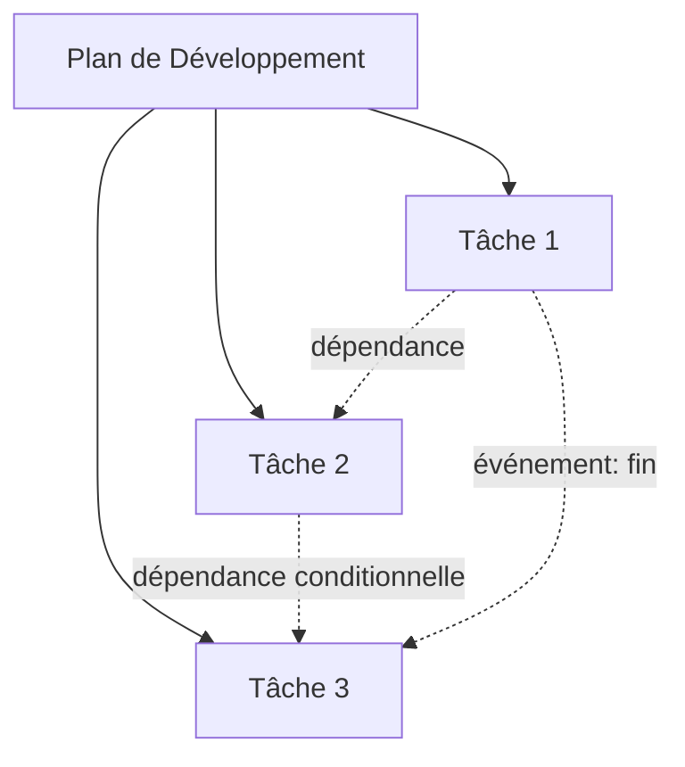

# Schéma de Table – Plans de Développement (plan-dev)

| id_plan | titre | managers | gouvernance | statut | priorité | catégorie | date | thématique | tâches | workflow | règles_validation | résumé |
|---------|-------|----------|-------------|--------|----------|-----------|------|------------|--------|----------|------------------|--------|
| string  | string| string[] | string      | string | string   | string    | date | string     | string[]| string   | string           | string |

---

# Schéma de Table – Tâches (task)

| id_task | id_plan | niveau | parent | enfants | phase | section | tâche | sous-tâche | managers | statut | priorité | mvp | méthode | fichiers_entrée | livrables_sortie | à_surveiller | catégorie | date | thématique | workflow | règles_validation | résumé |
|---------|---------|--------|--------|---------|-------|---------|-------|------------|----------|--------|----------|-----|---------|-----------------|------------------|--------------|-----------|------|------------|----------|------------------|--------|
| string  | string  | int    | string | string[]| string| string  | string| string     | string[] | string | string   |bool | string  | string[]        | string[]         | string       | string    | date | string     | string   | string           | string |

---

# Table des dépendances entre tâches (task_dependencies)

| id_task | id_task_dependant | type_dépendance | condition | ordre | commentaire |
|---------|------------------|-----------------|-----------|-------|-------------|
| string  | string           | string          | string    | int   | string      |

---

# Table d’affectation dynamique (task_assignments)

| id_task | manager | rôle | date_affectation | statut | commentaire |
|---------|--------|------|------------------|--------|-------------|
| string  | string | string| date             | string | string      |

---

# Table d’événements/triggers (task_events)

| id_event | id_task | type_event | date | acteur | payload | commentaire |
|----------|--------|------------|------|--------|---------|-------------|
| string   | string | string     | date | string | string  | string      |

---

# Articulation et orchestration dynamique

- Les tables relationnelles permettent de modéliser des workflows complexes, des dépendances multiples, des affectations dynamiques et une orchestration pilotée par événements.
- L’orchestrateur peut interroger ces tables pour déterminer dynamiquement l’ordre d’exécution, les conditions de lancement, les notifications à envoyer, etc.

---

# Diagramme Mermaid – Orchestration dynamique

---

# Gouvernance

- **Centralisation** : la gouvernance des plans est centralisée, chaque plan définit ses managers, rôles, workflow et règles de validation.
- **Déclinaison** : chaque tâche hérite de la gouvernance du plan, mais peut préciser des règles ou managers spécifiques.
- **Traçabilité** : chaque action (création, modification, validation) est tracée avec date, responsable, état.

---

*Ce schéma garantit une articulation claire entre plans et tâches, une gouvernance explicite, une orchestration dynamique et une traçabilité complète.*