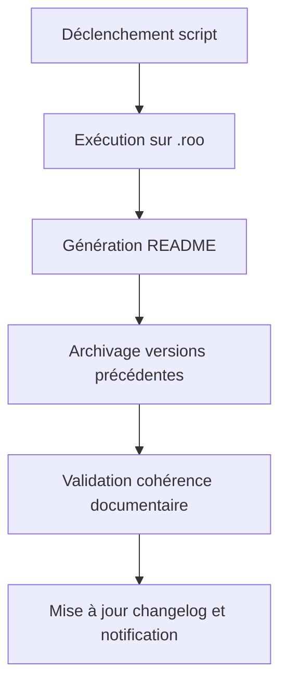

# Spécification détaillée – Automatisation de la maintenance documentaire `.roo` (Plan v107 – Tâche 4)

## Objectif

Automatiser la génération, la mise à jour et l’archivage de la documentation du dossier `.roo` selon les standards Roo-Code, en s’appuyant sur l’outil [`tools/scripts/gen_docs_and_archive.go`](../../../../tools/scripts/gen_docs_and_archive.go:10).

---

## Outil principal

- **Script Go** : [`tools/scripts/gen_docs_and_archive.go`](../../../../tools/scripts/gen_docs_and_archive.go:10-17)
- **Périmètre** : traitement du dossier `.roo` (génération, mise à jour, archivage documentaire)

---

## Workflow actionnable

1. **Déclenchement manuel ou via CI/CD**  
   - Par commit, tag ou demande de release.
2. **Exécution du script Go sur le dossier `.roo`**  
   - Analyse et traitement automatisé de la structure documentaire.
3. **Génération et mise à jour du README central**  
   - Création ou actualisation du fichier `README.md` central dans `.roo`.
4. **Archivage automatique des versions précédentes**  
   - Sauvegarde des anciennes versions de la documentation avant mise à jour.
5. **Validation de la cohérence documentaire**  
   - Génération de logs, d’un rapport de validation et d’un badge de cohérence.
6. **Mise à jour du changelog et notification à l’équipe**  
   - Ajout d’une entrée dans le changelog et envoi d’une notification (ex : Slack, email).

---

## Diagramme Mermaid du workflow

---

## Exigences de validation documentaire

- **Logs complets** : journalisation de chaque étape du processus.
- **Rapport de validation** : synthèse des actions réalisées et des éventuelles anomalies.
- **Badge de cohérence** : indicateur visuel de conformité documentaire.

---

## Points de traçabilité

- **Archivage automatique** : conservation des versions antérieures de la documentation `.roo`.
- **Mise à jour du changelog** : traçabilité des modifications apportées.
- **Notification à l’équipe** : information systématique des parties prenantes lors de chaque opération.

---

## Liens utiles

- Plan v107 : [`plan-dev-v107-rules-roo.md`](plan-dev-v107-rules-roo.md:1)
- Outil principal : [`tools/scripts/gen_docs_and_archive.go`](../../../../tools/scripts/gen_docs_and_archive.go:10-17)
- Standards Roo-Code : [`clinerules/README.md`](../../../../clinerules/README.md:1)
