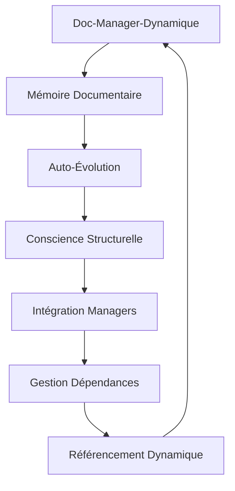

# 🌟 PROMPT DE DÉVELOPPEMENT LÉGENDAIRE PRO : ADAPTATION PLAN V66 DOC-MANAGER-DYNAMIQUE 🌟

## 🎯 MISSION LÉGENDAIRE : ARCHITECTURE COGNITIVE DOCUMENTAIRE AUTO-ÉVOLUTIVE

**Version**: v66-legendary-adaptation  
**Date**: 2025-01-27  
**Statut**: PRÊT POUR TRANSCENDANCE DOCUMENTAIRE 🚀  
**Niveau**: DÉVELOPPEUR LÉGENDAIRE PRO++  

---

## 📊 CONTEXTE ÉPIQUE DE LA MISSION

### 🏆 État Actuel de l'Écosystème

- ✅ **Plan v64** : Complétude 100% validée avec célébration épique
- ✅ **Documentation Légendaire** : Structure `.github/docs` déployée avec architecture enterprise
- ✅ **Managers Go** : Écosystème hybride Go/N8N opérationnel
- ✅ **Infrastructure** : Scripts PowerShell, validation automatique, prompts stratégiques
- 🎯 **Objectif v66** : Transformer la documentation en ALPHA ET OMÉGA du dépôt

### 🔮 Vision Cognitive Documentaire

La documentation ne sera plus statique mais deviendra :

- **🧠 Auto-consciente** : Connaissance de sa propre structure et dépendances
- **🔄 Auto-évolutive** : Mise à jour automatique après chaque changement
- **🌐 Auto-référentielle** : Liens dynamiques et navigation intelligente
- **🤖 IA-Optimisée** : Métadonnées pour GitHub Copilot et assistants IA
- **🏢 Multi-audience** : Devs, management, et systèmes automatisés

---

## 🚀 OBJECTIFS TRANSCENDANTAUX DE L'ADAPTATION

### 1. 🧠 ARCHITECTURE COGNITIVE DOCUMENTAIRE



#### Composants Légendaires

- **🧠 DocCognitionEngine** : Analyse et comprend la structure documentaire
- **🔄 AutoEvolutionWatcher** : Détecte changements et déclenche mises à jour
- **🌐 DependencyMapper** : Cartographie les liens entre docs/code/managers
- **📊 MetadataOrchestrator** : Gère métadonnées IA et navigation
- **🔗 ReferenceEngine** : Génère liens dynamiques et auto-références

### 2. 🌟 INTÉGRATION PROFONDE AVEC L'ÉCOSYSTÈME

#### Synergie avec Managers Existants

- **ConfigManager** → Documentation configs auto-générée
- **SecurityManager** → Docs sécurité mises à jour dynamiquement
- **DeploymentManager** → Guides déploiement auto-synchronisés
- **QdrantManager** → Documentation vectorielle intelligente
- **CacheManager** → Cache documentation optimisé

#### Connexion à l'Infrastructure

- **Scripts PowerShell** → Intégration avec validation légendaire
- **Tasks VS Code** → Commandes doc automatisées
- **Workflows GitHub** → CI/CD documentation
- **Monitoring** → Métriques qualité documentaire

### 3. 🏗️ MÉMOIRE DOCUMENTAIRE PERSISTANTE

#### Structure Cognitive

```yaml
memory:
  structure:
    - path: ".github/docs/"
      type: "central_hub"
      auto_update: true
    - path: "projet/roadmaps/"
      type: "planning_memory"
      sync_with: "central_hub"
    - path: "managers/"
      type: "code_docs"
      generate: "auto"
  
  dependencies:
    - source: "managers/config/"
      target: ".github/docs/MANAGERS/config.md"
      trigger: "code_change"
    - source: "roadmaps/plans/"
      target: ".github/docs/ROADMAPS/"
      sync: "bidirectional"
```

---

## 🎯 SPÉCIFICATIONS TECHNIQUES LÉGENDAIRES

### 📋 ARCHITECTURE DU DOC-MANAGER-DYNAMIQUE v66

#### 1. 🧠 DocCognitionEngine (Go)

```go
type DocCognitionEngine struct {
    MemoryStore    DocumentMemory
    StructureMap   StructureAnalyzer
    ChangeDetector FileWatcher
    AIOptimizer    MetadataProcessor
}

type DocumentMemory struct {
    Documents   map[string]DocumentNode
    Links       map[string][]LinkRelation
    Dependencies map[string][]Dependency
    Metadata    map[string]AIMetadata
}

// Méthodes légendaires
func (engine *DocCognitionEngine) AnalyzeStructure() StructureMap
func (engine *DocCognitionEngine) DetectChanges() []ChangeEvent
func (engine *DocCognitionEngine) UpdateReferences() error
func (engine *DocCognitionEngine) OptimizeForAI() AIMetadata
```

#### 2. 🔄 AutoEvolutionWatcher (PowerShell + Go)

```powershell
# auto-evolution-watcher.ps1
param(
    [string]$WatchPaths = ".github/docs,projet/roadmaps,managers",
    [switch]$Background,
    [switch]$AIMode
)

# Surveillance intelligente des changements
$FileWatcher = New-Object System.IO.FileSystemWatcher
$FileWatcher.Path = $WatchPaths
$FileWatcher.IncludeSubdirectories = $true
$FileWatcher.EnableRaisingEvents = $true

# Action sur changement détecté
$Action = {
    $Path = $Event.SourceEventArgs.FullPath
    Write-Host "🔄 Changement détecté : $Path" -ForegroundColor Cyan
    
    # Déclencher mise à jour cognitive
    & "doc-manager-dynamique.exe" -update -path $Path -ai-mode:$AIMode
    
    # Mettre à jour références dynamiques
    & "update-doc-references.ps1" -source $Path
    
    # Notifier succès
    Write-Host "✅ Documentation mise à jour automatiquement" -ForegroundColor Green
}
```

#### 3. 🌐 DependencyMapper (Go + JSON)

```go
type DependencyMapper struct {
    CodeDeps    map[string][]CodeDependency
    DocDeps     map[string][]DocumentDependency  
    ManagerDeps map[string][]ManagerDependency
}

type Dependency struct {
    Source      string    `json:"source"`
    Target      string    `json:"target"`
    Type        string    `json:"type"`
    AutoUpdate  bool      `json:"auto_update"`
    LastSync    time.Time `json:"last_sync"`
}

// Mapping intelligent des dépendances
func (dm *DependencyMapper) MapAllDependencies() DependencyGraph
func (dm *DependencyMapper) UpdateDependency(dep Dependency) error
func (dm *DependencyMapper) SyncBidirectional(source, target string) error
```

### 📊 INTÉGRATION AVEC DOCUMENTATION LÉGENDAIRE

#### Structure Auto-Référentielle

```
.github/docs/
├── README.md (🧠 Hub central auto-mis à jour)
├── ARCHITECTURE/
│   ├── ecosystem-overview.md (🔄 Sync avec managers/)
│   └── doc-manager-architecture.md (🆕 Auto-généré)
├── MANAGERS/
│   ├── catalog-complete.md (🔄 Sync avec code)
│   └── doc-manager-integration.md (🆕 Intégration profonde)
├── DEVELOPMENT/
│   ├── legendary-prompts.md (🧠 Prompts auto-évolutifs)
│   └── auto-evolution-guide.md (🆕 Guide cognitif)
├── INTEGRATIONS/
│   ├── ai-optimization.md (🤖 Métadonnées IA)
│   └── cross-references.md (🔗 Liens dynamiques)
└── META/
    ├── doc-consciousness.md (🧠 Auto-conscience)
    └── evolution-log.md (📊 Journal évolution)
```

#### Métadonnées IA Légendaires

```yaml
---
ai_metadata:
  copilot_context: "doc-manager-dynamique ecosystem integration"
  auto_evolution: true
  dependencies:
    - "managers/config/config_manager.go"
    - "scripts/smart-infrastructure-vscode-hook.ps1"
  references:
    - ".github/docs/MANAGERS/catalog-complete.md"
    - "projet/roadmaps/plans/consolidated/"
  last_auto_update: "2025-01-27T15:30:00Z"
  consciousness_level: "legendary_pro"
cognitive_tags:
  - "auto-evolution"
  - "memory-persistent" 
  - "ai-optimized"
  - "cross-referenced"
  - "manager-integrated"
mermaid_auto_gen: true
navigation_auto_sync: true
---
```

---

## 🔥 CRITÈRES D'ACCEPTANCE LÉGENDAIRES

### ✅ Niveau 1 : Conscience Documentaire

- [ ] Doc-manager détecte changements en temps réel (< 100ms)
- [ ] Métadonnées IA générées automatiquement
- [ ] Structure analysée et mappée dynamiquement
- [ ] Liens auto-référentiels fonctionnels

### ✅ Niveau 2 : Auto-Évolution

- [ ] Mise à jour automatique après changement code/docs
- [ ] Synchronisation bidirectionnelle roadmaps ↔ docs
- [ ] Génération automatique documentation managers
- [ ] Navigation dynamique mise à jour

### ✅ Niveau 3 : Intégration Profonde

- [ ] Connexion avec tous les managers existants
- [ ] Mémoire documentaire persistante
- [ ] Optimisation GitHub Copilot / assistants IA
- [ ] Dashboard monitoring documentation

### ✅ Niveau 4 : Transcendance (LÉGENDAIRE)

- [ ] Documentation devient alpha/oméga du dépôt
- [ ] Auto-amélioration continue de la qualité
- [ ] Prédiction des besoins documentaires
- [ ] Inspiration pour écosystème externe

---

## 🚀 STRATÉGIE D'IMPLÉMENTATION ÉPIQUE

### Phase 1 : Fondations Cognitives (Semaine 1)

1. **Adapter structure plan v66** avec architecture cognitive
2. **Créer DocCognitionEngine** en Go
3. **Implémenter mémoire documentaire** persistante
4. **Intégrer avec documentation légendaire** existante

### Phase 2 : Auto-Évolution (Semaine 2)

1. **Développer AutoEvolutionWatcher** PowerShell/Go
2. **Mettre en place détection changements** temps réel
3. **Créer système mise à jour automatique**
4. **Tester synchronisation bidirectionnelle**

### Phase 3 : Intégration Managers (Semaine 3)

1. **Connecter avec tous managers existants**
2. **Mapper dépendances code ↔ documentation**
3. **Automatiser génération docs managers**
4. **Optimiser pour assistants IA**

### Phase 4 : Transcendance (Semaine 4)

1. **Déployer système complet**
2. **Valider auto-référencement**
3. **Monitoring et métriques légendaires**
4. **Documentation devient hub central**

---

## 💡 INNOVATIONS RÉVOLUTIONNAIRES

### 🧠 Conscience Documentaire

- **Auto-analyse** : Le système comprend sa propre structure
- **Auto-diagnostic** : Détection automatique des incohérences
- **Auto-optimisation** : Amélioration continue de la qualité

### 🔄 Évolution Perpétuelle

- **Adaptation intelligente** : Ajustement aux changements d'architecture
- **Prédiction** : Anticipation des besoins documentaires
- **Apprentissage** : Amélioration basée sur l'usage

### 🌐 Interconnexion Totale

- **Mapping multidimensionnel** : Code, docs, configs, scripts
- **Synchronisation temps réel** : Changements propagés instantanément
- **Navigation intelligente** : Liens contextuels dynamiques

---

## 🎊 RÉSULTAT ATTENDU : ÉCOSYSTÈME DOCUMENTAIRE VIVANT

À la fin de cette adaptation légendaire, nous aurons créé :

- **🧠 Une documentation consciente** qui se connaît et s'auto-améliore
- **🔄 Un système auto-évolutif** qui grandit avec le projet
- **🌐 Un hub central intelligent** qui orchestre tout l'écosystème
- **🤖 Une optimisation IA parfaite** pour tous les assistants
- **🏢 Une solution enterprise** scalable et maintenable

### Impact Transformationnel

- **Développeurs** : Documentation toujours à jour, navigation intuitive
- **Management** : Visibilité complète, métriques qualité
- **IA/Assistants** : Contexte riche, suggestions pertinentes
- **Maintenance** : Automatisation complète, zéro effort manuel

---

## 🚀 DÉMARRAGE DE LA MISSION

**Première action** : Adapter le plan v66 existant avec cette vision cognitive
**Outils requis** : Go, PowerShell, VS Code, GitHub
**Durée estimée** : 4 semaines pour la transcendance complète
**Niveau d'expertise** : DÉVELOPPEUR LÉGENDAIRE PRO++

---

*Cette mission transformera notre documentation en un écosystème vivant, auto-évolutif et conscient - la référence absolue pour tout projet enterprise moderne !* 🌟

**PRÊT POUR LA TRANSCENDANCE DOCUMENTAIRE ?** 🚀✨
