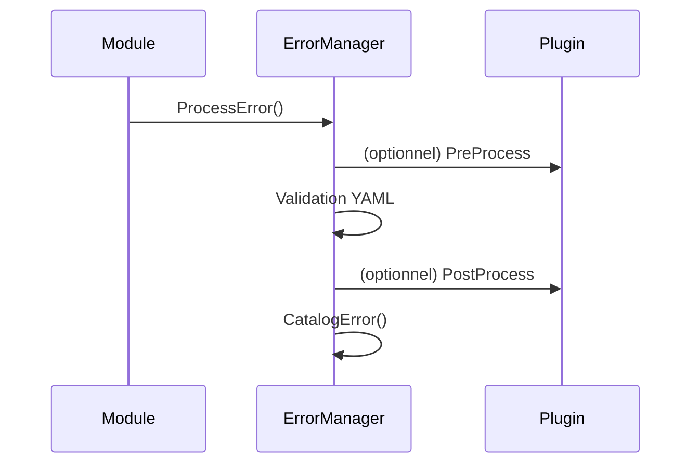

# Spécification technique Roo — ErrorManager

## 1. Rôle et objectifs

- **Centraliser la gestion, la validation et la journalisation structurée des erreurs pour tous les modules Roo.**
- **Fournir des interfaces extensibles pour l’intégration de plugins/hooks.**
- **Assurer la traçabilité, l’auditabilité et la conformité Roo-Code.**

## 2. Interfaces principales

```go
type ErrorManagerInterface interface {
    ProcessError(ctx context.Context, err error, component, operation string, hooks *ErrorHooks) error
    CatalogError(entry ErrorEntry) error
    ValidateErrorEntry(entry ErrorEntry) error
    RegisterPlugin(plugin PluginInterface) error
    ListPlugins() []PluginInfo
}
```

### Structures associées

```go
type ErrorEntry struct {
    Timestamp   time.Time
    Component   string
    Operation   string
    ErrorType   string
    Message     string
    StackTrace  string
    Metadata    map[string]interface{}
}

type ErrorHooks struct {
    PreProcess  func(*ErrorEntry) error
    PostProcess func(*ErrorEntry) error
    OnCatalog   func(*ErrorEntry) error
}
```

## 3. Logique et workflow

- **ProcessError** : Centralise la réception, la validation et la journalisation d’une erreur. Déclenche les hooks/plugins.
- **CatalogError** : Ajoute une entrée structurée au catalogue d’erreurs, avec validation YAML Roo.
- **ValidateErrorEntry** : Vérifie la conformité d’une entrée selon le schéma [`error_manager_schema.yaml`](error_manager_schema.yaml).
- **RegisterPlugin** : Permet l’extension dynamique via PluginInterface Roo.
- **ListPlugins** : Retourne la liste des plugins actifs.

## 4. Points d’extension

- **PluginInterface Roo** : Ajout dynamique de stratégies de gestion, reporting, enrichissement, alerting.
- **Hooks** : Injection de logique personnalisée avant/après traitement ou catalogage.

## 5. Exemples d’utilisation

```go
errMgr := NewErrorManager()
errMgr.RegisterPlugin(NewSentryPlugin())
err := errors.New("connexion perdue")
errMgr.ProcessError(ctx, err, "StorageManager", "SaveDependency", nil)
```

## 6. Critères de validation Roo

- Respect du schéma YAML [`error_manager_schema.yaml`](error_manager_schema.yaml)
- Couverture test >90 % sur la validation, la journalisation et l’extension plugins
- Auditabilité : logs structurés, reporting automatisé, rollback possible
- Documentation croisée : [AGENTS.md](AGENTS.md), [README.md](README.md), [plan-dev-v113-autmatisation-doc-roo.md](projet/roadmaps/plans/consolidated/plan-dev-v113-autmatisation-doc-roo.md)

## 7. Checklist de conformité

- [x] Interfaces Go documentées
- [x] Structures de données alignées Roo
- [x] Points d’extension plugins/hooks prévus
- [x] Validation YAML intégrée
- [x] Exemples d’appel fournis
- [x] Critères de test et d’auditabilité explicités

## 8. Diagramme de séquence (simplifié)



## 9. Risques & mitigation

- **Risque** : erreur non cataloguée → tests unitaires, logs d’audit, reporting.
- **Risque** : plugin défaillant → hooks d’erreur, rollback, logs.
- **Risque** : dérive documentaire → validation croisée, audit, traçabilité.

## 10. Questions ouvertes & axes d’amélioration

- Faut-il prévoir une interface d’export automatique des erreurs ?
- Quels formats additionnels de reporting (JSON, CSV) ?
- Intégration directe avec MonitoringManager ?

---