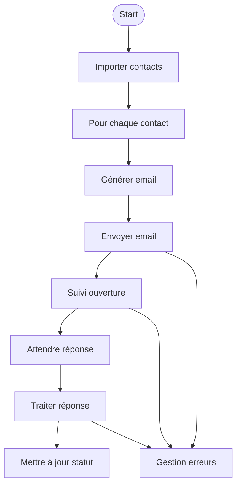

# Workflow n8n — Prospection Email Automatisée

## 1. Objectif

Automatiser la prospection par email : envoi séquencé, suivi des ouvertures, gestion des réponses.

## 2. Vue d’ensemble du workflow

- Import des contacts (CSV, Google Sheets)
- Boucle sur chaque contact
- Génération du message personnalisé
- Envoi de l’email (Gmail/SMTP)
- Suivi de l’ouverture (tracking pixel ou webhook)
- Gestion des réponses (Noeud IMAP/POP3 ou Gmail)
- Mise à jour du statut (Google Sheets, base de données)

## 3. Schéma mermaid du workflow



## 4. Exemples de configuration de noeuds

### Noeud « Read CSV » ou « Google Sheets »

- Permet d’importer dynamiquement la liste des prospects

### Noeud « Set » ou « Function »

```javascript
return {
  json: {
    subject: `Découverte — ${$json["entreprise"]}`,
    body: `Bonjour ${$json["prenom"]},\nJe vous contacte pour...`
  }
};
```

### Noeud « Gmail » ou « SMTP »

- Utiliser les variables d’environnement pour les credentials

### Noeud « Webhook » (tracking pixel)

- Permet de détecter l’ouverture de l’email

### Noeud « IMAP » ou « Gmail » (réception)

- Filtrer les réponses et déclencher des actions automatiques

## 5. Cas d’erreur et gestion des exceptions

- Email non délivré : loguer l’échec, relancer ou notifier
- Réponse hors workflow : marquer comme « à traiter manuellement »
- Problème d’authentification : vérifier les credentials dans `.env`
- Limite d’envoi atteinte : temporiser ou répartir sur plusieurs comptes

## 6. Exécution type

1. Lancer le workflow dans n8n
2. Vérifier les logs d’envoi et de réception
3. Consulter le statut dans la feuille Google Sheets ou la base de données
4. Adapter le message ou la séquence selon les retours

## 7. Ressources complémentaires

- [Guide de démarrage rapide](../guides/QUICKSTART.md)
- [Tutoriel email automation](../guides/EMAIL_AUTOMATION.md)
- [DOC_COVERAGE.md](../DOC_COVERAGE.md)
